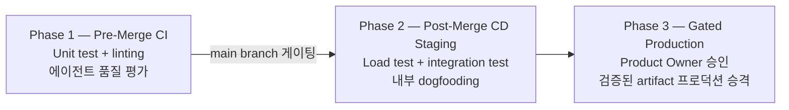
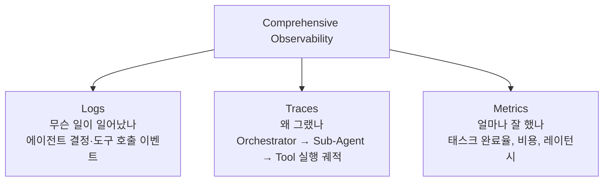
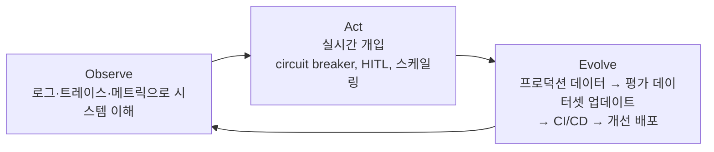

# AgentOps

**AgentOps**는 AI Agent를 프로토타입에서 프로덕션으로 전환하고, 지속적으로 운영·개선하기 위한 방법론과 도구 체계다. DevOps·MLOps의 원칙을 에이전트 고유의 복잡성(동적 도구 오케스트레이션, 비결정적 실행 경로, 멀티턴 상태 관리)에 맞게 확장한 것이다.

## Ops 진화 체계

(출처: [[Agents_Companion_v2]])

```
DevOps → MLOps → FMOps → PromptOps → RAGOps → AgentOps
```

AgentOps는 **GenAIOps**의 하위 분류이며, 이전 단계에 비해 추가되는 관리 요소:
- **Tool 관리**: 수백~수천 개 도구의 버전 관리·접근 제어·레지스트리
- **Agent Brain Prompt**: 목표·페르소나·지시가 담긴 에이전트 고유의 system prompt
- **오케스트레이션**: 에이전트 간 통신·태스크 위임·실행 조율
- **Memory**: 세션 내 단기 + 세션 간 장기 메모리 관리
- **작업 분해(Task Decomposition)**: 복잡한 목표를 실행 가능한 하위 태스크로 분해

## 에이전트 고유의 운영 과제

(출처: [[Prototype_to_Production]])

전통 소프트웨어와 달리 에이전트는 **자율적·상태보존적·동적 경로**를 가진다. 이것이 기존 MLOps로는 불충분한 이유다:

| 과제 | 설명 | 운영 요구사항 |
|------|------|--------------|
| **Dynamic Tool Orchestration** | 실행마다 다른 도구 선택 경로 | Robust versioning, 접근 제어, 세밀한 tracing |
| **Scalable State Management** | 세션 간 메모리 유지 | 안전하고 일관된 외부 상태 저장소 |
| **Unpredictable Cost & Latency** | 비결정적 실행 경로 | Smart budgeting, 동적 캐싱, 비용 알람 |

**프로덕션 없이 발생하는 실제 장애 사례**:
- Guardrail 미설정 → 고객 서비스 에이전트가 제품 무료 제공
- 인증 오설정 → 기밀 내부 DB 접근 허용
- 모니터링 부재 → 주말 동안 대규모 비용 청구 발생
- 지속 평가 없음 → 전날 완벽히 작동하던 에이전트가 갑자기 중단

> "에이전트를 만드는 건 쉽다. 신뢰하는 건 어렵다." — Prototype to Production (Google, 2026)

## 3 Pillars of AgentOps

(출처: [[Prototype_to_Production]])

### Pillar 1: Automated Evaluation (자동화된 평가)

Golden dataset 기반 quality gate — 어떤 버전도 평가 통과 없이 프로덕션 불가.

전통 단위 테스트만으로 불충분한 이유: 100개 tool unit test를 통과해도 잘못된 도구 선택이나 환각이 발생 가능. 에이전트는 **전체 reasoning trajectory**를 평가해야 한다.

평가 구성 3요소 (출처: [[Agents_Companion_v2]]):
1. **Capabilities** — 에이전트가 의도한 능력을 갖추고 있는가
2. **Trajectory & Tool Use** — 올바른 도구를 올바른 순서로 선택했는가
3. **Final Response** — 최종 응답이 기대 품질을 충족하는가

Trajectory 평가 6 metrics:
- Exact match / In-order match / Any-order match / Precision / Recall / Single-tool use

### Pillar 2: CI/CD Pipeline (지속적 통합·배포)



**Safe Rollout 4전략**:

| 전략 | 방법 | 적합 케이스 |
|------|------|------------|
| **Canary** | 1% → 점진적 확대 | 새 에이전트 버전 첫 배포 |
| **Blue-Green** | 두 환경 교체 | 즉각 롤백 필요 |
| **A/B Testing** | 비즈니스 메트릭 비교 | 데이터 기반 의사결정 |
| **Feature Flags** | 코드 배포 후 동적 릴리즈 | 선택적 사용자 테스트 |

**전제 조건**: 코드·프롬프트·모델·tool schema·메모리 구조·평가 데이터셋 전체의 **rigorous versioning** — 프로덕션의 "undo 버튼".

### Pillar 3: Comprehensive Observability (종합적 관찰 가능성)



## Observe → Act → Evolve 운영 루프

(출처: [[Prototype_to_Production]])



**핵심 가치**: 프로덕션 사건마다 에이전트가 더 강해지는 선순환 = 개선 주기가 주 단위에서 시간 단위로 단축.

## AgentOps 플랫폼 (agentops.ai)

**AgentOps** (agentops.ai)는 AI Agent 전용 observability·디버깅 플랫폼이다. 개념으로서의 AgentOps 방법론과는 별개의 상용 제품이다.

### 핵심 기능

- **Time-Travel Debugging & Session Replay**: 에이전트 실행을 정확한 시점으로 되감아 재현 가능
- **Multi-Agent Workflow Visualization**: 에이전트 간 상호작용·위임 관계를 시각적으로 추적
- **Visual Event Tracking**: LLM 호출, 도구 사용, 에이전트 상호작용을 타임라인으로 시각화
- **Token & Cost Tracking**: 에이전트별 토큰 사용량·비용 모니터링, 다중 모델 가격 자동 업데이트
- **400+ LLM 및 프레임워크 지원**: OpenAI, CrewAI, Autogen, LangChain, OpenAI Agents SDK 등

### 강점

- 멀티 프레임워크 환경에서 가장 낮은 마찰의 계측 (instrumentation)
- Time-travel debugging은 복잡한 멀티에이전트 상호작용 디버깅의 실질적 차별점
- 단일 SDK로 400+ LLM/프레임워크 지원

### 한계

- 자동 이슈 클러스터링 없음
- 자동 평가 생성(eval generation) 없음
- Observability·디버깅에 집중 → 체계적인 품질 개선 루프는 별도 도구 필요
- 프로덕션 환경에서 약 12% 오버헤드 (LangSmith 대비 높음)

### 가격 (2026년 Q1 기준)

- 무료 시작 가능
- 스타트업 플랜 유료
- 엔터프라이즈 플랜: 최대 $10,000+/월 (고용량 배포)

## 주요 도구 비교 (2026 기준)

(출처: Latitude 비교 분석, 2026년 Q1 기준) [1]

| 도구 | 에이전트 워크플로 지원 | 이슈 자동 탐지 | 평가 생성 | 오픈소스/셀프호스팅 | 특화 강점 |
|------|----------------------|--------------|---------|-------------------|---------|
| **AgentOps** | ✅ Time-travel debugging | ❌ | ❌ | ❌ (Cloud) | 멀티 프레임워크 디버깅 |
| **LangSmith** | ✅ LangChain/LangGraph 네이티브 | 부분 (Insights) | ❌ (수동) | ❌ (Cloud) | LangChain 생태계 |
| **Langfuse** | ✅ 강력한 멀티스텝 추적 | ❌ | ❌ (수동) | ✅ MIT 라이선스 | 셀프호스팅·데이터 거주 |
| **Arize Phoenix** | ✅ OTel 네이티브 | ❌ | ❌ | ✅ 오픈소스 | RAG 평가, OTel 인프라 |
| **Braintrust** | ✅ 지원 | 부분 (Topics beta) | ❌ (수동) | ❌ (Cloud) | CI/CD 게이트 eval, 가장 관대한 무료 티어 |
| **Latitude** | ✅ 인과적 세션 추적 | ✅ 이슈 lifecycle | ✅ GEPA 자동 생성 | ✅ 셀프호스팅 무료 | 프로덕션 실패 → eval 자동 생성 |
| **Galileo** | ✅ 지원 | 부분 (Signals) | ❌ | ❌ (Cloud) | Luna-2로 100% 트래픽 실시간 평가 |

### 선택 가이드

- **멀티 프레임워크 (CrewAI + Autogen + LangChain 혼용)** → AgentOps
- **LangChain/LangGraph 스택** → LangSmith
- **셀프호스팅·데이터 거주 요건** → Langfuse
- **OTel 인프라 투자** → Arize Phoenix
- **CI/CD 게이트 eval 중심** → Braintrust
- **프로덕션 실패 → eval 자동 생성 루프** → Latitude
- **규제 환경·100% 트래픽 평가** → Galileo

### 성능 오버헤드 (2026 기준)

- LangSmith: 사실상 0 (성능 임계 환경에 최적)
- AgentOps: ~12%
- Langfuse: ~15%

## Prototype → Production 전환 체크리스트

(출처: [[Prototype_to_Production]])

```
□ Golden dataset 구성 + 자동화 평가 harness
□ CI/CD 파이프라인에 품질 gate 통합
□ 코드·프롬프트·모델·tool schema 전체 버전 관리
□ 보안 3계층 적용 (Policy / Guardrail / Continuous Assurance)
□ Observability 스택 선택 및 계측 완료
□ Safe Rollout 전략 결정 (Canary 권장)
□ 비용 알람 설정 (시간별 임계값)
□ HITL 에스컬레이션 경로 정의
□ 프로덕션 데이터 → 평가 데이터셋 업데이트 루프 구축
```

## 관련 개념

[[LLMOps]] · [[Production]] · [[Evaluation]] · [[Agent_Engineering/Observability_and_Tracing]] · [[Agent_Architectures]] · [[Agent_Deployment]]

## 출처

- [[Prototype_to_Production]] (Google, 2025년 11월 최초 발행 → 2026년 5월 업데이트)
- [[Agents_Companion_v2]] (Google Kaggle, 2025)

## 참고 문헌

1. [Best AI Agent Observability Tools in 2026: A Comparison for Production Teams](https://latitude.so/blog/best-ai-agent-observability-tools-2026-comparison) — Latitude, March 2026
2. [AgentOps Review 2026](https://aiagentslist.com/agents/agentops) — AI Agents List
3. [Top 5 LLM and Agent Observability Tools in 2026](https://mlflow.org/top-5-agent-observability-tools/) — MLflow
