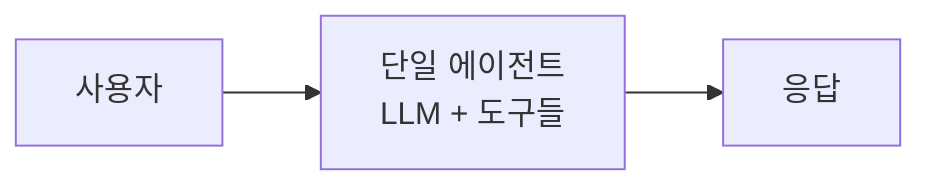
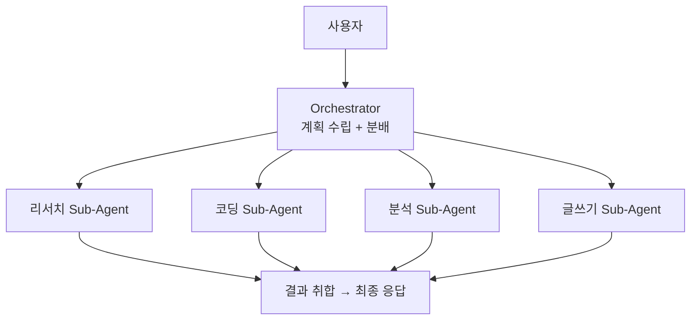
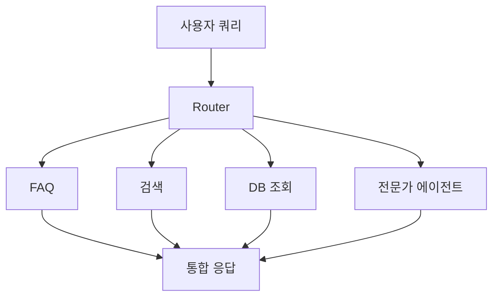
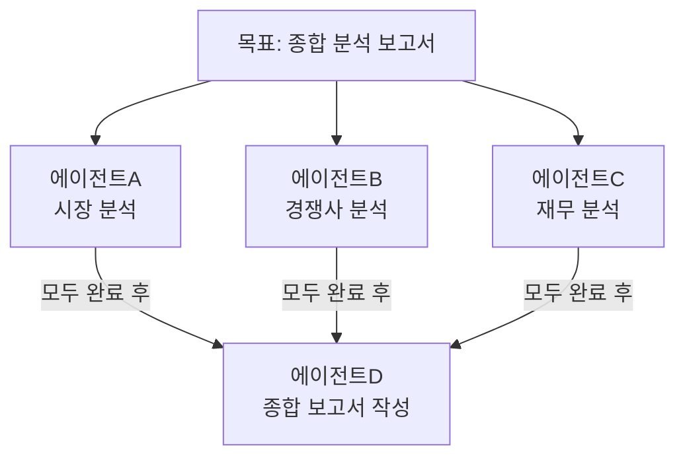
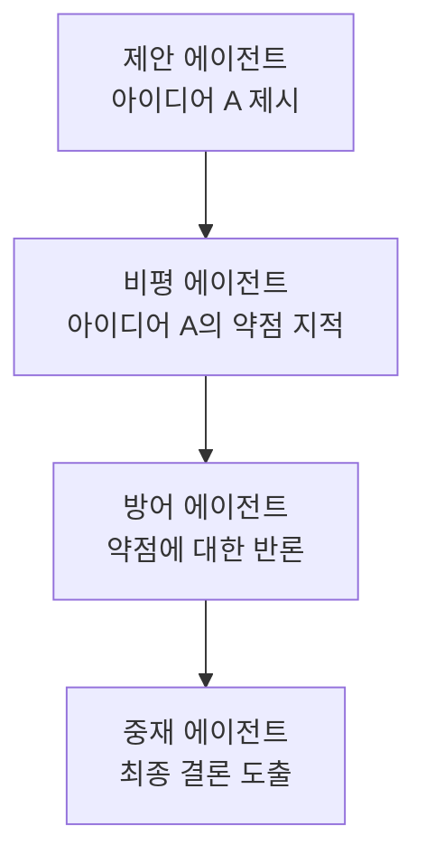
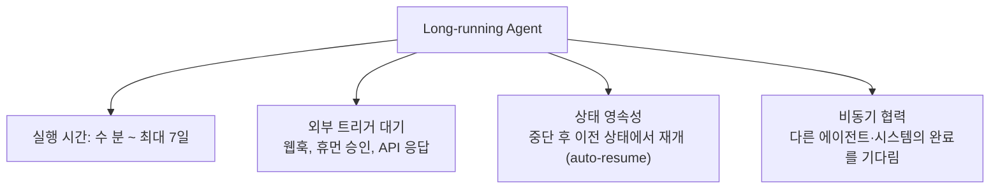
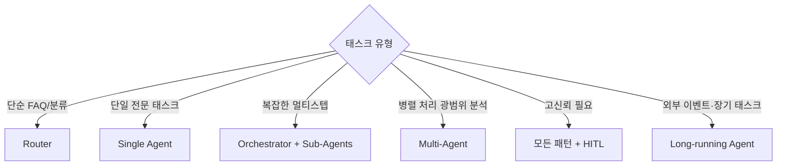

# Agent Architectures

## 개요

에이전트 시스템을 어떻게 구성하는가에 따라 성능, 비용, 안정성이 크게 달라진다. 주요 아키텍처 패턴: **Orchestrator & Sub-Agents**, **Router**, **Multi-Agent**.

## 1. Single Agent (단일 에이전트)

가장 단순한 형태. 하나의 LLM이 모든 결정과 실행 담당:



**적합 케이스**: 도메인이 명확하고 범위가 제한적인 태스크.
**한계**: 복잡한 멀티스텝 태스크에서 컨텍스트 과부하, 성능 저하.

## 2. Orchestrator & Sub-Agents

상위의 **Orchestrator**가 전략적 결정을 내리고, 전문화된 **Sub-Agents**에게 작업을 위임:



### LangGraph 구현 예시
```python
from langgraph.graph import StateGraph
from langgraph_supervisor import create_supervisor

# 전문화된 Sub-Agent 정의
research_agent = create_react_agent(llm, tools=[tavily_search])
code_agent = create_react_agent(llm, tools=[python_repl])
writer_agent = create_react_agent(llm, tools=[file_write])

# Supervisor (Orchestrator) 생성
supervisor = create_supervisor(
    agents={
        "researcher": research_agent,
        "coder": code_agent,
        "writer": writer_agent
    },
    model=llm,
    prompt="목표를 달성하기 위해 적절한 에이전트에게 작업을 위임하세요."
)
```

**장점**: 전문화로 성능↑, 각 에이전트의 컨텍스트 창 효율적 사용.
**단점**: Orchestrator가 병목, Sub-Agent 간 통신 오버헤드.

## 3. Router (라우터)

입력에 따라 적절한 전문 에이전트 또는 파이프라인으로 라우팅:



### 구현 예시
```python
def route_query(query: str) -> str:
    """쿼리 분류 후 라우팅"""
    classification_prompt = f"""
    다음 쿼리를 분류하세요:
    - "faq": 자주 묻는 질문
    - "search": 외부 검색 필요
    - "database": 내부 DB 조회 필요
    - "complex": 복잡한 분석 필요
    
    쿼리: {query}
    분류:
    """
    category = llm.invoke(classification_prompt).strip()
    
    routes = {
        "faq": faq_handler,
        "search": search_agent,
        "database": db_query_agent,
        "complex": complex_analysis_agent
    }
    return routes.get(category, default_handler)(query)
```

**장점**: 간단하고 빠름, 낮은 비용.
**단점**: 라우팅 오류 시 잘못된 파이프라인 실행.

## 4. Multi-Agent (병렬/협력 에이전트)

여러 에이전트가 **병렬로 작업**하거나 **서로 협력**:

### 병렬 실행


```python
import asyncio

async def parallel_research(topic: str):
    tasks = [
        market_agent.ainvoke({"task": f"시장 분석: {topic}"}),
        competitor_agent.ainvoke({"task": f"경쟁사 분석: {topic}"}),
        financial_agent.ainvoke({"task": f"재무 분석: {topic}"})
    ]
    results = await asyncio.gather(*tasks)
    return synthesis_agent.invoke({"data": results})
```

### Debate 패턴 (에이전트 간 토론)



## 5. Long-running Agent (장기 실행 에이전트) *(2026년 5월)*

수 분~수 일에 걸쳐 실행되는 에이전트 패턴. 기존 단기 실행(수 초~수 분) 패턴과 구분된다.



**적합 케이스:**
- 대규모 코드베이스 리팩토링 (수 시간)
- 멀티 단계 규정 준수 검토 (외부 승인 포함)
- 장기 리서치 태스크 (여러 날에 걸친 데이터 수집·분석)
- Human-in-the-Loop 워크플로우 (사람 검토 대기)

```python
# Agent Runtime의 auto-resume 패턴 (개념적 예시)
async def long_running_agent(task: str):
    state = await runtime.create_session(task)
    
    # Phase 1: 초기 처리
    result = await agent.process(state)
    
    # 외부 이벤트 대기 (웹훅/휴먼 승인) — 에이전트 일시 중단
    await runtime.wait_for_event(
        session_id=state.id,
        event_type="human_approval",
        timeout_days=7
    )
    # 승인 후 자동 재개 (컨텍스트·상태 완전 복원)
    
    # Phase 2: 승인 후 계속
    final_result = await agent.continue_processing(state)
    return final_result
```

**인프라 요구사항**: Long-running Agent는 Agent Runtime(sub-second cold start, 최대 7일 운영, auto-resume) 없이는 구현이 매우 복잡하다. 자세한 내용 → [[Production]]

## 아키텍처 선택 가이드



## 아키텍처별 비용 특성

| 아키텍처 | LLM 호출 수 | 비용 | 속도 | 실행 시간 |
|---------|-----------|------|------|---------|
| Single | 낮음 | 낮음 | 빠름 | 초~분 |
| Router | 낮음 | 낮음 | 빠름 | 초~분 |
| Orchestrator+Sub | 중간~높음 | 중간 | 중간 | 분 |
| Multi-Agent 병렬 | 높음 | 높음 | 빠름 (병렬) | 분 |
| Multi-Agent 순차 | 높음 | 높음 | 느림 | 분~시간 |
| Long-running | 가변 | 가변 | 비동기 | 시간~일 |

## AI Engineering에서의 역할

에이전트 아키텍처 선택은 AI 시스템 설계의 **핵심 아키텍처 결정**이다. 단순함에서 시작하고(Single Agent), 복잡성이 필요한 경우에만 Multi-Agent로 확장하는 것이 모범 사례다. 복잡한 아키텍처는 성능을 높이지만 디버깅과 비용도 함께 증가한다.

## 관련 개념
[[Agent_Core_Pillars]] · [[LangGraph]] · [[Human_in_the_Loop]] · [[Agent_Skills_and_Protocols]]

## 출처
- Anthropic "Building Effective Agents" — [anthropic.com](https://www.anthropic.com/engineering/building-effective-agents)
- LangGraph Multi-Agent 문서 — [langchain-ai.github.io/langgraph](https://langchain-ai.github.io/langgraph/concepts/multi_agent/)
- [[Introduction_to_Agents]] (이 위키의 기존 소스, 2025년 11월 최초 발행 → 2026년 5월 업데이트)
