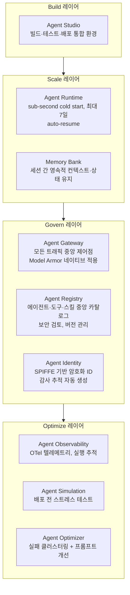

# Agent Core Pillars: Planning, Memory, Tools, Deployment

## 개요

LLM 에이전트는 단순한 LLM 호출을 넘어 자율적으로 목표를 추구하는 시스템이다. Lilian Weng (OpenAI)은 2023년 블로그 포스트 "LLM Powered Autonomous Agents"에서 에이전트의 3가지 핵심 기둥을 정의했다: **Planning(계획)**, **Memory(기억)**, **Tools(도구)**. 2026년 5월 업데이트에서는 이를 확장하여 **Deployment(배포)**가 4번째 핵심 구성요소로 추가되었다 — 에이전트가 실제로 "몸체와 다리"를 갖추고 프로덕션에서 지속적으로 작동하기 위한 런타임·인프라 레이어다.

## 에이전트 정의

```
에이전트 = LLM(두뇌) + Planning + Memory + Tools + Deployment

특징:
  - 자율성: 세부 단계를 스스로 결정
  - 목표 지향: 단일 작업 → 목표 달성까지 지속
  - 적응성: 환경 변화에 반응하여 계획 수정
  - 지속성: 장기간(수 분~수 일) 작동, 인프라 수준 관리
```

## Pillar 1: Planning (계획)

에이전트가 복잡한 목표를 달성 가능한 서브 태스크로 분해하고 순서를 결정하는 능력.

### 태스크 분해 기법
- **CoT (Chain of Thought)**: 단계별 추론
- **ToT (Tree of Thoughts)**: 여러 경로 탐색
- **ReAct**: 추론 + 행동 인터리빙

### Subgoal 분해
```
목표: "2024 연간 보고서 작성"
  → 서브 태스크 1: 재무 데이터 수집
  → 서브 태스크 2: 각 사업부 실적 요약
  → 서브 태스크 3: 전년 대비 비교 분석
  → 서브 태스크 4: 경영진 코멘트 초안 작성
  → 서브 태스크 5: 검토 및 수정
```

### Plan-and-Execute 패턴
```python
# 1단계: 계획 수립 (Planner)
plan = planner_llm.invoke(f"다음 목표를 위한 상세 실행 계획을 작성하세요: {goal}")

# 2단계: 계획 실행 (Executor)
for step in plan.steps:
    result = executor_agent.invoke(step)
    
# 3단계: 계획 업데이트 (Replanner)
if result.needs_replan:
    plan = replanner_llm.invoke(remaining_steps + new_context)
```

## Pillar 2: Memory (기억)

에이전트가 정보를 저장하고 필요할 때 검색하는 메커니즘.

### Short-term Memory (단기 기억)
현재 실행 컨텍스트. LLM의 컨텍스트 창에 저장:
```
[시스템 프롬프트] + [대화 히스토리] + [도구 결과들]
        ↑ 모두 현재 컨텍스트 창 내에 존재
```
- 세션 종료 시 사라짐
- 컨텍스트 창 한계(128K~1M 토큰)

### Long-term Memory (장기 기억)
세션 간 지속. 외부 저장소(Vector DB, DB):
```python
# 사용자 선호도 기억
memory_store.save({
    "user_id": "user_123",
    "preference": "항상 한국어로 응답",
    "context": "2024-01-15 설정"
})

# 다음 세션에서 검색
memories = memory_store.search(
    user_id="user_123",
    query="언어 설정"
)
```

### Memory 유형 분류 (자세한 내용 → [[Agent_Memory]])

| 유형 | 예시 | 저장 위치 |
|------|------|---------|
| Episodic | 이전 대화 기록 | Vector DB |
| Semantic | 사용자 프로필, 선호도 | DB + Vector |
| Procedural | 성공한 작업 패턴 | 파인튜닝 또는 프롬프트 |

## Pillar 3: Tools (도구)

에이전트가 외부 세계와 상호작용하는 인터페이스. LLM의 능력 한계를 확장.

### 도구 카테고리

| 카테고리 | 예시 | 기능 |
|--------|------|------|
| **검색** | Tavily, Brave Search | 최신 정보 검색 |
| **코드 실행** | Python REPL, E2B | 계산, 데이터 처리 |
| **파일 I/O** | Read/Write, PDF | 문서 접근 |
| **API 연동** | REST, GraphQL | 외부 서비스 |
| **데이터베이스** | SQL, NoSQL | 구조화 데이터 |
| **커뮤니케이션** | Email, Slack | 메시지 발송 |
| **브라우저** | Playwright, Selenium | 웹 자동화 |

### MCP (Model Context Protocol)
Anthropic이 제안한 도구 통합 표준. 자세한 내용 → [[AI/Engineering/Agent_Engineering/Agent_Skills_and_Protocols/MCP|MCP]]

## Pillar 4: Deployment (배포) *(2026년 5월 추가)*

에이전트가 실제 프로덕션 환경에서 안정적으로 운영되기 위한 런타임·인프라 레이어. 아무리 뛰어난 Planning·Memory·Tools를 가진 에이전트도 적절한 Deployment 없이는 엔터프라이즈 수준에서 작동할 수 없다.

### Gemini Enterprise Agent Platform

Google의 에이전트 프로덕션 인프라:



### 대안: Cloud Run / GKE

플랫폼 독립 배포가 필요한 경우:
- Cloud Run: 서버리스, 간단한 에이전트에 적합
- GKE: 고성능 멀티-에이전트 오케스트레이션

## 4 Pillars의 상호작용

```
사용자 목표: "경쟁사 분석 보고서 작성"

Planning:
  → 목표 분해: 경쟁사 리스트 → 각사 데이터 수집 → 비교 분석 → 보고서 작성

Tools:
  → search("경쟁사A 2024 재무 실적")  [검색 도구]
  → scrape(competitor_website)  [웹 도구]
  → python("계산 코드")  [코드 실행 도구]

Memory:
  → 이전 단계 결과들 누적 [단기 기억]
  → 회사 보고서 형식 기억 [장기 기억]
  → 수집된 데이터 임시 저장 [외부 메모리]

Deployment:
  → Agent Runtime에서 실행 (서브-초 콜드 스타트)
  → 장기 실행 시 Agent Runtime이 상태 유지 (최대 7일)
  → Agent Gateway가 트래픽·보안 중앙 제어
  → Agent Identity로 모든 액션에 감사 추적

결과: 완성된 보고서 (엔터프라이즈 수준 보안·운영 보장)
```

## AI Engineering에서의 역할

4 Core Pillars는 에이전트 시스템 설계의 **개념적 프레임워크**다. 에이전트가 제대로 작동하지 않을 때 "Planning이 부족한가, Memory가 부족한가, 적절한 Tools가 없는가, Deployment 인프라가 충분한가"를 진단하는 기준이 된다. 특히 Deployment는 로컬 프로토타입과 엔터프라이즈 프로덕션을 가르는 핵심 레이어로, 실제 구현에서 각 Pillar를 독립적으로 최적화할 수 있다.

## 관련 개념
[[Agent_Architectures]] · [[Planning_and_Reflection]] · [[Agent_Memory]] · [[Agent_Skills_and_Protocols]] · [[AI/Engineering/Agent_Engineering/Agent_Deployment|Agent Deployment]]

## 출처
- Weng, L. (2023) "LLM Powered Autonomous Agents" — [lilianweng.github.io](https://lilianweng.github.io/posts/2023-06-23-agent/)
- [[22365_19_Agents_v8]] (이 위키의 기존 소스)
- [[Introduction_to_Agents]] (이 위키의 기존 소스, 2025년 11월 최초 발행 → 2026년 5월 업데이트)
