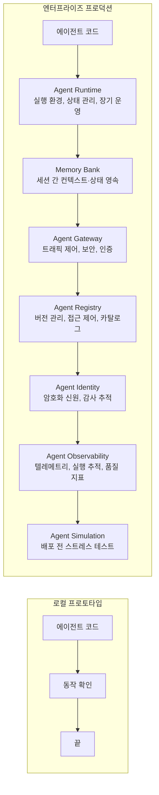
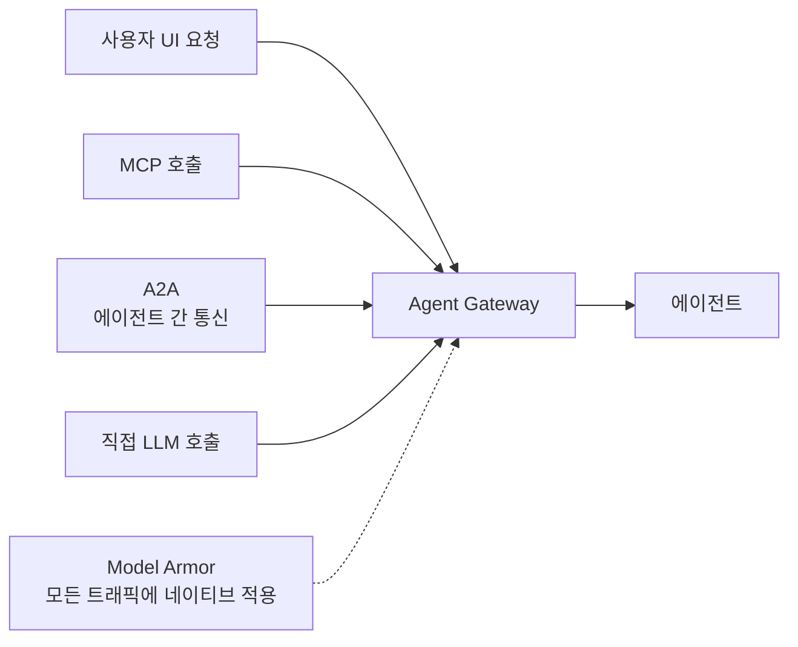
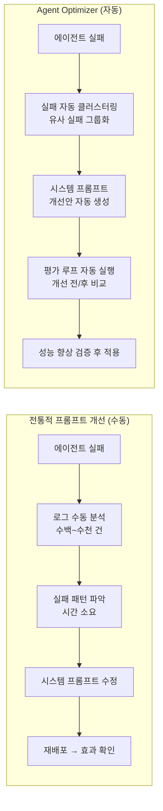
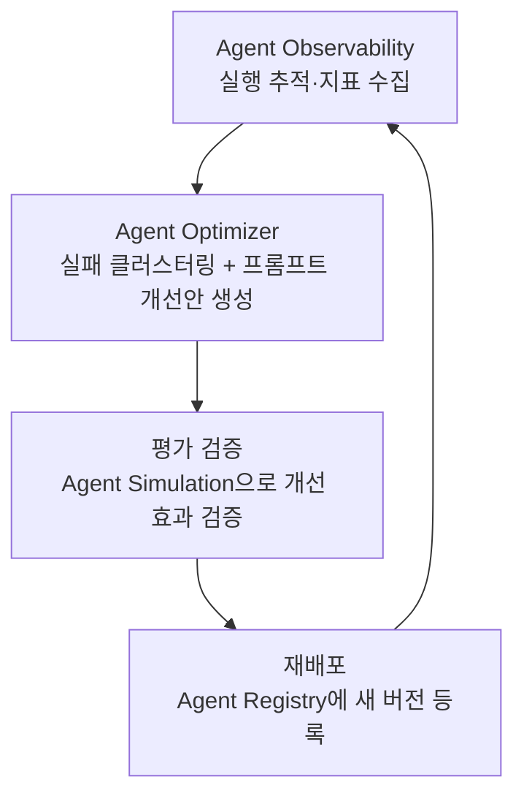

# Agent Deployment (에이전트 배포)

## 개요

**Agent Deployment**는 에이전트의 4번째 핵심 구성요소 — "몸체와 다리"다. Planning·Memory·Tools가 에이전트의 두뇌라면, Deployment는 그 두뇌가 프로덕션 환경에서 실제로 작동하고 지속되도록 하는 런타임·인프라 레이어다. 2026년 5월 업데이트에서 에이전트 설계의 필수 요소로 공식 추가됐다.



## Agent Runtime

에이전트 실행 환경의 핵심. 기존 서버리스(Lambda 등)와 달리 에이전트 특화 설계:

### 핵심 특성

```
sub-second cold start:
  기존 컨테이너: 수 초~수십 초 초기화
  Agent Runtime: 거의 즉각적 — 사용자 경험 저하 없음

최대 7일 멀티-데이 운영:
  기존 서버리스: 수 분~수십 분 타임아웃
  Agent Runtime: 수 시간~최대 7일 장기 태스크 지원

auto-resume (자동 재개):
  외부 이벤트(웹훅, 휴먼 승인, API 응답) 대기 중 에이전트 일시 중단
  이벤트 도달 시 컨텍스트·상태 완전 복원하여 자동 재개
  리소스 낭비 없이 비동기 대기 가능
```

### 구현 패턴

```python
# Agent Runtime에서의 장기 실행 에이전트 패턴 (개념적 예시)
from google.adk.runtime import AgentRuntime

runtime = AgentRuntime()

async def document_review_agent(documents: list[str]):
    """여러 날에 걸쳐 문서를 검토하고 외부 전문가 승인을 기다리는 에이전트"""
    
    session = await runtime.create_session(
        agent_id="doc-review-agent-v2",
        max_duration_days=3  # 최대 3일 실행
    )
    
    # Phase 1: 문서 분석 (수 분)
    analysis = await session.run(analyze_documents, documents)
    
    # 외부 전문가 검토 요청 후 대기 — 에이전트 일시 중단
    # (Runtime이 상태를 저장, 리소스 해제)
    expert_review = await session.wait_for_webhook(
        webhook_url="/api/expert-review",
        timeout_hours=48  # 48시간 대기
    )
    
    # 전문가 응답 후 자동 재개 (상태 완전 복원)
    # Phase 2: 피드백 반영 + 최종 보고서 작성
    final_report = await session.run(
        compile_report,
        analysis=analysis,
        expert_feedback=expert_review
    )
    
    return final_report
```

### 기존 인프라 대비 비교

| 특성 | Cloud Functions/Lambda | GKE/Cloud Run | Agent Runtime |
|------|----------------------|---------------|---------------|
| Cold start | 1~10초 | 수 초 | sub-second |
| 최대 실행 시간 | 15분~1시간 | 무제한 (직접 관리) | 7일 (관리형) |
| 상태 관리 | 직접 구현 | 직접 구현 | 내장 |
| auto-resume | 직접 구현 | 직접 구현 | 내장 |
| 에이전트 특화 | ✗ | ✗ | ✓ |

## Memory Bank

세션 경계를 넘어 에이전트 컨텍스트와 상태를 영속하는 저장소.

```python
# Memory Bank 활용 패턴 (개념적)
from google.adk.memory import MemoryBank

memory_bank = MemoryBank(agent_id="customer-support-agent")

class CustomerSupportAgent:
    async def handle_session(self, user_id: str, query: str):
        # 이전 세션 컨텍스트 자동 로드
        context = await memory_bank.load_context(
            user_id=user_id,
            keys=["user_profile", "open_tickets", "interaction_history"]
        )
        
        # 에이전트 응답 생성 (전체 히스토리 참조)
        response = await self.agent.run(
            query=query,
            context=context
        )
        
        # 세션 종료 후 컨텍스트 자동 저장
        await memory_bank.save_context(
            user_id=user_id,
            updates={
                "last_interaction": datetime.now().isoformat(),
                "resolved_count": context["resolved_count"] + 1
            }
        )
        
        return response
```

**Memory Bank vs Vector DB 직접 구현 비교**:
- Memory Bank: Agent Runtime과 네이티브 통합, Agent Identity 감사 추적 자동, 별도 설정 불필요
- Vector DB 직접 구현: 플랫폼 독립적, 더 세밀한 제어 가능, 관리 부담 높음

## Agent Gateway

모든 에이전트 트래픽의 단일 제어 진입점.



**Agent Gateway 역할:**
- 인증/인가 통합 (OAuth, IAM 충돌 해소)
- Model Armor 네이티브 적용 (별도 설정 없음)
- 트래픽 라우팅 (에이전트 버전, A/B 테스트)
- 속도 제한 (Rate limiting)
- 감사 로그 (모든 트래픽 기록)

## Agent Registry

조직 내 에이전트·도구·스킬의 중앙 카탈로그.

```python
# Agent Registry 등록 및 조회 패턴 (개념적)
from google.adk.registry import AgentRegistry

registry = AgentRegistry()

# 에이전트 등록 (보안 검토 후)
await registry.register(
    agent_id="invoice-processor-v3",
    description="청구서 처리 및 승인 자동화",
    version="3.0.1",
    owner_team="finance-automation",
    security_review_status="approved",  # 보안 사전 검토 완료
    allowed_teams=["finance", "accounting"],  # 팀 기반 접근 제어
    tools=["read_invoice", "validate_amount", "submit_for_approval"],
    tags=["finance", "automation", "approved"]
)

# 팀에서 사용 가능한 에이전트 조회
available_agents = await registry.list(
    team="finance",
    tags=["approved"],
    status="active"
)
```

**Agent Registry의 가치**:
- 보안 팀이 에이전트를 사전 검토 후 카탈로그에 등록 → 미검토 에이전트 실행 차단
- 버전 관리 → 롤백 및 점진적 롤아웃 가능
- 팀별 접근 제어 → 민감 에이전트를 허가된 팀만 사용

## Agent Identity

에이전트에 암호화 기반의 검증 가능한 신원을 부여하는 시스템.

```
기존 (신원 모호):
  에이전트가 DB에 접근 → "누가 접근했나?" 알 수 없음
  에이전트가 API 호출 → 서비스 계정 공유로 책임 추적 불가

Agent Identity (SPIFFE 기반):
  에이전트 시작 시 자동으로 암호화 ID 발급
  (Service Account, User OAuth와 구분되는 3번째 주체 유형)

  모든 작업에 ID 첨부:
    "invoice-processor-v3 (ID: spiffe://company.com/agent/inv-proc-v3)
     가 2026-06-17T09:23:11Z에 청구서 #4521를 읽었음"
  
  감사 추적 자동 생성:
    누가(어떤 에이전트가) → 무엇을 → 언제 → 어떤 결과로
    규정 준수 감사(Compliance Audit)에 활용
```

```python
# Agent Identity 활용 패턴 (개념적)
from google.adk.identity import AgentIdentity

# Agent Identity는 에이전트 시작 시 자동 발급됨
# 개발자가 직접 관리할 필요 없음

# 감사 로그 조회 예시
audit_logs = await identity_service.query_audit_logs(
    agent_id="invoice-processor-v3",
    time_range=("2026-06-01", "2026-06-17"),
    action_types=["read", "write", "api_call"]
)
# → 해당 에이전트의 모든 작업 이력 조회 가능
```

## Agent Simulation

배포 전 에이전트를 합성 트래픽으로 사전 검증하는 스트레스 테스트 도구.

```
Agent Simulation 흐름:

1. 합성 인터랙션 생성
   실제 사용자 데이터 없이 다양한 시나리오 자동 생성:
   - 정상 케이스 (대다수)
   - 엣지 케이스 (경계 조건)
   - 적대적 입력 (악의적 사용자 시뮬레이션)
   - 부하 테스트 (동시 요청 수천 건)

2. 페르소나 기반 평가
   다양한 사용자 유형으로 에이전트 반응 테스트:
   - "급한 사용자": 짧고 불완전한 요청
   - "비기술적 사용자": 모호한 표현 사용
   - "악의적 사용자": 정책 위반 시도

3. Critic Agent 자동 평가
   각 시뮬레이션 실행의 execution trace를 Critic Agent가 평가:
   - 목표 달성 여부
   - 실행 경로 효율성
   - 정책 준수 여부
   - Reasoning Drift 감지

4. 결과 분석
   실패 패턴 클러스터링 → 핵심 취약점 우선순위화
   → 배포 전 수정 후 재검증
```

```python
# Agent Simulation 패턴 (개념적)
from google.adk.simulation import AgentSimulation

simulation = AgentSimulation(
    agent=my_agent,
    critic_agent=critic_llm  # 실행 추적 자동 평가용
)

# 시뮬레이션 실행
results = await simulation.run(
    num_scenarios=1000,      # 합성 시나리오 수
    personas=["normal", "impatient", "technical", "adversarial"],
    include_edge_cases=True,
    stress_test_concurrency=100  # 동시 요청 수
)

# 결과 분석
print(f"전체 성공률: {results.success_rate:.1%}")
print(f"정책 위반 감지: {results.policy_violations}건")
print(f"Reasoning Drift 발생: {results.drift_cases}건")
print("\n취약점 Top 3:")
for issue in results.top_issues[:3]:
    print(f"  - {issue.description} (발생률: {issue.rate:.1%})")
```

## Agent Optimizer

프로덕션에서 에이전트의 실패 패턴을 자동으로 분석하고 시스템 프롬프트를 개선하는 자동화 도구. Gemini Enterprise Agent Platform의 **Optimize 레이어** 핵심 컴포넌트다.



### 핵심 기능

**자동 실패 클러스터링 (Auto-cluster Failures)**:
- 프로덕션 실행 트레이스에서 실패 케이스를 자동 수집
- 유사한 실패를 그룹화하여 패턴 파악 — 수동 로그 분석 대체
- 각 클러스터에 대해 "왜 실패하는가" 원인 분류

**시스템 프롬프트 개선 제안 (Automated Prompt Suggestion)**:
- 클러스터 분석 결과를 바탕으로 시스템 명령 또는 도구 설명 수정안 자동 생성
- DSPy/MIPROv2 계열의 메타 최적화 접근법과 유사하나 에이전트 특화
- 개선안은 평가 루프에서 자동 검증 후 사람이 최종 승인

**반복 최적화 (Iterative Optimization)**:
- 개선안 적용 → 평가 재실행 → 성능 측정 → 재개선의 루프 자동화
- 목표 지표(목표 달성률, 도구 호출 정확도 등) 대비 개선 수렴 시까지 반복

### 위치: Loop Engineering과의 연결

Agent Optimizer는 배포 후(Post-deployment) 지속 개선 루프의 일부다:



이 루프는 [[Loop_Engineering/Continuous_Optimization|Continuous Optimization]]의 에이전트 특화 구현체로 볼 수 있다.

---

## 배포 체크리스트

```
배포 전 (Pre-deployment):
  □ Agent Simulation 실행 — 성공률 임계값 충족?
  □ Agent Registry 등록 — 보안 검토 완료?
  □ Agent Identity 발급 확인
  □ Agent Gateway 라우팅 규칙 설정
  □ Memory Bank 스키마 마이그레이션 (필요시)

배포 후 (Post-deployment):
  □ Agent Observability 대시보드 확인 (Operational)
  □ Quality Dashboard 기준선(baseline) 설정
  □ 알람 임계값 설정 (에러율, 지연, 품질 저하)
  □ 첫 24시간 집중 모니터링

지속 개선 루프:
  □ Agent Optimizer 주기적 실행 — 실패 클러스터링 + 프롬프트 개선안 검토
  □ 개선안 수락 시 Agent Simulation 재검증 후 배포
```

## AI Engineering에서의 역할

Agent Deployment는 **에이전트를 프로토타입에서 엔터프라이즈 시스템으로 격상시키는 레이어**다. 아무리 뛰어난 Planning·Memory·Tools를 갖춘 에이전트도 적절한 Deployment 인프라 없이는 장기 운영·보안·감사·규모 확장이 불가능하다. 특히 규제 산업(금융, 의료, 법률)에서 Agent Identity + Agent Gateway + Agent Registry의 조합은 AI 자동화 도입의 전제 조건이 되고 있다.

## 관련 개념
[[Agent_Core_Pillars]] · [[Agent_Architectures]] · [[Agent_Memory]] · [[Guardrail_Engineering]] · [[Observability_and_Tracing]] · [[LLM_as_a_Judge]] · [[Production]]

## 출처
- [[Introduction_to_Agents]] (이 위키의 기존 소스, 2025년 11월 최초 발행 → 2026년 5월 업데이트)
- [[Prototype_to_Production]] (이 위키의 기존 소스, 2025년 11월 최초 발행 → 2026년 5월 업데이트)
- [[Agent_Quality]] (이 위키의 기존 소스, 2025년 11월 최초 발행 → 2026년 5월 업데이트)
- Google Cloud "Optimize your agents" — [docs.cloud.google.com](https://docs.cloud.google.com/gemini-enterprise-agent-platform/optimize) [1]
- Google Cloud "Optimize agent prompts" — [docs.cloud.google.com](https://docs.cloud.google.com/gemini-enterprise-agent-platform/optimize/evaluation/optimize-agent) [2]
- Google Cloud Blog "Introducing Gemini Enterprise Agent Platform" — [cloud.google.com](https://cloud.google.com/blog/products/ai-machine-learning/introducing-gemini-enterprise-agent-platform) [3]

### 참고 문헌
[1] https://docs.cloud.google.com/gemini-enterprise-agent-platform/optimize
[2] https://docs.cloud.google.com/gemini-enterprise-agent-platform/optimize/evaluation/optimize-agent
[3] https://cloud.google.com/blog/products/ai-machine-learning/introducing-gemini-enterprise-agent-platform
