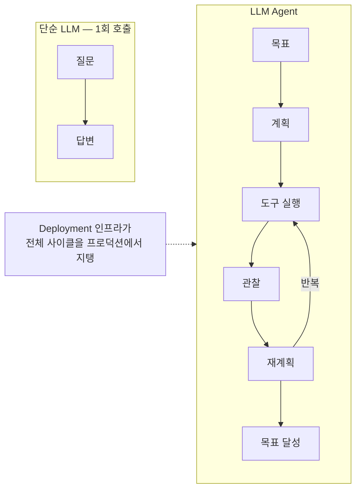
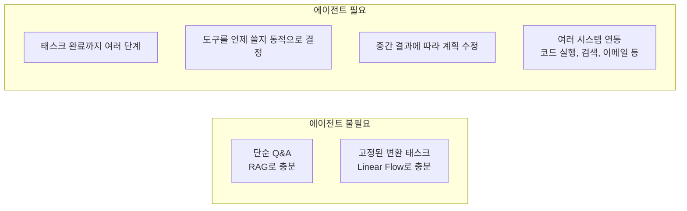
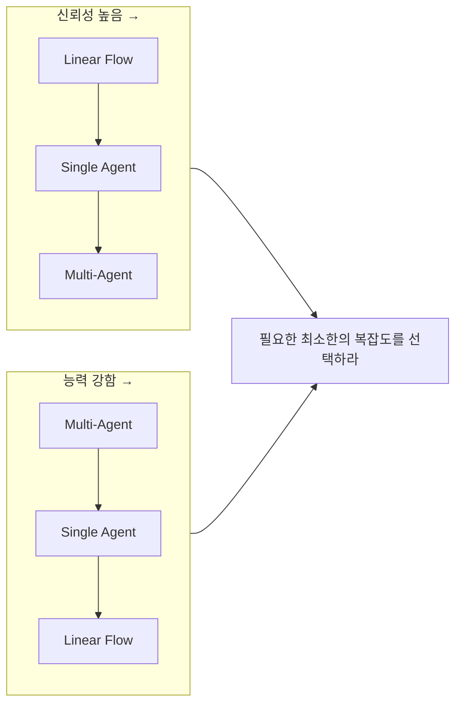

# Agent Engineering (에이전트 엔지니어링)

## 개요

**Agent Engineering**은 LLM을 단순한 텍스트 생성기가 아닌 **자율적으로 목표를 추구하는 시스템**으로 설계하는 기술이다. Lilian Weng (OpenAI, 2023)의 정의에 따르면 Planning·Memory·Tools 3기둥이며, 2026년 5월 업데이트에서 **Deployment**가 4번째 핵심 요소로 추가됐다.

## 하위 문서

| 문서 | 내용 |
|------|------|
| [[Agent_Core_Pillars]] | Planning/Memory/Tools/**Deployment** 4기둥 (Weng 2023 + 2026년 5월) |
| [[Agent_Architectures]] | Single/Orchestrator/Router/Multi-Agent/**Long-running** |
| [[Planning_and_Reflection]] | Plan-and-Solve, Reflexion (NeurIPS 2023) |
| [[Agent_Memory]] | Short/Long-term Memory, Memory ETL, Agent Runtime/Memory Bank |
| [[Agent_Skills_and_Protocols]] | Anthropic Skills, Google A2A Protocol |
| [[Agent_Deployment]] | Agent Runtime, Memory Bank, Gateway, Registry, Identity, Simulation *(2026년 5월)* |
| [[AgentOps]] | AgentOps 방법론 3 Pillars, agentops.ai 플랫폼, 도구 비교 (LangSmith/Langfuse/Braintrust 등) |
| [[Anthropic_Workflow_Patterns]] | 5가지 워크플로 패턴(chaining/routing/parallelization/orchestrator-workers/evaluator-optimizer) |
| [[Agent_Frameworks]] | AutoGen v0.4, CrewAI, OpenAI Agents SDK, Claude Agent SDK, Agno/Mastra |
| [[Multi_Agent_Coordination]] | 조정 패턴, 통신 프로토콜, 실패 모드(MASFT/MAST/Groupthink) |
| [[Computer_Use_and_Voice_Agents]] | Claude/OpenAI CUA/Gemini 컴퓨터 사용, Pipecat/LiveKit 음성 에이전트 |
| [[Autonomous_Systems]] | METR Time Horizon, STaR/AlphaEvolve/Darwin Gödel Machine, kill switch/HITL |
| [[Eval_Driven_Development_and_Agent_Workbench]] | 3단계 평가 레이어, Agent Workbench 7가지 표면 |

## 에이전트 적용 기준

## 복잡성과 신뢰도 트레이드오프

## AI Engineering에서의 역할

Agent Engineering은 **AI 자동화의 최전선**이다. 반복적인 지식 노동(리서치, 코드 작성, 데이터 분석)을 자율적으로 처리하는 시스템을 만들며, AI Engineering 스택의 "두뇌" 역할을 한다.

## 관련 개념
[[Flow_Engineering/Flow_Engineering]] · [[Harness_Engineering/Guardrail_Engineering]] · [[Loop_Engineering/Data_Flywheel]] · [[Production]]
