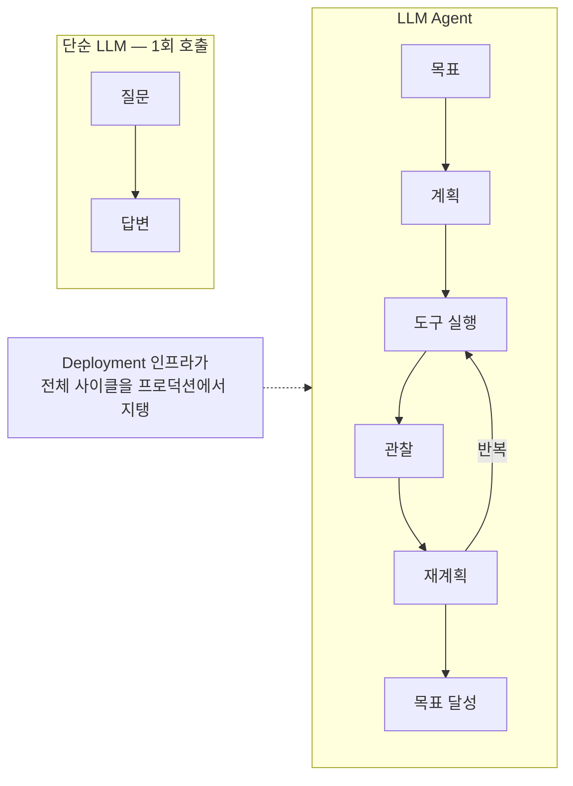
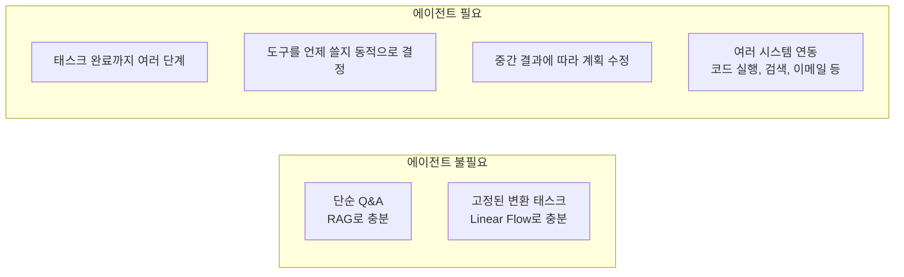
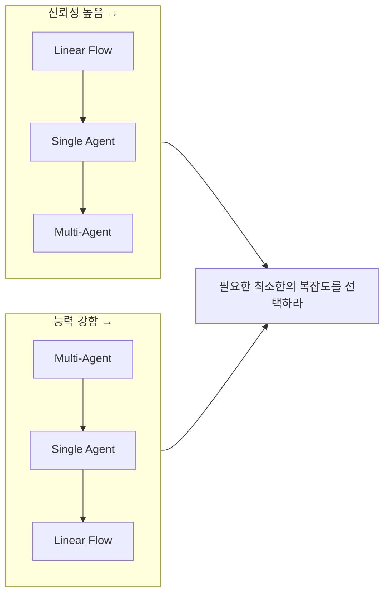

# Agent Engineering (에이전트 엔지니어링)

## 개요

**Agent Engineering**은 LLM을 단순한 텍스트 생성기가 아닌 **자율적으로 목표를 추구하는 시스템**으로 설계하는 기술이다. Lilian Weng (OpenAI, 2023)의 정의에 따르면 Planning·Memory·Tools 3기둥이며, 2026년 5월 업데이트에서 **Deployment**가 4번째 핵심 요소로 추가됐다.

```mermaid
flowchart LR
    subgraph simple["단순 LLM — 1회 호출"]
        Q[질문] --> A[답변]
    end
    subgraph agent["LLM Agent"]
        G[목표] --> P[계획] --> T[도구 실행] --> O[관찰] --> RP[재계획]
        RP -->|반복| T
        RP --> DA[목표 달성]
    end
    DEPLOY["Deployment 인프라가<br/>전체 사이클을 프로덕션에서 지탱"] -.-> agent
```

## 하위 문서

에이전트 설계 지식은 네 갈래로 나뉜다. **기법·패턴**은 어떤 에이전트에도 재사용되는 구성 요소이고, **인프라·운영**은 에이전트를 만들고 배포하고 관측하는 기반이며, **적용 사례**는 이 둘이 특정 도메인에서 조합된 시스템 유형이다.

### 기초

| 문서 | 내용 |
|------|------|
| [[AI/Engineering/Agent_Engineering/Agent_Core_Pillars\|Agent_Core_Pillars]] | Planning/Memory/Tools/**Deployment** 4기둥 (Weng 2023 + 2026년 5월) |
| [[AI/Engineering/Agent_Engineering/Agent_Architectures\|Agent_Architectures]] | Single/Orchestrator/Router/Multi-Agent/**Long-running** |

### 기법·패턴

| 문서 | 내용 |
|------|------|
| [[AI/Engineering/Agent_Engineering/Agent_Techniques/Agent_Techniques\|Agent_Techniques]] | 카테고리 개요 |
| [[AI/Engineering/Agent_Engineering/Agent_Techniques/Anthropic_Workflow_Patterns\|Anthropic_Workflow_Patterns]] | 5가지 워크플로 패턴(chaining/routing/parallelization/orchestrator-workers/evaluator-optimizer) |
| [[AI/Engineering/Agent_Engineering/Agent_Techniques/Planning_and_Reflection\|Planning_and_Reflection]] | Plan-and-Solve, Reflexion (NeurIPS 2023) |
| [[AI/Engineering/Agent_Engineering/Agent_Techniques/Agent_Memory\|Agent_Memory]] | Short/Long-term Memory, Memory ETL, Agent Runtime/Memory Bank |
| [[AI/Engineering/Agent_Engineering/Agent_Techniques/Multi_Agent_Coordination\|Multi_Agent_Coordination]] | 조정 패턴, 통신 프로토콜, 실패 모드(MASFT/MAST/Groupthink) |
| [[AI/Engineering/Agent_Engineering/Agent_Techniques/Agent_Skills_and_Protocols\|Agent_Skills_and_Protocols]] | Anthropic Skills, MCP, Google A2A Protocol, AG-UI |

### 인프라·운영

| 문서 | 내용 |
|------|------|
| [[AI/Engineering/Agent_Engineering/Agent_Infrastructure/Agent_Infrastructure\|Agent_Infrastructure]] | 카테고리 개요 |
| [[AI/Engineering/Agent_Engineering/Agent_Infrastructure/Agent_Frameworks\|Agent_Frameworks]] | AutoGen v0.4, CrewAI, OpenAI Agents SDK, Claude Agent SDK, Agno/Mastra |
| [[AI/Engineering/Agent_Engineering/Agent_Infrastructure/Agent_Deployment\|Agent_Deployment]] | Agent Runtime, Memory Bank, Gateway, Registry, Identity, Simulation *(2026년 5월)* |
| [[AI/Engineering/Agent_Engineering/Agent_Infrastructure/AgentOps\|AgentOps]] | AgentOps 방법론 3 Pillars, agentops.ai 플랫폼, 도구 비교 (LangSmith/Langfuse/Braintrust 등) |
| [[AI/Engineering/Agent_Engineering/Agent_Infrastructure/Eval_Driven_Development_and_Agent_Workbench\|Eval_Driven_Development_and_Agent_Workbench]] | 3단계 평가 레이어, Agent Workbench 7가지 표면 |

### 적용 사례

| 문서 | 내용 |
|------|------|
| [[AI/Engineering/Agent_Engineering/Agent_Applications/Agent_Applications\|Agent_Applications]] | 카테고리 개요 |
| [[AI/Engineering/Agent_Engineering/Agent_Applications/Coding_Agents\|Coding_Agents]] | 컨텍스트 파일(AGENTS.md), spec-driven 개발, Plan→Edit→Verify 루프, worktree 병렬, ACI |
| [[AI/Engineering/Agent_Engineering/Agent_Applications/Deep_Research_Agents\|Deep_Research_Agents]] | Planner/Researcher/Synthesizer 구조, bounded sub-agent, 인용 검증, BrowseComp |
| [[AI/Engineering/Agent_Engineering/Agent_Applications/Computer_Use_and_Voice_Agents\|Computer_Use_and_Voice_Agents]] | Claude/OpenAI CUA/Gemini 컴퓨터 사용, Pipecat/LiveKit 음성 에이전트 |
| [[AI/Engineering/Agent_Engineering/Agent_Applications/Autonomous_Systems\|Autonomous_Systems]] | METR Time Horizon, STaR/AlphaEvolve/Darwin Gödel Machine, kill switch/HITL |

## 에이전트 적용 기준

```mermaid
flowchart LR
    subgraph no["에이전트 불필요"]
        N1["단순 Q&A<br/>RAG로 충분"]
        N2["고정된 변환 태스크<br/>Linear Flow로 충분"]
    end
    subgraph yes["에이전트 필요"]
        Y1["태스크 완료까지 여러 단계"]
        Y2["도구를 언제 쓸지 동적으로 결정"]
        Y3["중간 결과에 따라 계획 수정"]
        Y4["여러 시스템 연동<br/>코드 실행, 검색, 이메일 등"]
    end
```

## 복잡성과 신뢰도 트레이드오프

```mermaid
flowchart LR
    subgraph reliability["신뢰성 높음 →"]
        LF1[Linear Flow] --> SA1[Single Agent] --> MA1[Multi-Agent]
    end
    subgraph capability["능력 강함 →"]
        MA2[Multi-Agent] --> SA2[Single Agent] --> LF2[Linear Flow]
    end
    reliability & capability --> RULE["필요한 최소한의 복잡도를 선택하라"]
```

## AI Engineering에서의 역할

Agent Engineering은 **AI 자동화의 최전선**이다. 반복적인 지식 노동(리서치, 코드 작성, 데이터 분석)을 자율적으로 처리하는 시스템을 만들며, AI Engineering 스택의 "두뇌" 역할을 한다.

## 관련 개념
[[AI/Engineering/Flow_Engineering/Flow_Engineering|Flow Engineering]] · [[AI/Engineering/Harness_Engineering/Guardrail_Engineering|Harness_Engineering/Guardrail_Engineering]] · [[AI/Engineering/Loop_Engineering/Data_Flywheel|Loop_Engineering/Data_Flywheel]] · [[AI/Engineering/Agent_Engineering/Agent_Infrastructure/Agent_Deployment|Agent Deployment]]
