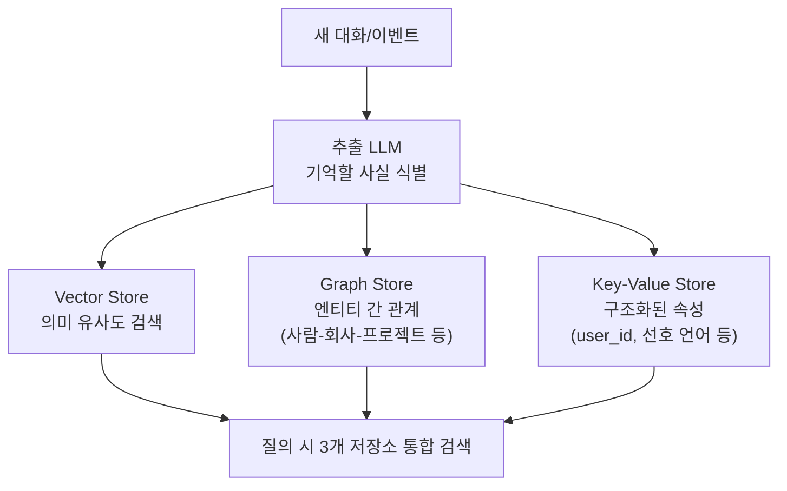
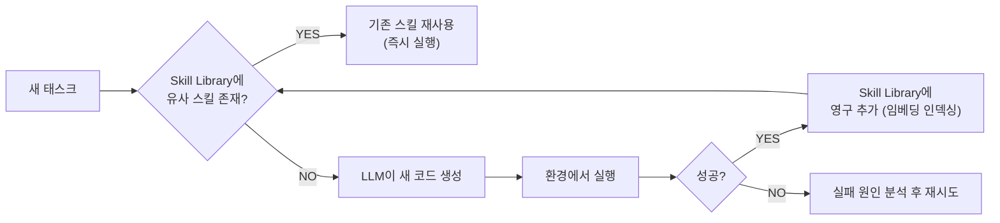
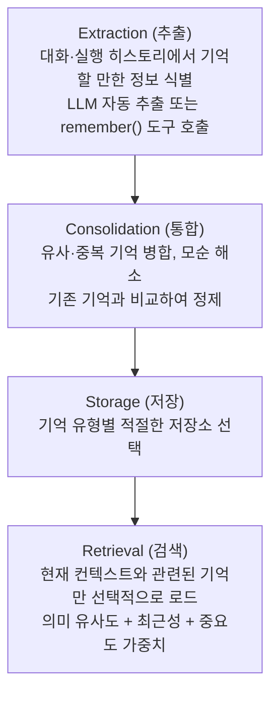

# Agent Memory (에이전트 메모리)

## 개요

에이전트 메모리는 에이전트가 정보를 저장하고 추후 검색하여 활용하는 모든 메커니즘이다. 인간의 기억 유형처럼 **Short-term**(단기), **Long-term**(장기)으로 구분된다. 좋은 메모리 시스템은 에이전트가 이전 경험을 바탕으로 더 나은 결정을 내리게 한다.

## Short-term Memory (단기 기억)

### Conversation History (대화 히스토리)
현재 세션 내 대화 내용. LLM의 컨텍스트 창에 저장:

```python
from langchain_core.messages import HumanMessage, AIMessage

# 대화 히스토리가 누적됨
messages = [
    HumanMessage(content="안녕! 내 이름은 홍길동이야"),
    AIMessage(content="안녕하세요, 홍길동님!"),
    HumanMessage(content="내 이름이 뭔지 기억해?"),
    # LLM은 이 전체 히스토리를 참고하여 "홍길동"이라고 답변
]
```

### In-Context Working Memory
복잡한 태스크 실행 중 중간 결과 저장:
```python
class AgentState(TypedDict):
    task: str
    plan: list[str]
    completed_steps: list[dict]   # 완료된 단계들의 결과
    tool_outputs: list            # 도구 출력들
    current_hypothesis: str       # 현재 추론 중인 가설
```

### 단기 기억의 한계
- 컨텍스트 창 초과 시 오래된 내용 삭제 필요
- 세션 종료 시 완전 소실
- 해결책: 대화 요약 + Long-term으로 이관

```python
from langchain.memory import ConversationSummaryBufferMemory

memory = ConversationSummaryBufferMemory(
    llm=llm,
    max_token_limit=2000,  # 2000 토큰 초과 시 자동 요약
    return_messages=True
)
```

## Long-term Memory (장기 기억)

세션 간 지속되는 외부 저장소 기반 기억.

### Vector-based Memory (벡터 메모리)
의미 검색으로 관련 기억 검색:

```python
from langchain_community.vectorstores import Chroma
from langchain_openai import OpenAIEmbeddings
from datetime import datetime

class VectorMemory:
    def __init__(self):
        self.store = Chroma(embedding_function=OpenAIEmbeddings())
    
    def save(self, content: str, metadata: dict = {}):
        """기억 저장"""
        self.store.add_texts(
            texts=[content],
            metadatas=[{**metadata, "timestamp": datetime.now().isoformat()}]
        )
    
    def recall(self, query: str, k: int = 5) -> list:
        """관련 기억 검색"""
        return self.store.similarity_search(query, k=k)
    
    def forget(self, memory_id: str):
        """기억 삭제"""
        self.store.delete([memory_id])

# 사용 예시
memory = VectorMemory()
memory.save("사용자 홍길동은 Python을 선호하며 간결한 코드 스타일을 좋아함")

# 다음 세션에서
relevant_memories = memory.recall("코드 스타일 선호도")
```

### User Profile Memory (사용자 프로필)
사용자 특성·선호도를 구조화된 형태로 저장:

```python
from pydantic import BaseModel
from typing import Optional

class UserProfile(BaseModel):
    user_id: str
    name: Optional[str]
    preferred_language: str = "ko"
    expertise_level: str = "intermediate"  # beginner/intermediate/expert
    interests: list[str] = []
    communication_style: str = "formal"    # formal/casual
    
class ProfileMemory:
    def update_from_conversation(self, profile: UserProfile, message: str):
        """대화에서 프로필 자동 업데이트"""
        update_prompt = f"""
        현재 사용자 프로필: {profile.dict()}
        새 대화 내용: {message}
        
        프로필 업데이트가 필요한 항목을 JSON으로 반환하세요.
        변경 없으면 빈 객체 {{}} 반환.
        """
        updates = llm_json_output(update_prompt)
        return profile.copy(update=updates)
```

### Episodic Memory (에피소딕 메모리)
과거 태스크 실행 기록:

```python
# 성공한 태스크 패턴 저장
episodic_memory.save({
    "task_type": "코드 디버깅",
    "problem": "IndexError in list comprehension",
    "solution_steps": ["인덱스 범위 확인", "len() 사용하여 검증", "try-except 추가"],
    "success": True,
    "time_taken": 120  # 초
})

# 유사한 태스크에서 검색
similar_cases = episodic_memory.search("배열 인덱스 오류")
# → 이전 성공 패턴을 현재 태스크에 적용
```

## Memory as a Tool 패턴

메모리를 에이전트의 도구 중 하나로 등록:

```python
from langchain.tools import tool

@tool
def remember(content: str) -> str:
    """중요한 정보를 장기 기억에 저장합니다"""
    memory_store.save(content)
    return f"기억 저장됨: {content[:50]}..."

@tool
def recall(query: str) -> str:
    """관련 기억을 검색합니다"""
    memories = memory_store.search(query)
    return "\n".join([m.page_content for m in memories])

# 에이전트가 스스로 기억 저장/검색 결정
agent = create_react_agent(llm, tools=[remember, recall, ...])
```

## MemGPT / Virtual Context Management

Packer et al. (2023, MemGPT 논문, 이후 Letta로 프로젝트명 변경)이 제안한 아키텍처. OS의 **가상 메모리(Virtual Memory)** 개념을 LLM에 그대로 적용한다 — 한정된 컨텍스트 창을 물리 메모리(RAM)로, 외부 저장소를 디스크로 취급한다.

```
OS 가상 메모리 유추:
  RAM (제한적, 빠름)         ↔ Main Context (LLM 컨텍스트 창)
  Disk (거의 무제한, 느림)   ↔ External Context (외부 DB)
  Page Fault (필요 시 로드)  ↔ 함수 호출로 명시적 메모리 인출/저장

MemGPT의 Main Context 구조:
  ┌─────────────────────────────┐
  │ System Instructions (고정)   │
  │ Working Context (핵심 요약)  │ ← LLM이 스스로 편집 가능
  │ FIFO Queue (최근 대화)       │ ← 가득 차면 오래된 것부터 요약 후 축출
  └─────────────────────────────┘
```

핵심 아이디어는 **LLM 스스로가 자신의 메모리를 관리하는 함수를 호출**한다는 점이다 — `core_memory_append()`, `archival_memory_search()` 같은 도구를 self-editing 방식으로 사용해 무엇을 기억에 남기고 무엇을 축출할지 능동적으로 결정한다.

```python
# MemGPT 스타일 self-editing memory 도구 (개념적)
@tool
def core_memory_append(section: str, content: str):
    """working context의 특정 섹션에 정보를 추가한다.
    LLM이 대화 중 중요하다고 판단한 정보를 스스로 여기에 기록"""
    working_context[section] += f"\n{content}"

@tool
def archival_memory_insert(content: str):
    """FIFO 큐에서 축출될 정보를 archival(장기) 저장소로 이관"""
    archival_store.add(content, embed(content))

@tool
def archival_memory_search(query: str, top_k: int = 3):
    """archival 저장소에서 관련 기억 검색 후 컨텍스트에 페이지인(page-in)"""
    return archival_store.search(query, top_k)
```

컨텍스트 창이 가득 차면 시스템이 자동으로 "메모리 압박(memory pressure)" 경고를 LLM에 보내고, LLM이 스스로 무엇을 요약·축출할지 결정한다 — 사람이 개입하지 않는 자기관리형 메모리다.

## Sleep-Time Compute

Letta 팀이 제안한 개념(2025). 에이전트가 **사용자 요청을 기다리는 유휴 시간(idle time)**을 활용해 메모리를 백그라운드로 정리·재구성한다 — 사람이 수면 중 기억을 응고(consolidate)하는 것과 유사한 발상이다.

```
전통적 방식: 매 요청마다 실시간으로 전체 기억을 검색·정리 → 지연시간 증가

Sleep-time Compute:
  유휴 시간에 미리:
    - 대화 기록을 요약·구조화
    - 모순되는 기억을 탐지하고 정리
    - 자주 쓰이는 질의에 대한 답을 미리 계산해 캐싱
  → 실제 요청 시점에는 이미 정리된 메모리만 조회 (지연시간 감소)
```

**효과**: 응답 시점의 지연시간과 토큰 비용을 줄이면서도 메모리 품질(모순 해소, 최신성)을 유지. Runtime Optimization의 캐싱 전략([[Loop_Engineering/Runtime_Optimization]])과 철학이 비슷하지만, 대상이 응답 자체가 아니라 메모리 상태라는 점이 다르다.

## Mem0 — Hybrid Memory (Vector + Graph + KV)

Mem0(2024)는 벡터 검색만으로는 관계형 정보(누가 누구와 어떤 관계인가)를 포착하기 어렵다는 문제를 세 가지 저장소를 결합해 해결한다.



```python
from mem0 import Memory

m = Memory()

m.add(
    "홍길동은 삼성전자에서 근무하며 김철수와 같은 팀이다. 파이썬을 선호한다.",
    user_id="hong"
)
# 내부적으로:
#   Vector: "파이썬 선호" 임베딩 저장
#   Graph: (홍길동)-[근무]->(삼성전자), (홍길동)-[동료]->(김철수)
#   KV: {"user_id": "hong", "preferred_language": "python"}

# 그래프 관계 기반 질의도 가능
related = m.search("홍길동의 동료는 누구인가?", user_id="hong")
```

**Mem0 vs 순수 Vector Memory**: 벡터 검색은 "파이썬을 좋아하는 사람"류 의미 질의에 강하지만 "홍길동의 동료가 다니는 회사"처럼 다단계 관계 추론에는 약하다. Mem0는 Graph Store로 이를 보완하며, 벤치마크(LOCOMO)에서 순수 벡터 방식 대비 관계 추론 정확도가 높게 보고된다.

## Skill Libraries and Lifelong Learning — Voyager

Wang et al. (2023)이 Minecraft 환경에서 제안한 **평생 학습 에이전트**. 핵심 아이디어는 에이전트가 성공한 행동을 **재사용 가능한 코드 스킬로 라이브러리에 저장**하고, 이후 유사 문제에서 처음부터 다시 추론하지 않고 라이브러리를 검색해 재사용하는 것이다.



```python
class SkillLibrary:
    """Voyager 스타일 코드 스킬 라이브러리"""
    def __init__(self):
        self.skills = {}  # name -> {code, description, embedding}

    def retrieve(self, task_description: str, k: int = 3) -> list:
        """현재 태스크와 의미적으로 유사한 스킬 검색"""
        query_embed = embed(task_description)
        return top_k_by_similarity(query_embed, self.skills, k)

    def add_skill(self, name: str, code: str, description: str):
        """검증된 성공 스킬만 영구 저장 — 실패한 시도는 저장하지 않음"""
        self.skills[name] = {
            "code": code, "description": description, "embedding": embed(description)
        }
```

**Voyager의 3요소**: ① 자동 커리큘럼(Automatic Curriculum) — 현재 상태 기준으로 다음 도전 과제를 스스로 설정, ② 스킬 라이브러리 — 검증된 코드를 영구 축적, ③ 반복 프롬프팅(Iterative Prompting) — 환경 피드백·실행 오류·자기 검증을 결합해 코드를 개선.

**AI Engineering 관점에서의 의의**: 기존 Memory가 "사실을 기억"하는 데 초점을 둔다면, Skill Library는 "능력을 기억"한다 — 에이전트가 시간이 지날수록 더 유능해지는 평생 학습(lifelong learning)의 실용적 구현체다. [[Agent_Skills_and_Protocols]]의 Agent Skills와 개념적으로 연결되지만, Voyager의 스킬은 사람이 아니라 **에이전트 스스로 생성·검증·축적**한다는 점이 다르다.

## LangMem / Memory 전문 라이브러리

LangChain의 Memory 관리 라이브러리 (2024~):
```python
from langmem import MemoryManager

memory_manager = MemoryManager(
    storage=ChromaStorage(),
    extraction_llm=llm,
    auto_extract=True  # 대화에서 자동으로 중요 정보 추출
)
```

## 기억 아키텍처 3-Buckets (Anthropic)

Context Engineering 관점에서의 메모리 분류 (→ [[Context_Engineering]]):
1. **Write**: 기억 저장 (언제, 무엇을 저장할지)
2. **Select**: 기억 검색 (어떤 기억이 현재 관련 있는지)
3. **Compress**: 기억 압축 (오래된 기억을 효율적으로 유지)

## Memory ETL 파이프라인

메모리는 단순히 저장하고 검색하는 게 아니라, **ETL 파이프라인**처럼 처리 단계가 필요하다:



| 유형 | 저장소 |
|------|--------|
| 의미 검색 | Vector DB (Chroma, Pinecone) |
| 구조화 프로필 | Relational DB |
| 장기 컨텍스트 | Memory Bank (Agent Runtime) |

### Provenance (출처 추적)

기억의 신뢰도·유효성 관리:

```python
class MemoryWithProvenance:
    """출처 정보를 포함한 메모리"""
    
    content: str
    source: str          # 어떤 대화/태스크에서 추출됐는가
    created_at: datetime
    confidence: float    # 추출 신뢰도 (0.0~1.0)
    last_verified: datetime  # 마지막으로 확인된 시점
    
    def is_stale(self, days_threshold: int = 30) -> bool:
        """기억이 오래되어 검증이 필요한지 확인"""
        return (datetime.now() - self.last_verified).days > days_threshold
```

Provenance가 없으면 기억의 신선도를 알 수 없어 오래된 정보로 잘못된 결정을 내릴 수 있다.

## Agent Runtime + Memory Bank (프로덕션) *(2026년 5월)*

엔터프라이즈 프로덕션에서의 메모리 인프라:

```
기존 방식 (직접 구축):
  에이전트 → Vector DB → 수동 세션 관리
  단점: 세션 복원 복잡, cold start 느림, 장기 운영 어려움

Gemini Enterprise Agent Platform:

  Agent Runtime:
    - sub-second cold start: 새 인스턴스 시작이 거의 즉각
    - 최대 7일 멀티-데이 운영: 장기 태스크 컨텍스트 유실 없음
    - auto-resume: 웹훅·휴먼 승인 후 정확히 이전 상태에서 재개
    
  Memory Bank:
    - 세션 경계를 넘는 영속적 컨텍스트 저장소
    - Agent Runtime과 네이티브 통합 (별도 Vector DB 불필요)
    - Agent Identity와 연동하여 메모리 접근 감사 추적

적합한 경우:
  - 다중 세션에 걸친 장기 프로젝트 에이전트
  - 사용자 선호도를 장기간 기억해야 하는 어시스턴트
  - 중단 후 재개가 빈번한 비동기 태스크 에이전트
```

## AI Engineering에서의 역할

Agent Memory는 에이전트를 "일회용 도구"에서 "지속 학습하는 어시스턴트"로 만드는 핵심 요소다. 사용자와의 장기 관계 구축, 조직의 노하우 축적, 반복 실수 방지 등 개인화된 AI 경험의 기반이다. 프로덕션에서는 Memory ETL 파이프라인으로 기억의 품질을 관리하고, Agent Runtime + Memory Bank로 세션 영속성과 장기 운영을 보장해야 한다.

## 관련 개념
[[Agent_Core_Pillars]] · [[Memory_and_Semantic_Cache]] · [[Context_Engineering]] · [[Planning_and_Reflection]] · [[Agent_Skills_and_Protocols]] · [[Session_Management]]

## 출처
- Weng, L. (2023) "LLM Powered Autonomous Agents" — [lilianweng.github.io](https://lilianweng.github.io/posts/2023-06-23-agent/)
- Packer et al. (2023) "MemGPT: Towards LLMs as Operating Systems" — [arXiv:2310.08560](https://arxiv.org/abs/2310.08560)
- Letta (구 MemGPT) "Sleep-time Compute" — [letta.com/blog](https://www.letta.com/blog/sleep-time-compute)
- Mem0 "Building Production-Ready AI Agents with Scalable Long-Term Memory" — [arXiv:2504.19413](https://arxiv.org/abs/2504.19413) · [mem0.ai](https://mem0.ai)
- Wang et al. (2023) "Voyager: An Open-Ended Embodied Agent with Large Language Models" — [arXiv:2305.16291](https://arxiv.org/abs/2305.16291)
- [[Context_Engineering_Sessions_&_Memory]] (이 위키의 기존 소스, 2025년 11월 최초 발행 → 2026년 5월 업데이트)
- LangMem 문서 — [langchain-ai.github.io/langmem](https://langchain-ai.github.io/langmem/)
- AI Engineering from Scratch, Phase 14 · Lessons 07-10 (MemGPT, Sleep-time Compute, Mem0, Voyager) — [GitHub](https://github.com/rohitg00/ai-engineering-from-scratch/tree/main/phases/14-agent-engineering)
