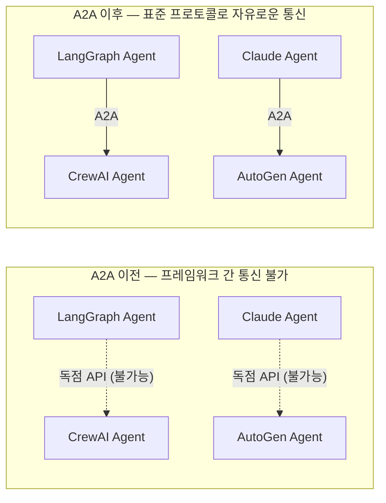
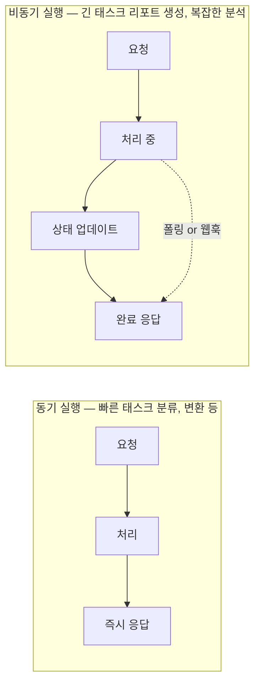
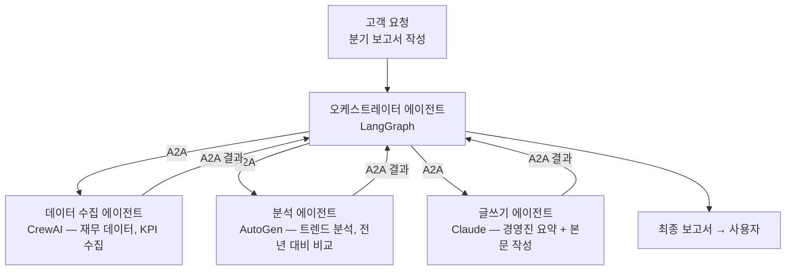

# A2A Protocol (Agent-to-Agent Protocol)

## 개요

**Agent2Agent (A2A) Protocol**은 Google이 2025년 4월 Google Cloud Next에서 발표한 오픈 표준으로, **서로 다른 플랫폼·프레임워크의 AI 에이전트들이 표준화된 방식으로 통신하고 협력**할 수 있게 하는 프로토콜이다. 에이전트 생태계의 상호운용성(interoperability)을 목표로 한다.



## 역사 및 현황

- **2025년 4월**: Google Cloud Next에서 발표. Google 주도, Anthropic·AWS·Microsoft·SAP 등 지지
- **2025년 6월**: Linux Foundation에 기증, 중립 거버넌스 확보. Apache 2.0 라이선스로 오픈소스
- **2025년 하반기**: v1.0 안정 스펙 릴리즈 — 멀티 프로토콜 지원, 엔터프라이즈 멀티테넌시, 보안 강화
- **2026년 4월 기준**: 150개 이상 조직 지지, Google/Microsoft/AWS 플랫폼에 통합, 프로덕션 배포 사례 다수

## 핵심 개념

### Agent Card

에이전트가 자신의 능력을 선언하는 JSON 문서 — "명함" 역할:

```json
{
    "agent_id": "sentiment-analyzer-v2",
    "name": "감성 분석 전문 에이전트",
    "version": "2.1.0",
    "capabilities": [
        "text_classification",
        "sentiment_analysis",
        "multilingual_support"
    ],
    "supported_languages": ["ko", "en", "ja"],
    "input_formats": ["text/plain", "application/json"],
    "output_formats": ["application/json"],
    "pricing": {"per_request_usd": 0.001},
    "endpoint": "https://api.example.com/agent/sentiment",
    "auth": {"type": "bearer_token"}
}
```

### 태스크 요청/응답

```json
// 요청 (오케스트레이터 → 서브 에이전트)
{
    "from": "agent://orchestrator.company.com",
    "to": "agent://sentiment.example.com",
    "message_id": "msg_abc123",
    "type": "task_request",
    "payload": {
        "task": "analyze_customer_sentiment",
        "input": {
            "reviews": ["정말 좋아요!", "배송이 느려서 실망했어요."],
            "language": "ko"
        },
        "expected_output_schema": "sentiment_report_v1"
    },
    "auth": {"token": "Bearer eyJ..."}
}

// 응답 (서브 에이전트 → 오케스트레이터)
{
    "message_id": "resp_xyz789",
    "in_reply_to": "msg_abc123",
    "status": "completed",
    "result": {
        "sentiments": [
            {"text": "정말 좋아요!", "score": 0.95, "label": "positive"},
            {"text": "배송이 느려서 실망했어요.", "score": 0.12, "label": "negative"}
        ],
        "average_score": 0.535
    }
}
```

## 실행 모드



## A2A 활용 시나리오



## MCP와의 관계 및 차이

| | MCP | A2A |
|--|-----|-----|
| **대상** | LLM ↔ 도구/서비스 (stateless) | 에이전트 ↔ 에이전트 (autonomous) |
| **통신 방향** | 단방향 호출 | 양방향 협력 |
| **상태** | Stateless | Stateful (장기 태스크 지원) |
| **메시지 성격** | "이 함수를 실행하라" | "이 복잡한 목표를 달성하라" |
| **발표 주체** | Anthropic (2024년 11월) | Google (2025년 4월) |
| **거버넌스** | Linux Foundation (2025년 12월~) | Linux Foundation (2025년 6월~) |

**자동차 수리점 비유**:
- Shop Manager(A2A)가 Mechanic(A2A)에게 진단 태스크 위임
- Mechanic은 진단 도구를 MCP로 호출 (스캐너, DB 조회 등)
- → MCP와 A2A는 경쟁이 아닌 **상호 보완** 관계

자세한 MCP 내용 → [[MCP]]

## AI Engineering에서의 역할

A2A는 **에이전트 생태계의 상호운용성 레이어**다. 단일 에이전트 시스템을 넘어 여러 전문 에이전트가 협력하는 멀티에이전트 아키텍처가 보편화될수록, A2A 없이는 각 에이전트가 고립된 사일로로 남게 된다. MCP가 에이전트와 도구를 연결한다면, A2A는 에이전트와 에이전트를 연결하여 **진정한 에이전트 네트워크**를 가능하게 한다.

## 관련 개념
[[MCP]] · [[Agent_Skills_and_Protocols]] · [[Agent_Architectures]] · [[Human_in_the_Loop]]

## 출처
- Google Developers Blog (2025) "Announcing the Agent2Agent Protocol (A2A)" — [developers.googleblog.com](https://developers.googleblog.com/en/a2a-a2a-new-era-of-agent-interoperability/)
- A2A Protocol 공식 스펙 — [a2a-protocol.org](https://a2a-protocol.org/latest/specification/)
- A2A GitHub — [github.com/a2aproject/A2A](https://github.com/a2aproject/A2A)
- Linux Foundation (2026) "A2A Protocol Surpasses 150 Organizations" — [linuxfoundation.org](https://www.linuxfoundation.org/press/a2a-protocol-surpasses-150-organizations-lands-in-major-cloud-platforms-and-sees-enterprise-production-use-in-first-year)
- Wikipedia "Agent2Agent" — [en.wikipedia.org](https://en.wikipedia.org/wiki/Agent2Agent)
- [[Prototype_to_Production]] (이 위키의 기존 소스 — A2A vs MCP 비교)
