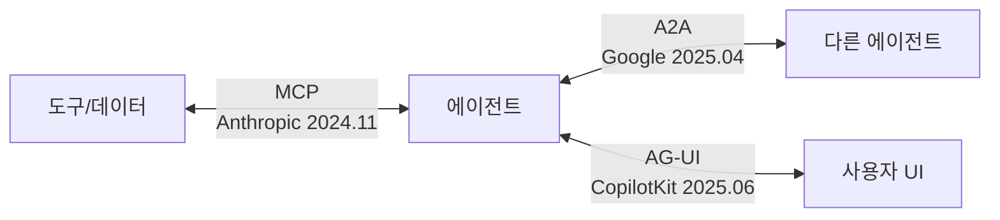
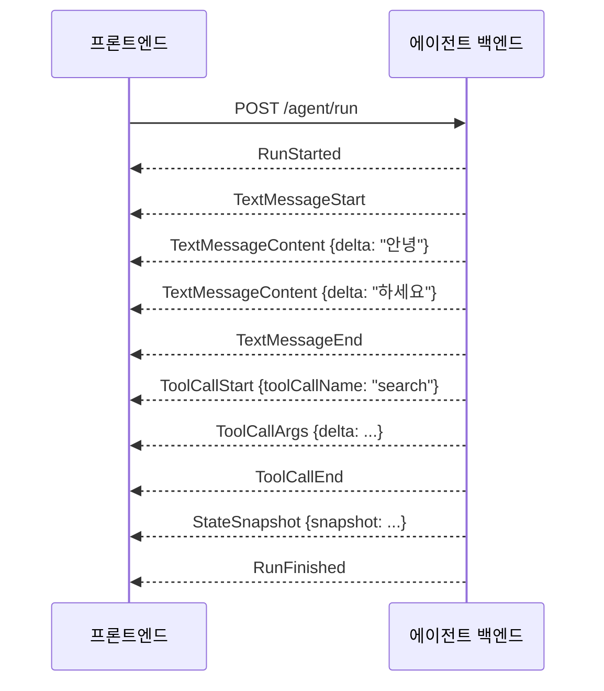

# AG-UI (Agent-User Interaction Protocol)

## 개요

**AG-UI (Agent–User Interaction Protocol)**는 CopilotKit이 주도하고 2025년 6월 오픈소스로 공개한 **에이전트-사용자 상호작용 표준 프로토콜**이다. 에이전트 백엔드와 사용자 대면 프론트엔드 사이의 범용 양방향 연결을 표준화하는 경량 이벤트 기반 프로토콜로, "에이전트 생태계의 마지막 마일 문제(last-mile problem)"를 해결하기 위해 만들어졌다 [1].



### 탄생 배경

에이전트-UI 통신은 오랫동안 표준 없이 팀마다 독자적 WebSocket 포맷, JSON 해킹, 폴링 API 등으로 구현되었다. 이로 인해:
- 인터페이스마다 에이전트와 개별 연동 코드 작성 필요
- 에이전트 교체 시 UI도 함께 수정
- 디버깅·로깅·재현 어려움

CopilotKit은 LangGraph, CrewAI와의 초기 파트너십에서 쌓은 경험을 바탕으로 이 문제를 해결하는 오픈 표준을 발표했다 [2].

---

## 핵심 개념

### 에이전트 상태·이벤트를 프론트엔드로 스트리밍

AG-UI의 핵심 모델은 단순하다. 프론트엔드가 에이전트에 HTTP POST로 요청을 보내면, 에이전트는 실행 중 **타입이 정의된 JSON 이벤트 스트림**을 SSE(Server-Sent Events)로 반환한다.



프론트엔드는 이벤트 타입에 따라 UI를 갱신한다 — 텍스트 청크는 채팅창에 즉시 표시, 도구 호출은 진행 인디케이터 표시, 상태 변경은 테이블/위젯 업데이트.

### 양방향성 (Bi-directional)

AG-UI는 에이전트→UI 단방향 스트리밍이 아니라 **양방향 프로토콜**이다. 사용자는 에이전트 실행 중간에:
- 작업 취소 (Cancel)
- 방향 수정 (Agent Steering)
- 중단 후 승인/수정 (Human-in-the-Loop Interrupts)

등을 실시간으로 수행할 수 있다.

---

## 이벤트 타입 체계

AG-UI는 현재 약 20개 이상의 표준 이벤트 타입을 정의하며 [3], 7개 카테고리로 분류된다:

### 1. Lifecycle Events (생명주기)

에이전트 실행의 시작·진행·종료를 추적한다.

| 이벤트 | 설명 |
|--------|------|
| `RunStarted` | 에이전트 실행 시작. `threadId`, `runId` 포함 |
| `RunFinished` | 실행 정상 완료. `outcome: {type: "success"}` 또는 `{type: "interrupt"}` |
| `RunError` | 실행 오류 종료. `message`, `code` 포함 |
| `StepStarted` | 하위 단계(노드, 함수) 시작 |
| `StepFinished` | 하위 단계 완료 |

### 2. Text Message Events (텍스트 메시지)

LLM이 생성하는 텍스트를 스트리밍한다.

```
TextMessageStart → TextMessageContent → ... → TextMessageEnd
                   (delta: "안녕")      (delta: "하세요")
```

| 이벤트 | 설명 |
|--------|------|
| `TextMessageStart` | 메시지 시작. `messageId`, `role` 포함 |
| `TextMessageContent` | 텍스트 청크. `delta` 필드로 순차 전송 |
| `TextMessageEnd` | 메시지 종료 |
| `TextMessageChunk` | Start→Content→End를 자동 확장하는 편의 이벤트 |

### 3. Tool Call Events (도구 호출)

에이전트가 도구(API, 함수 등)를 호출할 때 스트리밍한다.

| 이벤트 | 설명 |
|--------|------|
| `ToolCallStart` | 도구 호출 시작. `toolCallId`, `toolCallName` 포함 |
| `ToolCallArgs` | 인자 청크 스트리밍. `delta`로 JSON 조각 전송 |
| `ToolCallEnd` | 도구 호출 완료 |
| `ToolCallResult` | 도구 실행 결과 반환 |
| `ToolCallChunk` | Start→Args→End 자동 확장 편의 이벤트 |

### 4. State Management Events (상태 관리)

에이전트 내부 상태를 프론트엔드와 동기화한다. **Snapshot-Delta 패턴** 사용:

```
StateSnapshot (전체 상태)
  → StateDelta (RFC 6902 JSON Patch — 변경 사항만)
  → StateDelta
  → StateSnapshot (재동기화)
```

| 이벤트 | 설명 |
|--------|------|
| `StateSnapshot` | 전체 상태 스냅샷 |
| `StateDelta` | RFC 6902 JSON Patch 형식의 증분 업데이트 |
| `MessagesSnapshot` | 대화 메시지 이력 전체 |

### 5. Activity Events (활동)

진행 중인 에이전트 활동(계획, 검색 등)을 구조화해 전달한다.

| 이벤트 | 설명 |
|--------|------|
| `ActivitySnapshot` | 활동 전체 상태 스냅샷 |
| `ActivityDelta` | RFC 6902 Patch 형식의 활동 업데이트 |

### 6. Reasoning Events (추론 가시화)

LLM의 Chain-of-Thought 추론 과정을 UI에 표시하면서 개인정보를 보호한다.

| 이벤트 | 설명 |
|--------|------|
| `ReasoningStart` / `ReasoningEnd` | 추론 컨텍스트 경계 |
| `ReasoningMessageContent` | 추론 텍스트 청크 (사용자에게 표시할 요약) |
| `ReasoningEncryptedValue` | 암호화된 Chain-of-Thought (클라이언트는 불투명하게 저장·전달) |

### 7. Special Events (특수)

| 이벤트 | 설명 |
|--------|------|
| `Raw` | 외부 시스템의 이벤트를 감싸는 패스스루 |
| `Custom` | 프로토콜이 정의하지 않은 앱별 확장 이벤트 |

---

## 전송 레이어

AG-UI는 전송 레이어에 **의도적으로 중립적**이다:

```
기본 권장:  HTTP + SSE (Server-Sent Events)
  - 표준 인프라(방화벽, 프록시, CDN) 통과
  - 단방향 스트리밍에 최적

대안 지원:  WebSocket
  - 더 낮은 오버헤드, 서버→클라이언트 + 클라이언트→서버 모두 필요 시

유연한 미들웨어 레이어:
  - 느슨한 이벤트 포맷 매칭(loose event format matching) 지원
  - 다양한 에이전트 프레임워크의 기존 이벤트 형식을 AG-UI로 변환
```

프론트엔드 관점에서의 흐름:

```python
# 의사 코드: AG-UI 클라이언트 통합 패턴
async def run_agent(prompt: str):
    # 1. 에이전트에 요청 전송
    response = await http.post("/agent/run", json={
        "threadId": thread_id,
        "messages": [{"role": "user", "content": prompt}]
    }, stream=True)
    
    # 2. SSE 이벤트 스트림 수신
    async for event in response.iter_events():
        event_data = json.loads(event.data)
        
        # 3. 이벤트 타입별 처리
        match event_data["type"]:
            case "TEXT_MESSAGE_CONTENT":
                chat_window.append(event_data["delta"])
            case "TOOL_CALL_START":
                show_indicator(f"실행 중: {event_data['toolCallName']}")
            case "STATE_DELTA":
                apply_json_patch(ui_state, event_data["delta"])
            case "RUN_FINISHED":
                hide_loading_indicator()
```

---

## 프론트엔드 통합 패턴

### CopilotKit SDK (React)

AG-UI의 1st-party 레퍼런스 클라이언트. React 훅으로 에이전트 상태를 간단히 구독할 수 있다:

```typescript
import { CopilotKit, useCoAgent } from "@copilotkit/react-core";
import { CopilotChat } from "@copilotkit/react-ui";

// 에이전트 상태 공유 (Shared State)
const { state, setState } = useCoAgent({
  name: "research_agent",
  initialState: { query: "", results: [] }
});

// 도구 실행을 프론트엔드에서 처리
useCopilotAction({
  name: "update_chart",
  handler: async ({ data }) => {
    setChartData(data);  // 에이전트가 도구를 호출하면 UI에서 처리
  }
});
```

### 커스텀 클라이언트 직접 구현

```typescript
import { AbstractAgentClient, EventType } from "@ag-ui/client";

class MyAgentClient extends AbstractAgentClient {
  protected async *fetchResponse(input: RunAgentInput) {
    const response = await fetch("/agent", {
      method: "POST",
      body: JSON.stringify(input),
    });
    yield* parseSSEStream(response.body);
  }
}
```

---

## 백엔드 구현

### Python SDK

```python
from ag_ui.core import (
    EventType, RunStartedEvent, TextMessageStartEvent,
    TextMessageContentEvent, TextMessageEndEvent, RunFinishedEvent
)
from ag_ui.encoder import EventEncoder

async def agent_endpoint(input: RunAgentInput):
    encoder = EventEncoder()
    
    async def event_generator():
        yield encoder.encode(RunStartedEvent(
            type=EventType.RUN_STARTED,
            thread_id=input.thread_id,
            run_id=run_id
        ))
        
        # LLM 스트리밍 → AG-UI 이벤트 변환
        msg_id = str(uuid4())
        yield encoder.encode(TextMessageStartEvent(
            type=EventType.TEXT_MESSAGE_START,
            message_id=msg_id, role="assistant"
        ))
        
        async for chunk in llm.stream(input.messages):
            yield encoder.encode(TextMessageContentEvent(
                type=EventType.TEXT_MESSAGE_CONTENT,
                message_id=msg_id, delta=chunk.text
            ))
        
        yield encoder.encode(TextMessageEndEvent(
            type=EventType.TEXT_MESSAGE_END, message_id=msg_id
        ))
        yield encoder.encode(RunFinishedEvent(
            type=EventType.RUN_FINISHED, thread_id=input.thread_id
        ))
    
    return EventSourceResponse(event_generator())
```

### LangGraph 통합 예시

```python
from copilotkit.langgraph import copilotkit_emit_state

async def research_node(state: AgentState, config: RunnableConfig):
    # 에이전트 내부 상태를 프론트엔드에 실시간 공유
    await copilotkit_emit_state(config, {
        "status": "searching",
        "current_query": state["query"]
    })
    
    results = await search_tool(state["query"])
    
    await copilotkit_emit_state(config, {
        "status": "complete",
        "results": results
    })
    
    return {"results": results}
```

---

## SDK 지원 현황

| SDK | 상태 | 주체 |
|-----|------|------|
| TypeScript/JavaScript (`@ag-ui/core`) | 지원 | 1st Party |
| Python (`ag-ui-protocol`) | 지원 | 1st Party |
| Kotlin | 지원 | Community |
| Go | 지원 | Community |
| Java | 지원 | Community |
| Rust | 지원 | Community |
| Dart | 지원 | Community |
| Ruby | 지원 | Community |
| .NET | 개발 중 | Community |

### 에이전트 프레임워크 지원

| 프레임워크 | 상태 | 파트너 관계 |
|-----------|------|------------|
| LangGraph | 지원 | Partnership |
| CrewAI | 지원 | Partnership |
| Google ADK | 지원 | 1st Party |
| Microsoft Agent Framework | 지원 | 1st Party |
| AWS Strands Agents | 지원 | 1st Party |
| AWS Bedrock AgentCore | 지원 | 1st Party |
| Pydantic AI | 지원 | 1st Party |
| LlamaIndex | 지원 | 1st Party |
| AG2 | 지원 | 1st Party |
| Mastra | 지원 | 1st Party |
| Agno | 지원 | 1st Party |
| OpenAI Agent SDK | 개발 중 | Community |

---

## AG-UI vs MCP vs A2A vs A2UI 비교

| | **AG-UI** | **MCP** | **A2A** | **A2UI** |
|--|-----------|---------|---------|---------|
| **대상** | 에이전트 ↔ 사용자 UI | LLM ↔ 도구/서비스 | 에이전트 ↔ 에이전트 | 에이전트 → UI 컴포넌트 생성 |
| **발표 주체** | CopilotKit | Anthropic | Google | Google |
| **발표 시점** | 2025년 6월 | 2024년 11월 | 2025년 4월 | 2026년 |
| **방향성** | 양방향 (에이전트↔사용자) | 단방향 호출 | 양방향 협력 | 단방향 스트리밍 |
| **핵심 데이터** | 이벤트 스트림 (텍스트, 도구 호출, 상태) | 도구 스키마·호출 결과 | 태스크 요청·응답 | 선언적 UI 컴포넌트 JSON |
| **전송 레이어** | SSE / WebSocket | 다양 (stdio, HTTP, etc.) | HTTP | SSE |
| **상태 관리** | Stateful (StateSnapshot, StateDelta) | Stateless | Stateful (장기 태스크) | Stateless |
| **라이선스** | MIT (오픈소스) | MIT | Apache 2.0 | 오픈소스 |
| **거버넌스** | ag-ui-protocol 조직 | Linux Foundation | Linux Foundation | Google |

### 차이를 이해하는 비유

```
에이전트가 사용자를 위해 주식 분석을 수행하는 시나리오:

  MCP:   에이전트가 주가 API, 뉴스 DB 등 도구를 호출
         ("get_stock_price('005930.KS')" 실행)

  A2A:   오케스트레이터가 전문 서브에이전트에 분석 위임
         ("이 종목의 재무 분석을 담당해줘")

  AG-UI: 에이전트가 분석 과정을 사용자에게 실시간 스트리밍
         (텍스트 → 사용자 화면에 실시간 표시,
          도구 호출 → "데이터 조회 중..." 인디케이터,
          최종 차트 데이터 → StateSnapshot으로 UI 갱신)

  A2UI:  에이전트가 동적 UI 컴포넌트 자체를 생성
         (LineChart, DataTable, Button 등 선언적 JSON 전송)

  → AG-UI와 A2UI는 보완 관계:
    AG-UI = 에이전트-사용자 간 런타임 연결 채널
    A2UI = 그 채널을 통해 전달되는 Generative UI 스펙
```

---

## 한계 및 현황

### 현황 (2025년 6월 기준)

- **GitHub**: 13k stars, 1.2k forks (ag-ui-protocol/ag-ui 기준, 2026년 4월 수치) [4]
- **최신 릴리즈**: 2026년 4월 6일
- **거버넌스**: ag-ui-protocol 오픈소스 조직 (Linux Foundation 소속 아님)
- **표준화**: Oracle Open Agent Specification에 포함됨

### 한계

```
1. 아직 신생 프로토콜 (2025년 6월 출범)
   → v1.0 안정 스펙 미확정, 이벤트 타입 변경 가능성

2. 프론트엔드 클라이언트가 CopilotKit 중심
   → React 외 생태계 지원 아직 성숙 단계

3. A2A·MCP 대비 거버넌스 중립성 낮음
   → Linux Foundation 산하 아닌 ag-ui-protocol 조직 운영

4. 보안 모델 미성숙
   → MCP의 카탈로그 기반 보안처럼 엄격한 보안 경계 미정의

5. WebSocket 지원 이론적이나 SSE가 주류
   → 낮은 지연이 필요한 게임/실시간 협업 시나리오에서 한계
```

---

## AI Engineering에서의 역할

AG-UI는 **에이전트 생태계의 프레젠테이션 레이어**다. MCP가 에이전트와 도구를, A2A가 에이전트와 에이전트를 연결한다면, AG-UI는 에이전트와 사람을 연결한다. 사용자가 에이전트의 동작을 실시간으로 관찰하고 개입할 수 있는 Human-in-the-Loop 인터페이스를 표준화함으로써, 에이전트를 불투명한 블랙박스에서 사용자와 협력하는 파트너로 변환한다.

## 관련 개념
[[Agent_Skills_and_Protocols]] · [[Agent_Skills_and_Protocols/MCP]] · [[Agent_Skills_and_Protocols/A2A]] · [[Agent_Architectures]] · [[Human_in_the_Loop]]

## 출처
- CopilotKit Blog (2025) "AG-UI Protocol: Bridging Agents to Any Front End" — [copilotkit.ai](https://www.copilotkit.ai/blog/ag-ui-protocol-bridging-agents-to-any-front-end) [1]
- AG-UI 공식 문서 "Introduction" — [docs.ag-ui.com](https://docs.ag-ui.com/introduction) [2]
- AG-UI 공식 문서 "Events" — [docs.ag-ui.com](https://docs.ag-ui.com/concepts/events) [3]
- AG-UI GitHub — [github.com/ag-ui-protocol/ag-ui](https://github.com/ag-ui-protocol/ag-ui) [4]
- CopilotKit Blog "Build with Google's new A2UI Spec" — [copilotkit.ai](https://www.copilotkit.ai/blog/build-with-googles-new-a2ui-spec-agent-user-interfaces-with-a2ui-ag-ui) [5]
- Google Developers Blog "Delight users by combining ADK Agents with AG-UI" — [developers.googleblog.com](https://developers.googleblog.com/delight-users-by-combining-adk-agents-with-fancy-frontends-using-ag-ui/) [6]

### 참고 문헌
[1] https://www.copilotkit.ai/blog/ag-ui-protocol-bridging-agents-to-any-front-end
[2] https://docs.ag-ui.com/introduction
[3] https://docs.ag-ui.com/concepts/events
[4] https://github.com/ag-ui-protocol/ag-ui
[5] https://www.copilotkit.ai/blog/build-with-googles-new-a2ui-spec-agent-user-interfaces-with-a2ui-ag-ui
[6] https://developers.googleblog.com/delight-users-by-combining-adk-agents-with-fancy-frontends-using-ag-ui/
