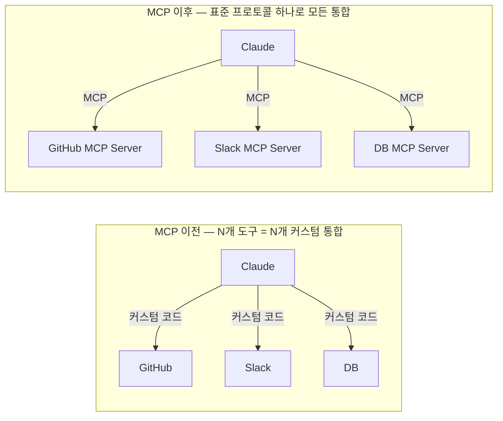
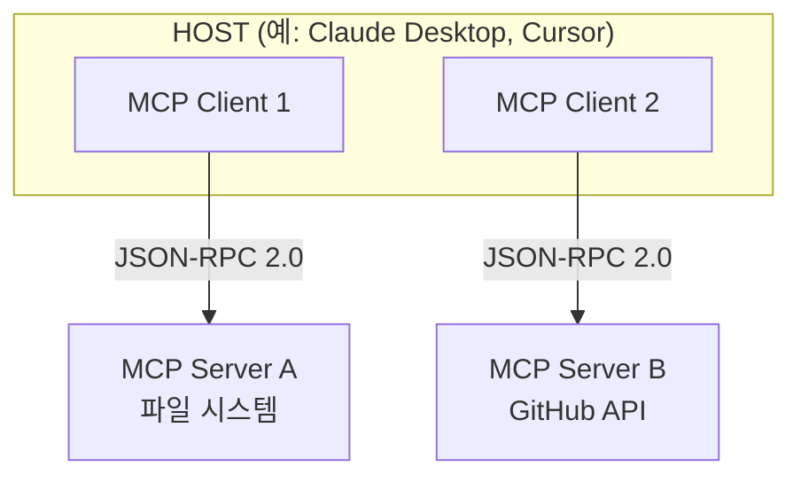

# MCP (Model Context Protocol)

## 개요

**Model Context Protocol (MCP)**은 Anthropic이 2024년 11월 오픈소스로 공개한 표준 프로토콜이다. AI Host 애플리케이션과 외부 데이터·도구·서비스 사이의 통신을 표준화한다. "AI를 위한 USB-C"라고도 불리며, 각 통합마다 별도 커넥터를 만들어야 했던 파편화 문제를 해결한다.



## 역사 및 현황

- **2024년 11월**: Anthropic이 오픈소스로 공개
- **2025년 11월**: 1주년 기념 Spec 업데이트
- **2025년 12월**: Linux Foundation 산하 Agentic AI Foundation에 기증 — OpenAI, Google, Microsoft, AWS, Block 등 공동 참여
- **2026년 기준**: Python/JS SDK 주간 다운로드 2,000만 회 이상, 수천 개 서드파티 MCP Server 생태계 형성

## 핵심 아키텍처: Host-Client-Server



- **Host**: LLM 애플리케이션 (Claude Desktop, Cursor, VS Code Copilot 등)
- **MCP Client**: Host 내부에서 특정 MCP Server와 1:1 통신하는 컴포넌트. 세션 상태 관리, 요청 포매팅 담당
- **MCP Server**: 실제 도구·리소스를 노출하는 경량 서버 (로컬 프로세스 또는 원격 API)
- **통신 방식**: JSON-RPC 2.0 (표준화된 원격 프로시저 호출)

## MCP Primitives (4가지 핵심 기능)

| Primitive | 방향 | 설명 | 예시 |
|-----------|------|------|------|
| **Tools** | Client → Server | 함수 실행 — 외부 시스템 상태 변경·계산 수행 | `create_file()`, `send_email()` |
| **Resources** | Client → Server | 데이터 노출 — 파일·DB 레코드를 LLM 컨텍스트에 제공 | 프로젝트 파일, DB 레코드 |
| **Prompts** | Client → Server | 재사용 가능한 프롬프트 템플릿 공유 | "코드 리뷰해줘" 템플릿 |
| **Sampling** | Server → Client | Server가 Host에게 LLM 호출 요청 | Server-initiated AI 생성 |

## 설정 예시

```json
// claude_desktop_config.json
{
  "mcpServers": {
    "filesystem": {
      "command": "npx",
      "args": ["-y", "@modelcontextprotocol/server-filesystem", "/project"]
    },
    "github": {
      "command": "npx",
      "args": ["-y", "@modelcontextprotocol/server-github"],
      "env": {"GITHUB_TOKEN": "ghp_..."}
    },
    "slack": {
      "command": "npx",
      "args": ["-y", "@modelcontextprotocol/server-slack"],
      "env": {"SLACK_BOT_TOKEN": "xoxb-..."}
    }
  }
}
```

## MCP Server 구현 예시 (Python SDK)

```python
from mcp.server import Server
from mcp.server.stdio import stdio_server
from mcp.types import Tool, TextContent
import mcp.types as types

app = Server("my-server")

@app.list_tools()
async def list_tools() -> list[Tool]:
    return [
        Tool(
            name="search_database",
            description="내부 제품 DB에서 검색합니다",
            inputSchema={
                "type": "object",
                "properties": {
                    "query": {"type": "string", "description": "검색어"},
                    "limit": {"type": "integer", "default": 10}
                },
                "required": ["query"]
            }
        )
    ]

@app.call_tool()
async def call_tool(name: str, arguments: dict) -> list[TextContent]:
    if name == "search_database":
        results = db.search(arguments["query"], limit=arguments.get("limit", 10))
        return [TextContent(type="text", text=str(results))]

async def main():
    async with stdio_server() as streams:
        await app.run(*streams, app.create_initialization_options())
```

## Transports

MCP Client와 Server가 실제로 메시지를 주고받는 물리적 통로. 용도에 따라 세 가지를 지원한다:

| Transport | 방식 | 적합한 경우 |
|-----------|------|------------|
| **stdio** | 표준 입출력 파이프 | 로컬 프로세스(같은 머신에서 Host가 Server를 자식 프로세스로 실행) |
| **HTTP + SSE** (레거시) | HTTP 요청 + Server-Sent Events로 스트리밍 응답 | 초기 원격 Server 지원 |
| **Streamable HTTP** (2025년 3월~ 표준) | 단일 HTTP 엔드포인트, 필요시 SSE로 업그레이드 | 원격 Server, 로드밸런서 뒤 배포, 재연결 복원력 |

Streamable HTTP는 기존 HTTP+SSE의 "연결이 끊기면 세션 전체 유실" 문제를 해결하며, 2025년 이후 원격 MCP Server의 표준 전송 방식이 됐다.

## Resources, Prompts, Sampling 심화

### Resources — 데이터 노출

Server가 파일·DB 레코드처럼 **읽기 전용 컨텍스트**를 URI로 노출한다. Tool과 달리 부작용이 없고, Host가 사용자에게 "첨부파일처럼" 보여줄 수 있다.

```python
@app.list_resources()
async def list_resources() -> list[Resource]:
    return [Resource(uri="file:///project/README.md", name="프로젝트 개요", mimeType="text/markdown")]

@app.read_resource()
async def read_resource(uri: str) -> str:
    return open(uri.replace("file://", "")).read()
```

### Prompts — 재사용 가능한 템플릿

Server가 "미리 만들어진 프롬프트 템플릿"을 노출해, 사용자가 슬래시 커맨드처럼 호출할 수 있게 한다 (예: `/review-pr`). Host UI에 템플릿 목록으로 노출되는 것이 일반적이다.

### Sampling — Server가 주도하는 LLM 호출

네 가지 Primitive 중 유일하게 **방향이 반대**다 — Server가 Host에게 "LLM 호출을 대신 해달라"고 요청한다. Server 자체는 LLM API 키를 갖지 않고, Host의 모델·정책을 그대로 사용하도록 설계됐다(비용·거버넌스를 Host가 중앙 통제).

```python
# Server가 Host에게 샘플링을 요청하는 흐름 (개념적)
async def summarize_via_host(large_document: str):
    result = await server.request_sampling(
        messages=[{"role": "user", "content": f"다음을 3줄로 요약: {large_document}"}],
        max_tokens=200,
    )
    return result.content
```

## Roots와 Elicitation

**Roots**: Client가 Server에게 "작업 가능한 파일시스템/URI 경계"를 명시적으로 알려주는 메커니즘. Server가 프로젝트 루트 바깥을 함부로 건드리지 않도록 하는 최소 권한 원칙의 구현체다.

**Elicitation**(2025년 6월 스펙 추가): Server가 작업 중 **사용자에게 추가 정보를 요청**할 수 있는 표준 방법. 예를 들어 배포 도구 Server가 "어느 환경에 배포할까요? (staging/production)"처럼 실행 중간에 사용자 입력을 되물을 수 있다 — 기존에는 이런 상호작용이 Server마다 제각각이었다.

## Async Tasks (비동기 작업)

오래 걸리는 도구 호출(수 분~수 시간)을 위한 표준 패턴. 동기 호출처럼 응답을 기다리지 않고, Server가 작업 ID를 즉시 반환하고 Client가 나중에 상태를 폴링하거나 완료 알림을 받는다.

```
1. Client → Server: "대규모 코드베이스 리팩토링 시작" 요청
2. Server → Client: task_id 즉시 반환 (동기 대기 없음)
3. Client: 필요 시 get_task_status(task_id) 폴링
4. Server: 작업 완료 시 notification 전송
```

[[Autonomous_Systems]]의 장기 실행 에이전트와 자연스럽게 맞물리는 패턴이다 — 몇 시간짜리 MCP 도구 호출도 동일한 프로토콜로 다룰 수 있다.

## MCP Apps (UI 확장)

MCP Server가 텍스트/데이터뿐 아니라 **인터랙티브 UI 컴포넌트**를 Host 안에 렌더링할 수 있게 하는 확장. 도구 호출 결과를 표·차트·폼 형태로 직접 보여줄 수 있다. Agent Skills & Protocols의 A2UI([[Agent_Skills_and_Protocols]])와 목적은 비슷하지만, MCP Apps는 "MCP Server가 자신의 도구 결과를 표현하는" 좁은 범위인 반면 A2UI는 에이전트가 임의 UI를 생성하는 더 일반적인 프로토콜이다.

## MCP 보안 심화: OAuth 2.1

초기 MCP는 인증 표준이 없어 Server마다 제각각의 인증을 구현했다. 2025년 스펙은 **OAuth 2.1**을 원격 MCP Server의 표준 인증 방식으로 채택했다.

```
OAuth 2.1 흐름 (MCP 적용):
  1. Client가 Server에 접근 시도 → 인증 필요 응답
  2. Client가 사용자를 인가 서버(Authorization Server)로 리다이렉트
  3. 사용자 로그인·동의 → Authorization Code 발급
  4. Client가 Code를 Access Token으로 교환
  5. 이후 모든 MCP 요청에 Access Token 첨부

MCP 특화 요구사항:
  - PKCE(Proof Key for Code Exchange) 필수 — 퍼블릭 클라이언트 보호
  - Dynamic Client Registration(DCR) — Client가 사전 등록 없이 자동 등록 가능
  - Resource Indicator — 토큰이 특정 MCP Server에만 유효하도록 범위 제한 (토큰 재사용 공격 방지)
```

## MCP Gateway와 Registry 생태계

엔터프라이즈 환경에서 수십~수백 개의 MCP Server를 개별 관리하는 것은 비현실적이다. 이를 해결하는 중간 계층 도구들이 2025~2026년 빠르게 성숙했다.

| 도구 | 역할 |
|------|------|
| **LiteLLM** | 여러 LLM Provider + MCP Server를 단일 API 뒤에서 통합 관리, 라우팅·비용 추적 |
| **Portkey** | MCP 트래픽 관측성, 캐싱, 폴백(fallback) 정책 |
| **Kong / Bifrost** | API Gateway 계층에서 MCP 요청에 인증·속도제한·로깅 적용 |

이 도구들은 [[Agent_Deployment]]에서 다룬 Google의 엔터프라이즈 전용 Agent Gateway/Registry와 같은 문제(중앙 인증, 거버넌스, 관측성)를 플랫폼 독립적으로 해결한다. 프로덕션 운영 관점의 상세 비교는 → [[Loop_Engineering/Production_Operations]]

## MCP vs Function Calling vs A2A

| | Function Calling | MCP | A2A |
|--|-----------------|-----|-----|
| **대상** | 단일 앱 내 함수 | LLM ↔ 외부 도구/서비스 | 에이전트 ↔ 에이전트 |
| **표준화** | 모델별 상이 | 오픈 표준 | 오픈 표준 |
| **재사용** | 앱 내부에 국한 | Server 한 번 만들면 모든 Host에서 사용 | 에이전트 네트워크 |
| **상태** | Stateless | Stateless | Stateful |
| **거버넌스** | 각 모델 공급사 | Linux Foundation (구 Anthropic) | Linux Foundation |

자세한 A2A 비교 → [[A2A]]

## 보안 위협 5가지

```
1. Prompt Injection via Tools
   악의적 데이터를 MCP 응답에 삽입 → 에이전트 행동 조작

2. Tool Poisoning
   악성 MCP Server가 정상 서버인 척 등록

3. Excessive Permissions
   최소 권한 원칙(least privilege) 위반

4. Data Exfiltration
   민감 데이터를 외부 MCP Server로 전송 유도

5. Rug Pull Attack
   신뢰 구축 후 MCP Server 동작을 사후에 변경
```

**대응 전략**:
- MCP Server 소스 검증 및 서명 확인
- 최소 권한 원칙 적용
- Human-in-the-Loop 승인 게이트
- 민감 데이터 처리 전 명시적 사용자 동의

## 엔터프라이즈 MCP 거버넌스 *(2026년 5월)*

오픈 MCP 표준만으로는 해결되지 않는 엔터프라이즈 요구사항이 있다. Gemini Enterprise Agent Platform은 이를 네이티브 레이어로 해결한다:

```
MCP 엔터프라이즈 갭 → 플랫폼 해결책

Identity (신원 모호성)
  문제: MCP 호출이 어떤 에이전트에서 왔는지 불분명
  해결: Agent Identity (SPIFFE 기반 암호화 ID)
        에이전트마다 검증 가능한 자격증명 자동 부여
        모든 MCP 호출에 발신 에이전트 ID 첨부

Auth (인증 충돌)
  문제: MCP Server의 OAuth와 엔터프라이즈 IAM이 충돌
  해결: Agent Gateway가 중앙에서 인증 통합
        모든 MCP 트래픽이 Gateway를 통과하여 일관된 인증 적용

Observability (관찰 불투명)
  문제: MCP 호출 내부가 블랙박스
  해결: Agent Observability Suite (OTel 준수)
        모든 MCP 호출 자동 계측·추적·로깅

Pre-deployment Validation (배포 전 검증 부재)
  문제: MCP 통합의 안전성을 배포 전에 확인하기 어려움
  해결: Agent Simulation으로 수천 개 합성 시나리오로 사전 테스트

Tool Governance (도구 거버넌스 부재)
  문제: 어떤 MCP Server가 승인되었는지 추적 불가
  해결: Agent Registry — 승인된 MCP Server 중앙 카탈로그
        버전 관리, 팀별 접근 제어, 보안 사전 검토 통합
```

순수 MCP 표준은 프로토콜 표준화에 집중하고, 엔터프라이즈 플레이어들은 그 위에 중앙 거버넌스 레이어를 추가하는 방식으로 수렴하고 있다.

## 생태계 영향

MCP 표준화 효과:
- 개발자는 MCP Server를 한 번만 만들면 Claude, Cursor, VS Code Copilot 등 모든 MCP-compatible Host에서 재사용 가능
- "Long tail of context providers" — 수천 개 서드파티 통합으로 생태계 형성
- OpenAI, Google, Microsoft, AWS 모두 MCP 채택 → 사실상 업계 표준

## AI Engineering에서의 역할

MCP는 **도구 통합의 표준 레이어**다. Function Calling이 "어떻게 함수를 호출하는가"의 문제를 풀었다면, MCP는 "어떤 도구가 어떤 방식으로 노출되는가"를 표준화한다. Agent Engineering 스택에서 외부 세계와의 인터페이스를 담당하며, 에이전트가 커지고 복잡해질수록 MCP의 역할이 중요해진다.

## 관련 개념
[[A2A]] · [[Agent_Skills_and_Protocols]] · [[Tool_Use_and_Function_Calling]] · [[Guardrail_Engineering]]

## 출처
- Anthropic (2024) "Introducing the Model Context Protocol" — [anthropic.com](https://www.anthropic.com/news/model-context-protocol)
- MCP 공식 문서 — [modelcontextprotocol.io](https://modelcontextprotocol.io)
- MCP Blog "One Year of MCP: November 2025 Spec Release" — [blog.modelcontextprotocol.io](https://blog.modelcontextprotocol.io/posts/2025-11-25-first-mcp-anniversary/)
- Wikipedia "Model Context Protocol" — [en.wikipedia.org](https://en.wikipedia.org/wiki/Model_Context_Protocol)
- MCP 공식 스펙 "Transports" · "Authorization" — [modelcontextprotocol.io/specification](https://modelcontextprotocol.io/specification)
- LiteLLM 문서 (MCP Gateway) — [docs.litellm.ai](https://docs.litellm.ai)
- AI Engineering from Scratch, Phase 13 · Lessons 06-18 (MCP 심화, 보안, 게이트웨이) — [GitHub](https://github.com/rohitg00/ai-engineering-from-scratch/tree/main/phases/13-tools-and-protocols)
- [[Agent_Tools_&_Interoperability_with_Model_Context_Protocol_(MCP)]] (이 위키의 기존 소스, 2025년 11월 최초 발행 → 2026년 5월 업데이트)
- [[Prototype_to_Production]] (MCP vs A2A 비교, 2025년 11월 최초 발행 → 2026년 5월 업데이트)
