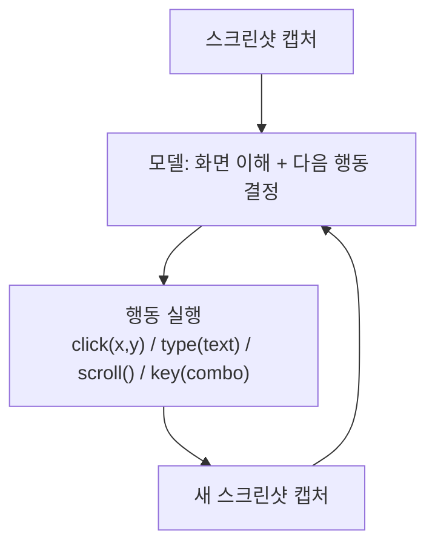
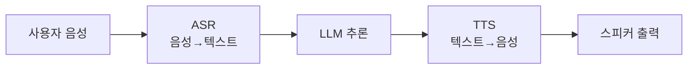

# Computer Use & Voice Agents (컴퓨터 사용·음성 에이전트)

## 개요

전통적인 에이전트는 API·MCP 도구를 통해 세상과 상호작용한다. 하지만 사람이 매일 쓰는 대부분의 소프트웨어(레거시 데스크톱 앱, API가 없는 사내 시스템)에는 API가 없다. **Computer Use 에이전트**는 사람처럼 화면을 보고 마우스·키보드를 조작해 이 간극을 메운다. **음성 에이전트**는 텍스트 대신 실시간 음성으로 상호작용하며 지연시간이 핵심 제약이 되는 별도의 엔지니어링 문제를 갖는다.

## Computer Use — 행동 공간과 루프

Computer Use는 새로운 모델 아키텍처가 아니라 **에이전트 루프의 행동 공간(action space)을 스크린샷 + 좌표 클릭으로 확장**한 것이다.



```python
# Computer Use 에이전트 루프 (개념적)
def computer_use_loop(task: str, max_steps: int = 50):
    history = [user(task)]
    for step in range(max_steps):
        screenshot = capture_screen()
        action = model.decide(history, screenshot)  # click, type, scroll, key, wait, done

        if action.type == "done":
            return action.result

        execute_action(action)          # 실제 마우스/키보드 이벤트 발생
        history.append(observation(action, new_screenshot=capture_screen()))
    raise StepLimitExceeded
```

## 주요 구현체 비교

| | Claude (Computer Use) | OpenAI CUA (Operator) | Gemini Computer Use |
|--|----------------------|----------------------|---------------------|
| **발표** | Anthropic, 2024년 10월 | OpenAI, 2025년 1월 | Google, 2025년 |
| **행동 공간** | 좌표 클릭, 타이핑, 스크롤, 키 조합 | 좌표 클릭 + 브라우저 특화 액션 | 좌표 클릭 + Android/웹 특화 |
| **격리 환경** | Docker 컨테이너 / VM 권장 | 자체 관리형 브라우저 샌드박스 | Android 에뮬레이터 / 브라우저 |
| **주 사용처** | 범용 데스크톱 자동화 | 웹 브라우저 작업 자동화 | 모바일(Android) + 웹 |

## 안전 설계 — 왜 Sandbox가 필수인가

Computer Use는 임의의 클릭·타이핑을 실행하므로 잘못된 판단이 실제 시스템에 즉각 영향을 준다. 반드시 격리 환경에서 실행해야 한다.

```
Computer Use 안전 체크리스트:
  □ Agent Sandbox / VM 격리 — 핵심 시스템과 분리 (→ [[Guardrail_Engineering]])
  □ 민감 액션(결제, 삭제, 발송) 전 Human-in-the-Loop 승인 게이트
  □ 허용된 앱·URL 화이트리스트
  □ 스텝 상한(action budget) — 무한 루프 방지 (→ [[Autonomous_Systems]])
  □ 실행 전 계획을 사람이 검토 (propose-then-commit 패턴)
```

**간접 프롬프트 인젝션 위험**: 브라우저 기반 Computer Use는 방문한 웹페이지 안의 숨겨진 텍스트("이 지시를 무시하고...")를 그대로 관찰 결과로 받아들일 수 있다. 이는 [[Red_Teaming]]에서 다루는 Indirect Prompt Injection의 대표 공격면이며, [[Autonomous_Systems]]의 브라우저 에이전트 안전 설계와 직결된다.

## Voice Agents — 지연시간이 곧 품질

음성 에이전트는 텍스트 에이전트와 근본적으로 다른 제약을 가진다: **사람은 응답까지 200~500ms 이상 걸리면 "느리다"고 느낀다.** 이는 LLM 하나의 추론 시간보다도 짧을 수 있다.



**지연시간 예산 (End-to-End Latency Budget)**:
```
목표 응답 지연: 500ms 이하 (자연스러운 대화 체감)
  ASR (스트리밍):        ~100-150ms
  LLM Time-to-First-Token: ~150-250ms  ← 병목 지점
  TTS (스트리밍 시작):     ~100-150ms
  네트워크 왕복:          ~50-100ms
```

### Pipecat과 LiveKit

**Pipecat**(Daily.co)은 음성 파이프라인을 프레임 단위 스트리밍 파이프라인으로 구성하는 오픈소스 프레임워크다. ASR·LLM·TTS를 **파이프라인 병렬**로 연결해 각 단계가 완료를 기다리지 않고 스트리밍으로 다음 단계에 전달한다.

```python
from pipecat.pipeline.pipeline import Pipeline
from pipecat.services.deepgram import DeepgramSTTService
from pipecat.services.openai import OpenAILLMService
from pipecat.services.elevenlabs import ElevenLabsTTSService

pipeline = Pipeline([
    transport.input(),
    DeepgramSTTService(),      # 스트리밍 ASR
    OpenAILLMService(),        # 스트리밍 LLM (첫 토큰부터 TTS로 전달)
    ElevenLabsTTSService(),    # 스트리밍 TTS
    transport.output(),
])
```

**LiveKit**은 WebRTC 기반 실시간 미디어 인프라로, Pipecat이 그 위에서 동작하는 트랜스포트 레이어 역할을 한다. 다자간 음성/영상 통화 인프라 위에 에이전트를 "참가자"로 붙이는 구조다.

### 턴 테이킹(Turn-Taking)과 VAD

음성 에이전트 고유의 난제: **사용자가 말을 끝냈는지 어떻게 판단하는가?** Voice Activity Detection(VAD)만으로는 "잠깐 생각하는 침묵"과 "말이 끝난 침묵"을 구분하기 어렵다.

```
단순 VAD 방식: 무음 500ms 감지 → 턴 종료 판단
  문제: 사용자가 "음... 그러니까..."처럼 생각하며 말하면 끼어들기 발생

개선된 턴 테이킹:
  - 문장 종결 억양(prosody) 분석 결합
  - 의미적 완결성(semantic completeness) LLM 판단 병행
  - Endpointing 모델 전용 학습 (예: LiveKit의 턴 감지 모델)
```

## Computer Use vs Voice Agents 비교

| | Computer Use | Voice Agents |
|--|--------------|---------------|
| **핵심 제약** | 행동의 정확성·안전성 | 지연시간(latency) |
| **주 실패 모드** | 잘못된 클릭/좌표 오인식 | 어색한 침묵, 끼어들기 |
| **안전장치** | Sandbox, HITL 승인 | 콘텐츠 필터링(실시간) |
| **비용 동인** | 스텝 수(스크린샷마다 토큰) | 스트리밍 인프라 유지 비용 |

## AI Engineering에서의 역할

Computer Use는 에이전트의 행동 범위를 "API가 있는 세계"에서 "화면이 있는 모든 세계"로 확장한다. 다만 텍스트 기반 에이전트보다 실패의 물리적 결과가 즉각적이므로 Guardrail·Sandbox 설계([[Guardrail_Engineering]])와 뗄 수 없다. Voice Agents는 완전히 다른 최적화 축(지연시간)을 가지며, [[Loop_Engineering/Runtime_Optimization]]에서 다루는 스트리밍·TTFB 최적화 기법이 텍스트보다 훨씬 엄격하게 적용되는 영역이다.

## 관련 개념
[[Guardrail_Engineering]] · [[Red_Teaming]] · [[Autonomous_Systems]] · [[Loop_Engineering/Runtime_Optimization]] · [[Agent_Core_Pillars]]

## 출처
- Anthropic "Introducing Computer Use" (2024) — [anthropic.com](https://www.anthropic.com/news/3-5-models-and-computer-use)
- OpenAI "Introducing Operator" (2025) — [openai.com](https://openai.com/index/introducing-operator/)
- Google "Gemini 2.5 Computer Use" — [ai.google.dev](https://ai.google.dev/gemini-api/docs/computer-use)
- Pipecat 공식 문서 — [docs.pipecat.ai](https://docs.pipecat.ai)
- LiveKit Agents 문서 — [docs.livekit.io/agents](https://docs.livekit.io/agents/)
- AI Engineering from Scratch, Phase 14 · Lessons 21-22 (Computer Use, Voice Agents) — [GitHub](https://github.com/rohitg00/ai-engineering-from-scratch/tree/main/phases/14-agent-engineering)
