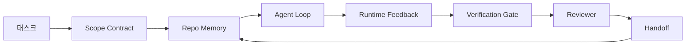

# Eval-Driven Development & Agent Workbench

## 개요

에이전트가 데모에서는 통과하지만 프로덕션에서는 예측 못 한 방식으로 실패한다. 벤치마크는 "이 모델이 전반적으로 유능한가"에는 답하지만 "이 에이전트가 우리 제품에 맞는 결과를 내는가"에는 답하지 못한다. 이 문서는 두 가지 상호보완적 규율을 다룬다: **Eval-Driven Development**(평가를 개발 루프의 중심에 두는 방법론)와 **Agent Workbench**(에이전트가 신뢰할 수 있게 작업하기 위해 필요한 7가지 표면을 갖춘 실행 환경).

## Eval-Driven Agent Development

Anthropic의 지침: "단순한 프롬프트로 시작하고, 포괄적 평가로 최적화하며, 필요할 때만 멀티스텝 에이전트 시스템을 추가하라." 평가는 마지막 단계가 아니라 다른 모든 선택을 이끄는 **바깥쪽 루프(outer loop)**다.

### 3단계 평가 레이어

```
1. Static Benchmarks (정적 벤치마크)
   범용 능력 비교, 회귀 게이팅용
   코드: SWE-bench Verified · 브라우징/데스크톱: WebArena, OSWorld
   범용: GAIA · 도구 사용: BFCL V4
   주의: 데이터 오염 — SWE-bench+ 연구에서 32.67% 해답 유출(solution leakage) 발견
        → 항상 "Verified" 또는 감사된(audited) 점수를 보고할 것

2. Custom Offline Evals (커스텀 오프라인 평가)
   제품의 실제 형태에 맞춘 평가
     - LLM-as-Judge (Langfuse, Phoenix, Opik)
     - 실행 기반 (Execution-based): 패치를 실제 실행해 테스트 통과 확인
     - 궤적 기반 (Trajectory-based): 정답 행동 순서와 비교
       (OSWorld-Human 연구: 최상위 에이전트도 정답 대비 1.4~2.7배 더 많은 단계 소모)

3. Online Evals (온라인/프로덕션 평가)
     - 세션 리플레이 (Langfuse)
     - 가드레일 트리거 알람 (→ [[Guardrail_Engineering]])
     - 스텝별 비용·지연시간 추적 (OTel 스팬 → [[Observability_and_Tracing]])
```

### Evaluator-Optimizer 타이트 루프

1. Proposer(제안자)가 출력 생성
2. Evaluator(평가자)가 판정
3. 평가자가 통과할 때까지 개선 반복

[[Planning_and_Reflection]]의 Self-Refine을 일반화한 형태이며, 신경 쓰는 어떤 에이전트 플로우든 이 루프로 감쌀 수 있다.

### 2026년 실무 표준

```
✓ 평가 코드는 애플리케이션 코드 옆에 위치 (별도 저장소 아님)
✓ 모든 PR마다 CI에서 자동 실행
✓ 평가 점수로 머지 게이트 ("main 대비 5% 이상 회귀 시 머지 차단")
✓ 모든 가드레일 규칙은 대응하는 평가 케이스를 가짐
✓ 모든 학습된 규칙(Reflexion 반성, 워크플로 학습 규칙 등)은 대응하는 실패 케이스를 가짐
```

### 흔한 실패

- **베이스라인 부재**: 마지막으로 알려진 정상 상태(last-known-good) 없이는 평가 결과를 해석할 수 없다
- **근거 없는 LLM 판정자**: 판정자 LLM도 환각한다 → CRITIC 패턴처럼 외부 도구로 근거를 확인해야 함
- **평가에 대한 과적합**: 평가 점수를 최적화하는 것이 실제 프로덕션 유용성과 괴리될 수 있음 → 케이스를 주기적으로 순환(rotate)
- **불안정한(flaky) 평가**: 비결정적 케이스가 오탐 알람을 유발 → 시드 고정, 상태 스냅샷

## Agent Workbench: 왜 유능한 모델도 실패하는가

프론티어 모델에게 실제 리포지토리에서 입력 검증 코드를 추가하라고 하면, 그럴듯한 코드를 작성하고 "완료"를 선언한 뒤 멈춘다. 하지만 테스트를 돌리면 2개가 실패하고, 검증과 무관한 파일까지 건드려져 있으며, 에이전트가 무엇을 가정했는지·무엇을 먼저 시도했는지·무엇이 남았는지 기록이 전혀 없다.

**모델이 Python을 잘못 안 것이 아니다. "작업"을 잘못 안 것이다.** 이것은 모델 버그가 아니라 **워크벤치(workbench) 버그**다 — 일회성 생성을 신뢰할 수 있고 재개 가능한 엔지니어링으로 바꿔주는 "모델을 둘러싼 표면"이 빠져 있는 것이다.

### 7가지 워크벤치 표면 (7 Surfaces)

| 표면 | 담는 것 | 없을 때의 실패 |
|------|--------|-------------|
| **Instructions** | 시작 규칙, 금지된 행동, "완료"의 정의 | 에이전트가 무엇이 "출하 가능"인지 추측함 |
| **State** | 현재 태스크, 건드린 파일, 막힌 지점, 다음 행동 | 매 세션이 0부터 재시작 |
| **Scope** | 허용/금지 파일, 인수 기준 | 무관한 코드로 수정이 새어나감 |
| **Feedback** | 실제 명령 출력이 루프에 캡처됨 | 400 에러에도 "성공"을 선언 |
| **Verification** | 테스트, lint, 스모크 실행, 범위 체크 | "괜찮아 보임"이 그대로 main에 반영 |
| **Review** | 다른 역할로 진행하는 2차 검토 | 빌더가 자기 숙제를 스스로 채점 |
| **Handoff** | 무엇이 바뀌었고, 왜, 무엇이 남았는지 | 다음 세션이 모든 걸 처음부터 재발견 |



루프는 **대화 히스토리가 아니라 상태 파일에서 닫힌다.** 대화는 휘발성이지만, 리포지토리는 진실의 시스템(system of record)이다.

**워크벤치 vs 프롬프트 엔지니어링**: 프롬프팅은 "이번 턴에 무엇을 원하는지"를 알려준다. 워크벤치는 "여러 턴·여러 세션에 걸쳐 어떻게 작업할지"를 알려준다. 대부분의 에이전트 실패 사례는 프롬프트 엔지니어링의 옷을 입은 워크벤치 실패다.

**워크벤치 vs 프레임워크**: 프레임워크([[Agent_Frameworks]])는 런타임(LangGraph, AutoGen, Agents SDK)을 제공한다. 워크벤치는 그 런타임 "안에서" 에이전트가 작업할 공간을 제공한다. 둘 다 필요하다.

### 분산 시스템 원시 요소(Primitives)로 환원

"하네스 엔지니어링(harness engineering)"이라는 용어로 여러 벤더(LangChain, OpenAI, Anthropic, Martin Fowler 등)가 각자 다른 어휘로 같은 것을 설명하고 있다. 하지만 7가지 표면은 결국 분산 백엔드 시스템이 이미 오래전부터 필요로 했던 8가지 원시 요소로 환원된다:

| 원시 요소 | 정체 | 에이전트에서의 대응물 |
|----------|------|---------------------|
| Function | 타입이 있는 핸들러 | 도구 호출, 규칙 검사, 검증 단계, 모델 호출 |
| Worker | 장기 실행 프로세스 | 빌더, 리뷰어, 검증자, MCP 서버 |
| Trigger | 함수를 호출하는 이벤트 소스 | 에이전트 루프 틱, HTTP 요청, 큐 메시지, cron, 훅 |
| Runtime | 무엇이 어디서 실행될지 결정하는 경계 | Claude Code 프로세스, LangGraph 런타임 |
| HTTP/RPC | 호출자-워커 간 통신선 | 도구 호출 프로토콜, MCP 요청 |
| Queue | 트리거-워커 사이 내구성 있는 버퍼 | 태스크 보드, 피드백 로그, 리뷰 인박스 |
| Session Persistence | 크래시·재시작에도 살아남는 상태 | `agent_state.json`, 체크포인트, 리포지토리 자체 |
| Authorization Policy | 누가 어떤 함수를 어떤 범위로 호출 가능한지 | 허용/금지 파일, 승인 경계, MCP capability list |

이렇게 환원하면 "Ralph Loop"(에이전트가 일찍 멈추려 할 때 원래 의도를 새 컨텍스트로 재주입)은 결국 세션 지속성을 가진 requeue 트리거이고, "Plan/Execute/Verify"는 상태와 큐로 통신하는 3개의 워커일 뿐임을 알 수 있다. 벤더마다 용어는 다르지만 엔지니어링은 동일하다.

### 실증 데이터 — 하네스가 모델보다 중요한 경우

```
Terminal Bench 2.0: 동일 모델, 하네스만 교체 → 코딩 에이전트가 상위 30위 밖에서 5위로 상승
Vercel: 에이전트 도구의 80%를 삭제 → 성공률이 80%에서 100%로 상승
Harvey: 하네스 최적화만으로 법률 에이전트 정확도 2배 이상 향상
88%의 엔터프라이즈 AI 에이전트 프로젝트가 프로덕션 도달 실패
  — 실패는 "추론"이 아니라 "런타임"에 집중되어 있음
2025년 벤치마크: 긴 컨텍스트 조건에서 WebAgent 완료율이 40~50%에서 10% 미만으로 붕괴
  — 대부분 무한 루프와 목표 상실이 원인
```

### 실행 도구: Workbench Pack

Phase 14 캡스톤(31~42강)은 위 7가지 표면을 하나의 설치 가능한 디렉토리로 패키징한다:

```
agent-workbench-pack/
├── AGENTS.md                    # Instructions
├── docs/
│   ├── agent-rules.md
│   ├── reliability-policy.md
│   ├── handoff-protocol.md
│   └── reviewer-rubric.md
├── schemas/
│   ├── agent_state.schema.json  # State
│   ├── task_board.schema.json
│   └── scope_contract.schema.json  # Scope
├── scripts/
│   ├── init_agent.py
│   ├── run_with_feedback.py     # Feedback
│   ├── verify_agent.py          # Verification
│   └── generate_handoff.py      # Handoff
└── bin/install.sh               # 임의 리포지토리에 멱등적으로 설치
```

**버전 관리 원칙**: `VERSION` 파일이 계약(contract) 역할을 한다 — 스키마·스크립트 변경은 메이저 버전 상승, 문서만 변경은 패치 버전 상승. `npm`, `Cargo`, `pyproject.toml`이 10년간 변화를 견뎌온 것과 동일한 규칙이다. 설치된 대상 리포지토리의 `agent_state.json`에 어떤 팩 버전으로 초기화됐는지 기록된다.

**배포 형태**: (1) 디렉토리로 직접 복사(`cp -r`), (2) GitHub 템플릿 저장소로 fork, (3) SkillKit 같은 스킬 배포 채널로 `skillkit install agent-workbench-pack` 한 번에 여러 에이전트 도구에 설치.

### 핵심 서브 레슨 요약 (14·31~14·41)

| 레슨 | 핵심 내용 |
|------|---------|
| Instructions as Executable Constraints | 규칙을 산문이 아니라 검사 가능한 함수로 표현 |
| Repo Memory and Durable State | 대화가 아니라 리포지토리 파일이 진실의 시스템 |
| Initialization Scripts | 세션 시작 시 상태·스코프를 일관되게 로드 |
| Scope Contracts and Task Boundaries | 허용/금지 파일 범위를 명시적 계약으로 |
| Runtime Feedback Loops | 실제 명령 출력을 루프에 캡처(성공 환각 방지) |
| Verification Gates | 결정론적 검증 함수, 실패 시 기본적으로 닫힘(fail closed) |
| Reviewer Agent | 빌더와 다른 권한·역할을 가진 독립 2차 검토자 |
| Multi-Session Handoff | 세션 종료 시 무엇이 남았는지 다음 세션에 전달 |

## Eval-Driven Development와 Workbench의 관계

두 방법론은 상호 보완적이다: Eval-Driven Development가 "무엇이 성공인지 어떻게 측정할 것인가"를 다룬다면, Agent Workbench의 Verification Gate가 그 측정을 실제 실행 루프 안에 강제한다. Phase 14의 모든 레슨은 대응하는 평가 케이스를 만들어낸다 — 예를 들어 Reflexion(→ [[Planning_and_Reflection]])은 "재시도 시 학습된 반성이 실제로 적용되는가"라는 평가 케이스를, 실패 모드([[Multi_Agent_Coordination]])는 "탐지기가 알려진 실패를 태깅하는가"라는 케이스를 만든다.

## AI Engineering에서의 역할

Eval-Driven Development와 Agent Workbench는 "모델이 얼마나 똑똑한가"에서 "시스템이 얼마나 신뢰할 수 있는가"로 초점을 옮기는 2026년의 핵심 흐름이다. Terminal Bench·Vercel·Harvey의 사례가 보여주듯, 같은 모델이라도 하네스(워크벤치) 설계만으로 성공률이 극적으로 달라진다. [[Eval_Driven_Development_and_Agent_Workbench|본 문서]]의 7가지 표면은 [[Multi_Agent_Coordination]]의 실패 모드(MASFT/MAST)를 예방하는 구체적 엔지니어링 대응책이기도 하다 — 예를 들어 Verification Gate는 "Verification Gap" 실패를, Handoff는 "Coordination Failure"를 구조적으로 줄인다.

## 관련 개념
[[Multi_Agent_Coordination]] · [[Agent_Frameworks]] · [[Planning_and_Reflection]] · [[Guardrail_Engineering]] · [[Observability_and_Tracing]] · [[Benchmarking]]

## 출처
- Anthropic "Building Effective Agents" — [anthropic.com](https://www.anthropic.com/research/building-effective-agents)
- LangChain "The Anatomy of an Agent Harness" — [blog.langchain.com](https://blog.langchain.com/the-anatomy-of-an-agent-harness/)
- MongoDB "The Agent Harness: Why the LLM Is the Smallest Part of Your Agent System" — [mongodb.com](https://www.mongodb.com/company/blog/technical/agent-harness-why-llm-is-smallest-part-of-your-agent-system)
- Anthropic "Effective harnesses for long-running agents" — [anthropic.com](https://www.anthropic.com/engineering/effective-harnesses-for-long-running-agents)
- Martin Fowler / Böckeler, B. "Harness engineering for coding agent users" — [martinfowler.com](https://martinfowler.com/articles/harness-engineering.html)
- AI Engineering from Scratch, Phase 14 · Lessons 30-42 (Eval-Driven Development, Agent Workbench 시리즈) — [GitHub](https://github.com/rohitg00/ai-engineering-from-scratch/tree/main/phases/14-agent-engineering)
