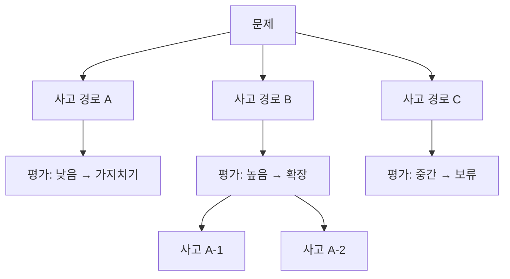
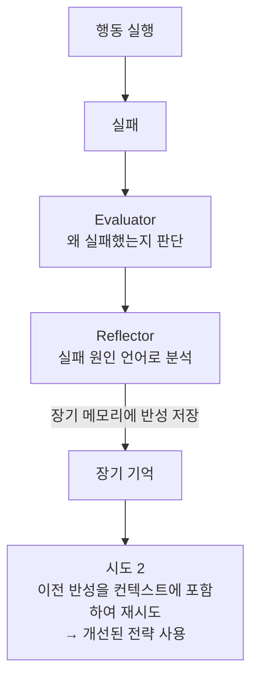

# Planning & Reflection

## 개요

에이전트가 복잡한 목표를 달성하기 위해 **사전에 계획을 수립**하고(Planning), 실행 중 **결과를 평가하여 자신의 행동을 교정**하는(Reflection) 메커니즘. 단순한 ReAct 루프를 넘어 에이전트의 자기 개선 능력을 부여한다.

## Planning 기법

### Plan-and-Solve (Wei et al., 2023)
문제 해결 전 명시적 계획 수립:

```
기본 CoT: "문제를 단계별로 생각하자"

Plan-and-Solve:
  1단계: "이 문제를 풀기 위한 계획을 세우자"
         → 계획: [①데이터 수집 ②분석 ③결론]
  2단계: 계획대로 실행
         → 계획이 있으므로 더 체계적이고 오류 감소
```

```python
plan_and_solve_prompt = """
문제: {problem}

먼저 이 문제를 단계별로 풀기 위한 계획을 세우세요:
계획:

이제 계획을 하나씩 실행하세요:
"""
```

### LangGraph Plan-and-Execute

```python
from langgraph_prebuilt import create_react_agent

# Planner: 전체 계획 수립
def planning_node(state):
    plan = planner_llm.invoke({
        "messages": [HumanMessage(content=f"다음 작업의 실행 계획을 수립하세요: {state['task']}")]
    })
    return {"plan": parse_plan(plan), "step_index": 0}

# Executor: 계획 단계별 실행
def execution_node(state):
    current_step = state["plan"][state["step_index"]]
    result = executor_agent.invoke({"task": current_step})
    return {"results": state["results"] + [result], "step_index": state["step_index"] + 1}

# Replanner: 결과에 따른 계획 수정
def replanning_node(state):
    if needs_replan(state):
        updated_plan = replanner_llm.invoke(state)
        return {"plan": updated_plan}
    return {}
```

### ReWOO (Reasoning WithOut Observation)

Xu et al. (2023)이 제안한 Plan-and-Execute 변형. 일반 ReAct는 각 단계마다 "추론 → 행동 → 관찰"을 인터리빙하며 매번 LLM을 호출하지만, **ReWOO는 계획 단계에서 모든 도구 호출을 미리 한 번에 설계**하고 실행은 별도 워커가 담당한다.

```
ReAct:  추론1 → 행동1 → 관찰1 → 추론2 → 행동2 → 관찰2 → ...  (매 단계 LLM 호출)

ReWOO:  Planner(1회 LLM 호출)
          → "#E1 = search(질문A)"
          → "#E2 = calculate(#E1 결과 사용)"
          → "#E3 = search(질문B)"
        Worker: #E1, #E2, #E3 도구 실행 (LLM 호출 없음, 병렬 가능)
        Solver(1회 LLM 호출): #E1~#E3 결과를 종합해 최종 답 생성
```

**장점**: LLM 호출 횟수 대폭 절감 (토큰 비용 감소), 도구 호출 병렬화 가능.
**단점**: 계획이 틀리면(변수 의존성 오판) 재계획 없이는 복구 어려움 — 관찰 결과에 따라 동적으로 경로를 바꿔야 하는 태스크에는 부적합.

### Tree of Thoughts (ToT) 와 LATS

**Tree of Thoughts** (Yao et al., NeurIPS 2023)는 단일 추론 경로(CoT) 대신 **여러 사고 경로를 트리로 탐색**하고, 각 노드를 평가해 유망한 경로만 확장한다.



탐색 전략으로 BFS(너비 우선) 또는 DFS(깊이 우선)를 사용하며, 각 단계에서 LLM 스스로가 "이 경로가 답에 얼마나 가까운가"를 평가한다.

**LATS (Language Agent Tree Search)** (Zhou et al., 2023)는 ToT에 **MCTS(Monte Carlo Tree Search)**와 환경 피드백(도구 실행 결과)을 결합한 확장판이다. ReAct의 행동-관찰 루프를 트리 탐색 안에 내장해, 각 노드에서 실제 도구를 실행하고 그 결과로 노드 가치를 갱신한다.

```
LATS 루프:
  1. Selection: UCB 점수가 높은 노드 선택
  2. Expansion: LLM이 여러 행동 후보 생성
  3. Evaluation: 각 후보를 실행 후 자기평가 + 외부 피드백으로 점수화
  4. Backpropagation: 점수를 트리 상위로 전파
  5. 반복 → 최선의 경로 선택
```

**비용 특성**: ToT/LATS는 CoT나 ReAct보다 LLM 호출이 훨씬 많다(노드마다 평가 호출 필요). HotPotQA, WebShop 등에서 ReAct 대비 성능 향상이 크지만, 단순 태스크에는 과도한 비용이다.

## Reflection (자기 반성)

### Reflexion Framework (Shinn et al., NeurIPS 2023)

실패에서 언어적 자기 반성을 통해 학습:



**성능**: HotPotQA +20%, HumanEval +11% (기본 ReAct 대비)

```python
from langchain_core.prompts import ChatPromptTemplate

# 반성 생성 프롬프트
reflection_prompt = ChatPromptTemplate.from_messages([
    ("system", "당신은 AI 에이전트의 행동을 평가하고 개선점을 제안하는 전문가입니다."),
    ("human", """
    목표: {goal}
    실행한 행동들: {actions}
    최종 결과: {result}
    
    이 시도에서 무엇이 잘못되었는지 분석하고,
    다음 시도에서 어떻게 개선할지 구체적으로 서술하세요.
    """)
])

def reflection_node(state: AgentState):
    if not state["task_succeeded"]:
        reflection = llm.invoke(reflection_prompt.format_messages(**state))
        return {"reflections": state["reflections"] + [reflection.content]}
    return {}
```

### Self-Refine

Madaan et al. (2023)이 제안한 반복 자기 개선 프레임워크. **외부 피드백이나 추가 학습 없이** 동일 LLM이 생성 → 피드백 → 개선을 반복한다.

```python
def self_refine(task: str, llm, max_iterations: int = 3) -> str:
    output = llm.invoke(task)
    for _ in range(max_iterations):
        feedback = llm.invoke(f"다음 출력의 문제점을 구체적으로 지적하세요:\n{output}")
        if "문제 없음" in feedback:
            break
        output = llm.invoke(f"다음 피드백을 반영해 출력을 개선하세요:\n출력: {output}\n피드백: {feedback}")
    return output
```

**성능**: GPT-4 기준 코드 최적화·수학 추론·대화 응답 등 7개 태스크에서 평균 약 20% 품질 향상 (사람 평가 기준). [[Anthropic_Workflow_Patterns]]의 Evaluator-Optimizer 패턴이 Self-Refine을 일반화한 형태다.

### CRITIC (Correcting with Tool-Interactive Critiquing)

Gou et al. (2023)이 제안. Self-Refine과 달리 **외부 도구(검색 엔진, 코드 인터프리터, 계산기)를 사용해 비평(critique)한다** — LLM 자신의 판단만으로는 사실 오류를 못 잡는 한계를 보완한다.

```
Self-Refine: LLM이 스스로를 비평 (환각을 환각으로 못 잡을 수 있음)
CRITIC:      외부 도구로 검증 → "이 응답의 이 문장은 검색 결과와 모순된다"
             → 도구 기반 근거로 수정
```

```python
def critic_loop(task: str, llm, tools: dict, max_iterations: int = 3) -> str:
    output = llm.invoke(task)
    for _ in range(max_iterations):
        # 도구를 사용한 사실 검증
        verification_query = llm.invoke(f"'{output}'를 검증하려면 어떤 도구 호출이 필요한가?")
        tool_result = tools[verification_query.tool](verification_query.args)
        critique = llm.invoke(f"출력: {output}\n도구 검증 결과: {tool_result}\n모순이 있는가?")
        if "모순 없음" in critique:
            break
        output = llm.invoke(f"다음 검증 결과를 반영해 수정하세요:\n{critique}")
    return output
```

**적합 케이스**: 사실 정확성이 중요한 QA, 코드 실행 결과 검증, 수치 계산 검증. 순수 언어적 자기반성(Self-Refine, Reflexion)보다 환각 억제에 강하다.

### Self-Correction 일반 패턴

생성 즉시 자기 검증(위 두 프레임워크의 공통 뼈대):

```python
def generate_with_verification(task: str) -> str:
    # 1. 초기 생성
    response = llm.invoke(task)
    
    # 2. 자기 검증
    verification = llm.invoke(f"""
    다음 응답을 검토하세요:
    {response}
    
    오류나 개선점이 있으면 지적하고 수정된 버전을 제공하세요.
    없으면 "검증 완료"라고 답하세요.
    """)
    
    if "검증 완료" not in verification:
        # 3. 수정
        final = llm.invoke(f"다음 피드백을 반영하여 응답을 수정하세요:\n{verification}")
        return final
    
    return response
```

## Human-Agent Collaboration (인간-에이전트 협력)

계획 단계에서 인간과 협력:

```python
# 계획을 인간에게 보여주고 수정 요청
def collaborative_planning(goal: str):
    # 1. 에이전트가 초안 계획 수립
    draft_plan = planner.invoke(goal)
    
    # 2. 인간에게 검토 요청 (HITL)
    human_feedback = interrupt({
        "plan": draft_plan,
        "question": "이 계획을 검토하고 수정사항을 알려주세요"
    })
    
    # 3. 피드백 반영
    final_plan = planner.invoke(f"{goal}\n\n인간 피드백: {human_feedback}")
    return final_plan
```

## Planning vs Reflection 비교

| | Planning | Reflection |
|--|---------|-----------|
| **시점** | 실행 전 | 실행 후 |
| **목적** | 효율적 실행 경로 설계 | 실패로부터 학습 |
| **메모리 활용** | 장기 기억에서 전략 참조 | 반성을 장기 기억에 저장 |
| **LLM 호출** | 1~2회 추가 | 1회 추가 |

## 계획·추론 기법 비교

| 기법 | LLM 호출 비용 | 강점 | 약점 |
|------|-------------|------|------|
| Plan-and-Solve | 낮음 | 단순, 빠름 | 재계획 어려움 |
| ReWOO | 낮음 (계획 1회 + 해결 1회) | 도구 호출 병렬화, 토큰 절감 | 관찰 기반 동적 재계획 불가 |
| ReAct | 중간 (단계마다 호출) | 관찰에 따른 유연한 대응 | 단계 수에 비례해 비용 증가 |
| Tree of Thoughts | 높음 | 다중 경로 탐색, 복잡 문제에 강함 | 단순 태스크엔 과도한 비용 |
| LATS | 매우 높음 | ToT + 환경 피드백, 최고 성능대 | 구현 복잡, 비용 최대 |
| Self-Refine | 중간 (반복 횟수만큼) | 외부 도구 불필요 | 환각을 스스로 못 잡을 수 있음 |
| CRITIC | 중간~높음 | 도구 기반 검증으로 환각 억제 | 검증 도구가 필요한 도메인에 한정 |

## AI Engineering에서의 역할

Planning & Reflection은 에이전트를 "실행기"에서 "자기 개선 시스템"으로 격상시킨다. 특히 반복적인 태스크(코드 디버깅, 리서치, 콘텐츠 생성)에서 Reflexion 패턴은 인간 감독 없이도 품질이 지속적으로 향상되는 효과를 낸다. ReWOO·ToT·LATS는 "얼마나 넓게 탐색할 것인가"의 스펙트럼을, Self-Refine·CRITIC은 "무엇을 근거로 스스로를 고칠 것인가"의 스펙트럼을 이루며, 태스크의 난이도와 비용 허용치에 따라 선택한다.

## 관련 개념
[[Agent_Core_Pillars]] · [[ReAct_Pattern]] · [[Chain_of_Thought]] · [[Human_in_the_Loop]] · [[Anthropic_Workflow_Patterns]] · [[Multi_Agent_Coordination]]

## 출처
- Shinn et al. (2023) "Reflexion: Language Agents with Verbal Reinforcement Learning" — [NeurIPS 2023](https://proceedings.neurips.cc/paper_files/paper/2023/file/1b44b878bb782e6954cd888628510e90-Paper-Conference.pdf)
- Wang et al. (2023) "Plan-and-Solve Prompting" — [arXiv:2305.04091](https://arxiv.org/abs/2305.04091)
- Xu et al. (2023) "ReWOO: Decoupling Reasoning from Observations" — [arXiv:2305.18323](https://arxiv.org/abs/2305.18323)
- Yao et al. (2023) "Tree of Thoughts: Deliberate Problem Solving with Large Language Models" — [NeurIPS 2023](https://arxiv.org/abs/2305.10601)
- Zhou et al. (2023) "Language Agent Tree Search Unifies Reasoning, Acting, and Planning" — [arXiv:2310.04406](https://arxiv.org/abs/2310.04406)
- Madaan et al. (2023) "Self-Refine: Iterative Refinement with Self-Feedback" — [arXiv:2303.17651](https://arxiv.org/abs/2303.17651)
- Gou et al. (2023) "CRITIC: Large Language Models Can Self-Correct with Tool-Interactive Critiquing" — [arXiv:2305.11738](https://arxiv.org/abs/2305.11738)
- HuggingFace "#12: How Do Agents Learn from Their Own Mistakes?" — [huggingface.co](https://huggingface.co/blog/Kseniase/reflection)
- AI Engineering from Scratch, Phase 14 · Lessons 02-05 (ReWOO, Tree of Thoughts/LATS, Self-Refine/CRITIC) — [GitHub](https://github.com/rohitg00/ai-engineering-from-scratch/tree/main/phases/14-agent-engineering)
