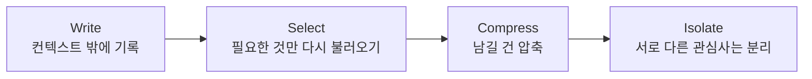

# Agentic Context Management (에이전틱 컨텍스트 관리)

## 개요

**Agentic Context Management**는 장시간 실행되는 에이전트 루프에서 컨텍스트 창을 어떻게 지속적으로 관리할 것인가를 다루는 기법군이다. RAG가 "무엇을 검색해 넣을 것인가"에 답한다면, 이 문서는 그 이후 — **에이전트가 수십~수백 턴 동안 도구를 호출하며 쌓이는 컨텍스트를 어떻게 살아있게 유지할 것인가**에 답한다.

```
단발성 RAG 질의:  [System] + [검색된 문서] + [질문] → 답변 (컨텍스트 1회 구성)

장기 실행 에이전트: [System] + [도구 호출1 결과] + [도구 호출2 결과] + ...
                    → 턴이 쌓일수록 컨텍스트가 계속 불어남
                    → 언젠가 창을 넘기거나, 넘기지 않아도 품질이 떨어진다
```

## Context Rot: 창에 여유가 있어도 성능은 떨어진다

**Context Rot**은 컨텍스트 창이 아직 가득 차지 않았는데도, 입력 토큰 수가 늘어날수록 모델의 추론 품질이 점진적으로 저하되는 현상이다. Chroma의 기술 리포트(2025) [1]는 GPT-4.1, Claude 4, Gemini 2.5, Qwen3 등 18개 모델을 대상으로 입력 길이만 늘리고 과제 난이도는 고정한 실험에서, 모델이 컨텍스트를 **균일하게 사용하지 않는다**는 것을 정량적으로 보였다. 장기 실행 검색 에이전트를 다룬 후속 연구(2026) [2]도 같은 저하 패턴을 재현하며 완화 기법을 제안한다.

### Lost in the Middle과의 차이

이 위키에는 이미 [[AI/Engineering/Context_Engineering/Lost_in_the_Middle|Lost_in_the_Middle]] 문서가 있다. 둘은 자주 혼동되지만 다른 현상이다.

| 구분 | Lost in the Middle | Context Rot |
|------|--------------------|--------------|
| **원인** | 정보의 **위치** (컨텍스트 중간) | 정보의 **총량** (입력 토큰 수 자체) |
| **완화** | 핵심 정보를 앞/뒤로 재배치 | 애초에 불필요한 토큰을 창에 넣지 않음 |
| **컨텍스트 창 여유** | 여유가 있어도 발생 | 여유가 있어도 발생 — 창을 "덜 채우는 것" 자체가 해법 |
| **주로 문제되는 곳** | 다중 문서 RAG (문서 순서) | 장기 실행 에이전트 루프 (누적 도구 결과) |

즉 Lost in the Middle은 "어디에 놓을까"의 문제이고, Context Rot은 "애초에 얼마나 넣을까"의 문제다. 실무에서는 둘 다 동시에 발생하므로, 문서 순서 최적화(Lost in the Middle 대응)와 아래의 4대 전략(Context Rot 대응)을 함께 적용해야 한다.

## 4대 전략: Write / Select / Compress / Isolate

LangChain의 컨텍스트 엔지니어링 정리(Lance Martin, 2025) [3]와 Anthropic의 실무 가이드(2025) [4]가 수렴하는 프레임이 있다. 컨텍스트를 다루는 모든 기법은 이 네 축 중 하나로 분류된다.



### Write — 컨텍스트 창 밖에 기록하기

도구 호출 결과 전체를 메시지 히스토리에 쌓는 대신, 디스크나 에이전트 상태(state)에 원본을 저장하고 컨텍스트에는 **요약이나 참조(URL, 파일 경로)만** 남긴다. `scratchpad`, 파일시스템 오프로딩, `Memory Block`이 여기 속한다. 이 위키의 [[AI/Engineering/Context_Engineering/LLM_Memory|LLM_Memory]] 문서가 다루는 In-Context Memory 관리가 Write 전략의 한 갈래다.

### Select — 필요한 것만 다시 불러오기

기록해 둔 것 중 지금 턴에 실제로 필요한 부분만 검색해 컨텍스트에 주입한다. [[AI/Engineering/Context_Engineering/Retrieval_Strategies/Retrieval_Strategies|Retrieval_Strategies]] 챕터 전체(RAG/GraphRAG/SQL RAG)가 본질적으로 Select 전략이며, 도구가 많은 에이전트에서는 "지금 태스크에 관련 있는 도구만" 골라 노출하는 것도 같은 원리다.

### Compress — 남길 것은 압축하기

전부 버릴 수도, 전부 남길 수도 없는 정보는 압축한다. [[AI/Engineering/Context_Engineering/Context_Compression|Context_Compression]] 문서의 LLMLingua·Contextual Compression이 **개별 프롬프트/청크 단위** 압축이라면, 아래에서 다루는 **Compaction**은 **대화 전체 흐름 단위** 압축이라는 점에서 층위가 다르다.

### Isolate — 서로 다른 관심사는 분리하기

한 컨텍스트 창에 모든 것을 담지 않고, 하위 작업을 별도의 독립된 컨텍스트 창으로 분리한다. 아래 "Sub-agent Context Isolation" 절 참조.

## Compaction: 요약 후 새 창에서 재개

**Compaction**은 컨텍스트 창이 한계에 가까워지면 지금까지의 대화를 요약하고, 그 요약을 시작점으로 **새 컨텍스트 창을 다시 여는** 루프 단위 기법이다 [4]. `Context_Compression.md`의 LLMLingua가 "이 프롬프트 안에서 토큰을 줄이는" 국소 압축이라면, Compaction은 "이 세션 전체를 접고 다음 세션으로 넘기는" 전역 압축이다.

```
Compaction 루프:
  [턴 1..N: 도구 호출 누적] → 창 한계 근접
    ↓
  요약 생성 (무엇을 남기고 무엇을 버릴지가 핵심)
    ↓
  [요약] + [턴 N 이후 계속] → 새 컨텍스트 창에서 재개
```

Anthropic의 실무 가이드 [4]는 Compaction 설계의 핵심을 이렇게 정리한다: 먼저 **recall(회수율)을 최대화**해 트레이스의 모든 관련 정보를 요약 프롬프트가 놓치지 않게 하고, 그다음 **precision(정밀도)을 개선**해 불필요한 내용을 걷어낸다. 너무 공격적으로 압축하면 당장은 안 중요해 보이지만 나중에 결정적인 정보(예: 사용자가 초반에 명시한 제약 조건)를 잃을 수 있다.

## Sub-agent Context Isolation

**Isolate** 전략의 대표 구현이다. 하위 작업을 별도 서브에이전트에 위임하고, 그 서브에이전트는 자신만의 독립된 컨텍스트 창에서 상세 작업(예: 웹 검색, 코드 탐색)을 수행한 뒤, 리드 에이전트에는 **압축된 요약(보통 1,000~2,000 토큰)만** 반환한다 [4].

```
리드 에이전트 컨텍스트: [지시] → [서브에이전트A 요약 1.5K] + [서브에이전트B 요약 1.2K] → 종합
                                        ↑ 각 서브에이전트 내부의 방대한 탐색 과정은
                                          리드 에이전트 컨텍스트에 전혀 노출되지 않는다
```

Anthropic의 멀티 에이전트 리서치 시스템은 이 패턴이 복잡한 리서치 태스크에서 단일 에이전트 방식을 능가했다고 보고한다 [4]. 이는 이 위키의 [[AI/Engineering/Agent_Engineering/Multi_Agent_Coordination|Multi_Agent_Coordination]](통신·조정 패턴)과 [[AI/Engineering/Graph_Engineering/Multi_Agent_Topology|Multi_Agent_Topology]](노드/엣지로서의 에이전트 구조)가 다루는 "왜 나누는가"에 대한 **컨텍스트 관점의 답**이기도 하다 — 토폴로지를 나누는 이유 중 하나가 바로 컨텍스트 격리다.

## 파일시스템 오프로딩과 Note-taking

Write 전략의 구체적 구현으로, 에이전트가 컨텍스트 대신 **파일시스템에 직접 기록**하고 필요할 때만 다시 읽는 패턴이 2025~2026년 실무 표준으로 자리잡았다. 무거운 도구 호출 결과(예: 전체 웹페이지, 로그 전체)를 디스크나 에이전트 상태에 저장하고, 컨텍스트에는 요약이나 파일 경로만 남긴 뒤 필요할 때 `read_file`로 다시 불러온다. 장기 실행 코딩 에이전트의 `scratchpad.md`, `TODO.md` 같은 진행 상황 기록도 같은 원리 — 컨텍스트가 리셋되거나 압축되더라도 파일에는 상태가 남는다.

## 위험: Governance Decay

Compaction과 컨텍스트 관리 전략에는 알려진 위험이 있다. **Governance Decay**(arXiv:2606.22528, 2026) [5]는 반복적인 컨텍스트 압축이 안전 제약이나 시스템 지침처럼 "당장 눈에 띄지 않지만 중요한" 정보를 요약 과정에서 조용히 침식시키는 현상을 지적한다. 요약 프롬프트가 recall보다 precision을 우선시하도록 튜닝돼 있으면 특히 취약하다 — 표면적으로는 "불필요한 내용 제거"처럼 보이는 압축이, 실제로는 [[AI/Engineering/Harness_Engineering/Guardrail_Engineering|Guardrail_Engineering]]이 설정한 제약을 몇 차례의 Compaction 사이클을 거치며 소실시킬 수 있다. 따라서 장기 실행 에이전트에서는 안전 관련 지침을 Compaction 대상에서 제외하거나, System Prompt처럼 매 사이클 무조건 재주입되는 고정 영역에 두는 설계가 권장된다.

## AI Engineering에서의 역할

Agentic Context Management는 RAG·Memory·Compression 같은 **개별 컴포넌트 기법을 에이전트의 시간축 위에서 어떻게 조합할 것인가**를 다루는 상위 설계 규율이다. 단발성 질의응답에서는 필요 없던 문제 — 창이 안 찼는데도 성능이 떨어지고(Context Rot), 압축이 안전장치를 갉아먹고(Governance Decay), 서브에이전트 간 정보 경계를 어디에 그을지(Isolation) — 가 모두 여기서 다뤄진다. Loop Engineering 관점에서 컨텍스트를 다루는 비용 절감 기법은 [[AI/Engineering/Loop_Engineering/Cost_Engineering/Context_Usage_Auditing|Context_Usage_Auditing]]을 참고.

## 관련 개념
[[AI/Engineering/Context_Engineering/Context_Compression|Context_Compression]] · [[AI/Engineering/Context_Engineering/Lost_in_the_Middle|Lost_in_the_Middle]] · [[AI/Engineering/Context_Engineering/LLM_Memory|LLM_Memory]] · [[AI/Engineering/Agent_Engineering/Agent_Memory|Agent_Engineering/Agent_Memory]] · [[AI/Engineering/Agent_Engineering/Multi_Agent_Coordination|Agent_Engineering/Multi_Agent_Coordination]] · [[AI/Engineering/Harness_Engineering/Guardrail_Engineering|Harness_Engineering/Guardrail_Engineering]] · [[AI/Engineering/Loop_Engineering/Cost_Engineering/Context_Usage_Auditing|Loop_Engineering/Cost_Engineering/Context_Usage_Auditing]]

## 출처
1. Hong, Troynikov & Huber (Chroma, 2025) "Context Rot: How Increasing Input Tokens Impacts LLM Performance" — [research.trychroma.com/context-rot](https://research.trychroma.com/context-rot)
2. "Diagnosing and Mitigating Context Rot in Long-horizon Search" (2026) — [arXiv:2606.29718](https://arxiv.org/abs/2606.29718)
3. Martin, L. (LangChain, 2025) "Context Engineering for Agents" — [rlancemartin.github.io/2025/06/23/context_engineering](https://rlancemartin.github.io/2025/06/23/context_engineering/)
4. Anthropic (2025) "Effective context engineering for AI agents" — [anthropic.com/engineering/effective-context-engineering-for-ai-agents](https://www.anthropic.com/engineering/effective-context-engineering-for-ai-agents)
5. "Governance Decay: How Context Compaction Silently Erases Safety Constraints in Long-Horizon LLM Agents" (2026) — [arXiv:2606.22528](https://arxiv.org/abs/2606.22528)
6. "Context Engineering 2.0: The Context of Context Engineering" (2025) — [arXiv:2510.26493](https://arxiv.org/abs/2510.26493)
