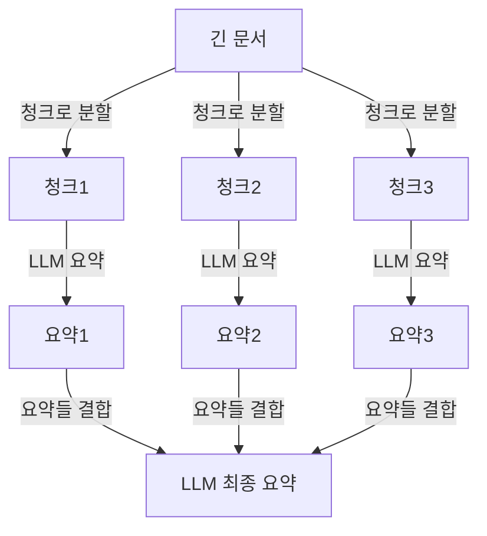

# Context Compression / Prompt Pruning

## 개요

**Context Compression**은 LLM의 컨텍스트 창에 들어가는 정보를 최소화하면서 필요한 정보는 유지하는 기법이다. **Prompt Pruning**은 프롬프트에서 불필요한 내용을 제거하는 구체적인 구현 방식이다. 컨텍스트 창 비용과 레이턴시를 줄이는 핵심 최적화다.

## 왜 필요한가

```
비용 구조 (GPT-4 Turbo 기준):
  입력 토큰: $0.01 / 1K tokens
  출력 토큰: $0.03 / 1K tokens

128K 컨텍스트 창 꽉 채우면:
  = 128K × $0.01 = $1.28/요청
  하루 10,000 요청 = $12,800/일

불필요한 컨텍스트 50% 제거 시:
  = $6,400/일 절감
```

## 주요 기법

### 1. LLM Lingua (선택적 압축)

Microsoft Research (2023)가 개발한 토큰 단위 압축:

```python
from llmlingua import PromptCompressor

compressor = PromptCompressor(
    model_name="microsoft/llmlingua-2-xlm-roberta-large-meetingbank",
    device_map="cuda"
)

compressed = compressor.compress_prompt(
    context,
    instruction="질문에 답변하세요",
    question="파이썬으로 정렬하는 방법은?",
    target_token=200,        # 목표 토큰 수
    rate=0.55,               # 압축률 (45% 제거)
    condition_in_question="after_condition"
)

print(compressed["compressed_prompt"])  # 불필요한 토큰 제거된 프롬프트
```

**작동 원리**: 소형 언어 모델로 각 토큰의 중요도 점수를 계산, 낮은 점수 토큰 제거.

### 2. Contextual Compression Retriever (LangChain)

RAG에서 청크 전체가 아닌 관련 부분만 추출:

```python
from langchain.retrievers.document_compressors import LLMChainExtractor
from langchain.retrievers import ContextualCompressionRetriever

# 압축기: 쿼리와 관련된 문장만 추출
compressor = LLMChainExtractor.from_llm(llm)

# 기본 검색기 + 압축 결합
compression_retriever = ContextualCompressionRetriever(
    base_compressor=compressor,
    base_retriever=vectorstore.as_retriever()
)

# 청크 전체 대신 관련 문장만 반환
relevant_docs = compression_retriever.get_relevant_documents(query)
```

### 3. Map-Reduce 요약 (긴 문서)

문서 전체를 한 번에 처리하기 어려울 때:


### 4. 대화 히스토리 요약

멀티턴 대화에서 이전 대화를 요약하여 토큰 절약:

```python
from langchain.memory import ConversationSummaryMemory

memory = ConversationSummaryMemory(
    llm=llm,
    max_token_limit=500  # 500토큰 초과 시 요약
)
# 대화가 길어지면 자동으로 이전 내용을 요약하여 압축
```

### 5. Selective Context (선택적 컨텍스트)

모든 도구 설명, Few-shot 예시를 항상 포함하지 않고 필요한 것만 동적으로 선택:
```python
# 쿼리 관련 도구만 포함
def select_relevant_tools(query: str, all_tools: list) -> list:
    query_embed = embed(query)
    tool_embeds = [embed(tool.description) for tool in all_tools]
    similarities = cosine_sim(query_embed, tool_embeds)
    return [all_tools[i] for i in top_k_indices(similarities, k=3)]
```

## 압축 기법 비교

| 기법 | 압축률 | 품질 손실 | 속도 | 적합 케이스 |
|------|-------|---------|------|-----------|
| LLM Lingua | 50~80% | 낮음 | 빠름 | RAG 컨텍스트 |
| LLM Summarization | 70~90% | 중간 | 느림 | 긴 문서 처리 |
| Contextual Compression | 40~60% | 낮음 | 중간 | RAG 청크 |
| Conv. Summary Memory | 60~80% | 낮음 | 느림 | 긴 대화 세션 |

## Lost in the Middle 문제

컨텍스트 창 중간의 정보는 양 끝의 정보보다 LLM이 덜 활용하는 현상 (Liu et al., 2023):
```
컨텍스트: [정보A][정보B][정보C][정보D][정보E]
활용도:     높음   낮음   낮음   낮음   높음

→ 중요 정보를 컨텍스트 앞/뒤에 배치
→ 중간의 불필요한 정보 제거로 해소 가능
```

자세한 내용은 [[Lost_in_the_Middle]] 문서 참조.

## AI Engineering에서의 역할

Context Compression은 **비용 최적화**와 **성능 향상** 두 가지를 동시에 달성한다. 불필요한 토큰 제거는 API 비용을 줄이고, 핵심 정보 집중은 모델의 응답 품질을 높인다. 특히 컨텍스트 창이 긴 Agent 시스템에서 누적 컨텍스트 관리의 핵심 기법이다.

## 관련 개념
[[Chunking_Strategies]] · [[Advanced_Retrieval]] · [[Memory_and_Semantic_Cache]] · [[Runtime_Optimization]]

## 출처
- Jiang et al. (2023) "LLMLingua: Compressing Prompts for Accelerated Inference" — [arXiv:2310.05736](https://arxiv.org/abs/2310.05736)
- Liu et al. (2023) "Lost in the Middle: How Language Models Use Long Contexts" — [arXiv:2307.03172](https://arxiv.org/abs/2307.03172)
- LangChain "Contextual Compression" — [python.langchain.com](https://python.langchain.com/docs/how_to/contextual_compression/)
