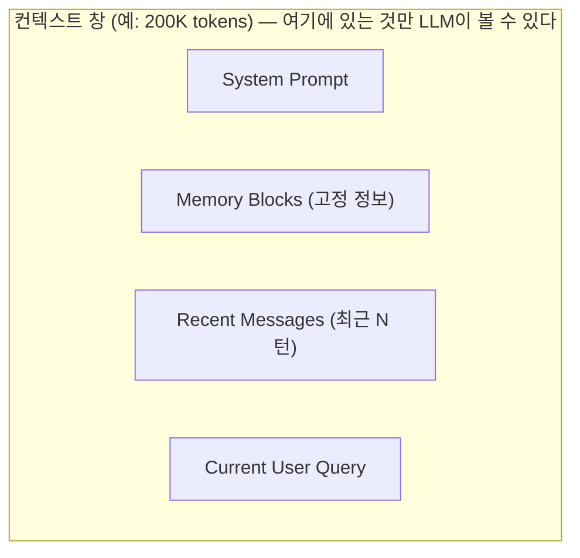
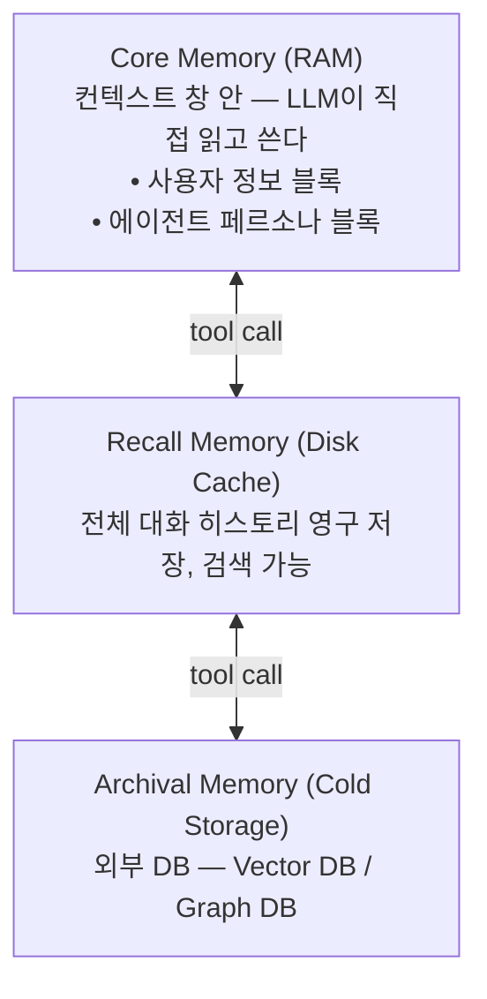
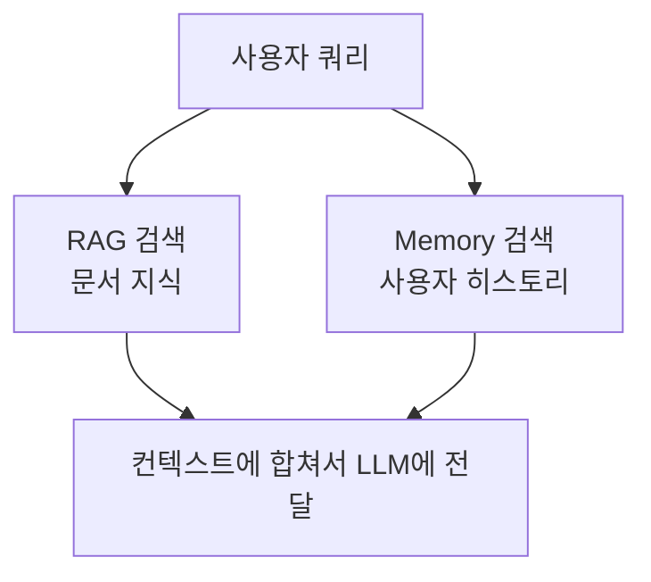

# LLM Memory (LLM 메모리)

## 개요

LLM Memory는 AI 시스템이 **이전 상호작용의 정보를 저장·유지·검색하여 미래 응답에 활용**하는 모든 메커니즘을 말한다. 기본 LLM은 스테이트리스(stateless)—각 대화가 독립적으로 시작—하지만, Memory 시스템은 이를 스테이트풀(stateful) 에이전트로 변환한다.

```
스테이트리스 LLM:
  세션 1: "내 이름은 김철수야" → 기억 없음
  세션 2: "내 이름이 뭐야?" → "알 수 없습니다" ❌

스테이트풀 에이전트 (Memory 있음):
  세션 1: "내 이름은 김철수야" → 메모리에 저장
  세션 2: "내 이름이 뭐야?" → "김철수님이시죠!" ✅
```

---

## Memory 유형 분류 (4가지)

Lilian Weng (2023) [1]이 정리한 LLM 메모리 4유형이 표준 분류로 자리잡았다.

### 1. In-Context Memory (컨텍스트 내 메모리)
현재 컨텍스트 윈도우 안에 있는 모든 정보. 토큰 단위로 저장되며, 컨텍스트 창이 가득 차면 소실된다.



- **장점**: 즉각 접근, 별도 검색 불필요
- **단점**: 용량 한계, 세션 종료 시 소실
- **해결책**: Summarization + External Memory로 이관

### 2. External Memory (외부 메모리)
벡터 DB, Key-Value 스토어, 관계형 DB 등 모델 외부의 영구 저장소.

```python
# 저장: 대화에서 중요 정보 추출 → 외부 DB 저장
memory_store.add("사용자 김철수는 Python을 선호함", user_id="user_123")

# 검색: 관련 메모리를 컨텍스트로 주입
memories = memory_store.search("언어 선호도", user_id="user_123")
# → 컨텍스트 창에 추가하여 LLM에 전달
```

- **특징**: 세션 간 지속, 검색 기반 접근
- **기술**: Vector DB (의미 검색), Knowledge Graph (관계 탐색), KV Store (빠른 조회)

### 3. In-Weights Memory (가중치 내 메모리)
사전학습(pre-training)과 파인튜닝(fine-tuning)을 통해 모델 가중치에 내재화된 지식. [2]

```
Pre-training → "파리는 프랑스의 수도다" 등 세상 지식이 가중치에 인코딩
Fine-tuning  → 도메인 특화 지식 추가 내재화
```

- **장점**: 추가 저장소 불필요, 빠른 접근
- **단점**: 업데이트 불가(추론 시), 특정 날짜 이후 정보 없음
- **해결책**: RAG 또는 Fine-tuning으로 보완

### 4. In-Cache Memory (캐시 메모리)
Transformer Attention의 KV(Key-Value) Cache. 동일 컨텍스트를 재계산하지 않도록 저장.

```
KV Cache:
  [시스템 프롬프트 처리] → Key-Value 벡터 캐시 저장
  [다음 요청] → 캐시된 KV 재사용 → 연산 절약
```

- **주목적**: 연산 효율화 (토큰 재계산 방지)
- **활용**: Anthropic의 Prompt Caching, OpenAI의 Cached Tokens 기능 등 [3]
- **메모리로서의 한계**: 같은 세션 내, 같은 prefix에서만 유효

---

## Memory의 범위(Scope)

| 범위 | 지속성 | 적용 대상 |
|------|--------|---------|
| **Session (단기)** | 현재 대화 내 | 대화 맥락 유지 |
| **User (사용자)** | 세션 간 영구 | 개인화, 선호도 |
| **Agent** | 에이전트 인스턴스별 | 특정 에이전트의 지식 |
| **Organization** | 조직 전체 공유 | 기업 지식베이스 |

---

## Conversation Memory 전략

### 1. Buffer Memory (전체 히스토리)
모든 대화 기록을 그대로 저장. 가장 단순하지만 토큰 소비가 커진다.

```python
from langchain.memory import ConversationBufferMemory

memory = ConversationBufferMemory(return_messages=True)
# 장점: 구현 간단, 완전한 문맥
# 단점: 긴 대화에서 컨텍스트 창 초과
```

### 2. Window Buffer Memory (슬라이딩 윈도우)
최근 K 턴만 유지. 오래된 대화는 자동으로 제거된다. [4]

```python
from langchain.memory import ConversationBufferWindowMemory

memory = ConversationBufferWindowMemory(k=5, return_messages=True)
# 최근 5 턴만 유지 → 일정한 토큰 사용량 보장
```

### 3. Summary Memory (요약 메모리)
오래된 대화를 LLM이 요약하여 보관. 정보 밀도가 높다.

```python
from langchain.memory import ConversationSummaryMemory

memory = ConversationSummaryMemory(llm=llm, return_messages=True)
# LLM이 대화 내용을 자동 요약 → 적은 토큰으로 많은 정보 보존
```

### 4. Summary Buffer Memory (하이브리드)
최근 대화는 그대로 + 오래된 대화는 요약. 실무에서 가장 많이 쓰인다.

```python
from langchain.memory import ConversationSummaryBufferMemory

memory = ConversationSummaryBufferMemory(
    llm=llm,
    max_token_limit=2000,  # 2000 토큰 초과 시 자동 요약
    return_messages=True
)
# 최근 2000 토큰: 원본 유지
# 이전 내용: LLM 요약 → 압축
```

### 5. Entity Memory (엔티티 메모리)
특정 엔티티(사람, 장소, 개념 등)에 대한 정보를 구조화하여 별도 추적.

```python
from langchain.memory import ConversationEntityMemory

memory = ConversationEntityMemory(llm=llm)
# 예: "김철수"라는 엔티티 → {이름: 김철수, 직업: 개발자, 선호언어: Python}
# 같은 엔티티가 등장할 때 자동으로 관련 정보 주입
```

### 6. Vector Store Memory (벡터 검색 메모리)
모든 대화를 벡터 DB에 저장. 현재 쿼리와 관련 있는 과거 대화를 의미 검색으로 찾는다.

```python
from langchain.memory import VectorStoreRetrieverMemory
from langchain_community.vectorstores import Chroma

vectorstore = Chroma(embedding_function=embeddings)
retriever = vectorstore.as_retriever(search_kwargs={"k": 3})

memory = VectorStoreRetrieverMemory(retriever=retriever)
# 현재 쿼리와 가장 유사한 과거 3개 대화를 자동 주입
```

---

## 실제 구현 프레임워크

### Letta (구 MemGPT) — OS 패러다임

MemGPT(2023) [5]에서 출발. LLM을 운영체제처럼 자신의 메모리를 직접 관리하게 한다.



- 에이전트가 스스로 `core_memory_append()`, `archival_memory_search()` 등 함수 호출
- Sleep-time agents: 유휴 시간에 메모리 비동기 정리·요약
- 단일 영구 스레드(perpetual thread)로 무한 대화 지원

### Mem0 — Universal Memory Layer

2025년 ECAI 발표 논문 [6]. LLM과 앱 사이에 끼워 넣는 메모리 미들웨어.

```python
from mem0 import MemoryClient

client = MemoryClient(api_key="...")

# 저장: LLM이 대화에서 사실 추출 → ADD/UPDATE/DELETE
client.add("파이썬을 선호함, JavaScript는 싫어함", user_id="user_123")

# 검색: 멀티 시그널 (의미 유사도 + BM25 + 엔티티 매칭)
results = client.search("언어 선호도", user_id="user_123")
# → 컨텍스트에 주입
```

**주요 특징:**
- Multi-scope 메모리: `user_id`, `agent_id`, `run_id`, `org_id` 조합
- Multi-signal retrieval: 벡터 유사도 + BM25 키워드 + 엔티티 매칭 퓨전
- LoCoMo 벤치마크 92.5점 달성 (2026 기준) [7]
- AWS Agent SDK의 공식 메모리 레이어로 채택

### Zep — Temporal Knowledge Graph

2025년 1월 논문 [8]. 대화 흐름을 시간 축이 있는 지식 그래프(Graphiti)로 관리.

```
대화 → Graphiti 처리 →
  노드: 엔티티 (사람, 장소, 개념)
  엣지: 관계 + 시간 정보 (valid_from, valid_to)
    예: 김철수 -[근무함: 2022~2024]→ 회사A
        김철수 -[근무함: 2025~현재]→ 회사B
```

- Bitemporal modeling: 사실의 생성 시간 + 유효 시간 분리 추적
- MemGPT 대비 Deep Memory Retrieval 벤치마크에서 우위
- 정확도 +18.5%, 응답 지연 -90% (기준 대비)

---

## Memory 유형 비교 (기억 과학 관점)

인지 신경과학의 기억 분류를 LLM에 적용: [9]

| 인간 기억 | LLM 대응 | 예시 |
|---------|---------|------|
| **Episodic** (에피소딕) | 대화 히스토리, Recall Memory | "저번에 이 버그 어떻게 고쳤더라" |
| **Semantic** (의미) | 지식 베이스, In-weights | "Python의 list.sort()는 in-place" |
| **Procedural** (절차) | 워크플로우, 패턴 | "이 팀은 PR 전에 항상 테스트 실행" |
| **Working** (작업) | In-Context (현재 창) | 현재 대화 맥락 |

---

## Memory vs RAG 비교

공통점: 둘 다 외부 정보를 컨텍스트에 주입한다. 하지만 목적과 동작이 다르다. [10]

| 항목 | RAG | Memory |
|------|-----|--------|
| **질문** | "이 문서는 뭐라고 하나?" | "이 사용자는 무엇이 필요한가?" |
| **대상** | 정적 문서·지식 | 동적 사용자 상태·선호도 |
| **업데이트** | Read-only (문서 변경 시 재인덱싱) | Read-write (실시간 업데이트) |
| **개인화** | 모든 사용자 동일 | 사용자별 맞춤 |
| **용도** | 사실 확인, 할루시네이션 방지 | 개인화, 세션 연속성 |

**실무 결론**: 대부분의 프로덕션 에이전트는 **RAG (지식) + Memory (개인화)를 함께** 사용한다.



---

## Memory 시스템 설계 원칙

### Write: 무엇을 언제 저장할까?
```python
# 좋은 예: 사실, 선호도, 완료된 작업
memory.add("사용자가 다크 모드를 선호함")
memory.add("2024-03 프로젝트A 배포 완료")

# 나쁜 예: 일시적 정보, 중복
memory.add("사용자가 지금 이 메시지를 보내는 중")  # 불필요
```

### Select: 어떤 기억을 언제 꺼낼까?
- 현재 쿼리와 의미적으로 가장 관련 있는 것
- 최신 정보 우선 (구 정보가 최신과 충돌 시)
- 멀티 시그널 검색으로 정밀도 향상

### Compress: 오래된 기억을 어떻게 유지할까?
```
최신 N 턴: 원본 보존
그 이전:   LLM 요약으로 압축
아주 오래된 것: 아카이브 또는 삭제 (decay)
```

### Forget: 어떤 기억을 지울까?
- 모순되는 신규 정보가 들어오면 구 정보 삭제/업데이트
- 민감 정보 보존 기간 만료 시 삭제
- Staleness: 고신뢰도 메모리도 시간이 지나면 낡아진다 (미해결 문제)

---

## 현재 미해결 과제 (2026) [7]

- **Temporal abstraction**: 시간에 따른 사실 변화 추론 (예: 직장 변경)
- **Cross-session identity**: 동일 사용자의 다중 기기·익명 세션 연결
- **Memory staleness**: 자주 접근된 기억이 낡아져 틀린 답변을 자신있게 생성하는 문제
- **Procedural memory tooling**: 절차적 기억 관리 도구 아직 초기 단계

---

## AI Engineering에서의 역할

LLM Memory는 에이전트를 **"일회용 도구"에서 "지속 학습하는 어시스턴트"로** 전환시키는 핵심 인프라다. 단순한 챗봇을 넘어 사용자와 장기 관계를 형성하고, 조직의 노하우를 축적하며, 반복 실수를 방지하는 개인화 AI 경험의 토대가 된다.

## 관련 개념
[[Semantic_Cache]] · [[Context_Engineering/Context_Engineering]] · [[Agent_Engineering/Agent_Memory]] · [[Retrieval_Strategies/RAG/RAG]]

## 참고 문헌
1. Weng, L. (2023) "LLM Powered Autonomous Agents" — [lilianweng.github.io](https://lilianweng.github.io/posts/2023-06-23-agent/)
2. "LLM Weights Context and Memory Explained Simply" — [Medium](https://medium.com/@tahirbalarabe2/llm-weights-context-and-memory-explained-simply-03685b6789c0)
3. Anthropic "Prompt Caching" — [docs.anthropic.com](https://docs.anthropic.com/en/docs/build-with-claude/prompt-caching)
4. Pinecone "Conversational Memory for LLMs with Langchain" — [pinecone.io](https://www.pinecone.io/learn/series/langchain/langchain-conversational-memory/)
5. Packer et al. (2023) "MemGPT: Towards LLMs as Operating Systems" — [arXiv:2310.08560](https://arxiv.org/abs/2310.08560)
6. Chhikara et al. (2025) "Mem0: Building Production-Ready AI Agents with Scalable Long-Term Memory" — [arXiv:2504.19413](https://arxiv.org/abs/2504.19413)
7. Mem0 Team (2026) "State of AI Agent Memory 2026" — [mem0.ai](https://mem0.ai/blog/state-of-ai-agent-memory-2026)
8. Rasmussen et al. (2025) "Zep: A Temporal Knowledge Graph Architecture for Agent Memory" — [arXiv:2501.13956](https://arxiv.org/abs/2501.13956)
9. "AI Meets Brain: Memory Systems from Cognitive Neuroscience to Autonomous Agents" — [arXiv:2512.23343](https://arxiv.org/abs/2512.23343)
10. Mem0 Blog "RAG vs. AI Memory: What Agent Developers Need to Know" — [mem0.ai](https://mem0.ai/blog/rag-vs-ai-memory)
11. Letta "Agent Memory: How to Build Agents That Learn and Remember" — [letta.com](https://www.letta.com/blog/agent-memory/)
