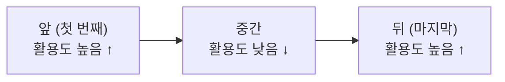
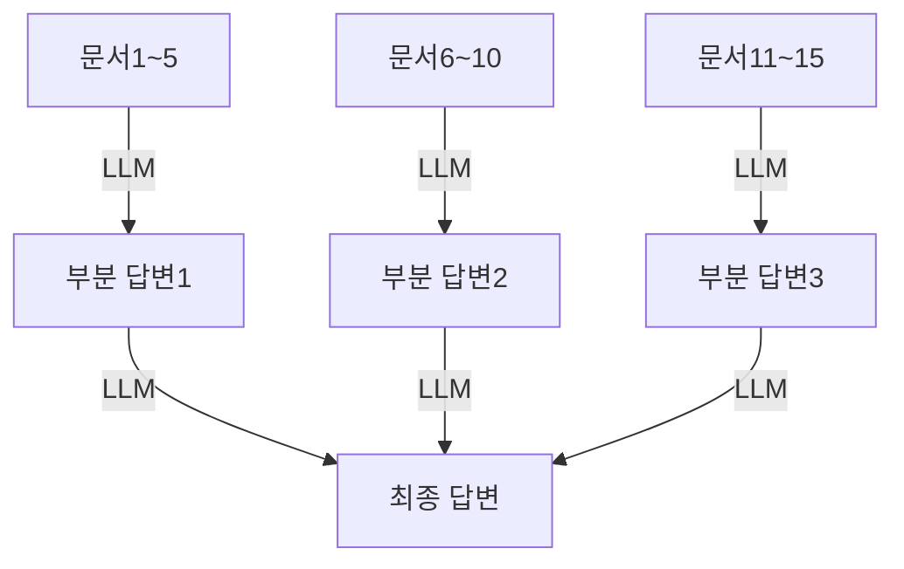

# Lost in the Middle

## 개요

**Lost in the Middle**은 LLM이 긴 컨텍스트를 처리할 때 **중간 부분의 정보를 앞/뒤 정보보다 현저히 덜 활용**하는 현상이다. Liu et al. (2023)이 처음 정량화하였으며, RAG 파이프라인과 장문 처리 시스템 설계에서 반드시 고려해야 하는 특성이다 [1].



## 연구 배경: Liu et al. (2023)

원 논문 "Lost in the Middle: How Language Models Use Long Contexts" (arXiv:2307.03172) [1]은 두 가지 작업으로 현상을 측정했다:

1. **Multi-Document QA**: 여러 문서 중 정답 문서의 위치를 바꾸면서 성능 측정
2. **Key-Value Retrieval**: 키-값 쌍 목록에서 특정 키를 찾는 작업

### 핵심 발견

| 발견 | 내용 |
|------|------|
| **U자형 성능 곡선** | 정답이 컨텍스트 앞/뒤에 있을 때 성능이 가장 높고, 중간에 있을 때 최저 |
| **컨텍스트 길이 비례** | 컨텍스트가 길수록 중간 활용도 저하가 심화됨 |
| **Long-context 모델도 동일** | 긴 컨텍스트를 지원하도록 훈련된 모델도 동일한 패턴을 보임 |
| **성능 격차** | 최적 위치(앞/뒤) vs 최악 위치(중간) 간 최대 20%p 이상 성능 차이 |

```python
# 실험 예시: 정답 문서 위치별 Exact Match 점수 (20개 문서 기준, Claude-2)
positions = [0, 4, 9, 14, 19]   # 앞 → 뒤 인덱스
em_scores  = [59, 41, 35, 38, 60]  # U자형 패턴 확인
```

## 발생 원인

### 1. 어텐션 편향 (Positional Attention Bias)

Transformer의 어텐션 메커니즘은 학습 데이터의 패턴을 반영한다. 대부분의 텍스트는 **결론이나 핵심 정보가 앞/뒤에 집중**되어 있어, 모델이 이를 내재화한 것으로 추정된다.

### 2. Primary Primacy / Recency 효과

- **Primacy Effect**: 첫 번째로 보인 정보에 높은 가중치 부여
- **Recency Effect**: 가장 최근(마지막)에 본 정보를 더 잘 기억

이 두 효과가 결합되어 중간 부분이 상대적으로 희석된다.

### 3. 컨텍스트 길이에 따른 정보 희석

토큰 수가 많아질수록 특정 위치의 어텐션 값이 분산되어, 중간의 개별 토큰이 받는 어텐션이 감소한다.

## 회피 전략

### 전략 1: 중요 정보를 컨텍스트 앞/뒤에 배치

가장 직접적인 대응. 답변에 핵심적인 문서나 정보는 컨텍스트의 앞부분 또는 끝부분에 배치한다.

```
# 권장 구조 (20개 문서 중 정답 문서가 1번인 경우)
[정답 문서]  ← 앞에 배치 (활용도 ↑)
[관련 문서2]
[관련 문서3]
...
[관련 문서20]

# 또는
[관련 문서1]
...
[관련 문서19]
[정답 문서]  ← 뒤에 배치 (활용도 ↑)
```

**RAG 파이프라인 적용**:

```python
def reorder_for_primacy_recency(docs: list, scores: list) -> list:
    """가장 관련성 높은 문서를 앞/뒤에, 낮은 문서를 중간에 배치"""
    ranked = sorted(zip(docs, scores), key=lambda x: x[1], reverse=True)
    top_docs = [d for d, _ in ranked[:3]]    # 상위 3개
    low_docs = [d for d, _ in ranked[3:]]    # 나머지
    # 상위 절반을 앞에, 나머지를 중간에, 나머지 상위를 뒤에
    mid = len(top_docs) // 2
    return top_docs[:mid] + low_docs + top_docs[mid:]
```

### 전략 2: Query-Aware Contextualization (쿼리 앞뒤 배치)

Liu et al. (2024)이 제안한 방식 [2]. 쿼리(질문)를 컨텍스트 **앞과 뒤 모두**에 배치하여 모델이 어느 위치에서든 목표를 인식하게 한다.

```
# 일반 방식
{context}
질문: {question}

# Query-Aware Contextualization
질문: {question}
---
{context}
---
위 내용을 바탕으로 다음 질문에 답하시오: {question}
```

### 전략 3: 구조화된 마크업으로 중요 정보 강조

XML 태그, 헤더, 구분자 등으로 중요 정보 구역을 명시적으로 표시한다. 모델이 구조적 신호를 어텐션 단서로 활용하기 때문이다.

```xml
<!-- 중요 정보를 마크업으로 강조 -->
<important>
이 섹션의 정보를 최우선으로 참고하시오.
[핵심 문서 내용]
</important>

<supporting_context>
[보조 문서들...]
</supporting_context>

<key_reminder>
앞의 <important> 섹션을 반드시 활용하여 답변하시오.
</key_reminder>
```

### 전략 4: 컨텍스트 크기 최소화 (Context Compression)

불필요한 문서 자체를 제거하면 중간 문제를 원천적으로 줄일 수 있다. [[Context_Compression]] 문서 참조.

```
원칙: "필요한 문서만 컨텍스트에 넣는다"

- Reranker로 관련성 낮은 문서 제거
- LLM Lingua로 각 문서 내 불필요한 토큰 제거
- 청크 크기 최소화
```

### 전략 5: 멀티-쿼리 및 분할 처리 (MapReduce)

전체 컨텍스트를 한 번에 처리하는 대신, 청크별로 분리하여 처리 후 결합한다. 각 청크에서는 정보가 앞/뒤에 위치하므로 Lost in the Middle 문제가 발생하지 않는다.



### 전략 6: Reranking으로 문서 순서 최적화

[[RAG/Advanced_Retrieval|Advanced Retrieval]]의 Reranking 단계에서 relevance score를 기준으로 문서를 재정렬할 때, 단순히 내림차순으로 정렬하는 것이 아니라 전략 1의 앞/뒤 배치 원칙을 적용한다.

## 현재 상황: 최신 모델에서의 개선

최신 장문 컨텍스트 모델들은 Lost in the Middle 현상이 일부 개선되었으나 **완전히 해소되지는 않았다** [3][4].

```
모델별 개선 추이 (Multi-Doc QA 기준, 중간 위치 성능):
  GPT-3.5-Turbo (2023):  ~35% Exact Match
  Claude-2 (2023):        ~38% Exact Match
  GPT-4 (2024):           ~50% Exact Match (개선)
  최신 모델 (2025~):       더 개선되었으나 여전히 앞/뒤가 유리
```

즉, 모델이 발전해도 **앞/뒤 배치 원칙은 여전히 유효한 설계 지침**이다.

## AI Engineering에서의 역할

Lost in the Middle은 RAG 파이프라인 설계에서 간과하기 쉬운 함정이다. 좋은 Retriever와 Reranker를 구축해도, 최종적으로 LLM에 전달하는 **문서 순서 설계를 소홀히 하면 성능이 저하**된다. 특히 컨텍스트 창이 수십만 토큰으로 커지는 환경일수록 이 문제가 두드러지므로, 컨텍스트 순서를 명시적으로 최적화하는 로직을 파이프라인에 포함시켜야 한다.

## 관련 개념
[[Context_Engineering]] · [[Context_Compression]] · [[RAG/Advanced_Retrieval]] · [[RAG/Chunking_Strategies]]

## 출처
- [1] Liu et al. (2023) "Lost in the Middle: How Language Models Use Long Contexts" — [arXiv:2307.03172](https://arxiv.org/abs/2307.03172)
- [2] Towards AI: "Lost in the Middle: How Context Engineering Solves AI's Long-Context Problem" — [pub.towardsai.net](https://pub.towardsai.net/why-language-models-are-lost-in-the-middle-629b20d86152)
- [3] arXiv (2025): "Lost in the Middle: An Emergent Property from Information Retrieval Demands in LLMs" — [arxiv.org/html/2510.10276v1](https://arxiv.org/html/2510.10276v1)
- [4] arXiv (2025): "What Works for 'Lost-in-the-Middle' in LLMs? A Study on GM-Extract and Mitigations" — [arxiv.org/html/2511.13900v1](https://arxiv.org/html/2511.13900v1)
- [5] GitHub: "lost-in-the-middle (Nelson Liu)" — [github.com/nelson-liu/lost-in-the-middle](https://github.com/nelson-liu/lost-in-the-middle)
