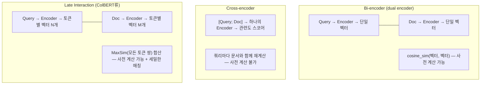

# Embedding & Reranker Models (임베딩·리랭커 모델)

## 개요

RAG·GraphRAG·시맨틱 검색 전체가 딛고 선 기반은 **임베딩 모델**이다. 청킹·벡터 저장·리랭킹 같은 검색 파이프라인 설계는 대개 임베딩이 "이미 잘 만들어져 있다"는 전제 위에서 논의된다. 이 문서는 그 전제 자체 — **임베딩 모델을 어떻게 고르고, 왜 특정 아키텍처를 선택하며, 리랭커와 어떻게 나눠 쓰는가** — 를 다룬다.

```
임베딩(Embedding) = 이질적 데이터(텍스트·이미지·오디오)를 공유 벡터 공간으로 매핑하는 손실 압축(lossy compression)
  의미적 유사성 = 기하학적 거리 (위도/경도가 위치의 2D 임베딩인 것과 같은 원리)
  다른 모델이 만든 임베딩은 서로 호환되지 않는다 → 파이프라인 전체가 하나의 버전을 고정해야 함
```

## 3가지 아키텍처: Bi-encoder vs Cross-encoder vs Late Interaction



| | Bi-encoder | Cross-encoder | Late Interaction (ColBERT) |
|---|---|---|---|
| **연산 시점** | 쿼리·문서 독립 인코딩 (사전 계산) | 쿼리+문서 동시 입력 (실시간) | 쿼리·문서 독립 인코딩, 토큰별 벡터 보존 |
| **속도** | 매우 빠름 (ANN 인덱스 가능) | 느림 (후보 수만큼 forward pass) | 중간 (bi-encoder보다 저장·연산 큼) |
| **정확도** | 중간 (문장 전체를 한 벡터로 뭉갬) | 높음 (토큰 단위 상호작용) | 높음 (토큰 단위 상호작용 + 사전 계산 가능) |
| **용도** | 1차 검색 (대규모 후보군에서 Top-K) | 리랭킹 (소수 후보만 재정렬) | 1차 검색 + 세밀한 매칭 동시 |
| **대표 모델** | Sentence-BERT, E5, Gemini/OpenAI 임베딩 | Cohere Rerank, bge-reranker, Qwen3-Reranker, Vertex 기반 두 개탑(Two-tower) 인코더의 발전형 | ColBERT (Khattab & Zaharia, 2020), XTR (Lee, 2023), ColPali (Faysse, 2024) |

**실무 패턴**: 대량 후보군에서는 Bi-encoder로 1차 검색(Top-100~500) → Cross-encoder 또는 Late Interaction으로 재정렬(Top-5~20). 리랭킹 단계의 파이프라인 배치는 [[AI/Engineering/Context_Engineering/Retrieval_Strategies/RAG/Advanced_Retrieval|Advanced_Retrieval]] 참고.

## Matryoshka Representation Learning — 차원을 고르는 문제

**Matryoshka Embedding**(Kusupati et al., 2022)은 하나의 임베딩 벡터 안에 여러 해상도의 표현을 중첩시켜 학습한다. 러시아 마트료시카 인형처럼, 벡터의 앞쪽 N차원만 잘라내도 그 자체로 유효한 임베딩으로 쓸 수 있다.

```
전체 벡터: [d1, d2, d3, ..., d3072]  (예: 3072차원 모델)
  앞 1024차원만 사용 → 저장 공간 1/3, 품질 하락 ~2%
  앞 256차원만 사용  → 저장 공간 1/12, 품질 하락은 더 크지만 여전히 유효

→ 서비스 단계별로 다른 절단 지점을 쓸 수 있음:
  1차 대량 필터링 = 256차원 (빠르고 저렴)
  최종 재정렬     = 전체 차원 (정확)
```

3072→1024차원 절단 시 벡터 DB 저장 비용이 약 1/3로 줄고 검색 품질 하락은 약 2% 수준에 그친다는 것이 실무에서 반복 관찰되는 트레이드오프다. 2025년 Matryoshka Quantization으로 양자화(Quantization)와 결합되어 저장 비용을 더 줄이는 방향으로 발전했다.

## 벤치마크: MTEB / BEIR와 그 한계

- **BEIR**(Benchmarking IR, zero-shot retrieval): 도메인 전이 성능을 측정하는 표준
- **MTEB**(Massive Text Embedding Benchmark): 검색뿐 아니라 분류·클러스터링·유사도 등 여러 태스크를 종합한 리더보드. 원조 BERT의 BEIR 점수 ~10.6에서 2025년 기준 상위 모델 평균 55.7까지 상승
- **평가 지표**: Precision@k(검색된 것 중 관련 비율), Recall@k(전체 관련 중 검색된 비율), nDCG(순서까지 반영한 정규화 점수)

**한계**: MTEB/BEIR는 공개 벤치마크 데이터셋 기준이라 실제 도메인(사내 법률 문서, 의료 기록 등)과 분포가 다를 수 있다. 리더보드 1위 모델이 특정 도메인에서는 하위권 모델보다 못한 경우가 흔하다 — **벤치마크는 후보 압축용이지 최종 선택 기준이 아니다.** 반드시 자체 골든셋으로 재검증한다(골든셋 구축 방법론은 [[AI/Engineering/Agent_Engineering/Eval_Driven_Development_and_Agent_Workbench|Eval_Driven_Development_and_Agent_Workbench]] 참고).

## 도메인 파인튜닝

범용 임베딩 모델은 전문 용어·사내 은어·법률/의료 도메인에서 성능이 떨어진다. 대응 방법:

```python
# Contrastive fine-tuning 개념 흐름
# <anchor(쿼리), positive(정답 문서), [negatives(오답 문서들)]> 삼중항으로 학습
# 목표: positive는 anchor와 가깝게, negative는 멀게

# Hard negative mining: 무작위 오답이 아니라
# "표면적으로는 비슷하지만 의미상 틀린" 문서를 찾아 negative로 사용
# → 결정 경계(decision boundary)가 훨씬 정교해짐
```

- **데이터 소스**: 사람이 라벨링한 쿼리-문서 쌍, 합성 데이터(LLM으로 쿼리 생성 — Gecko 논문의 LLM 합성 Q-D 쌍 접근), 기존 검색 로그에서 추출
- **한국어 임베딩 고려사항**: 다국어 모델(BGE-M3, multilingual-e5)은 한국어 토큰 효율이 영어 대비 낮고 형태소 경계가 모호해 청킹·임베딩 품질에 영향을 준다. 한국어 특화 모델(KoSimCSE, KURE 등) 또는 한국어 코퍼스로 재파인튜닝한 다국어 모델이 실무에서 더 안정적인 경우가 많다.

## 리랭커 모델

| 모델 | 방식 | 특징 |
|------|------|------|
| **Cohere Rerank** | Cross-encoder (API) | 다국어 지원, 별도 인프라 불필요 |
| **bge-reranker** | Cross-encoder (오픈소스) | 자체 호스팅, 다양한 크기(base/large) |
| **Qwen3-Reranker** | Cross-encoder (오픈소스) | 최신 세대, 다국어·긴 컨텍스트 지원 |
| **ColBERT/ColPali 계열** | Late Interaction | 1차 검색과 리랭킹을 동일 모델로 처리 가능 |

리랭커를 파이프라인 어디에 배치하는지, RRF(Reciprocal Rank Fusion) 등과 어떻게 결합하는지는 [[AI/Engineering/Context_Engineering/Retrieval_Strategies/RAG/Advanced_Retrieval|Advanced_Retrieval]]에서 다룬다 — 본 문서는 **리랭커 모델 자체의 선택 기준**에 집중한다.

## 경계 정리

| 문서 | 다루는 것 |
|------|-----------|
| **본 문서 (Embedding_Models)** | 임베딩·리랭커 **모델 자체**의 아키텍처 분류, 벤치마크 해석, 차원 선택, 파인튜닝 |
| [[AI/Engineering/Context_Engineering/Retrieval_Strategies/RAG/Vector_Storage\|Vector_Storage]] | 임베딩을 **저장**하는 인프라 — ANN 인덱스(HNSW/FAISS/ScaNN), 벡터 DB 제품 선택 |
| [[AI/Engineering/Context_Engineering/Retrieval_Strategies/RAG/Advanced_Retrieval\|Advanced_Retrieval]] | 리랭킹·쿼리 변환을 검색 **파이프라인**에 배치하는 방법 |

## AI Engineering에서의 역할

RAG·GraphRAG·시맨틱 캐시·Agentic RAG는 결국 "좋은 임베딩이 이미 있다"는 전제 위에 서 있다. 그 전제를 검증하지 않고 검색 파이프라인만 정교화하면, 리랭킹·청킹·쿼리 변환을 아무리 개선해도 상한선은 임베딩 모델의 표현력에 갇힌다. 임베딩 모델 선택은 RAG 프로젝트에서 가장 먼저 결정하고, 가장 늦게 재검토하는 실수가 잦은 결정이다.

## 관련 개념
[[AI/Engineering/Context_Engineering/Retrieval_Strategies/RAG/Vector_Storage|Vector_Storage]] · [[AI/Engineering/Context_Engineering/Retrieval_Strategies/RAG/Advanced_Retrieval|Advanced_Retrieval]] · [[AI/Engineering/Context_Engineering/Retrieval_Strategies/RAG/Multimodal_RAG|Multimodal_RAG]] · [[AI/Engineering/Model_Engineering/Quantization|Model_Engineering/Quantization]]

## 출처
- [[AI/sources/whitepaper_emebddings_vectorstores_v2|Embeddings & Vector Stores]] (Google, Nawalgaria/Ren/Sugnet, 2025년 2월 — 이 위키의 기존 소스)
- Kusupati et al. (2022) "Matryoshka Representation Learning" — [arXiv:2205.13147](https://arxiv.org/abs/2205.13147)
- Khattab & Zaharia (2020) "ColBERT: Efficient and Effective Passage Search via Contextualized Late Interaction over BERT" — [arXiv:2004.12832](https://arxiv.org/abs/2004.12832)
- Faysse et al. (2024) "ColPali: Efficient Document Retrieval with Vision Language Models" — [arXiv:2407.01449](https://arxiv.org/abs/2407.01449)
- Lee et al. (2024) "Gecko: Versatile Text Embeddings Distilled from Large Language Models" — [arXiv:2403.20327](https://arxiv.org/abs/2403.20327)
- MTEB Leaderboard — [huggingface.co/spaces/mteb/leaderboard](https://huggingface.co/spaces/mteb/leaderboard)
