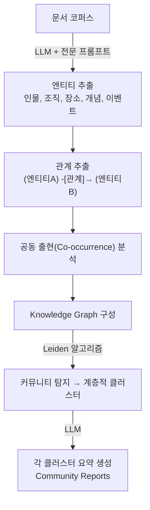

# Graph RAG

## 개요

**Graph RAG**는 Knowledge Graph의 구조적 관계 정보를 RAG 검색에 활용하여, 기존 벡터 기반 RAG가 다루기 어려운 **복잡한 다중 홉 추론(multi-hop reasoning)**과 **글로벌 주제 요약**을 가능하게 하는 기법이다.

## 제창

- **개발**: Microsoft Research
- **공개**: 2024년 2월 블로그 발표, 7월 GitHub 오픈소스 공개 (20,000+ stars)
- **논문**: "From Local to Global: A Graph RAG Approach to Query-Focused Summarization" — [arXiv:2404.16130](https://arxiv.org/abs/2404.16130)
- **구현**: [github.com/microsoft/graphrag](https://github.com/microsoft/graphrag)

## 기존 RAG의 한계

```
기존 벡터 RAG:
  질문: "이 데이터셋에서 가장 중요한 주제는 무엇인가?"
  → 벡터 검색은 "연결고리 추적" 불가
  → 여러 문서에 걸친 패턴 파악 어려움
  → 전역적(global) 이해 부재

Graph RAG로 해결:
  → 지식 그래프가 전체 데이터셋 구조 파악
  → 의미론적 클러스터로 글로벌 주제 파악 가능
  → 엔티티 간 경로를 따라 multi-hop 추론
```

## 작동 방식

### Phase 1: 지식 그래프 구축



### Phase 2: 쿼리 처리 (두 가지 모드)

#### Local Search (지역 검색)
특정 엔티티에 대한 구체적 질문:
```
질문: "Apple의 CEO는 누구이며 그의 경력은?"

1. 엔티티 매핑: "Apple" → 그래프 노드
2. 1~2홉 이웃 탐색: CEO, 이사회, 관련 인물
3. 관련 Community Reports 검색
4. 결합하여 LLM 최종 답변 생성
```

#### Global Search (전역 검색)
데이터셋 전체에 걸친 요약·분석 질문:
```
질문: "이 보고서에서 다루는 주요 테마는?"

1. 모든 Community Reports 사용
2. Map 단계: 각 커뮤니티 리포트에서 답변 생성
3. Reduce 단계: 모든 답변을 종합하여 글로벌 답변
(MapReduce 패턴)
```

## 구현 예시 (Microsoft GraphRAG)

```python
# 설치
# pip install graphrag

# 인덱싱 (그래프 구축)
# graphrag index --root ./myproject

# 쿼리
from graphrag.query.api import global_search, local_search

# Local 검색
result = local_search(
    root_dir="./myproject",
    query="Tesla의 주요 제품은?",
    community_level=2
)

# Global 검색
result = global_search(
    root_dir="./myproject",
    query="이 데이터셋의 주요 테마는?",
    response_type="Multiple Paragraphs"
)
```

## 성능 특성

Microsoft의 평가(Podcast transcript, News article):
- **Comprehensiveness**: GraphRAG +16.3% (vs Vector RAG)
- **Diversity**: GraphRAG +62.9%
- **Empowerment**: GraphRAG +35.5%
- **Directness**: Vector RAG +25% (GraphRAG는 더 포괄적)

**비용**: 인덱싱 시 LLM API 대량 사용 → 고비용. GPT-4 사용 시 중형 코퍼스도 수십~수백 달러.

## Neo4j GraphRAG

Neo4j도 LPG 기반 GraphRAG 구현 제공:
```python
from neo4j_graphrag.retrievers import VectorCypherRetriever

retriever = VectorCypherRetriever(
    driver=neo4j_driver,
    index_name="document_embeddings",
    retrieval_query="""
    MATCH (node)-[:MENTIONS]->(entity)
    OPTIONAL MATCH (entity)-[r]-(related)
    RETURN node.text, entity.name, type(r), related.name
    """,
    embedder=OpenAIEmbeddings()
)
```

## Graph RAG vs Vector RAG

| 기준 | Vector RAG | Graph RAG |
|------|-----------|-----------|
| **검색 방식** | 의미 유사도 | 그래프 탐색 + 유사도 |
| **Multi-hop** | 어려움 | 자연스러움 |
| **글로벌 요약** | 불가 | 가능 |
| **구축 비용** | 낮음 | 높음 (LLM 엔티티 추출) |
| **쿼리 속도** | 빠름 | 느림 |
| **적합 케이스** | 구체적 사실 검색 | 복잡한 분석, 주제 파악 |

## AI Engineering에서의 역할

Graph RAG는 기업 내 대규모 비정형 데이터에서 **인사이트를 추출**하는 데 강력하다. "이 분기 보고서들의 주요 위험 요소는?" 같은 분석적 질문에 벡터 RAG는 한계가 있지만 Graph RAG는 효과적으로 답할 수 있다. 다만 높은 구축 비용 때문에 고가치 유스케이스에 선택적으로 적용해야 한다.

## Knowledge Graph 하위 문서

GraphRAG는 Knowledge Graph 개념을 기반으로 한다. 관련 하위 문서:

| 문서 | 내용 |
|------|------|
| [[Knowledge_Graph/Knowledge_Graph]] | 지식 그래프 개요 — 트리플, 엔티티-관계 모델 |
| [[Knowledge_Graph/LPG_and_RDF]] | Labeled Property Graph (Neo4j) vs RDF (SPARQL) |
| [[Knowledge_Graph/Ontology]] | OWL 온톨로지, 도메인 온톨로지, 추론 엔진 |

Graph RAG의 Phase 1(지식 그래프 구축)은 위 Knowledge Graph 개념을 LLM으로 자동화한 것이다. 수동으로 Knowledge Graph를 구축하는 전통적 방식과 달리, LLM이 문서에서 엔티티와 관계를 자동 추출한다.

## 관련 개념
[[Knowledge_Graph/LPG_and_RDF]] · [[Knowledge_Graph/Ontology]] · [[RAG/Advanced_Retrieval]] · [[RAG/Vector_Storage]] · [[../Retrieval_Strategies]]

## 출처
- Microsoft Research "GraphRAG: Unlocking LLM discovery on narrative private data" — [microsoft.com](https://www.microsoft.com/en-us/research/blog/graphrag-unlocking-llm-discovery-on-narrative-private-data/)
- Edge et al. (2024) "From Local to Global: A Graph RAG Approach" — [arXiv:2404.16130](https://arxiv.org/abs/2404.16130)
- Neo4j "The GraphRAG Manifesto" — [neo4j.com](https://neo4j.com/blog/genai/graphrag-manifesto/)
- GitHub microsoft/graphrag — [github.com](https://github.com/microsoft/graphrag)
