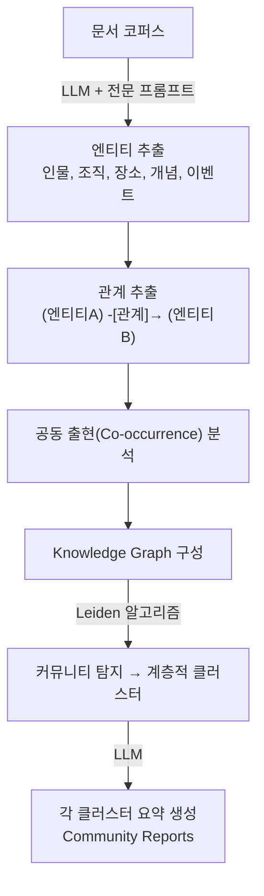

# Graph RAG

## 개요

**Graph RAG**는 Knowledge Graph의 구조적 관계 정보를 RAG 검색에 활용하여, 기존 벡터 기반 RAG가 다루기 어려운 **복잡한 다중 홉 추론(multi-hop reasoning)**과 **글로벌 주제 요약**을 가능하게 하는 기법이다.

## 제창

- **개발**: Microsoft Research
- **공개**: 2024년 2월 블로그 발표, 7월 GitHub 오픈소스 공개 (20,000+ stars)
- **논문**: "From Local to Global: A Graph RAG Approach to Query-Focused Summarization" — [arXiv:2404.16130](https://arxiv.org/abs/2404.16130)
- **구현**: [github.com/microsoft/graphrag](https://github.com/microsoft/graphrag)

## 기존 RAG의 한계

```
기존 벡터 RAG:
  질문: "이 데이터셋에서 가장 중요한 주제는 무엇인가?"
  → 벡터 검색은 "연결고리 추적" 불가
  → 여러 문서에 걸친 패턴 파악 어려움
  → 전역적(global) 이해 부재

Graph RAG로 해결:
  → 지식 그래프가 전체 데이터셋 구조 파악
  → 의미론적 클러스터로 글로벌 주제 파악 가능
  → 엔티티 간 경로를 따라 multi-hop 추론
```

## 작동 방식

### Phase 1: 지식 그래프 구축


```mermaid
flowchart TD
    DOC[문서 코퍼스] -->|LLM + 전문 프롬프트| ENT["엔티티 추출<br/>인물, 조직, 장소, 개념, 이벤트"]
    ENT --> REL["관계 추출<br/>(엔티티A) -[관계]→ (엔티티B)"]
    REL --> CO["공동 출현(Co-occurrence) 분석"]
    CO --> KG[Knowledge Graph 구성]
    KG -->|Leiden 알고리즘| COM["커뮤니티 탐지 → 계층적 클러스터"]
    COM -->|LLM| CR["각 클러스터 요약 생성<br/>Community Reports"]
```

### Phase 2: 쿼리 처리 (두 가지 모드)

#### Local Search (지역 검색)
특정 엔티티에 대한 구체적 질문:
```
질문: "Apple의 CEO는 누구이며 그의 경력은?"

1. 엔티티 매핑: "Apple" → 그래프 노드
2. 1~2홉 이웃 탐색: CEO, 이사회, 관련 인물
3. 관련 Community Reports 검색
4. 결합하여 LLM 최종 답변 생성
```

#### Global Search (전역 검색)
데이터셋 전체에 걸친 요약·분석 질문:
```
질문: "이 보고서에서 다루는 주요 테마는?"

1. 모든 Community Reports 사용
2. Map 단계: 각 커뮤니티 리포트에서 답변 생성
3. Reduce 단계: 모든 답변을 종합하여 글로벌 답변
(MapReduce 패턴)
```

#### DRIFT Search (하이브리드 검색)
Local과 Global 각각의 약점 — 지역 검색은 전역 맥락을 놓치고, 전역 검색은 세부 사실을 놓친다 — 을 보완하기 위해 Microsoft가 추가한 세 번째 모드:
```
DRIFT = Dynamic Reasoning and Inference with Flexible Traversal

1. Community Reports로부터 초기 답변을 "시드(seed)"로 생성 (Global 수준 맥락 확보)
2. 시드를 바탕으로 후속 질문을 생성해 Local Search로 세부 엔티티까지 탐색
3. 필요에 따라 그래프를 유연하게 넘나들며(traversal) 답변을 정제
```
벡터 RAG 대비 우수한 성능을 보인 것으로 보고되었으며, Local/Global 양쪽의 장점을 모두 취하려는 시도다.

## 구현 예시 (Microsoft GraphRAG)

```python
# 설치
# pip install graphrag

# 인덱싱 (그래프 구축)
# graphrag index --root ./myproject

# 쿼리
from graphrag.query.api import global_search, local_search

# Local 검색
result = local_search(
    root_dir="./myproject",
    query="Tesla의 주요 제품은?",
    community_level=2
)

# Global 검색
result = global_search(
    root_dir="./myproject",
    query="이 데이터셋의 주요 테마는?",
    response_type="Multiple Paragraphs"
)
```

## 성능 특성

Microsoft의 평가(Podcast transcript, News article):
- **Comprehensiveness**: GraphRAG +16.3% (vs Vector RAG)
- **Diversity**: GraphRAG +62.9%
- **Empowerment**: GraphRAG +35.5%
- **Directness**: Vector RAG +25% (GraphRAG는 더 포괄적)

**비용**: 인덱싱 시 LLM API 대량 사용 → 고비용. GPT-4 사용 시 중형 코퍼스도 수십~수백 달러.

## 최신 발전: LazyGraphRAG

Microsoft Research가 2024년 11월 공개한 GraphRAG의 저비용 버전. 기존 GraphRAG의 가장 큰 약점인 "높은 구축 비용"을 정면으로 해결한다.

- **핵심 아이디어**: 인덱싱 단계에서 LLM으로 엔티티·관계를 미리 추출하지 않는다. 대신 그래프 순회와 요약을 **쿼리 시점에 필요한 만큼만** 지연 실행(lazy evaluation)한다.
- **비용**: 인덱싱 비용이 일반 벡터 RAG와 거의 동일 — 풀 GraphRAG 대비 약 0.1% 수준. 쿼리 비용도 GraphRAG Global Search 대비 700배 이상 저렴하면서 답변 품질은 유사한 수준을 유지한다.
- **적용**: 2025년 Microsoft Discovery(과학 연구용 에이전틱 플랫폼)와 Azure 서비스에 통합되었다.

## Neo4j GraphRAG

Neo4j도 LPG 기반 GraphRAG 구현 제공:
```python
from neo4j_graphrag.retrievers import VectorCypherRetriever

retriever = VectorCypherRetriever(
    driver=neo4j_driver,
    index_name="document_embeddings",
    retrieval_query="""
    MATCH (node)-[:MENTIONS]->(entity)
    OPTIONAL MATCH (entity)-[r]-(related)
    RETURN node.text, entity.name, type(r), related.name
    """,
    embedder=OpenAIEmbeddings()
)
```

## 대안 구현체: LightRAG

Microsoft GraphRAG 외에 널리 쓰이는 오픈소스 대안. Guo et al. (2024, EMNLP 2025), [arXiv:2410.05779](https://arxiv.org/abs/2410.05779), [github.com/HKUDS/LightRAG](https://github.com/HKUDS/LightRAG).

- **핵심 아이디어**: **dual-level retrieval** — 쿼리마다 low-level 키(구체적 엔티티·관계)와 high-level 키(추상적 주제)를 동시에 생성해 검색한다. Local Search와 Global Search를 굳이 나누지 않고 한 번에 두 층위를 함께 훑는 방식이다.
- **구조**: 그래프 구조와 벡터 임베딩을 결합한 경량 듀얼 레이어 아키텍처.
- **장점**: Microsoft GraphRAG 대비 인덱싱·쿼리 비용이 낮고 구현이 가벼워 오픈소스 커뮤니티에서 널리 채택되었다.

## Graph RAG vs Vector RAG

| 기준 | Vector RAG | Graph RAG |
|------|-----------|-----------|
| **검색 방식** | 의미 유사도 | 그래프 탐색 + 유사도 |
| **Multi-hop** | 어려움 | 자연스러움 |
| **글로벌 요약** | 불가 | 가능 |
| **구축 비용** | 낮음 | 높음 (LLM 엔티티 추출)¹ |
| **쿼리 속도** | 빠름 | 느림 |
| **적합 케이스** | 구체적 사실 검색 | 복잡한 분석, 주제 파악 |

¹ LazyGraphRAG·LightRAG 등 최신 변형은 이 구축 비용 문제를 상당 부분 완화한다.

## 실무 고려사항과 한계

- **엔티티 해상도(Entity Resolution)**: 엔티티는 기본적으로 이름 기반으로 매칭된다. 동명이인이나 같은 대상의 이명(異名)을 제대로 해소하지 못하면 그래프가 파편화되고, 이 오류가 그래프 순회를 따라 누적되어 잘못된 추론으로 이어진다.
- **증분 인덱싱**: 초기 GraphRAG는 문서가 추가될 때마다 전체 재인덱싱이 필요했다. v0.4.0(2024년 11월)부터 `graphrag update` 명령으로 신규 문서에서만 엔티티를 추출해 기존 그래프에 병합할 수 있게 되었다.
- **쿼리 지연시간과 확장성**: 그래프 순회와 커뮤니티 요약 생성 때문에 벡터 RAG 대비 end-to-end 지연시간이 2~3배 높다는 후속 연구 결과가 있다. 코퍼스 크기가 커질수록 그래프 인덱스와 요약이 초선형적으로 증가해 메모리 부담도 커진다.

## AI Engineering에서의 역할

Graph RAG는 기업 내 대규모 비정형 데이터에서 **인사이트를 추출**하는 데 강력하다. "이 분기 보고서들의 주요 위험 요소는?" 같은 분석적 질문에 벡터 RAG는 한계가 있지만 Graph RAG는 효과적으로 답할 수 있다. 다만 높은 구축 비용 때문에 고가치 유스케이스에 선택적으로 적용해야 한다.

## Knowledge Graph 하위 문서

GraphRAG는 Knowledge Graph 개념을 기반으로 한다. 관련 하위 문서:

| 문서 | 내용 |
|------|------|
| [[AI/Engineering/Context_Engineering/Retrieval_Strategies/GraphRAG/Knowledge_Graph/Knowledge_Graph\|Knowledge Graph]] | 지식 그래프 개요 — 트리플, 엔티티-관계 모델 |
| [[AI/Engineering/Context_Engineering/Retrieval_Strategies/GraphRAG/Knowledge_Graph/LPG_and_RDF\|Knowledge_Graph/LPG_and_RDF]] | Labeled Property Graph (Neo4j) vs RDF (SPARQL) |
| [[AI/Engineering/Context_Engineering/Retrieval_Strategies/GraphRAG/Knowledge_Graph/Ontology\|Knowledge_Graph/Ontology]] | OWL 온톨로지, 도메인 온톨로지, 추론 엔진 |

Graph RAG의 Phase 1(지식 그래프 구축)은 위 Knowledge Graph 개념을 LLM으로 자동화한 것이다. 수동으로 Knowledge Graph를 구축하는 전통적 방식과 달리, LLM이 문서에서 엔티티와 관계를 자동 추출한다.

## 관련 개념
[[AI/Engineering/Context_Engineering/Retrieval_Strategies/GraphRAG/Knowledge_Graph/LPG_and_RDF|Knowledge_Graph/LPG_and_RDF]] · [[AI/Engineering/Context_Engineering/Retrieval_Strategies/GraphRAG/Knowledge_Graph/Ontology|Knowledge_Graph/Ontology]] · [[AI/Engineering/Context_Engineering/Retrieval_Strategies/RAG/Advanced_Retrieval|RAG/Advanced_Retrieval]] · [[AI/Engineering/Context_Engineering/Retrieval_Strategies/RAG/Vector_Storage|RAG/Vector_Storage]] · [[AI/Engineering/Context_Engineering/Retrieval_Strategies/Retrieval_Strategies|Retrieval Strategies]]

## 출처
- Microsoft Research "GraphRAG: Unlocking LLM discovery on narrative private data" — [microsoft.com](https://www.microsoft.com/en-us/research/blog/graphrag-unlocking-llm-discovery-on-narrative-private-data/)
- Edge et al. (2024) "From Local to Global: A Graph RAG Approach" — [arXiv:2404.16130](https://arxiv.org/abs/2404.16130)
- Neo4j "The GraphRAG Manifesto" — [neo4j.com](https://neo4j.com/blog/genai/graphrag-manifesto/)
- GitHub microsoft/graphrag — [github.com](https://github.com/microsoft/graphrag)
- Microsoft Research "LazyGraphRAG: Setting a new standard for quality and cost" — [microsoft.com](https://www.microsoft.com/en-us/research/blog/lazygraphrag-setting-a-new-standard-for-quality-and-cost/)
- Guo et al. (2024) "LightRAG: Simple and Fast Retrieval-Augmented Generation" — [arXiv:2410.05779](https://arxiv.org/abs/2410.05779)
- GitHub HKUDS/LightRAG — [github.com](https://github.com/HKUDS/LightRAG)
