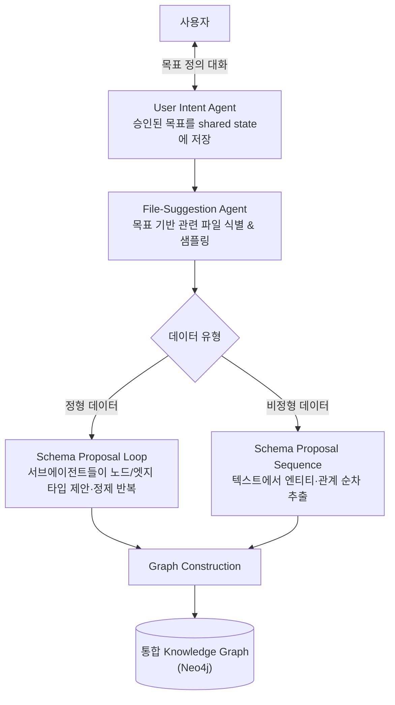

# Agentic Knowledge Graph Construction (에이전틱 지식 그래프 구축)

## 개요

**Agentic Knowledge Graph Construction**은 원본 데이터(정형+비정형)로부터 지식 그래프를 만드는 과정 자체를 **멀티에이전트 시스템에 위임**하는 접근이다. 전통적인 KG 구축은 스키마 설계·엔티티 추출·관계 매핑을 사람이 수작업으로 하거나 고정된 ETL 파이프라인으로 처리했지만, 이 접근에서는 사용자의 목표를 이해하는 에이전트, 관련 파일을 찾는 에이전트, 스키마를 제안·정제하는 에이전트가 협업하여 그래프를 자동으로 구축한다.



## 제창

- **강좌**: "Agentic Knowledge Graph Construction" — DeepLearning.AI
- **강사**: Andreas Kollegger (Neo4j, GenAI Innovation Lead)
- **구성**: 중급, 12개 영상 강의(총 3시간 8분), 8개 코드 예제, 1개 채점 과제
- **사용 도구**: Google **Agent Development Kit (ADK)**로 멀티에이전트 오케스트레이션, **Neo4j**로 그래프 저장, Cypher는 알면 도움이 되지만 필수는 아님

## 파이프라인 4단계

기존 RAG가 문서를 청크로 쪼개 벡터 저장소에만 넣는 것과 달리, 이 파이프라인은 **청크를 그래프 구조 안에도 함께 배치**한다 — 예를 들어 제품 리뷰 청크가 제품 노드에 연결되는 식이다.

```
① User Intent Agent
   사용자와 대화하며 "이 KG로 무엇을 하고 싶은가"를 구체화
   → 승인된 목표(goal)를 공유 상태(shared state)에 저장

② File-Suggestion Agent
   목표를 기반으로 관련 데이터 파일 식별
   → 파일 내용을 샘플링해 적합성 확인 → 승인된 파일 목록 유지

③ Schema Proposal Agents (두 트랙)
   정형 데이터: 서브에이전트 루프가 노드/엣지 타입(스키마)을 반복적으로 제안·정제
   비정형 데이터: 순차 워크플로가 텍스트에서 엔티티·관계를 추출

④ Graph Construction
   제안된 스키마로 그래프 생성
   → 정형 그래프 + 비정형 그래프를 하나의 통합 Knowledge Graph로 연결
```

**대화형 에이전트 + 3개 서브 워크플로** 구조 — 사용자 목표를 파악하는 대화형 에이전트 1개와, 정형/비정형 데이터를 처리하는 서브 에이전틱 워크플로 여러 개가 **공유 컨텍스트(shared state)**를 통해 협업한다. 사람이 매번 스키마를 손으로 설계하고 추출 규칙을 짜던 작업을, 목표 정의 → 데이터 탐색 → 스키마 제안 → 구축의 에이전트 파이프라인으로 자동화한 것이다.

## 수동 구축 방식과의 차이

| | 수동 KG 구축 | Agentic KG Construction |
|---|---|---|
| 스키마 설계 | 도메인 전문가가 사전 설계 | Schema Proposal Agent가 데이터를 보고 반복 제안·정제 |
| 대상 파일 선정 | 사람이 직접 지정 | File-Suggestion Agent가 목표 기반으로 탐색 |
| 정형/비정형 처리 | 별도 파이프라인, 수동 통합 | 두 트랙을 병렬 처리 후 자동 병합 |
| 반복 개선 | 재설계 시 처음부터 다시 | 승인된 목표·파일·스키마가 공유 상태에 누적, 재요청 시 이어서 정제 |

## AI Engineering에서의 역할

Agentic KG Construction은 [[AI/Engineering/Agent_Engineering/Multi_Agent_Coordination|Multi-Agent Coordination]]에서 다루는 조정 패턴(역할 분담, 공유 메모리/Blackboard 패턴)을 [[AI/Engineering/Context_Engineering/Retrieval_Strategies/GraphRAG/Knowledge_Graph/Knowledge_Graph|Knowledge Graph]]·[[AI/Engineering/Context_Engineering/Retrieval_Strategies/GraphRAG/Knowledge_Graph/Ontology|Ontology]] 구축이라는 구체적 도메인에 적용한 사례다. Context Engineering이 "LLM에게 어떤 구조적 지식을 줄 것인가"를 다뤘다면, 이 접근은 "그 구조적 지식 자체를 에이전트가 만들게 하려면 어떻게 조직해야 하는가"라는 질문에 답한다 — [[AI/Engineering/Graph_Engineering/Multi_Agent_Topology|Multi-Agent Topology]]에서 다루는 노드 유형 구분(대화형 에이전트, 순차 워크플로, 반복 루프)이 그대로 적용되는 실제 사례이기도 하다.

## 관련 개념
[[AI/Engineering/Context_Engineering/Retrieval_Strategies/GraphRAG/Knowledge_Graph/Knowledge_Graph|Knowledge_Graph]] · [[AI/Engineering/Context_Engineering/Retrieval_Strategies/GraphRAG/Knowledge_Graph/Ontology|Ontology]] · [[AI/Engineering/Context_Engineering/Retrieval_Strategies/GraphRAG/Knowledge_Graph/LPG_and_RDF|LPG_and_RDF]] · [[AI/Engineering/Agent_Engineering/Multi_Agent_Coordination|Agent_Engineering/Multi_Agent_Coordination]] · [[AI/Engineering/Agent_Engineering/Agent_Frameworks|Agent_Engineering/Agent_Frameworks]] · [[AI/Engineering/Graph_Engineering/Multi_Agent_Topology|Multi-Agent Topology]]

## 출처
- DeepLearning.AI, ["Agentic Knowledge Graph Construction"](https://www.deeplearning.ai/courses/agentic-knowledge-graph-construction) — Andreas Kollegger (Neo4j), 2026
