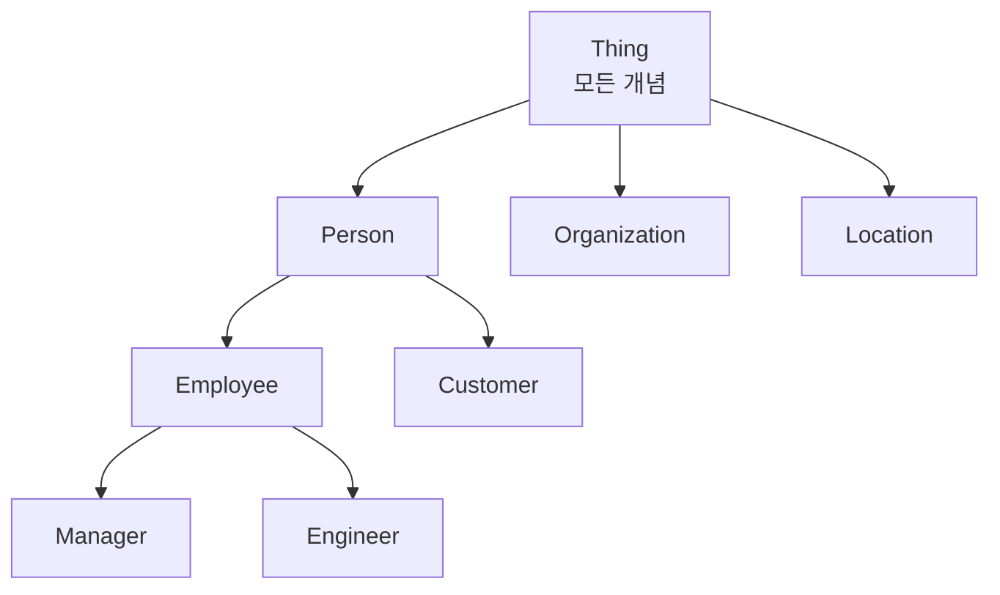

# Ontology (온톨로지)

## 개요

**Ontology**는 특정 도메인의 개념(Concept), 속성(Property), 그들 간의 관계(Relationship)를 형식적으로 정의한 **지식 체계의 명세**다. "어떤 것이 무엇인지, 어떤 관계를 가지는지"를 기계가 이해하고 추론할 수 있는 형태로 기술한다.

## 어원 및 제창

- **철학적 기원**: 그리스어 "온토스(존재)" + "로고스(이론)" = 존재론
- **컴퓨터 과학 도입**: Tom Gruber (1993) "A translation approach to portable ontology specifications" — AI 분야에서 "공유된 개념화의 명시적 명세"로 정의
- **시맨틱 웹 표준**: W3C OWL (2004, 2012)

## 온톨로지 구성 요소

### Classes (클래스)
도메인의 주요 개념 범주:
```owl
# OWL/Turtle 표현
ex:Person rdf:type owl:Class .
ex:Organization rdf:type owl:Class .
ex:Employee rdfs:subClassOf ex:Person .
```

### Properties (속성)
두 클래스 간의 관계(Object Property) 또는 데이터 값(Datatype Property):
```owl
ex:worksFor rdf:type owl:ObjectProperty .
ex:worksFor rdfs:domain ex:Employee .
ex:worksFor rdfs:range ex:Organization .

ex:hasAge rdf:type owl:DatatypeProperty .
ex:hasAge rdfs:range xsd:integer .
```

### Individuals (인스턴스)
클래스의 실제 인스턴스:
```owl
ex:홍길동 rdf:type ex:Employee .
ex:홍길동 ex:worksFor ex:Acme_Corp .
ex:홍길동 ex:hasAge "30"^^xsd:integer .
```

### Axioms (공리)
논리적 제약 조건:
```owl
# 한 사람은 하나의 직속 상사만 가질 수 있음
ex:hasDirectManager rdf:type owl:FunctionalProperty .

# 동의어 관계
ex:Employee owl:equivalentClass ex:Worker .
```

## 온톨로지 계층 구조



## 추론 (Reasoning)

온톨로지의 가장 강력한 기능. 명시적으로 입력하지 않은 사실을 논리적으로 도출:

```
입력:
  홍길동 rdf:type Employee
  모든 Employee는 Person

추론:
  → 홍길동 rdf:type Person (자동 추론)

입력:
  홍길동 worksFor Acme_Corp
  Acme_Corp rdf:type KoreanCompany

추론:
  → 홍길동은 한국 회사에서 근무 (자동 추론)
```

**추론기(Reasoner)**: Pellet, HermiT, FaCT++ (OWL DL 추론기)

## 주요 도메인 온톨로지

| 도메인 | 온톨로지 | 용도 |
|--------|---------|------|
| **의료** | SNOMED CT, ICD-11 | 의학 용어 표준화 |
| **생물정보** | Gene Ontology (GO) | 유전자 기능 분류 |
| **법률** | LKIF, Akoma Ntoso | 법률 문서 구조화 |
| **기업** | GS1, Schema.org | 제품·비즈니스 설명 |
| **웹** | Dublin Core, FOAF | 웹 메타데이터 |

## LLM 시대에서의 온톨로지

### 역할 변화
```
전통적: 온톨로지 = 지식의 의미 저장소
LLM 시대: 온톨로지 = LLM의 구조적 가이드

활용 방식:
1. 온톨로지 기반 프롬프트 구성
   "Person, Organization, Location 클래스 기준으로 엔티티 추출하세요"

2. 온톨로지로 LLM 출력 검증
   LLM 추출 결과 → 온톨로지 제약 조건 검증

3. 온톨로지 자동 생성 (LLM 활용)
   문서 → LLM → 새 온톨로지 클래스/관계 제안
```

### LLM과 결합된 온톨로지 관리
GPT-4, Claude 등을 활용해 온톨로지 구축·유지보수 자동화:
```python
prompt = """
다음 의료 문서에서 새로운 클래스와 관계를 추출하고
OWL Turtle 형식으로 제안하세요:
{medical_document}
"""
```

## AI Engineering에서의 역할

온톨로지는 도메인 지식을 **기계가 이해할 수 있는 형태**로 명확히 정의한다. Knowledge Graph와 결합하여 AI 시스템에 추론 능력을 부여하며, RAG 파이프라인에서 검색 정밀도를 높이는 데 활용된다. Graph RAG 시스템에서 온톨로지는 LLM이 추출하는 엔티티와 관계의 **스키마 역할**을 한다.

## 관련 개념
[[LPG_and_RDF]] · [[AI/Engineering/Context_Engineering/Retrieval_Strategies/GraphRAG/GraphRAG|GraphRAG]] · [[AI/Engineering/Context_Engineering/Retrieval_Strategies/GraphRAG/Knowledge_Graph/Knowledge_Graph|Knowledge Graph]]

## 출처
- Gruber (1993) "A translation approach to portable ontology specifications"
- W3C OWL 2 Web Ontology Language — [w3.org/OWL](https://www.w3.org/OWL/)
- Pavlyshyn "Ontology vs Graph Database. LLM Agents as Reasoners" — [Substack](https://volodymyrpavlyshyn.substack.com/p/ontology-vs-graph-database-llm-agents)
