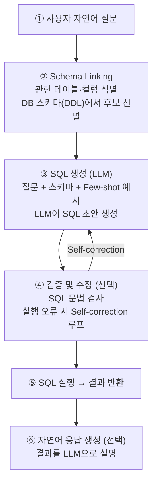

# NL2SQL (Natural Language to SQL)

## 개요

**NL2SQL**(Natural Language to SQL, 또는 **Text-to-SQL**)은 사용자의 자연어 질문을 실행 가능한 SQL 쿼리로 자동 변환하는 기술이다. 정형 데이터베이스(RDBMS)에 저장된 데이터를 SQL을 모르는 비전문가도 자연어로 질의할 수 있게 함으로써, 데이터 민주화(Data Democratization)를 실현하는 핵심 수단으로 주목받고 있다.

```
사용자: "지난 분기 가장 많이 팔린 상품 TOP 5는?"
        ↓ NL2SQL
SELECT product_name, SUM(quantity) AS total_sold
FROM orders
WHERE order_date >= '2024-10-01' AND order_date < '2025-01-01'
GROUP BY product_name
ORDER BY total_sold DESC
LIMIT 5;
```

## Text-to-SQL 파이프라인



## Schema Linking

Schema Linking은 NL2SQL에서 **가장 어렵고 중요한 단계**다. 수백~수천 개의 테이블·컬럼 중 질문과 관련된 것만 추려내는 작업으로, 이 단계의 정확도가 최종 SQL 품질을 결정한다.

### 주요 방법

```
방법 1: DDL 기반 표현
  CREATE TABLE orders (
    order_id INT,
    product_name VARCHAR(100),
    quantity INT,
    order_date DATE
  );
  → 전체 스키마를 LLM 컨텍스트에 포함 (소규모 DB에 적합)

방법 2: Dictionary 기반 표현 (TA-SQL)
  {"orders.product_name": "주문된 상품명", "orders.quantity": "주문 수량"}
  → 컬럼별 설명 포함 (대규모 DB에 효과적)

방법 3: 벡터 검색 기반 Schema Filtering
  질문 임베딩 ↔ 컬럼명·설명 임베딩 비교
  → 유사도 높은 컬럼만 필터링
  → Large-scale DB에서 컨텍스트 절약
```

### 최근 연구 (2024-2025)

- **LinkAlign** (2025): 멀티 데이터베이스 환경에서 확장 가능한 Schema Linking 제안 [1]
- **Bidirectional Retrieval** (2024): 질문→스키마, 스키마→질문 양방향 검색으로 정확도 향상 [2]
- **E-SQL**: 질문 풍부화(Question Enrichment)를 통해 Schema Linking 품질 개선

## 주요 접근법

### 1. Decomposed In-Context Learning

```
DIN-SQL (2023):
  Step 1: Schema Linking — "이 질문에 필요한 테이블은?"
  Step 2: Query 분류 — Simple / Nested / Non-nested
  Step 3: SQL 생성 — 분류별 특화 프롬프트
  Step 4: Self-correction — 오류 수정

DFIN-SQL (2024): DIN-SQL에 Focused Schema 결합으로 대규모 DB 정확도 향상 [3]
```

### 2. Few-shot 프롬프팅 기반

```
DAIL-SQL (2023):
  - 스켈레톤 유사도로 Few-shot 예시 선택
  - 구조적 지식을 DDL로 인코딩
  - 도메인 특정 단어 차단(Masking)으로 일반화

PURPLE / C3: Zero/Few-shot 프롬프팅 접근

OpenSearch-SQL (2025):
  - 동적 Few-shot 선택 + Consistency Alignment
  - Spider·BIRD 벤치마크 SOTA 달성 [4]
```

### 3. 멀티에이전트·멀티패스

```
CHESS (2024):
  - Candidate Schema 후보군 생성
  - 여러 SQL 후보 생성 후 투표
  - Hierarchical Schema 표현

MAC-SQL / MCS-SQL:
  - 다수 에이전트 협업으로 복잡 쿼리 처리

Memo-SQL (2026):
  - 구조적 분해 + 경험 기반 학습
  - 이전 실수를 메모로 저장해 반복 오류 방지 [5]
```

### 4. Fine-Tuning 기반

```
CODES (2024):
  - 도메인 특화 데이터로 소형 LLM 파인튜닝
  - 추론 비용 절감

Synthesizing NL2SQL Data (2024):
  - 약한 LLM + 강한 LLM 조합으로 학습 데이터 합성 [6]
```

## 벤치마크

### Spider

```
- 출처: Yale University (Yu et al., 2018)
- 규모: 10,181 질문-SQL 쌍 / 200개 데이터베이스
- 분할: Train 7,000 / Dev 1,034 / Test 2,147
- 특징: 크로스-도메인, compositional generalization 평가
- 평가 지표: Exact Match (EM), Execution Accuracy (EX)
- 한계: 실제 DB 복잡성보다 단순
```

### BIRD (Big Bench for Large-scale Database Grounded Text-to-SQL)

```
- 출처: Li et al. (2023)
- 규모: 12,751 질문-SQL 쌍 / 95개 실세계 DB / 37개 도메인
- 분할: Train 9,428 / Dev 1,534 / Test 1,789
- 특징:
  - 실제 비즈니스 데이터 (Finance, Healthcare, Sports 등)
  - 복잡한 다중 조인, 중첩 서브쿼리
  - Implicit 지식 필요 (도메인 상식 포함)
  - Efficient Execution 점수 포함
- 평가 지표: Valid Efficiency Score (VES), EX
- SOTA 정확도: ~73% (2025년 기준, GPT-4급 모델)
```

| 벤치마크 | DB 수 | 질문 수 | 난이도 | 특징 |
|----------|-------|---------|--------|------|
| Spider | 200 | 10K | 중간 | 크로스-도메인 일반화 |
| BIRD | 95 | 12.7K | 높음 | 실세계 복잡도 + 암묵적 지식 |
| Spider 2.0 | 632 | 수천 | 매우 높음 | Enterprise급 복잡 쿼리 |

## 한계 및 실무 고려사항

```
1. Schema 규모 문제
   - 수백 개 테이블 → 컨텍스트 초과
   - 해결: Schema Filtering, 동적 Schema 로딩

2. 암묵적 지식
   - "지난 분기" → 현재 날짜 기준 계산 필요
   - "활성 사용자" → 도메인마다 정의 다름
   - 해결: 도메인 메타데이터 주입, 설명 컬럼 추가

3. Dialect 차이
   - MySQL vs PostgreSQL vs BigQuery vs Snowflake
   - 함수명·문법 차이로 이식성 문제

4. 실행 오류 처리
   - 생성된 SQL이 문법 오류 또는 런타임 오류
   - 해결: Self-correction 루프 (오류 메시지를 다시 LLM에 피드백)

5. 보안 위험
   - SQL Injection 가능성
   - 해결: Parameterized query, 권한 제한 계정 사용

6. 복잡 집계·분석 쿼리
   - Window Function, CTE, 복잡한 서브쿼리에서 정확도 급락
   - BIRD Dev 기준 ~73% 정확도 — 여전히 30%는 오류
```

## AI Engineering에서의 역할

NL2SQL은 **정형 데이터 대상 Retrieval Strategy의 핵심**이다. 기업 내 ERP, CRM, 데이터웨어하우스에 자연어로 접근하는 BI Chatbot, 데이터 분석 에이전트 구현에 필수적이다. [[SQL_RAG]]와 결합하면 벡터 검색(비정형 지식) + SQL 검색(정형 데이터)을 동시에 활용하는 Hybrid 시스템을 구축할 수 있다.

## 관련 개념

[[SQL_RAG]] · [[RAG/RAG]] · [[RAG/Advanced_Retrieval]] · [[GraphRAG/GraphRAG]]

## References

[1] LinkAlign: Scalable Schema Linking for Real-World Large-Scale Multi-Database Text-to-SQL — [arxiv.org/pdf/2503.18596](https://arxiv.org/pdf/2503.18596)

[2] Rethinking Schema Linking: A Context-Aware Bidirectional Retrieval Approach for Text-to-SQL — [arxiv.org/pdf/2510.14296](https://arxiv.org/pdf/2510.14296)

[3] DFIN-SQL: Integrating Focused Schema with DIN-SQL for Superior Accuracy in Large-Scale Databases — [arxiv.org/pdf/2403.00872](https://arxiv.org/pdf/2403.00872)

[4] OpenSearch-SQL: Enhancing Text-to-SQL with Dynamic Few-shot and Consistency Alignment — [arxiv.org/pdf/2502.14913](https://arxiv.org/pdf/2502.14913)

[5] Memo-SQL: Structured Decomposition and Experience-Driven — [arxiv.org/pdf/2601.10011](https://arxiv.org/pdf/2601.10011)

[6] Synthesizing Text-to-SQL Data from Weak and Strong LLMs — [arxiv.org/pdf/2408.03256](https://arxiv.org/pdf/2408.03256)

[7] Retrieval-Augmented NL2SQL Generation with Data-Centric Query Capsules (SIGIR-AP 2025) — [dl.acm.org/doi/10.1145/3767695.3769489](https://dl.acm.org/doi/10.1145/3767695.3769489)

[8] BASE-SQL: A powerful open source Text-To-SQL baseline approach — [arxiv.org/pdf/2502.10739](https://arxiv.org/pdf/2502.10739)
