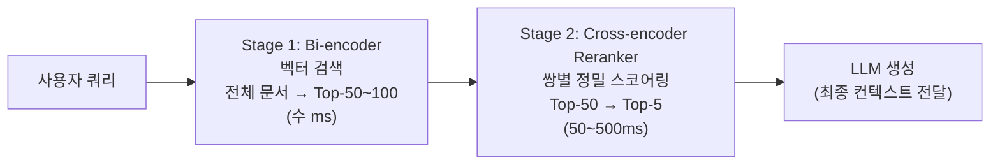
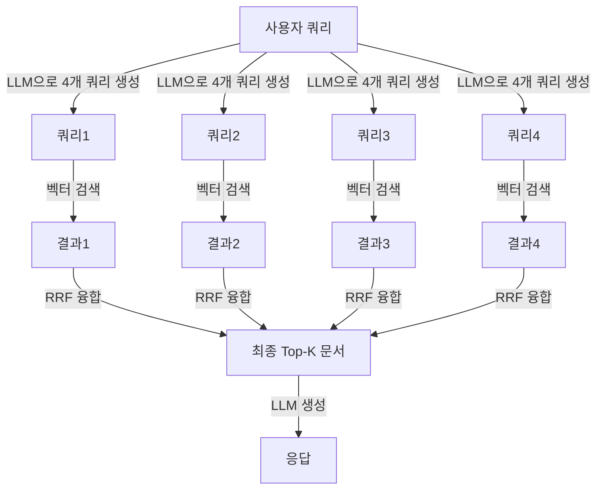

# Advanced Retrieval (고급 검색 기법)

## 개요

기본 벡터 검색(단순 쿼리 → Top-K 반환)을 넘어, 검색 품질을 향상시키는 다양한 고급 기법들. Reranking, Query Transformation, Multi-query 등이 포함된다.

## 기본 RAG의 한계

```
문제 1 — Query-Document Mismatch:
  쿼리: "파이썬으로 어떻게 정렬하나요?"
  문서: "Python의 sort() 함수..." (키워드 다름 → 낮은 유사도)

문제 2 — 단일 관점:
  쿼리 하나로는 관련 문서의 다양한 측면을 커버 못함

문제 3 — 상위 K개의 노이즈:
  유사도 점수가 높아도 실제 관련성이 낮은 문서 포함 가능
```

## Reranking (재정렬)

### 왜 Reranking이 필요한가

벡터 검색(Bi-encoder)은 빠르지만 구조적 한계가 있다. 쿼리와 문서를 **독립적으로** 인코딩한 뒤 코사인 유사도로 비교하기 때문에, 두 텍스트 사이의 상호작용(토큰 레벨 교차 어텐션)을 포착하지 못한다.

```
Bi-encoder의 한계:
  embed("파이썬 정렬 방법") ↔ embed("Python sort() 함수 사용법")
  → 표면적 키워드 차이로 낮은 유사도 → 좋은 문서가 누락

Cross-encoder의 해법:
  Transformer(  [CLS] 파이썬 정렬 방법 [SEP] Python sort() 함수... )
  → 두 텍스트 전체를 함께 처리 → 정밀한 관련성 점수
```

단, Cross-encoder는 모든 문서 쌍을 inference해야 하므로 수백만 문서에 직접 적용 불가. **Two-Stage Retrieval**로 해결한다.

### Two-Stage Retrieval 파이프라인



Stage 1에서 recall을 확보하고, Stage 2에서 precision을 높이는 구조. Reranking만으로 RAG 응답 품질을 **15~40% 향상** 가능 [1][2].

### Cross-Encoder Reranking

```python
from sentence_transformers import CrossEncoder

reranker = CrossEncoder("cross-encoder/ms-marco-MiniLM-L-6-v2")
pairs = [(query, doc) for doc in candidate_docs]  # Top-50 후보
scores = reranker.predict(pairs)
reranked_docs = sorted(zip(scores, candidate_docs), reverse=True)[:5]
```

### 주요 Reranker 모델 비교

| 모델 | 타입 | 특징 | 지연시간 (Top-50 GPU) |
|------|------|------|----------------------|
| **BAAI/bge-reranker-v2-m3** | Cross-encoder | 오픈소스 최강, 다국어 지원, 278M params | ~80ms |
| **Cohere Rerank v3.5** | API | 상용, 구조화 데이터(YAML) 지원, 4096 context | API 레이턴시 |
| **Cohere Rerank v4.0-pro/fast** | API | v3.5 후속, pro/fast 티어 분리 | API 레이턴시 |
| **ColBERT v2** | Late Interaction | 토큰별 최대 유사도(MaxSim), 서버 사이드 인덱스 | ~25ms |
| **FlashRank** | Cross-encoder | 경량 MiniLM 기반, CPU 실행 가능 | ~15ms |
| **ms-marco-MiniLM-L-6-v2** | Cross-encoder | 범용 영어 베이스라인 | ~50ms |

**BGE Reranker v2-m3**는 현재 오픈소스 중 영어/다국어 작업에서 best로 평가된다 [1].

#### BGE Reranker 사용 예시

```python
from FlagEmbedding import FlagReranker

reranker = FlagReranker("BAAI/bge-reranker-v2-m3", use_fp16=True)
scores = reranker.compute_score(
    [(query, doc) for doc in candidate_docs],
    normalize=True  # 0~1 범위로 정규화
)
top_docs = [doc for _, doc in sorted(zip(scores, candidate_docs), reverse=True)[:5]]
```

#### ColBERT: Late Interaction

Cross-encoder보다 빠르면서 Bi-encoder보다 정확한 중간 방식. 쿼리와 문서를 별도 인코딩하되, **토큰 레벨**에서 MaxSim 연산으로 상호작용:

```
score(q, d) = Σ_i max_j (E_q[i] · E_d[j])
  → 쿼리의 각 토큰이 문서에서 가장 유사한 토큰과 매칭
```

서버 사이드 인덱스(RAGatouille 라이브러리)를 구축하면 대규모에서도 빠르게 동작 [4].

### Cohere Rerank API

```python
import cohere
co = cohere.Client(api_key)

results = co.rerank(
    model="rerank-v3.5",       # 또는 rerank-v4.0-pro / rerank-v4.0-fast
    query=query,
    documents=[doc.page_content for doc in candidates],
    top_n=5,
    return_documents=True
)

top_docs = [r.document.text for r in results.results]
```

기존 키워드/벡터 검색 시스템에 2nd stage로 추가만 하면 되어 도입 비용이 낮다 [3].

### RRF (Reciprocal Rank Fusion)

여러 검색 결과 리스트를 모델 없이 수학적으로 결합:
```
RRF 점수 = Σ 1 / (k + rank_i)
  k=60 (상수, 상위 랭크의 영향 완화)
```
Dense 검색(벡터)과 Sparse 검색(BM25) 결과를 안전하게 합산할 때 사용. 별도 학습 불필요.

### 성능 vs 지연시간 트레이드오프

```
정확도 높음  ← Cross-encoder (ColBERT/BGE) → API Reranker (Cohere)
               ↕ 비용 증가
지연시간 낮음 ← FlashRank / RRF / Bi-encoder 단독
```

| 전략 | 지연시간 추가 | 정확도 향상 | 권장 상황 |
|------|-------------|------------|----------|
| Bi-encoder 단독 | 0 | — | 실시간 검색, 지연 민감 |
| RRF (Hybrid) | <10ms | +5~10% | Dense+Sparse 조합 시 |
| FlashRank | ~15ms | +15~20% | CPU 서버, 비용 절감 |
| BGE Reranker v2-m3 | ~80ms | +20~30% | 오픈소스 고정확도 |
| Cohere Rerank v3.5 | 100~300ms | +25~40% | 관리형, 구조화 데이터 |

**실무 팁:**
- Top-K는 Stage 1에서 50~100, Stage 2 출력은 3~5로 좁히는 것이 일반적
- 문서를 512 토큰으로 truncate하면 reranking 속도와 품질 균형을 맞출 수 있음
- 정적 코퍼스에서는 쿼리-문서 점수를 캐싱하면 중복 비용 절감 가능

### LLM-as-Reranker

일반 LLM도 reranker로 사용할 수 있다. 접근 방식은 두 가지다 [8][9].

**Pointwise Reranking**: 쿼리와 문서 하나씩을 LLM에 넣어 관련성 점수를 요청. Top-K 문서마다 LLM을 호출하므로 비용·지연이 선형 증가한다.

**Listwise Reranking**: 쿼리와 후보 문서 전체를 한 번에 입력해 순위 목록을 출력하게 한다. Pointwise보다 일관성이 높지만, 문서가 많아질수록 컨텍스트 길이(O(n²) 어텐션 비용)와 지연이 폭발한다.

#### Cross-Encoder 전용 모델 대비 트레이드오프

ZeroEntropy가 17개 벤치마크(MTEB, BEIR, MS MARCO 등)에서 측정한 결과 [8]:

| 모델 | NDCG@10 평균 | p50 지연 (75kb 입력) | 상대 비용 |
|------|------------|-------------------|---------|
| zerank-1 (전용 reranker) | **0.777** | **130ms** | 1x |
| GPT-5-mini (listwise) | 0.698 | 2,180ms | 10x |
| GPT-4.1-mini (listwise) | 0.713 | 740ms | 32x |
| Cohere rerank-3.5 | 0.719 | 198ms | 2x |

전용 Cross-encoder가 정확도 높고 지연·비용 모두 유리하다. LLM reranker의 주요 단점:
- **Score 비일관성**: LLM은 절대 점수(0~1)를 안정적으로 출력하도록 훈련되지 않아 calibration이 불량
- **Pointwise의 취약성**: 후보 문서를 개별적으로 평가하므로 문서 간 상대 비교 신호를 잃음
- **실시간 불가**: 사용자 이탈 임계(3초) 내에 100개 후보를 LLM으로 처리하기 어려움

#### LLM Reranker가 유리한 경우

- **복잡한 추론이 필요한 reranking**: 논리적 함의 판단, 다단계 추론 등 전용 모델이 학습하지 못한 고난도 태스크 [9]
- **오프라인 배치 처리**: 지연이 허용되고 정확도가 최우선인 데이터 파이프라인
- **소수 후보 listwise 정밀화**: Cross-encoder로 Top-50 → Top-5로 좁힌 뒤, 최종 3개를 LLM listwise로 재정렬하는 3단계 파이프라인

```
권장 파이프라인 (비용 효율 최대화):
  Stage 1: BM25 / 벡터 검색 → Top-100 (수 ms, recall 확보)
  Stage 2: Cross-encoder Reranker → Top-5 (수십~수백 ms, precision 확보)
  Stage 3: LLM Listwise (선택) → Top-3 (초 단위, 복잡 추론 필요 시만)
```

## Query Transformation (쿼리 변환)

### Query Rewriting (쿼리 재작성)
원본 쿼리를 검색에 더 효과적인 형태로 변환:
```python
rewrite_prompt = """
다음 사용자 질문을 문서 검색에 최적화된 키워드 중심 쿼리로 변환하세요.
원본: {query}
검색 쿼리:
"""
optimized_query = llm.generate(rewrite_prompt.format(query=user_query))
```

### Step-Back Prompting
구체적 질문을 더 추상적인 질문으로 변환하여 배경 지식 검색:
```
원본: "GPT-4의 RLHF는 어떻게 작동하나요?"
Step-back: "강화학습으로 LLM을 학습하는 방법은?"
→ 더 넓은 범위의 관련 문서 검색 가능
```

### Multi-Query Retrieval
단일 쿼리를 여러 관점의 쿼리로 확장:
```python
multi_query_prompt = """
다음 질문을 다양한 관점에서 5가지 버전으로 재작성하세요:
질문: {question}

1.
2.
3.
4.
5.
"""
queries = llm.generate(multi_query_prompt)
# 5개 쿼리 각각 검색 → 결과 합집합 → 중복 제거
```

### Decomposition (질문 분해)
복잡한 질문을 서브 질문으로 분해 후 단계적 검색:
```
복잡한 질문: "A사와 B사의 2024년 매출과 영업이익을 비교하고 성장률을 계산하세요"

서브 질문:
  1. "A사의 2024년 매출은?"
  2. "A사의 2024년 영업이익은?"
  3. "B사의 2024년 매출은?"
  4. "B사의 2024년 영업이익은?"
  5. 각 답변으로 성장률 계산
```

## RAG Fusion

Multi-query + RRF를 결합한 패턴:


## Contextual Compression (컨텍스트 압축)

검색된 청크에서 실제 관련 부분만 추출:
```python
from langchain.retrievers.document_compressors import LLMChainExtractor
from langchain.retrievers import ContextualCompressionRetriever

compressor = LLMChainExtractor.from_llm(llm)
compression_retriever = ContextualCompressionRetriever(
    base_compressor=compressor,
    base_retriever=base_retriever
)
# 전체 청크 대신 관련 문장만 반환
```

## 평가 지표

| 지표 | 의미 | 계산 |
|------|------|------|
| **Precision@K** | 상위 K개 중 관련 문서 비율 | TP / K |
| **Recall@K** | 전체 관련 문서 중 상위 K에 포함된 비율 | TP / 전체 관련 |
| **MRR** | 첫 번째 관련 문서의 역수 순위 평균 | Σ(1/rank_i) / N |
| **NDCG** | 랭킹 품질 (관련성 + 순서 고려) | 복합 계산 |

## AI Engineering에서의 역할

Advanced Retrieval은 RAG 파이프라인의 **정밀도 레이어**다. 기본 검색이 "관련 문서를 찾는" 것이라면, 고급 검색은 "가장 유용한 컨텍스트를 최적 형태로 제공하는" 것이다. Reranking만으로도 RAG 응답 품질을 15~30% 향상시킬 수 있다.

## 관련 개념
[[Chunking_Strategies]] · [[Vector_Storage]] · [[HyDE]]

## 출처
- [1] Reranking for RAG: +40% Accuracy with Cross-Encoders (2025 Guide) — [ailog.fr](https://app.ailog.fr/en/blog/guides/reranking)
- [2] Build BGE Reranker: Cross-Encoder Reranking for Better RAG — [markaicode.com](https://markaicode.com/bge-reranker-cross-encoder-reranking-rag/)
- [3] Cohere Rerank Best Practices — [docs.cohere.com](https://docs.cohere.com/docs/reranking-best-practices)
- [4] Reranking with ColBERT: Precision Without Pain — [Medium](https://medium.com/@ThinkingLoop/reranking-with-colbert-precision-without-pain-b390dda517f0)
- [5] Nogueira & Cho (2019) "Passage Re-ranking with BERT" — [arXiv:1901.04085](https://arxiv.org/abs/1901.04085)
- [6] Gao et al. (2023) "RAG Survey" — [arXiv:2312.10997](https://arxiv.org/abs/2312.10997)
- [7] Top 7 Rerankers for RAG — [analyticsvidhya.com](https://www.analyticsvidhya.com/blog/2025/06/top-rerankers-for-rag/)
- [8] Houir Alami (2025) "Should You Use LLMs for Reranking? Pointwise, Listwise, and Cross-Encoders" — [zeroentropy.dev](https://zeroentropy.dev/articles/should-you-use-llms-for-reranking-a-deep-dive-into-pointwise-listwise-and-cross-encoders/)
- [9] "A Thorough Comparison of Cross-Encoders and LLMs for Reranking SPLADE" — [arXiv:2403.10407](https://arxiv.org/html/2403.10407v1)
- LangChain Advanced RAG 문서 — [python.langchain.com](https://python.langchain.com/docs/how_to/multi_query/)
