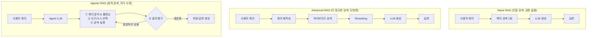
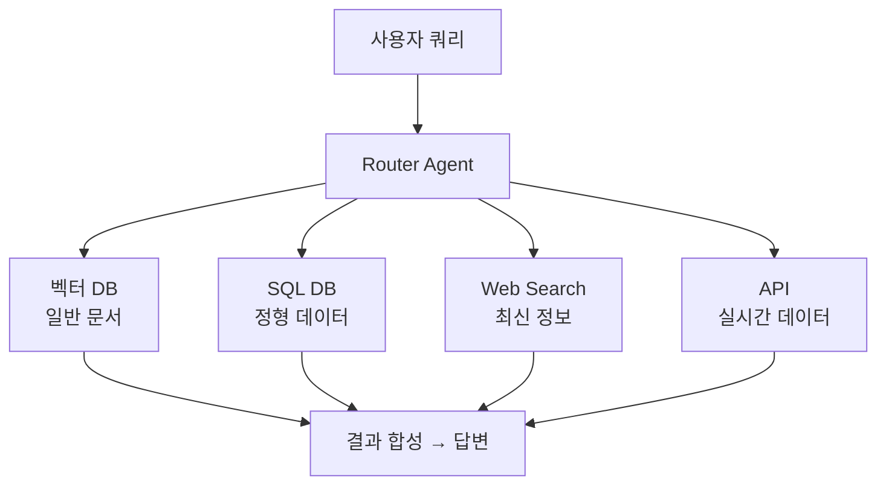
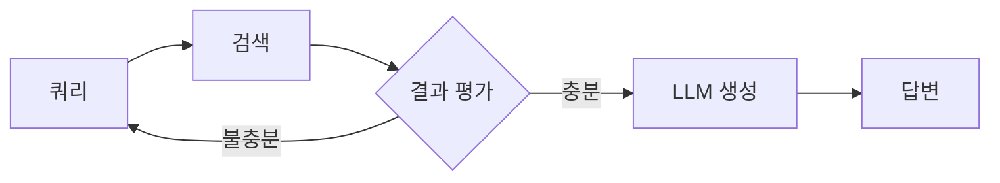
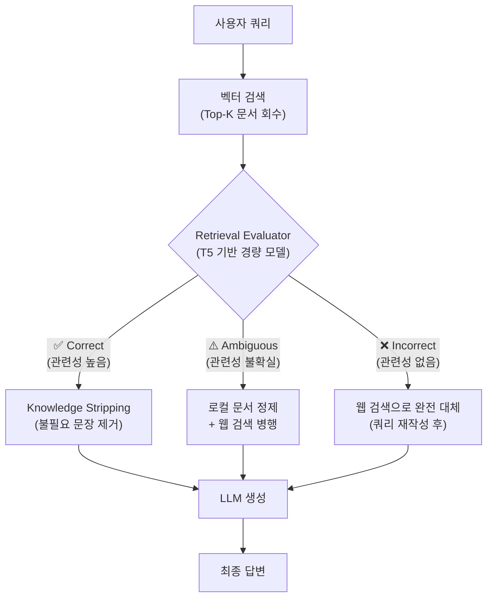
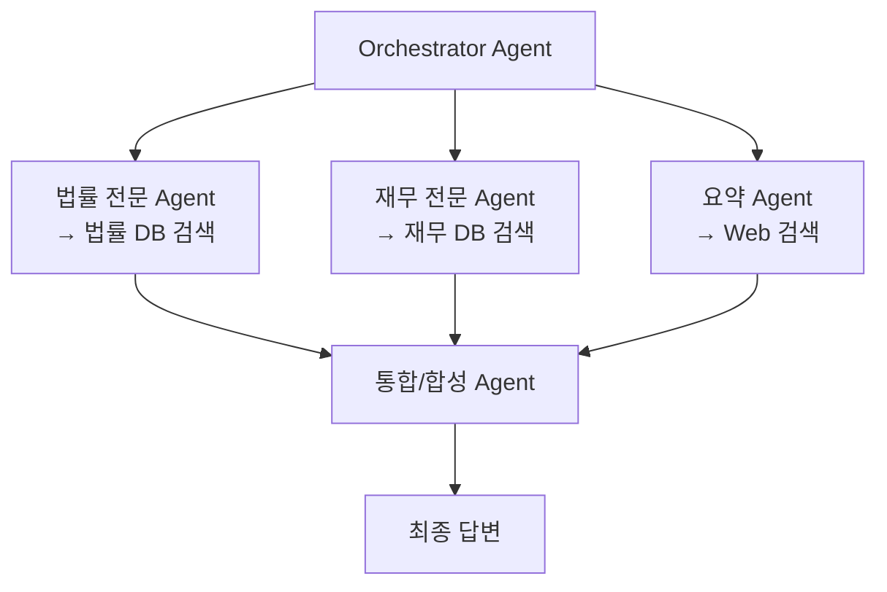
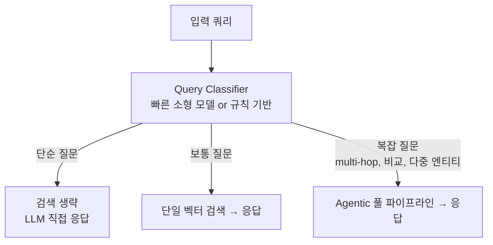
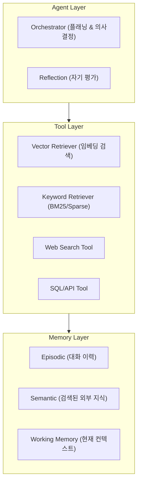

# Agentic RAG

## 개요

**Agentic RAG**는 기존 RAG 파이프라인에 자율 에이전트(autonomous agent)를 결합한 아키텍처다. 단순히 "쿼리 → 검색 → 생성"의 선형 흐름을 따르는 Naive RAG와 달리, LLM이 *무엇을 언제 어떻게 검색할지*를 스스로 결정하고, 결과가 충분하지 않으면 재검색하거나 다른 도구를 동원하는 **제어 루프(control loop)** 형태로 동작한다.

2025년 기준 논문(Agentic RAG Survey, arXiv 2501.09136)은 이를 다음과 같이 정의한다:

> "Agentic RAG embeds autonomous AI agents into the RAG pipeline, leveraging agentic design patterns — reflection, planning, tool use, and multi-agent collaboration — to dynamically manage retrieval strategies."

## Naive RAG vs Advanced RAG vs Agentic RAG



| 구분 | Naive RAG | Advanced RAG | Agentic RAG |
|------|-----------|--------------|-------------|
| 검색 횟수 | 1회 고정 | 1회(고도화) | 동적(필요시 반복) |
| 검색 소스 | 단일 벡터 DB | 하이브리드 | 다중 도구/DB |
| 자기 평가 | 없음 | 없음 | 있음 |
| Multi-hop 추론 | 불가 | 부분 가능 | 가능 |
| 비용 | 낮음 | 중간 | 높음(~10x) |
| 복잡 쿼리 정확도 | ~34% | ~60% | ~89% |

## 핵심 아키텍처 패턴

### 1. Single-Agent Router 패턴

가장 단순한 형태. 에이전트가 쿼리를 분석해 적합한 검색 도구나 지식 소스로 라우팅한다.



### 2. Iterative Retrieval 패턴

검색 결과를 평가하고, 불충분하면 추가 검색을 반복한다.



**Self-RAG** (Asai et al., 2023)가 이 패턴의 대표 구현이다. 특수 reflection token(`[Retrieve]`, `[IsRel]`, `[IsSup]`)을 생성해 스스로 검색 필요성과 결과 적절성을 판단한다.

### 3. Corrective RAG (CRAG) 패턴

Yan et al. (2024)이 제안한 패턴으로, 검색 결과에 경량 평가자(evaluator/grader)를 끼워 품질을 판정하고, 판정 결과에 따라 세 가지 경로 중 하나로 분기한다. 잘못된 컨텍스트가 그대로 LLM에 주입되어 발생하는 환각을 구조적으로 차단한다 [5].



**핵심 구성 요소:**

**Retrieval Evaluator**: T5 기반 경량 모델로 문서-쿼리 관련성을 Correct / Ambiguous / Incorrect로 분류. Naive RAG의 "검색 결과를 그대로 사용"과 달리 검색 품질에 조건부로 반응한다.

**Knowledge Stripping**: Correct 판정 시 전체 청크를 그대로 쓰지 않고, 쿼리와 직접 관련된 "knowledge strips"만 추출해 컨텍스트 노이즈를 줄인다.

**쿼리 재작성(Query Rewriting)**: Incorrect 판정 시 웹 검색 전 쿼리를 보다 검색 친화적 형태로 변환 후 실행. 단순 폴백이 아니라 개선된 쿼리로 재시도한다.

**성능**: 2025 MDPI 벤치마크 — CRAG Precision@5 = 0.69, 환각률 10.5%, 지연 240ms. Naive RAG 대비 환각률 약 40% 감소 [5].

**CRAG의 한계**: 평가자 판정이 틀릴 경우 (False Negative) 좋은 문서를 버리거나 불필요한 웹 검색을 실행. 웹 검색 의존 시 인터넷 연결 필수이며 지연이 증가한다. 평가자 자체도 추가 인퍼런스 비용 발생.

### 4. Multi-Agent RAG 패턴

복수의 전문화된 에이전트가 병렬로 검색·처리한 후 결과를 통합한다.



단일 에이전트로는 스코프를 커버하기 어려울 때, 즉 도메인이 여럿이거나 병렬 검색이 필요할 때 사용한다.

## Query Routing (쿼리 라우팅)

Adaptive RAG의 핵심은 쿼리 복잡도에 따라 적합한 전략으로 라우팅하는 것이다.



복잡도 판별 신호:
- 쿼리 길이 및 절의 수
- "비교하면", "그리고 또한", "~와의 관계" 등 multi-hop 마커
- 엔티티 수 (2개 이상이면 복잡)

일반적으로 전체 트래픽의 70-85%는 Classic RAG로, 나머지 15-30%만 Agentic RAG로 처리한다. Agentic RAG는 쿼리당 비용이 ~10배 높기 때문이다.

## 핵심 구성 요소



## 프레임워크 지원

| 프레임워크 | 지원 패턴 |
|-----------|----------|
| **LangGraph** | 상태 그래프 기반 Agentic RAG, CRAG, Self-RAG 구현 |
| **LlamaIndex** | `AgentRunner`, `RouterRetriever`, Iterative RAG |
| **LangChain** | `create_react_agent` + RAG tools |
| **AutoGen** | Multi-Agent RAG, 에이전트 간 검색 협력 |

## 성능 트레이드오프

```
Multi-hop 추론:
  Naive RAG:   ~34% 정확도
  Agentic RAG: ~89% 정확도

Self-RAG 환각률:
  일반 RAG 대비 5.8% (임상 QA 기준 최저)

비용:
  Agentic RAG ≈ Naive RAG × 10 (LLM 호출 증가)
  → 단순 쿼리에는 Classic RAG 유지 필요
```

## 언제 Agentic RAG를 써야 하는가

**쓸 때:**
- 답변이 여러 문서/DB를 교차해야 하는 multi-hop 질문
- 단일 검색으로 충분하지 않고 추론-재검색 루프가 필요한 경우
- 여러 이종 데이터 소스(SQL, API, 문서)를 통합해야 할 때
- 결과의 정확성 보장이 비용보다 중요한 도메인 (의료, 법률, 금융)

**쓰지 말아야 할 때:**
- 단순 FAQ나 단일 문서 검색으로 충분한 쿼리
- 지연(latency)이 극도로 중요한 실시간 서비스
- 비용 제약이 있는 고빈도 단순 쿼리

## AI Engineering에서의 역할

Agentic RAG는 Context Engineering과 Agent Engineering의 **교차점**에 위치한다. RAG가 "어떤 지식을 컨텍스트에 넣을 것인가"를 다루는 패시브 파이프라인이었다면, Agentic RAG는 에이전트가 스스로 지식 수집 전략을 결정하는 **능동적 인식 루프**다.

엔터프라이즈 QA, 법률 리서치, 의료 정보 검증, 복잡한 금융 분석 등 단순 검색으로는 한계가 있는 도메인의 사실상 표준 아키텍처로 자리잡고 있다.

## 관련 개념

[[RAG]] · [[Advanced_Retrieval]] · [[HyDE]] · [[../GraphRAG/GraphRAG|GraphRAG]] · [[../../Agent_Engineering/Agent_Architectures|Agent Architectures]] · [[../../Agent_Engineering/Planning_and_Reflection|Planning & Reflection]]

## 출처

- Asai et al. (2025) "Agentic Retrieval-Augmented Generation: A Survey on Agentic RAG" — [arXiv:2501.09136](https://arxiv.org/abs/2501.09136)
- Asai et al. (2023) "Self-RAG: Learning to Retrieve, Generate, and Critique through Self-Reflection" — [arXiv:2310.11511](https://arxiv.org/abs/2310.11511)
- [5] Yan et al. (2024) "CRAG — Corrective Retrieval Augmented Generation" — [arXiv:2401.15884](https://arxiv.org/abs/2401.15884)
- [6] Analytics Vidhya "Corrective RAG (CRAG) in Action" (2024) — [analyticsvidhya.com](https://www.analyticsvidhya.com/blog/2024/12/corrective-rag/)
- Weaviate "What Is Agentic RAG?" — [weaviate.io/blog/what-is-agentic-rag](https://weaviate.io/blog/what-is-agentic-rag)
- Neo4j "What is Agentic RAG?" — [neo4j.com/blog/agentic-ai/what-is-agentic-rag](https://neo4j.com/blog/agentic-ai/what-is-agentic-rag/)
