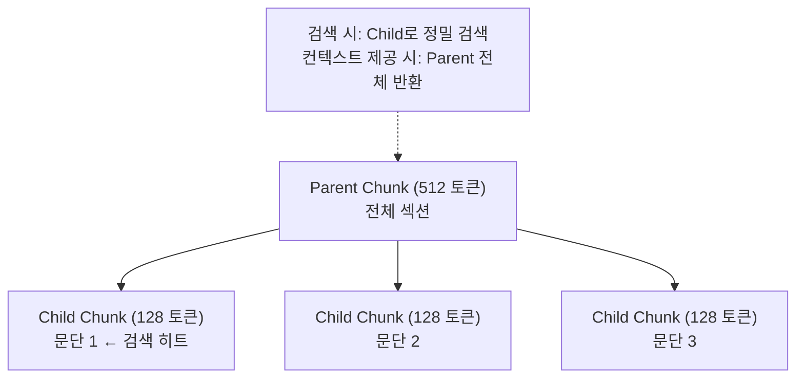

# Chunking Strategies (청킹 전략)

## 개요

**Chunking**은 RAG(Retrieval-Augmented Generation) 파이프라인에서 원본 문서를 LLM의 컨텍스트 창에 맞는 작은 단위(**청크**)로 분할하는 과정이다. 청킹 전략은 검색 품질에 직접적인 영향을 미치며, "너무 크면 노이즈, 너무 작으면 컨텍스트 손실"이라는 트레이드오프를 해결해야 한다.

## 왜 중요한가

```
청크가 너무 크면:
  - 관련 없는 내용이 컨텍스트에 포함
  - 검색 정밀도↓ (주제가 섞임)
  
청크가 너무 작으면:
  - 컨텍스트 단절 (문장이 잘림)
  - 검색 재현율↓ (완전한 의미 손실)
```

## 주요 청킹 전략

### 1. Fixed-Size Chunking (고정 크기)

가장 단순한 방식. 문자 수 또는 토큰 수로 일정하게 분할:

```python
from langchain.text_splitter import RecursiveCharacterTextSplitter

splitter = RecursiveCharacterTextSplitter(
    chunk_size=512,      # 청크 크기 (토큰)
    chunk_overlap=50,    # 청크 간 겹침 (컨텍스트 연속성)
)
chunks = splitter.split_text(document)
```

**장점**: 빠르고 구현이 간단. 비용 효율적.
**단점**: 문장 중간에서 잘릴 수 있음.
**Overlap**: 연속되는 청크 간 10~20% 겹침으로 경계 손실 완화.
**추천 크기**: 일반적으로 512 토큰 (128~1024 범위에서 태스크별 조정).

### 2. Semantic Chunking (의미론적)

임베딩 유사도를 이용해 **의미적으로 연관된 문장**을 하나의 청크로 묶음:

```python
from langchain_experimental.text_splitter import SemanticChunker
from langchain_openai.embeddings import OpenAIEmbeddings

chunker = SemanticChunker(
    embeddings=OpenAIEmbeddings(),
    breakpoint_threshold_type="percentile",  # 분할 기준
    breakpoint_threshold_amount=95,          # 상위 5% 불유사 지점에서 분할
)
```

**작동 방식**:
```
문장1 → embed → [0.2, 0.8, ...]
문장2 → embed → [0.3, 0.7, ...]  # 유사 → 같은 청크
문장3 → embed → [0.9, 0.1, ...]  # 불유사 → 새 청크 시작
```

**장점**: 의미적 완결성 높음. 재현율 최대 +9% (고정 크기 대비).
**단점**: 인덱싱 시 임베딩 계산 비용 발생. 속도 느림.

### 3. Hierarchical Chunking (계층적)

**Parent-Child** 구조: 작은 청크(검색용)와 큰 청크(컨텍스트용)를 함께 유지:



```python
# LlamaIndex의 Hierarchical Node Parser
from llama_index.node_parser import HierarchicalNodeParser

parser = HierarchicalNodeParser.from_defaults(
    chunk_sizes=[2048, 512, 128]  # 3단계 계층
)
```

**장점**: 정밀도(Child)와 컨텍스트(Parent) 동시 확보. 프로덕션 권장.
**단점**: 인덱스 복잡도↑.

### 4. Document-Level Chunking (문서 단위)

짧은 문서(FAQ, 티켓, 제품 설명)는 분할 없이 전체를 하나의 청크로:
```python
# 청킹 없이 문서 전체 임베딩
chunks = [Document(page_content=full_document, metadata={"source": url})]
```

**적합 케이스**: FAQ, 짧은 설명서, 뉴스 기사.

### 5. Context-Aware Chunking (컨텍스트 인식)

각 청크에 **문서 전체 맥락 요약**을 앞에 붙여 임베딩:
```
청크 원본: "이 방법은 O(n log n) 복잡도를 가진다."

컨텍스트 추가 후:
"이 문서는 정렬 알고리즘을 비교한다. 
 이 문서에서 이 청크는 병합 정렬의 시간 복잡도를 설명한다.
 
 이 방법은 O(n log n) 복잡도를 가진다."
```
Anthropic의 Contextual Retrieval(2024)에서 제안. Recall ↑49%, Full RAG errors ↓67%.

## 청크 크기 선택 가이드

| 문서 유형 | 추천 청크 크기 | 전략 |
|----------|--------------|------|
| 법률·계약서 | 512~1024 토큰 | 의미론적 + Overlap |
| 코드 | 함수/클래스 단위 | 구문 기반 |
| FAQ | 문서 단위 | 분할 안 함 |
| 긴 보고서 | 128~512 + Parent | 계층적 |
| 학술 논문 | 단락 단위 | 의미론적 |

## 성능 비교 (NVIDIA 2024 벤치마크)

| 전략 | 정확도 | 분산 |
|------|-------|------|
| Page-level | 0.648 | 낮음 (가장 안정적) |
| Semantic | +9% recall | 중간 |
| Fixed-512 | 경쟁력 있음 | 낮음 |
| Hierarchical | 최고 균형 | 낮음 |

## AI Engineering에서의 역할

청킹 전략은 RAG 시스템의 **기반**이다. 잘못된 청킹은 좋은 임베딩 모델이나 검색 알고리즘으로도 보완하기 어렵다. 프로덕션에서는 태스크·문서 특성에 맞는 전략을 실험으로 검증한 후 선택해야 한다.

## 관련 개념
[[Vector_Storage]] · [[Advanced_Retrieval]] · [[HyDE]]

## 출처
- Atlan "Chunking Strategies for RAG: Methods, Trade-offs & Best Practices" — [atlan.com](https://atlan.com/know/chunking-strategies-rag/)
- Firecrawl "Best Chunking Strategies for RAG (and LLMs) in 2026" — [firecrawl.dev](https://www.firecrawl.dev/blog/best-chunking-strategies-rag)
- Anthropic "Contextual Retrieval" (2024) — [anthropic.com](https://www.anthropic.com/news/contextual-retrieval)
- Mix-of-Granularity Paper (2024) — [arXiv:2406.00456](https://arxiv.org/pdf/2406.00456)
