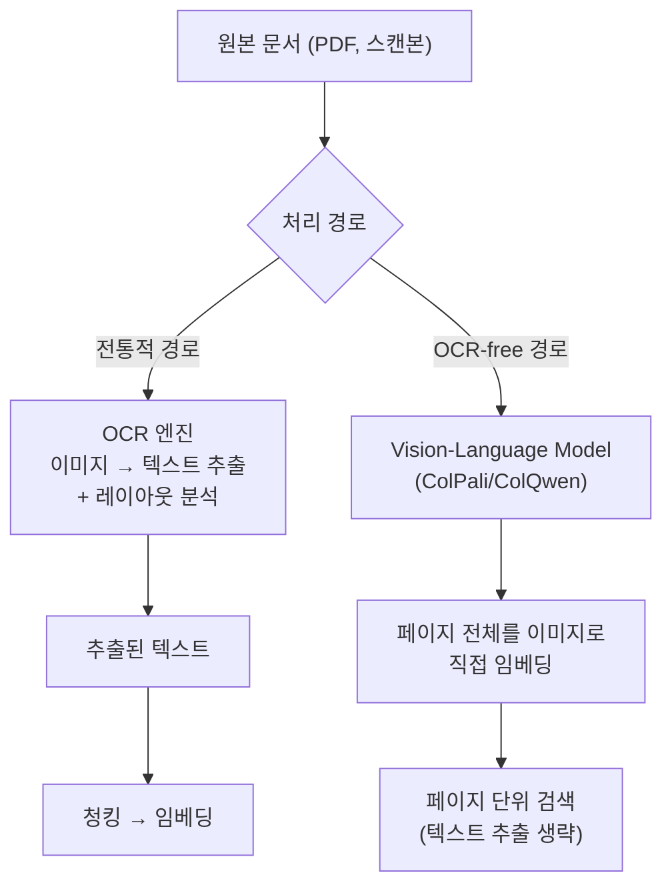

# Document Ingestion (문서 수집·파싱)

## 개요

[[AI/Engineering/Context_Engineering/Retrieval_Strategies/RAG/Chunking_Strategies|Chunking_Strategies]]는 "텍스트를 어떻게 자를 것인가"에서 시작하지만, 실무 문서(PDF, 스캔본, 스프레드시트, 프레젠테이션)는 애초에 **텍스트가 아니다**. 레이아웃·표·수식·다단 구성이 뒤섞인 원본 파일에서 청킹 가능한 텍스트를 뽑아내는 단계가 청킹보다 먼저 있어야 한다. 이 단계의 품질이 나쁘면 이후 청킹·임베딩·리랭킹을 아무리 정교화해도 상한선이 낮게 고정된다.

## 파싱해야 하는 것들

```
평문 텍스트(.txt) → 그대로 청킹 가능

PDF/문서 파일 → 파싱 필요:
  - 다단 레이아웃 (컬럼 순서를 잘못 읽으면 문장이 뒤섞임)
  - 표(Table) — 셀 구조를 유지한 채 텍스트로 직렬화해야 의미 보존
  - 수식 — LaTeX/MathML로 변환하거나 이미지로 별도 처리
  - 스캔 문서 — 텍스트 레이어가 없어 OCR 필수
  - 헤더/푸터/페이지 번호 — 본문과 섞이면 노이즈
```

## OCR 경유 vs OCR-free 두 노선



**OCR 경유**: 텍스트를 명시적으로 추출한 뒤 기존 RAG 파이프라인(청킹→임베딩→검색)에 그대로 태운다. 텍스트 추출 오류(표 구조 붕괴, 수식 깨짐)가 그대로 하류로 전파되는 것이 약점이다.

**OCR-free**(ColPali/ColQwen 계열): 문서 페이지를 텍스트로 변환하지 않고 **이미지 그대로** Vision-Language Model에 넣어 임베딩한다. 레이아웃·표·차트·이미지가 뒤섞인 문서에서 OCR 오류 자체를 우회한다는 장점이 있다. 상세 아키텍처와 임베딩 방식은 [[AI/Engineering/Context_Engineering/Retrieval_Strategies/RAG/Multimodal_RAG|Multimodal_RAG]]와 [[AI/Engineering/Context_Engineering/Retrieval_Strategies/Embedding_Models|Embedding_Models]] 참고.

## 도구 지형

| 도구 | 방식 | 특징 |
|------|------|------|
| **Unstructured.io** | 레이아웃 감지 + OCR 통합 | 다양한 파일 포맷(PDF/HTML/DOCX/PPTX 등) 폭넓게 지원, 오픈소스 |
| **LlamaParse** | LLM 기반 파싱 (LlamaIndex 생태계) | 복잡한 표·중첩 레이아웃에 강함, 관리형 API |
| **Docling** (IBM) | 레이아웃 모델 + 표 구조 인식 | 오픈소스, 표·수식 구조 보존에 특화 |
| **Marker** | PDF → Markdown 변환 | 빠른 처리 속도, 학술 논문 등 정형 레이아웃에 강함 |

## 메타데이터 추출과 구조 보존

파싱 단계에서 손실되기 쉬운 것은 텍스트 내용이 아니라 **구조 정보**다.

```
보존해야 할 메타데이터:
  - 문서 내 위치(페이지 번호, 섹션 제목 계층)
  - 표/그림의 캡션과 원본 위치 연결
  - 작성일·작성자·버전(문서 신선도 판단에 필요)

구조가 무너지면 생기는 문제:
  "표 3번을 참고하라"는 본문 문장이 청킹 후 표 3번과 분리되어
  청크만 봐서는 무엇을 참고하라는 것인지 알 수 없어짐
  → 청킹 전략(Chunking_Strategies)이 아무리 좋아도 원본 구조 정보가 없으면 복구 불가
```

## 증분 인덱싱과 재처리 비용

문서가 갱신될 때마다 전체 코퍼스를 다시 파싱·청킹·임베딩하는 것은 비용이 크다.

```
변경 감지 전략:
  - 파일 해시(content hash) 비교 → 변경된 문서만 재처리
  - 청크 단위 해시 → 문서 내 일부 섹션만 바뀌어도 해당 청크만 재임베딩
  - 버전 태깅 → 이전 임베딩을 즉시 폐기하지 않고 병행 서빙 후 전환(blue-green과 유사)
```

## 경계 정리

| 문서 | 다루는 것 |
|------|-----------|
| **본 문서 (Document_Ingestion)** | 원본 파일에서 **청킹 가능한 텍스트/구조를 추출**하는 단계 — 파싱, OCR, 메타데이터 보존 |
| [[AI/Engineering/Context_Engineering/Retrieval_Strategies/RAG/Chunking_Strategies|Chunking_Strategies]] | 추출된 텍스트를 **의미 단위로 분할**하는 단계 |
| [[AI/Engineering/Context_Engineering/Retrieval_Strategies/RAG/Multimodal_RAG|Multimodal_RAG]] | OCR-free 경로를 포함해 **이미지·텍스트 혼합 검색**을 다루는 단계 |

## AI Engineering에서의 역할

RAG 파이프라인 품질 저하의 상당수는 리랭킹이나 임베딩 모델이 아니라 **이 첫 단계**에서 이미 결정된다 — 표가 깨진 채로 청킹되거나, 페이지 순서가 뒤섞인 채로 임베딩되면 그 뒤의 모든 최적화는 손상된 입력 위에서 이루어진다. RAG 프로젝트 트러블슈팅 시 검색 알고리즘을 의심하기 전에 이 단계의 출력을 먼저 육안으로 검사하는 것이 실무에서 가장 빠른 디버깅 경로인 경우가 많다.

## 관련 개념
[[AI/Engineering/Context_Engineering/Retrieval_Strategies/RAG/Chunking_Strategies|Chunking_Strategies]] · [[AI/Engineering/Context_Engineering/Retrieval_Strategies/RAG/Multimodal_RAG|Multimodal_RAG]] · [[AI/Engineering/Context_Engineering/Retrieval_Strategies/Embedding_Models|Embedding_Models]] · [[AI/Engineering/Context_Engineering/Retrieval_Strategies/NL2SQL/NL2SQL|NL2SQL]]

## 출처
- Unstructured.io 공식 문서 — [docs.unstructured.io](https://docs.unstructured.io)
- LlamaParse 공식 문서 — [docs.llamaindex.ai](https://docs.llamaindex.ai/en/stable/llama_cloud/llama_parse/)
- Docling (IBM) — [github.com/docling-project/docling](https://github.com/docling-project/docling)
- Faysse et al. (2024) "ColPali: Efficient Document Retrieval with Vision Language Models" — [arXiv:2407.01449](https://arxiv.org/abs/2407.01449)
