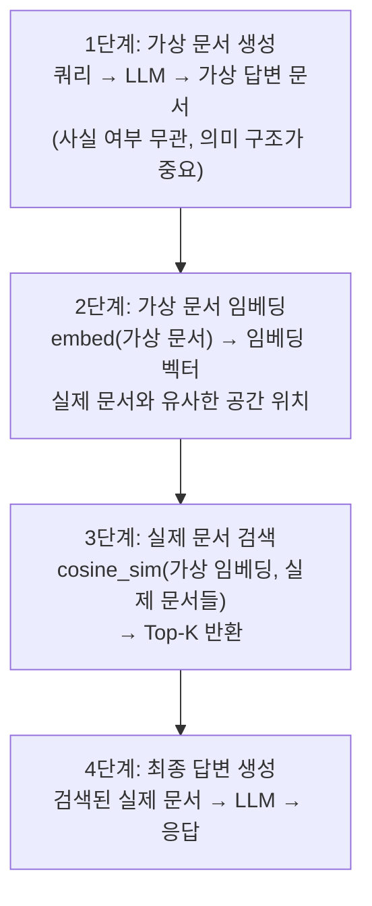
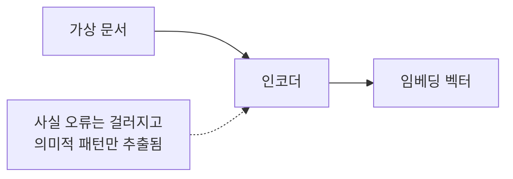

# HyDE (Hypothetical Document Embeddings)

## 개요

**HyDE**(Hypothetical Document Embeddings)는 사용자 쿼리에 대한 **가상의 답변 문서**를 LLM으로 생성하고, 그 가상 문서의 임베딩으로 실제 문서를 검색하는 기법이다. 쿼리와 문서 간의 **표현 불일치(representation gap)** 문제를 해결한다.

## 제창

- **저자**: Gao et al. (2022)
- **논문**: "Precise Zero-Shot Dense Retrieval without Relevance Labels" — [arXiv:2212.10496](https://arxiv.org/abs/2212.10496)

## 문제: Query-Document Gap

```
쿼리 표현: "파이썬에서 리스트 정렬하는 방법"
  → 짧은 자연어 질문 스타일

문서 표현: "Python의 list.sort() 메서드는 in-place 정렬을 수행하며..."
  → 긴 설명문 스타일

→ 임베딩 공간에서 두 표현의 거리가 멀 수 있음
```

## HyDE 작동 방식



## 구현 예시

```python
from langchain.chains import HypotheticalDocumentEmbedder
from langchain_openai import OpenAI, OpenAIEmbeddings

# 가상 문서 생성 LLM
llm = OpenAI()

# HyDE 임베딩
embeddings = OpenAIEmbeddings()
hyde_embeddings = HypotheticalDocumentEmbedder.from_llm(
    llm=llm,
    embeddings=embeddings,
    prompt_key="web_search"  # 태스크별 프롬프트
)

# 검색 시 자동으로 가상 문서 생성 후 임베딩
query = "파이썬 리스트 정렬 방법"
results = vectorstore.similarity_search_by_vector(
    hyde_embeddings.embed_query(query),
    k=5
)
```

## HyDE가 효과적인 이유

Dense Contrastive Encoder의 **Dense Bottleneck** 특성:


잘못된 사실을 포함하더라도 **올바른 의미적 방향**으로 검색할 수 있음.

## 장단점

### 장점
- 쿼리-문서 표현 불일치 해소
- Zero-shot (추가 학습 없이) 성능 향상
- 특히 전문 도메인(의료, 법률, 기술)에서 효과적
- 단순 쿼리 임베딩 대비 recall↑

### 단점
- 가상 문서 생성 비용 (LLM 추가 호출)
- 레이턴시 증가 (생성 시간 추가)
- 가상 문서의 환각이 심하면 검색 방향이 잘못될 수 있음
- 짧고 명확한 쿼리에는 효과 제한적

## 적합한 케이스

```
효과 높음:
  - 전문 기술 문서 검색 (API 문서, 논문)
  - 도메인 특화 QA (의료, 법률)
  - 쿼리가 짧고 문서가 긴 경우
  - 개념 설명을 찾는 경우

효과 낮음:
  - 쿼리가 이미 문서 언어와 유사한 경우
  - 사실 확인형 쿼리 (날짜, 수치 등)
  - 실시간 레이턴시가 중요한 경우
```

## Multi-HyDE 변형

여러 가상 문서를 생성하고 임베딩을 평균:
```python
# 3개 가상 문서 생성
hypothetical_docs = [llm.generate(query) for _ in range(3)]
# 임베딩 평균
avg_embedding = np.mean([embeddings.embed(doc) for doc in hypothetical_docs], axis=0)
# 평균 임베딩으로 검색
results = vectorstore.similarity_search_by_vector(avg_embedding)
```

## AI Engineering에서의 역할

HyDE는 Advanced Retrieval 기법 중 쿼리 변환 계열의 대표 기법이다. 특히 전문 도메인에서 RAG 파이프라인의 recall을 높이는 데 효과적이며, 비용 대비 효과 측면에서 reranking과 보완적으로 사용하면 시너지가 크다.

## 관련 개념
[[Advanced_Retrieval]] · [[Chunking_Strategies]] · [[Vector_Storage]]

## 출처
- Gao et al. (2022) "Precise Zero-Shot Dense Retrieval without Relevance Labels" — [arXiv:2212.10496](https://arxiv.org/abs/2212.10496)
- Machine Learning Plus "HyDE for RAG Explained" — [machinelearningplus.com](https://machinelearningplus.com/gen-ai/hypothetical-document-embedding-hyde-a-smarter-rag-method-to-search-documents/)
- Zilliz "Better RAG with HyDE" — [zilliz.com](https://zilliz.com/learn/improve-rag-and-information-retrieval-with-hyde-hypothetical-document-embeddings)
