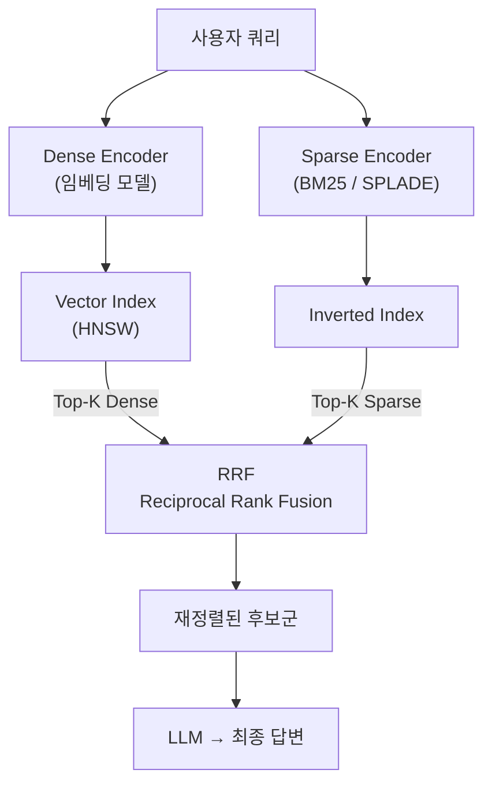
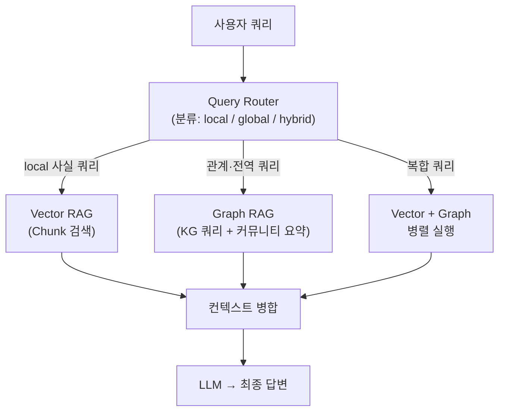
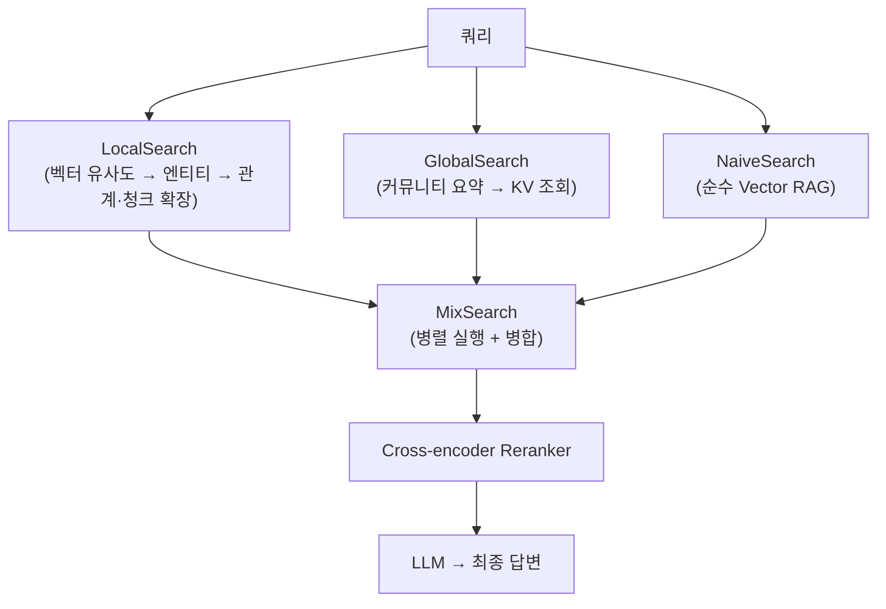

# Hybrid RAG

## 개요

"Hybrid RAG"는 두 가지 독립된 의미로 쓰인다.

| 유형 | 조합 | 주요 목적 |
|------|------|-----------|
| **Hybrid Search RAG** | Dense(벡터) + Sparse(BM25/SPLADE) | 검색 Recall 향상 |
| **Vector + Graph RAG** | Vector RAG + GraphRAG(Knowledge Graph) | 로컬 유사도 + 전역 구조 동시 처리 |

두 개념은 서로 독립적이며, 실전에서는 셋 모두를 조합하는 "Full Hybrid" 구성도 가능하다.

---

## 1. Hybrid Search RAG (Dense + Sparse)

### 원리

Dense 벡터 검색과 Sparse 키워드 검색(BM25/SPLADE)을 병렬로 실행한 뒤, **Reciprocal Rank Fusion(RRF)** 으로 결과를 합산한다. 두 방식이 서로 다른 쿼리 유형에서 실패하기 때문에, 조합하면 각각의 약점을 상호 보완한다.

단일 Dense 검색 대비 Recall@10 기준 15~30% 향상이 보고되며[1], Weaviate·Qdrant·Pinecone·Elasticsearch 등 주요 벡터 DB에서 기본(production default)으로 채택됐다[2].

### Dense vs Sparse 비교

| 특성 | Dense (벡터) | Sparse (BM25/SPLADE) |
|------|-------------|----------------------|
| 표현 방식 | 연속 실수 벡터 (768~4096차원) | 고차원 희소 벡터 (어휘 크기) |
| 잘하는 것 | 의미적 유사도, 패러프레이즈 | 정확한 용어 매칭, 고유명사, 코드 |
| 못하는 것 | 희귀 용어, 정확 매칭 | 의미 추론, 동의어 |
| 대표 모델 | text-embedding-3, BGE, E5 | BM25, SPLADE, BM42 |
| 인덱스 구조 | HNSW (ANN) | 역색인 (Inverted Index) |

**BM25 vs SPLADE**: BM25는 토큰 빈도(TF-IDF 계열) 기반으로 학습 없이 동작한다. SPLADE는 BERT 기반 Masked LM으로 암묵적 term expansion을 수행해 "automobile" 문서에 "car", "vehicle" 가중치를 자동 부여한다. BEIR 벤치마크에서 BM25보다 일관적으로 우세하나 추론 비용이 발생한다[3].

### 파이프라인



① 쿼리를 Dense/Sparse 인코더에 동시에 전달  
② 각 인덱스에서 Top-50~100 후보 검색 (병렬)  
③ RRF로 두 랭킹 리스트를 수학적으로 결합  
④ 결합된 Top-K를 LLM 컨텍스트로 주입

### RRF (Reciprocal Rank Fusion)

점수 스케일 불일치 문제(Dense: 코사인 0.6~0.95, Sparse: BM25 0~15)를 피하기 위해 점수 대신 **순위(rank)만** 사용하는 rank-only 알고리즘이다.

```
RRF(d) = Σ  1 / (k + rank_i(d))
  k = 60  (기본값; 상위 랭크 집중 완화)
  rank_i(d) = retriever i에서 문서 d의 순위
```

---

## 2. Vector + Graph Hybrid RAG

### 원리

**Vector RAG** (비정형 텍스트 청크 검색)와 **GraphRAG** (Knowledge Graph 엔티티·관계 쿼리)를 결합한다. 두 retriever가 서로 다른 유형의 지식을 담당하며, Query Router 또는 병렬 실행으로 결합한다.

Microsoft의 GraphRAG 논문(Edge et al., 2024)이 "local mode"(엔티티 기반 벡터 검색)와 "global mode"(커뮤니티 요약 검색)를 나눈 것과 같은 맥락이다. 실전에서는 두 모드를 결합한 "hybrid mode"가 가장 높은 성능을 보인다[4]. Sarmah et al. (2024)은 금융 문서(earnings call transcript) 도메인에서 VectorRAG와 GraphRAG를 결합한 HybridRAG가 두 방식 각각보다 retrieval accuracy와 answer generation 모두에서 우수함을 실험으로 검증했다[5].

### 각 Retriever의 역할

| 질문 유형 | 적합한 Retriever | 예시 |
|-----------|-----------------|------|
| 특정 문서 내 사실 확인 | Vector RAG | "A 제품의 스펙은?" |
| 엔티티 간 관계 추론 | Graph RAG | "A와 B는 어떤 관계인가?" |
| 전역 요약·패턴 파악 | Graph RAG (커뮤니티) | "이 도메인의 핵심 토픽은?" |
| 의미적 유사 문서 탐색 | Vector RAG | "이 개념과 비슷한 사례는?" |

### 파이프라인



**구현 패턴**

- **Query Router**: LLM 분류기 또는 키워드 휴리스틱으로 쿼리 유형을 판별해 적합한 retriever로 라우팅
- **병렬 실행 + 컨텍스트 병합**: 두 retriever를 항상 동시에 실행하고 결과를 합쳐 LLM에 전달 (컨텍스트 윈도우 내에 수용 가능한 경우)
- **Agentic RAG**: Agent가 실행 중 동적으로 Vector/Graph 검색을 선택 → [[AI/Engineering/Context_Engineering/Retrieval_Strategies/RAG/Agentic_RAG|Agentic RAG]] 참고

### 장단점

**장점**
- 사실 기반 쿼리(벡터)와 관계·전역 쿼리(그래프)를 단일 파이프라인에서 처리
- GraphRAG 단독 대비 로컬 사실 검색 품질 향상
- Vector RAG 단독 대비 복잡한 다중 홉 추론 가능

**단점**
- Knowledge Graph 구축·유지 비용 (엔티티 추출, 관계 링킹)
- 파이프라인 복잡도 증가 (두 인덱스 + 라우터 + 병합 로직)
- 컨텍스트 길이: 두 retriever 결과를 합치면 LLM 컨텍스트 윈도우 압박

---

## 3. Vector + Graph + Key-Value (Multi-Store Hybrid)

세 종류의 **스토리지 백엔드**를 조합하는 구성이다. 각 스토어가 서로 다른 유형의 지식을 담당한다.

| 스토어 | 역할 | 적합한 쿼리 |
|--------|------|-------------|
| **Vector Store** | 청크 임베딩 → 의미 유사도 검색 | "이 개념과 비슷한 내용은?" |
| **Graph DB** | 엔티티·관계 → 구조적 탐색 | "A와 B의 관계는? 다중 홉 추론" |
| **Key-Value Store** | 엔티티 속성·커뮤니티 요약 → 정확 조회 | "X의 요약 정보를 빠르게" |

### 대표 접근법

**StructRAG** (2024)[6]: **Hybrid Structure Router**가 쿼리 특성에 따라 최적 구조를 동적으로 선택한다. 5가지 후보 구조 중 하나를 DPO로 훈련된 라우터가 선택하고, 해당 구조로 문서를 변환한 뒤 답변을 생성한다.

| 구조 타입 | 해당 스토어 유형 | 적합한 태스크 |
|-----------|----------------|---------------|
| Table | 정형 Key-Value | 통계·비교 질문 |
| Graph | Graph DB | 다중 홉 추론, 관계 탐색 |
| Algorithm | 절차 표현 | 계획·순서 질문 |
| Catalogue | Key-Value 목록 | 전체 요약, 목록화 |
| Chunk | Vector Store | 단순 단일 홉 사실 검색 |

→ Router가 쿼리마다 하나의 최적 구조를 선택하므로, 동시 병렬 실행이 아닌 **동적 라우팅** 방식이다.

**RAGU** (2025)[7]: 세 스토리지 티어(graph DB + key-value store + vector store)를 **병렬로 동시 실행**하는 MixSearch 엔진을 제공한다.



- **LocalSearch**: Vector 유사도로 엔티티를 찾고, Graph DB로 관계·청크 확장
- **GlobalSearch**: Leiden 커뮤니티 요약을 KV Store에서 직접 조회
- **MixSearch**: 세 엔진을 모두 병렬 실행해 컨텍스트를 합산
- **QueryPlanEngine**: 복잡한 쿼리를 DAG로 분해해 순차·병렬 실행

---

## AI Engineering에서의 역할

[[Advanced_Retrieval]]의 Two-Stage 파이프라인에서 Stage 1(Recall 확보)을 담당한다: Hybrid Search(Dense+Sparse)로 Top-100을 뽑고 → Cross-encoder Reranker로 Top-5로 좁히는 조합이 현재 표준 실무 패턴이다. Vector+Graph 결합은 관계 추론이 필요한 도메인(의료, 법률, 지식 집약 산업)에서 특히 효과적이다. Multi-Store Hybrid(Vector+Graph+KV)는 단일 쿼리가 사실 검색·관계 탐색·전역 요약을 동시에 요구할 때 가장 큰 이점을 보이며, StructRAG의 Router 방식과 RAGU의 MixSearch 방식이 현재 대표적인 구현이다.

## 관련 개념

[[Advanced_Retrieval]] · [[Vector_Storage]] · [[AI/Engineering/Context_Engineering/Retrieval_Strategies/RAG/Agentic_RAG|Agentic RAG]] · [[AI/Engineering/Context_Engineering/Retrieval_Strategies/GraphRAG/GraphRAG|GraphRAG]] · [[AI/Engineering/Context_Engineering/Retrieval_Strategies/GraphRAG/Knowledge_Graph/Knowledge_Graph|Knowledge Graph]]

## 출처

1. Pinecone Research (2024) "Hybrid Search: 15-30% Retrieval Improvement" — [atlan.com/know/hybrid-rag](https://atlan.com/know/hybrid-rag/)
2. Digital Applied "Hybrid Search: BM25, Vector & Reranking Reference 2026" — [digitalapplied.com/blog/hybrid-search-bm25-vector-reranking-reference-2026](https://www.digitalapplied.com/blog/hybrid-search-bm25-vector-reranking-reference-2026)
3. GoPenAI "Hybrid Search in RAG: Dense + Sparse (BM25/SPLADE), Reciprocal Rank Fusion" — [blog.gopenai.com](https://blog.gopenai.com/hybrid-search-in-rag-dense-sparse-bm25-splade-reciprocal-rank-fusion-and-when-to-use-which-fafe4fd6156e)
4. Edge et al. (2024) "From Local to Global: A Graph RAG Approach to Query-Focused Summarization" — [arXiv:2404.16130](https://arxiv.org/abs/2404.16130)
5. Sarmah et al. (2024) "HybridRAG: Integrating Knowledge Graphs and Vector Retrieval Augmented Generation for Efficient Information Extraction" — ACM ICAIF '24 — [arXiv:2408.04948](https://arxiv.org/abs/2408.04948)
6. Xu et al. (2024) "StructRAG: Boosting Knowledge Intensive Reasoning of LLMs via Inference-time Hybrid Information Structurization" — [arXiv:2410.08815](https://arxiv.org/abs/2410.08815)
7. (2025) "RAGU: A Multi-Step GraphRAG Engine with a Compact Domain-Adapted LLM" — [arXiv:2607.11683](https://arxiv.org/abs/2607.11683)
