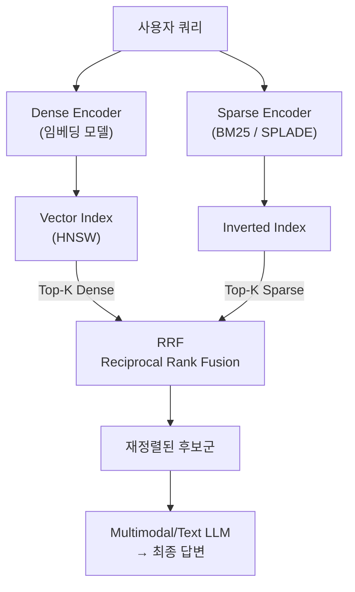

# Hybrid RAG

## 개요

**Hybrid RAG**는 Dense 벡터 검색과 Sparse 키워드 검색(BM25/SPLADE)을 병렬로 실행한 뒤, Reciprocal Rank Fusion(RRF)으로 결과를 합산하는 RAG 아키텍처다. 두 방식이 서로 다른 유형의 쿼리에서 실패하기 때문에, 조합함으로써 각각의 약점을 상호 보완한다.

단일 Dense 검색 대비 Recall@10 기준 15~30% 향상이 보고되며[1], Weaviate·Qdrant·Pinecone·Elasticsearch 등 주요 벡터 DB에서 기본(production default)으로 채택됐다 [2].

## Dense vs Sparse 비교

| 특성 | Dense (벡터) | Sparse (BM25/SPLADE) |
|------|-------------|----------------------|
| 표현 방식 | 연속 실수 벡터 (768~4096차원) | 고차원 희소 벡터 (어휘 크기) |
| 잘하는 것 | 의미적 유사도, 패러프레이즈 | 정확한 용어 매칭, 고유명사, 코드 |
| 못하는 것 | 희귀 용어, 정확 매칭 | 의미 추론, 동의어 |
| 대표 모델 | text-embedding-3, BGE, E5 | BM25, SPLADE, BM42 |
| 인덱스 구조 | HNSW (ANN) | 역색인 (Inverted Index) |

**BM25 vs SPLADE**: BM25는 토큰 빈도(TF-IDF 계열) 기반으로 학습 없이 동작한다. SPLADE는 BERT 기반 Masked LM으로 암묵적 term expansion을 수행해 "automobile" 문서에 "car", "vehicle" 가중치를 자동 부여한다. BEIR 벤치마크에서 BM25보다 일관적으로 우세하나 추론 비용이 발생한다 [3].

## 파이프라인



① 쿼리를 Dense/Sparse 인코더에 동시에 전달  
② 각 인덱스에서 Top-50~100 후보 검색 (병렬)  
③ RRF로 두 랭킹 리스트를 수학적으로 결합  
④ 결합된 Top-K를 LLM 컨텍스트로 주입

## RRF (Reciprocal Rank Fusion)

점수 스케일 불일치 문제(Dense: 코사인 0.6~0.95, Sparse: BM25 0~15)를 피하기 위해 점수 대신 **순위(rank)만** 사용하는 rank-only 알고리즘이다.

```
RRF(d) = Σ  1 / (k + rank_i(d))
  k = 60  (기본값; 상위 랭크 집중 완화)
  rank_i(d) = retriever i에서 문서 d의 순위
```

- 두 리스트 모두 상위에 있는 문서가 가장 높은 점수를 받음
- 한 쪽 리스트에만 있어도 일정 점수를 얻어 누락되지 않음
- 학습 불필요, 추가 지연 <10ms

### Weighted Sum vs RRF

| | Weighted Sum (α·dense + β·sparse) | RRF |
|---|---|---|
| 점수 정규화 필요 | 예 (Min-Max / Z-score) | 아니오 |
| 도메인 튜닝 필요 | α, β 최적화 필요 | 불필요 |
| 최신 지원 | Weaviate Hybrid 2.0 (동적 가중치) | 대부분 DB 기본값 |
| 권장 | 고도로 튜닝된 시스템 | 빠른 구현, 안정적 기본값 |

## 장단점

**장점**
- 정확 매칭(제품 코드, 법령 조항, 기술 용어)과 의미 검색을 동시에 처리
- 추가 학습 없이 즉시 적용 가능 (RRF)
- 기존 벡터 DB에 sparse 인덱스만 추가하면 구축 가능

**단점**
- Dense + Sparse 인덱스 두 개 유지 → 스토리지 1.5~2× 증가
- 인덱싱 시간 및 쿼리 지연 소폭 증가
- SPLADE 사용 시 인코딩 추론 비용 발생

## 적합한 사용 사례

| 사용 사례 | 이유 |
|-----------|------|
| 기술 문서 / API 레퍼런스 검색 | 함수명, 파라미터명 등 정확 매칭 필수 |
| 법률·계약서 검색 | 조항 번호, 법령명 정확 매칭 |
| 전자상거래 상품 검색 | SKU, 브랜드명 + 의미 검색 |
| 의학 문헌 검색 | 약물명, ICD 코드 + 의미 추론 |
| 다국어 코퍼스 | 언어별 희귀 용어 BM25로 보완 |

## 구현 체크리스트

```
□ 벡터 DB: Weaviate / Qdrant / Elasticsearch (hybrid search 내장)
□ Dense 인덱스: HNSW + 임베딩 모델 (BGE-M3, text-embedding-3-large 등)
□ Sparse 인덱스: BM25 (빠른 시작) 또는 SPLADE (더 높은 품질)
□ Fusion: RRF k=60 (기본값) → 도메인 데이터로 α, β 튜닝 (선택)
□ 평가: NDCG@10, Recall@K로 Dense-only 대비 검증
```

## AI Engineering에서의 역할

[[Advanced_Retrieval]]의 Two-Stage 파이프라인에서 Stage 1(Recall 확보)을 담당한다. 즉, Hybrid RAG로 Top-100을 뽑고 → Cross-encoder Reranker로 Top-5로 좁히는 조합이 현재 표준 실무 패턴이다.

## 관련 개념

[[Advanced_Retrieval]] · [[Vector_Storage]] · [[Agentic_RAG]] · [[../GraphRAG/GraphRAG]]

## 출처

- [1] Pinecone Research (2024) "Hybrid Search: 15-30% Retrieval Improvement" — [atlan.com/know/hybrid-rag](https://atlan.com/know/hybrid-rag/)
- [2] Digital Applied "Hybrid Search: BM25, Vector & Reranking Reference 2026" — [digitalapplied.com/blog/hybrid-search-bm25-vector-reranking-reference-2026](https://www.digitalapplied.com/blog/hybrid-search-bm25-vector-reranking-reference-2026)
- [3] GoPenAI "Hybrid Search in RAG: Dense + Sparse (BM25/SPLADE), Reciprocal Rank Fusion" — [blog.gopenai.com](https://blog.gopenai.com/hybrid-search-in-rag-dense-sparse-bm25-splade-reciprocal-rank-fusion-and-when-to-use-which-fafe4fd6156e)
- [4] Yan et al. (2024) "Corrective RAG" — 비교 참조 — [arXiv:2401.15884](https://arxiv.org/abs/2401.15884)
