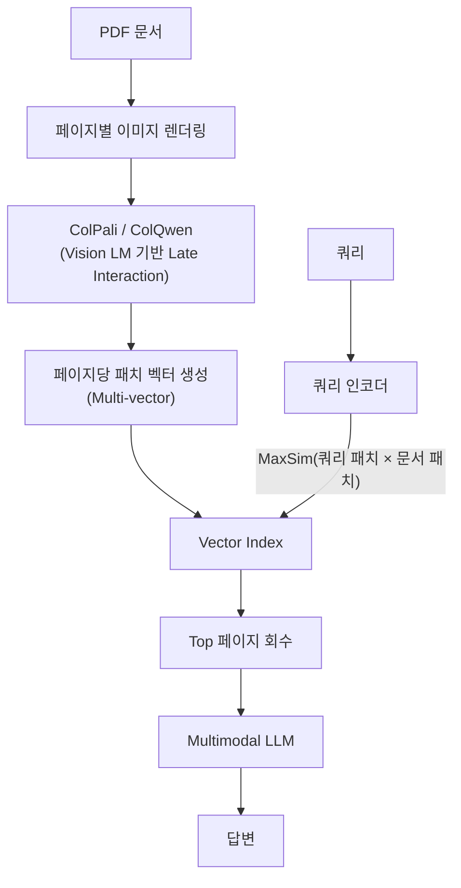

# Multimodal RAG

## 개요

**Multimodal RAG**는 텍스트뿐만 아니라 이미지·표·차트·PDF 페이지 등 시각 정보를 검색 단위로 처리하는 RAG 아키텍처다. 공유 임베딩 공간에 텍스트와 이미지를 함께 인덱싱하고, 멀티모달 LLM(GPT-4o, Gemini, Claude 3.5)이 혼합 컨텍스트에서 답변을 생성한다.

2025년 이후 ColPali(ICLR 2025), SV-RAG(ICLR 2025), URaG(AAAI 2026) 등 연구가 생산 수준으로 성숙해 더 이상 실험 단계가 아니다 [1][2].

## 왜 필요한가

기존 텍스트 전용 RAG는 다음 유형의 정보를 누락한다.

- **PDF 내 그래프·차트**: OCR로 변환하면 수치 관계가 손실됨
- **의료 영상·X-ray**: 텍스트 설명이 원본 이미지 정보를 완전히 대체할 수 없음
- **기술 도면·회로도**: 구조적 시각 정보
- **슬라이드 덱**: 레이아웃과 시각적 강조가 의미의 일부

Multimodal RAG는 이러한 시각 정보를 OCR 없이 직접 임베딩해 검색 대상으로 삼는다.

## 아키텍처

### ① CLIP/SigLIP 공유 임베딩 방식

텍스트와 이미지를 하나의 잠재 공간에 정렬하는 Dual-Encoder를 사용한다. 쿼리(텍스트)와 이미지 후보 모두 동일한 벡터 공간에서 코사인 유사도로 비교된다.

```mermaid
flowchart TD
    subgraph 인덱싱
        D["문서 (PDF/슬라이드)"]
        D --> TE["텍스트 청크<br/>Text Encoder"]
        D --> IE["이미지/페이지<br/>Image Encoder<br/>(CLIP / SigLIP-2)"]
        TE --> VI["Unified Vector Index"]
        IE --> VI
    end
    subgraph 검색·생성
        Q["사용자 쿼리"] --> QE["쿼리 인코더"]
        QE --> VI
        VI -->|"Top-K (텍스트+이미지 혼합)"| MM["Multimodal LLM<br/>(GPT-4o / Gemini / Claude)"]
        MM --> ANS["최종 답변"]
    end
```

**대표 모델**: CLIP (OpenAI), SigLIP-2 (Google), ALIGN (Google), voyage-multimodal-3 (Voyage AI, 2025)

### ② ColPali / ColQwen 방식 (OCR-free)

ColPali (Faysse et al., ICLR 2025)는 PDF 페이지를 **렌더링된 이미지 그대로** 처리하는 Late Interaction 방식이다. OCR 파이프라인 없이 문서 레이아웃·시각 요소를 보존한 채 검색한다.



OCR 실패가 잦은 수식·표·비라틴 문자가 많은 문서에서 텍스트 RAG 대비 명확히 우세하다 [3].

### 방식 비교

| | CLIP 공유 임베딩 | ColPali Late Interaction |
|---|---|---|
| OCR 필요 | 방식에 따라 다름 | 불필요 |
| 임베딩 수 | 이미지당 1벡터 | 이미지당 N벡터 (패치 수) |
| 저장 공간 | 적음 | 많음 (패치 × 벡터) |
| 검색 정확도 | 중간 | 높음 (레이아웃 보존) |
| 속도 | 빠름 | 느림 (MaxSim 연산) |
| 적합 사례 | 범용 이미지 검색 | 문서 페이지 검색 |

## 생성 단계

검색된 컨텍스트(텍스트 청크 + 이미지/페이지)를 Multimodal LLM에 그대로 전달한다.

```
컨텍스트 = [텍스트 청크 3개] + [이미지 2장] + [표 이미지 1장]
→ GPT-4o / Gemini 2.0 Flash / Claude 3.5 Sonnet → 답변
```

주요 Multimodal LLM: GPT-4o (OpenAI), Gemini 1.5/2.0 Pro·Flash (Google), Claude 3.5/3.7 Sonnet (Anthropic), Qwen3-VL (Alibaba)

## 장단점

**장점**
- OCR 실패·포맷 변환 손실 없이 원본 시각 정보 보존
- 텍스트+이미지 혼합 질문 처리 가능
- 슬라이드·PDF 중심 지식베이스에 즉시 적용 가능

**단점**
- 이미지 임베딩 비용 및 저장 공간 증가 (ColPali는 특히 높음)
- Multimodal LLM 호출 비용이 텍스트 전용보다 높음
- 정밀한 평가 지표 확립이 아직 진행 중 (UNIDOC-BENCH 등)

## 적합한 사용 사례

| 사용 사례 | 관련 모달리티 |
|-----------|--------------|
| 기업 PDF·슬라이드 QA | 페이지 이미지, 표, 차트 |
| 의료 영상 판독 보조 | X-ray, MRI + 텍스트 리포트 |
| 전자상거래 상품 검색 | 상품 이미지 + 설명 텍스트 |
| 지도·도면 검색 | 지리 이미지 + 메타데이터 |
| 학술 논문 검색 | 수식 이미지 + 텍스트 |

## 구현 스택 (2025~2026 기준)

```
임베딩 모델:  ColPali / voyage-multimodal-3 / SigLIP-2 / CLIP
벡터 DB:      Qdrant / Weaviate / pgvector (이미지 벡터 지원)
생성 LLM:     Gemini 2.0 Flash / GPT-4o / Claude 3.5 Sonnet
프레임워크:   LlamaIndex MultiModal / LangChain + GPT4V
```

## AI Engineering에서의 역할

Multimodal RAG는 Retrieval Strategies의 경계를 텍스트 코퍼스 너머로 확장한다. 기존 RAG가 "어떤 텍스트 청크를 컨텍스트에 넣을 것인가"를 다뤘다면, Multimodal RAG는 "어떤 모달리티의 어떤 단위를 컨텍스트에 넣을 것인가"라는 더 넓은 문제를 다룬다.

## 관련 개념

[[RAG]] · [[Vector_Storage]] · [[Advanced_Retrieval]] · [[../GraphRAG/GraphRAG|GraphRAG]] · [[Agentic_RAG]]

## 출처

- [1] Rileylearning Medium "Recent Multimodal RAG Papers (ColPali, SV-RAG, URaG, MetaEmbed)" (2025) — [rileylearning.medium.com](https://rileylearning.medium.com/recent-multimodal-rag-papers-colpali-sv-rag-urag-metaembed-2f3069f9a9ae)
- [2] Hélain Zimmermann "Multimodal RAG 2026: Vision and Text for State-of-the-Art Pipelines" — [helain-zimmermann.com](https://helain-zimmermann.com/blog/multimodal-rag-2026-vision-and-text-for-state-of-the-art-pipelines)
- [3] Spheron "ColPali and Multimodal Document RAG on GPU Cloud: Visual PDF Retrieval Without OCR (2026)" — [spheron.network/blog](https://www.spheron.network/blog/colpali-multimodal-document-rag-gpu-cloud/)
- [4] NVIDIA Technical Blog "An Easy Introduction to Multimodal Retrieval-Augmented Generation" — [developer.nvidia.com](https://developer.nvidia.com/blog/an-easy-introduction-to-multimodal-retrieval-augmented-generation/)
- [5] Faysse et al. (2024) "ColPali: Efficient Document Retrieval with Vision Language Models" — [ICLR 2025](https://arxiv.org/abs/2407.01449)
- [6] KX Systems "Guide to Multimodal RAG for Images and Text (2025)" — [medium.com/kx-systems](https://medium.com/kx-systems/guide-to-multimodal-rag-for-images-and-text-10dab36e3117)
