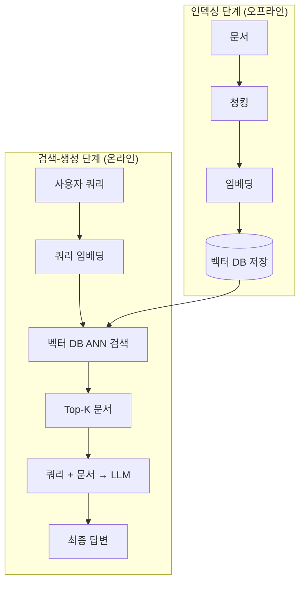

# RAG (Retrieval-Augmented Generation)

## 개요

**RAG**는 Lewis et al. (Facebook AI Research, 2020)이 제안한 아키텍처로, LLM의 파라메트릭 지식(가중치에 저장된 정보)의 한계를 외부 지식 검색으로 보완하는 방식이다. "모델을 다시 학습하지 않고도 최신 정보를 활용한다"는 핵심 아이디어를 담고 있다.

## 왜 필요한가

```
순수 LLM의 문제:
  1. 지식 단절 — 훈련 이후 발생한 사건 모름
  2. 환각 — 모르면 그럴듯한 거짓말 생성
  3. 출처 없음 — "어디서 나온 정보인가?" 불명확
  4. 도메인 한계 — 내부 문서, 독점 데이터 없음

RAG의 해결:
  질문 → [검색: 관련 문서 찾기] → [생성: 문서 기반 답변]
  → 최신 정보 + 환각 감소 + 출처 명시 가능
```

## 표준 RAG 파이프라인



## 하위 문서

| 문서 | 내용 |
|------|------|
| [[Chunking_Strategies]] | 문서를 어떻게 조각낼 것인가 — 5가지 전략 |
| [[Vector_Storage]] | 임베딩을 어떻게 저장하고 검색할 것인가 |
| [[Advanced_Retrieval]] | 더 정확한 검색 — 리랭킹, Multi-Query, HyDE |
| [[HyDE]] | 가상 문서로 검색 품질 높이기 |
| [[AI/Engineering/Context_Engineering/Retrieval_Strategies/RAG/Agentic_RAG|Agentic RAG]] | 에이전트 기반 동적 검색 — Self-RAG, CRAG, Multi-Agent RAG |
| [[Hybrid_RAG]] | Dense(벡터) + Sparse(BM25/SPLADE) 결합 — Reciprocal Rank Fusion |
| [[Multimodal_RAG]] | 텍스트+이미지+표 통합 검색 — CLIP, ColPali, Multimodal LLM |

## 성능 평가 (RAGAS 기준)

```
Faithfulness:      답변이 검색 문서에 근거하는가?
Answer Relevancy:  답변이 질문에 관련되는가?
Context Precision: 검색된 문서가 관련 있는가?
Context Recall:    필요한 문서가 검색됐는가?
```

## AI Engineering에서의 역할

RAG는 **지식 집약적 AI 서비스의 기반 아키텍처**다. 엔터프라이즈 QA, 법률 리서치, 의료 정보 제공, 코드 문서 검색 등 "정확한 정보가 중요한" 모든 도메인에서 기본값으로 채택된다.

## 관련 개념
[[AI/Engineering/Context_Engineering/Retrieval_Strategies/GraphRAG/GraphRAG|GraphRAG]] · [[AI/Engineering/Context_Engineering/Retrieval_Strategies/SQL_RAG/SQL_RAG|SQL RAG]] · [[../../Context_Engineering/Memory_and_Semantic_Cache]] · [[../../Context_Engineering/Context_Compression]]

## 출처
- Lewis et al. (2020) "Retrieval-Augmented Generation for Knowledge-Intensive NLP Tasks" — [arxiv.org/abs/2005.11401](https://arxiv.org/abs/2005.11401)
