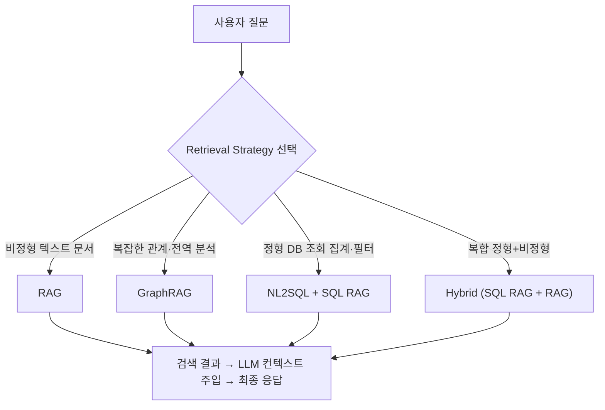
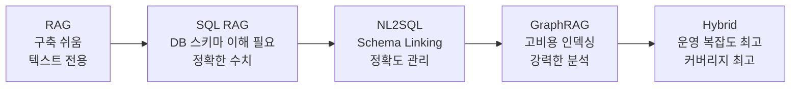
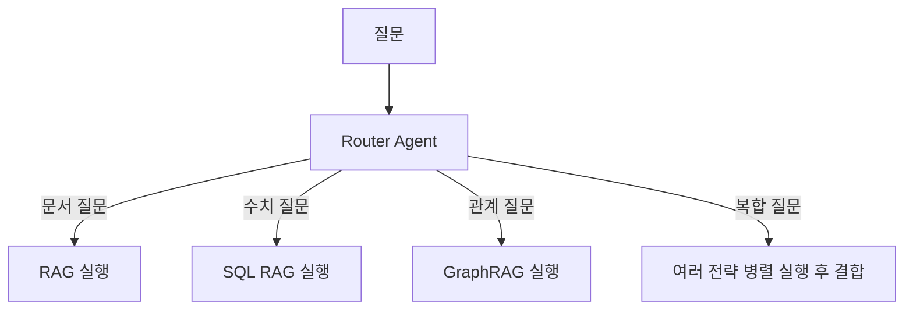

# Retrieval Strategies (검색 전략)

## 개요

**Retrieval Strategies**는 LLM이 외부 데이터 소스에서 관련 정보를 가져오는 방법론의 총칭이다. "어떤 형태의 데이터를 어떤 방식으로 검색할 것인가"를 결정하는 계층으로, 잘못된 전략 선택은 검색 품질 저하 → 환각 증가 → 최종 응답 품질 하락으로 이어진다.



## 4가지 핵심 전략

### 1. RAG (Retrieval-Augmented Generation)

비정형 텍스트 문서를 청킹·임베딩한 뒤 벡터 유사도로 검색하는 기본 전략.

```
적합 데이터: PDF, 이메일, 웹페이지, 사내 문서, 뉴스 기사
적합 질문: "~에 대해 설명해줘", "~의 조건은?", "~의 차이는?"
검색 방식: 벡터 ANN (HNSW, FAISS)
```

→ 상세: [[AI/Engineering/Context_Engineering/Retrieval_Strategies/RAG/RAG|RAG]]

---

### 2. GraphRAG

Knowledge Graph의 구조적 관계와 커뮤니티 클러스터를 활용해 복잡한 다중 홉 추론·전역 요약을 수행하는 전략.

```
적합 데이터: 엔티티 관계가 중요한 문서 (논문, 법률, 기업 관계망)
적합 질문: "이 데이터셋의 주요 테마는?", "A와 B의 관계는?", "이 업계의 핵심 플레이어는?"
검색 방식: 그래프 탐색 (Local Search / Global Search)
```

→ 상세: [[AI/Engineering/Context_Engineering/Retrieval_Strategies/GraphRAG/GraphRAG|GraphRAG]]

---

### 3. NL2SQL (Natural Language to SQL)

자연어 질문을 SQL 쿼리로 변환해 RDBMS에서 직접 검색하는 전략.

```
적합 데이터: RDBMS, 데이터웨어하우스, 트랜잭션 DB
적합 질문: "지난 달 매출 합계는?", "가장 많이 팔린 상품 TOP 5는?"
검색 방식: SQL 쿼리 실행 (결정론적)
핵심 과제: Schema Linking, SQL 생성 정확도
```

→ 상세: [[AI/Engineering/Context_Engineering/Retrieval_Strategies/NL2SQL/NL2SQL|NL2SQL]]

---

### 4. SQL RAG

SQL을 검색 메커니즘으로 활용하는 RAG 아키텍처 패턴. NL2SQL을 포함하며, 벡터 RAG와 결합한 Hybrid 아키텍처로 확장 가능.

```
적합 데이터: 정형 + 비정형 혼합 엔터프라이즈 데이터
적합 질문: 수치 분석 + 문서 참조가 동시에 필요한 복합 질문
검색 방식: SQL 실행 + 벡터 검색 (Hybrid)
```

→ 상세: [[AI/Engineering/Context_Engineering/Retrieval_Strategies/SQL_RAG/SQL_RAG|SQL RAG]]

---

## "어떤 데이터에 어떤 전략을?" 판단 기준표

| 데이터 형태 | 질문 유형 | 권장 전략 | 대안 |
|------------|----------|----------|------|
| 비정형 문서 (PDF, 텍스트) | 사실 검색, 설명 | **RAG** | GraphRAG |
| 비정형 문서 | 전역 요약, 엔티티 관계 | **GraphRAG** | RAG |
| 정형 DB (수치, 트랜잭션) | 집계, 필터, 랭킹 | **SQL RAG + NL2SQL** | — |
| 정형 DB | 단순 조회 | **NL2SQL** | — |
| 정형 + 비정형 혼합 | 복합 분석 | **Hybrid (SQL + Vector)** | — |
| 지식 그래프 / 온톨로지 | 관계 추론 | **GraphRAG** | RAG |

### 비용-복잡도 트레이드오프


낮은 비용·복잡도 → 높은 비용·복잡도

## 전략 간 결합 패턴

**Agentic Retrieval**: 에이전트가 질문을 분석해 전략을 동적으로 선택한다.



→ [[AI/Engineering/Context_Engineering/Retrieval_Strategies/RAG/Agentic_RAG|Agentic RAG]] 참고

## 하위 문서

| 챕터 | 문서 | 내용 |
|------|------|------|
| **RAG** | [[AI/Engineering/Context_Engineering/Retrieval_Strategies/RAG/RAG|RAG]] | 벡터 기반 RAG 기초 |
| | [[AI/Engineering/Context_Engineering/Retrieval_Strategies/RAG/Chunking_Strategies|Chunking Strategies]] | 문서 분할 전략 5가지 |
| | [[AI/Engineering/Context_Engineering/Retrieval_Strategies/RAG/Vector_Storage|Vector Storage]] | 벡터 DB, HNSW, FAISS |
| | [[AI/Engineering/Context_Engineering/Retrieval_Strategies/RAG/Advanced_Retrieval|Advanced Retrieval]] | Reranking, Multi-Query, RAG Fusion |
| | [[AI/Engineering/Context_Engineering/Retrieval_Strategies/RAG/HyDE|HyDE]] | 가상 문서 임베딩 검색 개선 |
| | [[AI/Engineering/Context_Engineering/Retrieval_Strategies/RAG/Agentic_RAG|Agentic RAG]] | Self-RAG, CRAG, Multi-Agent RAG |
| **GraphRAG** | [[AI/Engineering/Context_Engineering/Retrieval_Strategies/GraphRAG/GraphRAG|GraphRAG]] | Microsoft GraphRAG, 커뮤니티 클러스터링 |
| | [[AI/Engineering/Context_Engineering/Retrieval_Strategies/GraphRAG/Knowledge_Graph/Knowledge_Graph|Knowledge Graph]] | 지식 그래프 개요 |
| | [[AI/Engineering/Context_Engineering/Retrieval_Strategies/GraphRAG/Knowledge_Graph/LPG_and_RDF|LPG & RDF]] | Neo4j Cypher vs SPARQL |
| | [[AI/Engineering/Context_Engineering/Retrieval_Strategies/GraphRAG/Knowledge_Graph/Ontology|Ontology]] | OWL, 도메인 온톨로지 |
| **NL2SQL** | [[AI/Engineering/Context_Engineering/Retrieval_Strategies/NL2SQL/NL2SQL|NL2SQL]] | Text-to-SQL 파이프라인, 벤치마크, 최신 기법 |
| **SQL RAG** | [[AI/Engineering/Context_Engineering/Retrieval_Strategies/SQL_RAG/SQL_RAG|SQL RAG]] | 정형 데이터 RAG, Hybrid 아키텍처 |

## 관련 개념

[[AI/Engineering/Context_Engineering/Context_Engineering|Context Engineering]] · [[AI/Engineering/Context_Engineering/Retrieval_Strategies/RAG/Advanced_Retrieval|Advanced Retrieval]] · [[AI/Engineering/Context_Engineering/Retrieval_Strategies/GraphRAG/GraphRAG|GraphRAG]]
