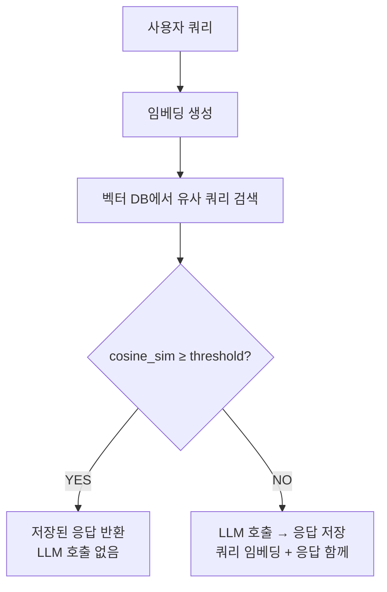
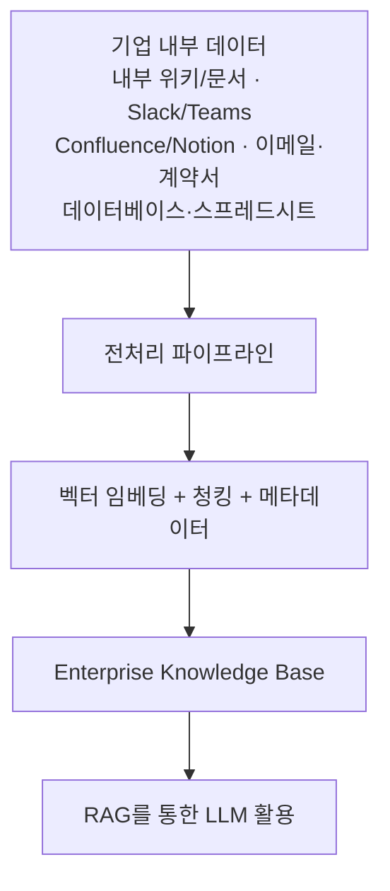

# Semantic Cache (시맨틱 캐시)

## 개요

Semantic Cache는 **의미 유사도 기반 캐싱**으로 LLM API 호출 비용과 레이턴시를 줄이는 최적화 기법이다. 기존 캐시가 완전 일치(Exact Match)만 히트하는 것과 달리, 임베딩 유사도가 임계값을 넘으면 캐시 히트로 처리한다.

```
기존 캐시:
  저장: "파이썬 리스트 정렬 방법" → [LLM 응답]
  새 쿼리: "python에서 list 정렬하는 법" → 캐시 미스 ❌

Semantic Cache:
  "파이썬 리스트 정렬 방법" → embed → [0.2, 0.7, ...]
  "python에서 list 정렬하는 법" → embed → [0.21, 0.68, ...]
  cosine_sim = 0.94 > threshold(0.9) → 캐시 히트 ✅
```

---

## 동작 원리



---

## GPTCache

오픈소스 시맨틱 캐시 라이브러리 (Zilliz 개발) [1]:

```python
from gptcache import cache
from gptcache.adapter import openai
from gptcache.embedding import Onnx
from gptcache.manager import CacheBase, VectorBase, get_data_manager
from gptcache.similarity_evaluation import SearchDistanceEvaluation

# 캐시 초기화
onnx = Onnx()
data_manager = get_data_manager(
    CacheBase("sqlite"),          # 응답 저장
    VectorBase("faiss", dimension=onnx.dimension),  # 임베딩 저장
)
cache.init(
    embedding_func=onnx.to_embeddings,
    data_manager=data_manager,
    similarity_evaluation=SearchDistanceEvaluation(),
    similarity_threshold=0.8,   # 유사도 임계값
)

# 이후 OpenAI API 호출이 자동으로 캐싱됨
response = openai.ChatCompletion.create(
    model="gpt-4",
    messages=[{"role": "user", "content": "파이썬 리스트 정렬 방법"}]
)
```

---

## Redis 기반 Semantic Cache 구현

```python
import redis
from openai import OpenAI
import numpy as np

class SemanticCache:
    def __init__(self, threshold=0.9):
        self.redis = redis.Redis()
        self.client = OpenAI()
        self.threshold = threshold
    
    def embed(self, text: str) -> list:
        return self.client.embeddings.create(
            input=text, model="text-embedding-3-small"
        ).data[0].embedding
    
    def get(self, query: str):
        query_embed = self.embed(query)
        # Redis Vector Search로 유사 쿼리 검색
        # 임계값 이상이면 캐시된 응답 반환
        ...
    
    def set(self, query: str, response: str):
        embed = self.embed(query)
        # Redis에 임베딩 + 응답 저장
        ...
```

---

## 성능 효과

연구 결과 (GPT Semantic Cache, 2024) [2]:

| 지표 | 수치 |
|------|------|
| 캐시 히트율 | 61.6 ~ 68.8% |
| 히트 정확도 | 97% 이상 |
| 레이턴시 감소 | API 호출 없이 즉시 응답 |
| 비용 절감 | 동일 트래픽 대비 60~70% API 호출 감소 |

---

## 카테고리 인식 캐시 (Category-Aware Cache)

쿼리 유형별 다른 유사도 임계값 적용. 사실 확인 쿼리는 엄격하게, 창작 쿼리는 느슨하게:

```python
thresholds = {
    "factual": 0.95,      # 사실 확인 — 매우 유사해야만 히트
    "creative": 0.70,     # 창작 — 느슨하게 히트
    "code": 0.90,         # 코드 — 언어·목적 유사하면 히트
    "conversation": 0.85  # 대화 — 중간 기준
}
```

---

## Enterprise Knowledge Base와의 연계

조직 내부 데이터를 LLM이 활용할 수 있는 구조화된 형태로 저장한 시스템.



Semantic Cache는 이 위에서 반복 쿼리의 비용을 최적화하는 역할을 한다.

---

## AI Engineering에서의 역할

Semantic Cache는 **Loop Engineering의 Runtime Optimization** 레이어에서 핵심 역할을 한다 (→ [[Loop_Engineering/Runtime_Optimization]]). 반복적인 질문이 많은 고객 지원, 내부 도구, 교육 플랫폼에서 API 비용을 극적으로 절감한다.

## 관련 개념
[[LLM_Memory]] · [[RAG/Vector_Storage]] · [[Loop_Engineering/Runtime_Optimization]] · [[Agent_Engineering/Agent_Memory]]

## 참고 문헌
1. GPTCache GitHub — [github.com/zilliztech/GPTCache](https://github.com/zilliztech/GPTCache)
2. "GPT Semantic Cache: Reducing LLM Costs and Latency via Semantic Embedding Caching" (2024) — [arXiv:2411.05276](https://arxiv.org/abs/2411.05276)
3. Anthropic "Contextual Retrieval" — [anthropic.com](https://www.anthropic.com/news/contextual-retrieval)
