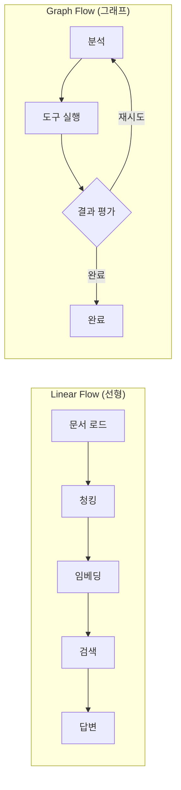
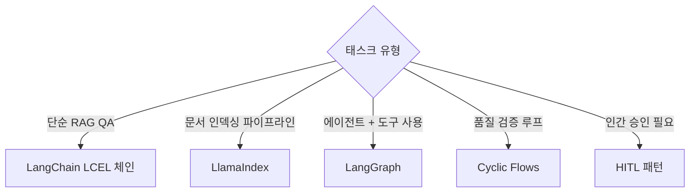

# Flow Engineering (플로우 엔지니어링)

## 개요

**Flow Engineering**은 여러 LLM 호출, 도구 실행, 데이터 변환을 **파이프라인으로 연결**하여 복잡한 태스크를 완수하는 아키텍처 설계 기술이다. "단일 LLM 호출로 해결할 수 없는 것을 어떻게 엮을 것인가"에 답한다.

## 두 가지 플로우 유형

## 하위 문서

| 문서 | 내용 |
|------|------|
| [[AI/Engineering/Flow_Engineering/Linear_Flow/Linear_Flow|Linear Flow]] | 순차적 파이프라인 개요 |
| [[Linear_Flow/LangChain]] | LCEL 파이프라인 (Harrison Chase, 2022) |
| [[Linear_Flow/LlamaIndex]] | 인덱싱-질의 파이프라인 (Jerry Liu, 2022) |
| [[Linear_Flow/Tool_Use_and_Function_Calling]] | OpenAI/Anthropic Function Calling |
| [[AI/Engineering/Flow_Engineering/Graph_Flow/Graph_Flow|Graph Flow]] | 순환 그래프 플로우 개요 |
| [[Graph_Flow/LangGraph]] | StateGraph 에이전트 (LangChain AI, 2024) |
| [[Graph_Flow/Cyclic_Flows]] | Evaluate-and-Retry, Self-Correction |
| [[Graph_Flow/ReAct_Pattern]] | Thought-Action-Observation (Yao, 2022) |
| [[Graph_Flow/Human_in_the_Loop]] | 인간 개입 포인트 — Breakpoints, Time Travel |

## 기술 선택 기준

## AI Engineering에서의 역할

Flow Engineering은 **LLM 단독으로는 불가능한 태스크를 시스템으로 해결하는 계층**이다. 단일 모델 호출의 한계(컨텍스트 길이, 단계적 추론)를 파이프라인으로 극복하며, Agent Engineering의 직접적 기반이 된다.

## 관련 개념
[[AI/Engineering/Context_Engineering/Context_Engineering|Context Engineering]] · [[AI/Engineering/Agent_Engineering/Agent_Engineering|Agent Engineering]]
