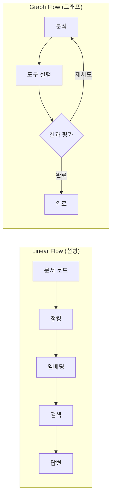
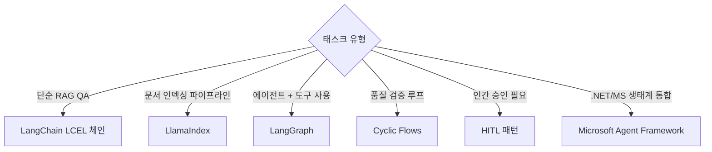

# Flow Engineering (플로우 엔지니어링)

## 개요

**Flow Engineering**은 여러 LLM 호출, 도구 실행, 데이터 변환을 **파이프라인으로 연결**하여 복잡한 태스크를 완수하는 아키텍처 설계 기술이다. "단일 LLM 호출로 해결할 수 없는 것을 어떻게 엮을 것인가"에 답한다.

## 두 가지 플로우 유형

```mermaid
flowchart LR
    subgraph linear["Linear Flow (선형)"]
        A1[문서 로드] --> B1[청킹] --> C1[임베딩] --> D1[검색] --> E1[답변]
    end
    subgraph graph["Graph Flow (그래프)"]
        A2[분석] --> B2[도구 실행]
        B2 --> C2{결과 평가}
        C2 -->|재시도| A2
        C2 -->|완료| D2[완료]
    end
```

## 하위 문서

| 문서 | 내용 |
|------|------|
| [[AI/Engineering/Flow_Engineering/Linear_Flow/Linear_Flow\|Linear Flow]] | 순차적 파이프라인 개요 |
| [[AI/Engineering/Flow_Engineering/Linear_Flow/LangChain\|Linear_Flow/LangChain]] | LCEL 파이프라인 (Harrison Chase, 2022) |
| [[AI/Engineering/Flow_Engineering/Linear_Flow/LlamaIndex\|Linear_Flow/LlamaIndex]] | 인덱싱-질의 파이프라인 (Jerry Liu, 2022) |
| [[AI/Engineering/Flow_Engineering/Linear_Flow/Tool_Use_and_Function_Calling\|Linear_Flow/Tool_Use_and_Function_Calling]] | OpenAI/Anthropic Function Calling |
| [[AI/Engineering/Flow_Engineering/Graph_Flow/Graph_Flow\|Graph Flow]] | 순환 그래프 플로우 개요 |
| [[AI/Engineering/Flow_Engineering/Graph_Flow/LangGraph\|Graph_Flow/LangGraph]] | StateGraph 에이전트 (LangChain AI, 2024) |
| [[AI/Engineering/Flow_Engineering/Graph_Flow/Cyclic_Flows\|Graph_Flow/Cyclic_Flows]] | Evaluate-and-Retry, Self-Correction |
| [[AI/Engineering/Flow_Engineering/Graph_Flow/ReAct_Pattern\|Graph_Flow/ReAct_Pattern]] | Thought-Action-Observation (Yao, 2022) |
| [[AI/Engineering/Flow_Engineering/Graph_Flow/Human_in_the_Loop\|Graph_Flow/Human_in_the_Loop]] | 인간 개입 포인트 — Breakpoints, Time Travel |

## 기술 선택 기준

```mermaid
flowchart TD
    T{태스크 유형} -->|단순 RAG QA| LC[LangChain LCEL 체인]
    T -->|문서 인덱싱 파이프라인| LI[LlamaIndex]
    T -->|에이전트 + 도구 사용| LG[LangGraph]
    T -->|품질 검증 루프| CF[Cyclic Flows]
    T -->|인간 승인 필요| HITL[HITL 패턴]
    T -->|.NET/MS 생태계 통합| MAF[Microsoft Agent Framework]
```

**Microsoft Agent Framework 1.0** (2026-04-03 GA)은 그동안 별개였던 **Semantic Kernel**(엔터프라이즈 상태 관리·타입 안정성)과 **AutoGen**(멀티 에이전트 오케스트레이션)을 하나의 .NET+Python SDK로 통합했다 — MCP·A2A를 1.0부터 네이티브로 지원한다. AutoGen과 Semantic Kernel은 유지보수 모드로 전환됐다. .NET/Azure 중심 조직에서 LangGraph의 대안으로 고려된다. 프레임워크별 상세 비교는 [[AI/Engineering/Agent_Engineering/Agent_Frameworks|Agent_Engineering/Agent_Frameworks]] 참고.

## AI Engineering에서의 역할

Flow Engineering은 **LLM 단독으로는 불가능한 태스크를 시스템으로 해결하는 계층**이다. 단일 모델 호출의 한계(컨텍스트 길이, 단계적 추론)를 파이프라인으로 극복하며, Agent Engineering의 직접적 기반이 된다.

## 관련 개념
[[AI/Engineering/Context_Engineering/Context_Engineering|Context Engineering]] · [[AI/Engineering/Agent_Engineering/Agent_Engineering|Agent Engineering]]
