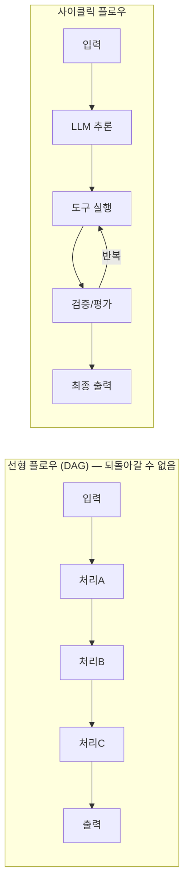
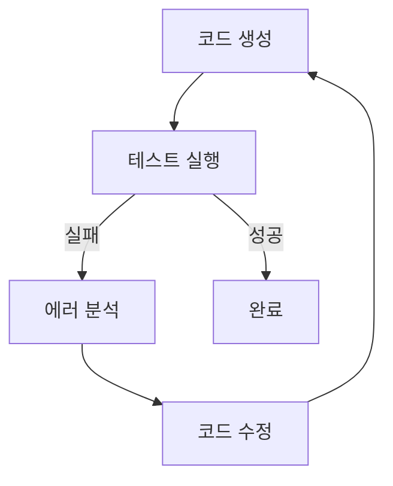
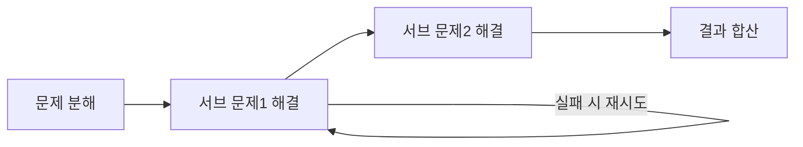
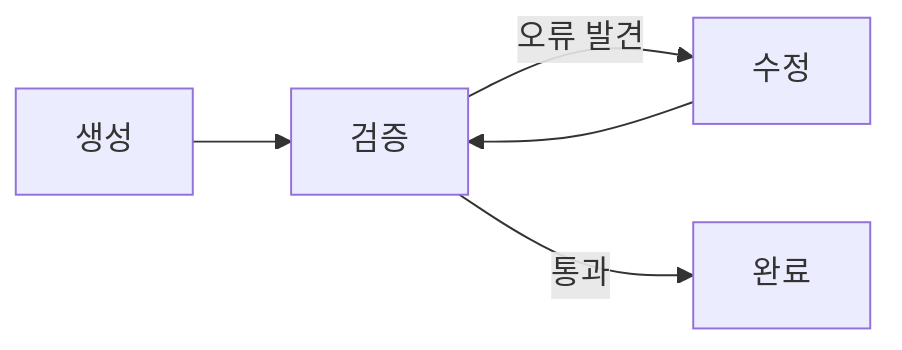
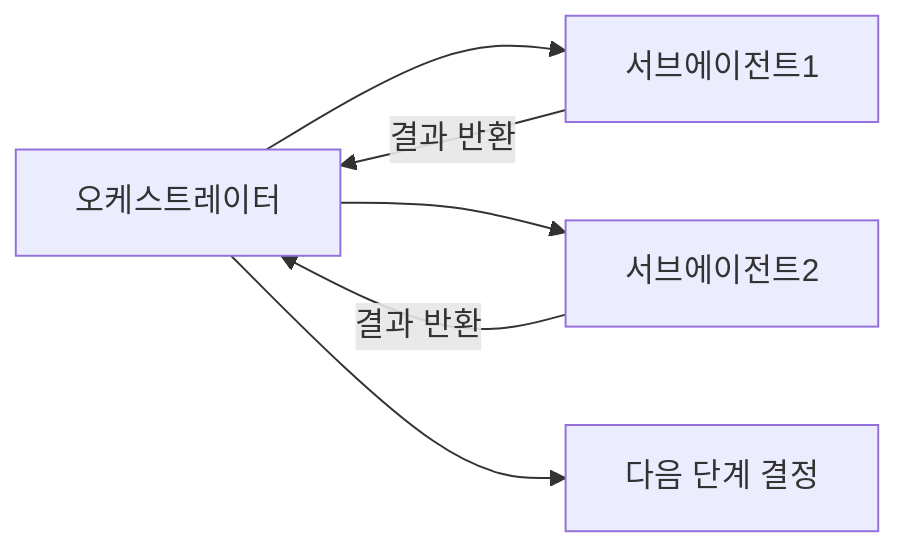

# Cyclic Flows (사이클릭 플로우)

## 개요

**Cyclic Flows**는 LLM 파이프라인에서 노드 간 **순환(cycle)**을 허용하는 실행 아키텍처다. 선형(DAG) 플로우와 달리, LLM이 목표를 달성할 때까지 동일한 단계를 반복 실행할 수 있다. 에이전트 행동의 핵심 특성이다.

## 선형 vs 사이클릭



## 사이클릭 플로우가 필요한 이유

### 1. Iterative Refinement (반복 개선)


### 2. Multi-Step Problem Solving
복잡한 문제는 한 번에 풀 수 없음:


### 3. Tool-Use Loop (ReAct 패턴)
```
생각 → 도구 호출 → 관찰 → 생각 → 도구 호출 → ... → 최종 답변
```

## 사이클 종료 조건

사이클릭 플로우에는 반드시 **종료 조건(Exit Condition)**이 필요:

```python
def should_continue(state: AgentState) -> str:
    # 조건 1: 최대 반복 횟수
    if state["iterations"] >= 10:
        return END
    
    # 조건 2: 작업 완료
    if state["task_completed"]:
        return END
    
    # 조건 3: 도구 호출 없으면 종료
    last_msg = state["messages"][-1]
    if not (hasattr(last_msg, "tool_calls") and last_msg.tool_calls):
        return END
    
    # 계속 진행
    return "continue"
```

## 사이클릭 플로우 패턴

### 1. Evaluate-and-Retry
```python
# 품질 평가 후 기준 미달 시 재생성
def evaluate_node(state):
    response = state["current_response"]
    score = evaluate_quality(response)
    if score < 0.8 and state["retries"] < 3:
        return {"quality_ok": False, "retries": state["retries"] + 1}
    return {"quality_ok": True}

# 조건부 엣지
builder.add_conditional_edges("evaluate", 
    lambda s: "generate" if not s["quality_ok"] else END)
```

### 2. Self-Correction Loop


### 3. Orchestrator-Worker Cycle


## 구현: LangGraph

LangGraph는 사이클릭 플로우의 사실상 표준 구현체:

```python
from langgraph.graph import StateGraph, END

builder = StateGraph(State)
builder.add_node("agent", agent_node)
builder.add_node("tools", tool_execution_node)
builder.add_node("evaluator", quality_evaluator_node)

# 사이클 구성
builder.set_entry_point("agent")
builder.add_conditional_edges("agent", route_after_agent)
builder.add_edge("tools", "agent")          # 도구 → 에이전트 (사이클)
builder.add_conditional_edges("evaluator",  # 평가 후 재시도 또는 종료
    lambda s: "agent" if not s["satisfied"] else END)
```

## 주의사항

### 무한 루프 방지
```python
MAX_ITERATIONS = 20

def route(state):
    if state["iterations"] >= MAX_ITERATIONS:
        logger.warning("Max iterations reached")
        return "force_exit"
    return "continue"
```

### 비용 관리
사이클마다 LLM 호출 발생 → 비용 모니터링 필수:
```python
# 각 사이클의 토큰 사용량 추적
total_tokens = sum(step.token_usage for step in state["steps"])
if total_tokens > BUDGET_TOKENS:
    return "budget_exceeded"
```

## AI Engineering에서의 역할

Cyclic Flows는 Agent Engineering의 **핵심 실행 메커니즘**이다. 에이전트가 "목표 달성까지 지속 시도"하는 능력은 사이클릭 플로우 없이는 불가능하다. 단순 파이프라인과 진정한 에이전트 시스템의 가장 근본적인 차이가 바로 사이클(루프)의 유무다.

## 관련 개념
[[LangGraph]] · [[ReAct_Pattern]] · [[Human_in_the_Loop]] · [[Agent_Architectures]]

## 출처
- LangGraph 공식 문서 — [langchain-ai.github.io/langgraph](https://langchain-ai.github.io/langgraph/)
- "Mastering LangGraph: The Backbone of Stateful Multi-Agent AI" — [Towards AI](https://pub.towardsai.net/mastering-langgraph-the-backbone-of-stateful-multi-agent-ai-0424500a510b)
