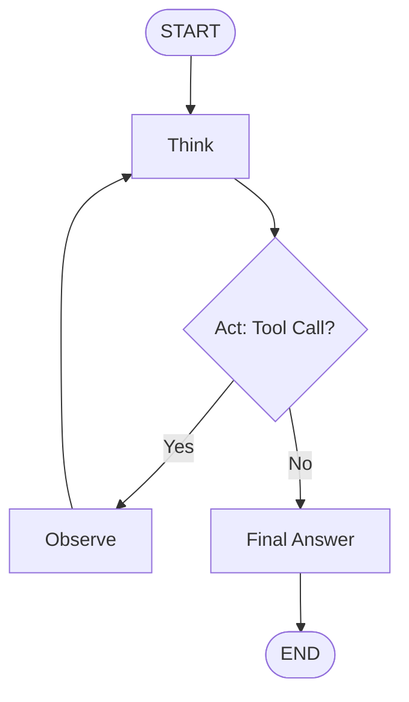
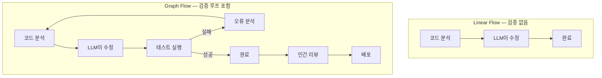

# Graph Flow (그래프 플로우)

## 개요

**Graph Flow**는 LLM 파이프라인을 노드(처리 단계)와 엣지(전환 조건)로 이루어진 **방향성 그래프**로 표현하는 패턴이다. 루프, 조건 분기, 상태 유지가 가능하여 에이전트 시스템과 복잡한 워크플로우를 구현할 수 있다.



## 하위 문서

| 문서 | 내용 |
|------|------|
| [[LangGraph]] | StateGraph로 에이전트 워크플로우 구현 (LangChain AI, 2024) |
| [[Cyclic_Flows]] | 루프 패턴 — Evaluate-and-Retry, Self-Correction |
| [[ReAct_Pattern]] | 사고-행동-관찰 루프 (Yao et al. 2022) |
| [[Human_in_the_Loop]] | 인간 승인/개입 포인트 — Breakpoints, Time Travel |

## Graph Flow가 필요한 이유



## 상태 관리 (State Management)

Graph Flow의 핵심은 **각 노드 간 공유되는 상태 객체**:

```python
from typing import TypedDict, Annotated
from langgraph.graph import StateGraph

class AgentState(TypedDict):
    messages: list          # 대화 히스토리
    tool_calls: list        # 호출한 도구 목록
    iteration_count: int    # 루프 카운터 (무한루프 방지)
    final_answer: str       # 최종 답변
```

## AI Engineering에서의 역할

Graph Flow는 **에이전트 시스템 구현의 표준 패턴**이다. Linear Flow가 "레시피대로 요리"라면, Graph Flow는 "상황에 따라 재료를 조정하며 요리"에 해당한다. 복잡한 태스크 자동화, 품질 보장, 인간-AI 협업이 필요한 곳에서 필수적이다.

## 관련 개념
[[Linear_Flow/Linear_Flow]] · [[Agent_Engineering/Agent_Architectures]]
