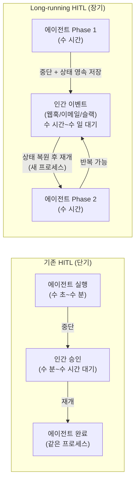

# Human-in-the-Loop (HITL)

## 개요

**Human-in-the-Loop (HITL)**는 자동화된 AI 에이전트 실행 중 특정 시점에 **인간이 개입하여 검토, 승인, 수정**할 수 있도록 하는 아키텍처 패턴이다. State Interruptions(상태 인터럽트)와 Breakpoints(중단점)를 통해 에이전트를 일시 중단하고 인간의 판단을 기다린다.

## 왜 필요한가

완전 자동 에이전트는 다음 상황에서 위험:
```
위험 시나리오:
  에이전트: "고객 DB에서 특정 레코드를 삭제하겠습니다"
  → 되돌릴 수 없는 작업!
  → 인간 승인 없이 실행 금지

비즈니스 규정:
  "500만원 이상 결제는 CFO 승인 필요"
  "외부 API 호출 전 보안팀 검토 필요"
```

## HITL 패턴 유형

### 1. Breakpoints (정적 중단점)

미리 정의한 노드에서 항상 중단:
```python
# LangGraph 정적 중단점
graph = builder.compile(
    interrupt_before=["dangerous_action", "send_email"],  # 이 노드 전 중단
    interrupt_after=["data_fetch"]  # 이 노드 후 중단
)

result = graph.invoke(initial_state, config)
# → "dangerous_action" 노드 직전에 자동으로 중단
```

### 2. Dynamic Interrupts (동적 인터럽트)

실행 중 조건에 따라 동적으로 중단:
```python
from langgraph.types import interrupt

def action_node(state: AgentState):
    action = state["planned_action"]
    
    # 위험한 작업인 경우에만 인터럽트
    if action.is_destructive or action.cost > 100_000:
        # 인간에게 검토 요청
        approval = interrupt({
            "action_description": action.description,
            "estimated_cost": action.cost,
            "question": "이 작업을 승인하시겠습니까?"
        })
        
        if not approval["approved"]:
            return {"status": "rejected", "reason": approval.get("reason")}
    
    # 승인 후 실행
    result = execute_action(action)
    return {"action_result": result}
```

### 3. Edit & Continue (수정 후 계속)

인간이 에이전트 상태를 수정한 후 재개:
```python
# 그래프 실행 (중단점에서 멈춤)
thread_config = {"configurable": {"thread_id": "task_123"}}
result = graph.invoke(initial_state, thread_config)

# 현재 상태 확인
current_state = graph.get_state(thread_config)
print(current_state.values["draft_response"])  # LLM이 생성한 초안

# 인간이 상태 수정
graph.update_state(
    thread_config,
    {"draft_response": "수정된 답변 내용..."}  # 인간이 직접 수정
)

# 수정된 상태로 재개
final_result = graph.invoke(None, thread_config)
```

### 4. Time Travel (시간 여행)

이전 체크포인트로 롤백:
```python
# 모든 체크포인트 히스토리 확인
history = graph.get_state_history(thread_config)
for checkpoint in history:
    print(checkpoint.config["configurable"]["checkpoint_id"])

# 특정 체크포인트로 롤백
old_config = {"configurable": {"checkpoint_id": "checkpoint_v3"}}
result = graph.invoke(None, old_config)
```

## 실무 HITL 패턴

### Interrupt-on-Action (권장)

파괴적 작업에만 인터럽트 적용:
```python
DESTRUCTIVE_ACTIONS = ["delete", "send", "publish", "transfer_money"]

def should_interrupt(state: AgentState) -> bool:
    next_action = state.get("next_action", "")
    return any(action in next_action for action in DESTRUCTIVE_ACTIONS)
```

### Approval Workflow

다단계 승인 프로세스:
```python
def approval_node(state: AgentState):
    # Level 1: 팀장 승인 (10만원 이상)
    if state["cost"] > 100_000:
        team_lead_approval = interrupt({"approver": "team_lead", ...})
        if not team_lead_approval["approved"]:
            return {"status": "rejected"}
    
    # Level 2: CFO 승인 (500만원 이상)
    if state["cost"] > 5_000_000:
        cfo_approval = interrupt({"approver": "cfo", ...})
        if not cfo_approval["approved"]:
            return {"status": "rejected"}
    
    return {"status": "approved"}
```

## HITL + 비동기 실행

장시간 작업에서 인간 응답을 기다리는 동안 서버 리소스 낭비 방지:
```python
# 1. 작업 시작 → 인터럽트에서 중단
task_id = start_async_task(initial_state)

# 2. 서버가 다른 작업 처리 (중단 상태 DB에 저장)

# 3. 인간이 웹UI에서 승인
# POST /api/tasks/{task_id}/approve
# {"approved": true, "comment": "승인합니다"}

# 4. 서버가 재개
resume_task(task_id, human_input={"approved": True})
```

## Long-running Agent HITL *(2026년 5월)*

수 시간~수 일에 걸쳐 실행되는 에이전트에서 HITL은 기존과 다른 도전을 제시한다. 단순히 "잠시 멈추고 승인 받기"가 아니라 **며칠 후 재개**가 가능해야 한다.

### 기존 HITL vs Long-running HITL



### 구현 패턴 (Agent Runtime 기반)

```python
# Long-running HITL 패턴 — Agent Runtime의 auto-resume 활용
from google.adk.runtime import AgentRuntime
from google.adk.types import HumanApprovalRequired

runtime = AgentRuntime()

async def multi_day_audit_agent(audit_scope: dict):
    """수 일에 걸친 감사 에이전트 — 인간 검토 2단계 포함"""
    
    session = await runtime.create_session(
        max_duration_days=5,  # 최대 5일
        checkpoint_on_interrupt=True  # 중단 시 자동 체크포인트
    )
    
    # Phase 1: 자동 데이터 수집 (수 시간)
    raw_findings = await session.run(collect_audit_data, audit_scope)
    
    # HITL 포인트 1: 감사 팀장 검토 (최대 24시간 대기)
    # → 에이전트 일시 중단, 이메일 발송
    team_lead_review = await session.request_human_input(
        prompt=f"감사 초안 검토 후 승인해주세요:\n{raw_findings.summary}",
        notify_via="email",
        timeout_hours=24,
        on_timeout="escalate_to_manager"  # 타임아웃 시 에스컬레이션
    )
    
    if not team_lead_review["approved"]:
        return {"status": "rejected", "reason": team_lead_review["comments"]}
    
    # Phase 2: 심층 분석 (수 시간)
    detailed_analysis = await session.run(
        deep_analysis,
        findings=raw_findings,
        guidance=team_lead_review.get("guidance", "")
    )
    
    # HITL 포인트 2: CFO 최종 승인 (최대 48시간 대기)
    cfo_approval = await session.request_human_input(
        prompt=f"최종 감사 보고서 승인:\n{detailed_analysis.executive_summary}",
        notify_via="slack",
        timeout_hours=48
    )
    
    return {
        "status": "completed",
        "report": detailed_analysis,
        "approved_by": cfo_approval["approver"]
    }
```

**핵심 인프라 요구사항**: Long-running HITL은 Agent Runtime의 auto-resume(며칠 후 재개)과 Memory Bank(상태 영속)가 없으면 구현이 매우 복잡하다. 자세한 내용 → [[Agent_Deployment]]

## AI Engineering에서의 역할

HITL은 **에이전트 시스템의 안전 밸브**다. 완전 자동화와 안전성 사이의 균형을 잡아주며, 규제 산업(금융, 의료, 법률)에서 AI 자동화 도입을 가능하게 한다. Anthropic의 에이전트 안전 가이드라인에서도 위험 작업 전 인간 검토를 강력 권고한다.

## 관련 개념
[[LangGraph]] · [[Cyclic_Flows]] · [[Guardrail_Engineering]] · [[Agent_Architectures]] · [[Agent_Deployment]]

## 출처
- LangChain 공식 "Making it easier to build HITL agents with interrupt" — [langchain.com](https://www.langchain.com/blog/making-it-easier-to-build-human-in-the-loop-agents-with-interrupt)
- LangGraph HITL How-to — [langchain-ai.github.io](https://langchain-ai.github.io/langgraph/cloud/how-tos/human_in_the_loop_breakpoint/)
- "Architecting Human-in-the-Loop Agents" — [Medium](https://medium.com/data-science-collective/architecting-human-in-the-loop-agents-interrupts-persistence-and-state-management-in-langgraph-fa36c9663d6f)
