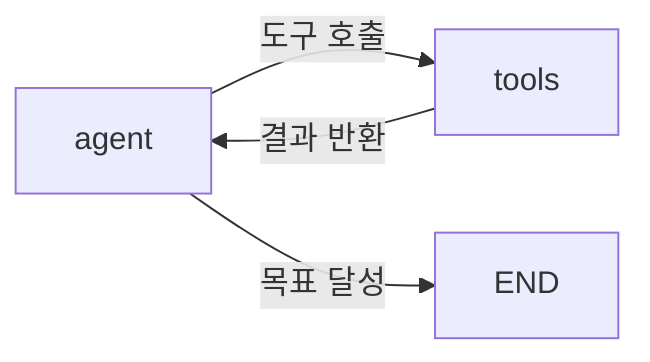

# LangGraph

## 개요

**LangGraph**는 LLM 애플리케이션을 **상태 기반 그래프(Stateful Graph)**로 모델링하는 프레임워크다. LangChain의 선형 체인과 달리 **사이클(Cycle)**을 지원하여 에이전트가 목표를 달성할 때까지 반복 실행할 수 있다.

## 제창

- **개발**: LangChain AI (Harrison Chase 팀)
- **출시**: 2024년 1월
- **위상**: LangChain 생태계의 에이전트 레이어. LangChain과 상호 보완적.

## 핵심 개념

### State (상태)

그래프를 흐르는 공유 메모리 객체:

```python
from typing import TypedDict, Annotated
from langgraph.graph.message import add_messages

class AgentState(TypedDict):
    messages: Annotated[list, add_messages]  # 대화 히스토리
    current_task: str
    tool_results: list
    iterations: int
```

모든 노드는 State를 입력받고 업데이트된 State를 반환.

### Nodes (노드)

Python 함수 = 하나의 처리 단계:

```python
from langchain_openai import ChatOpenAI
from langchain_core.messages import SystemMessage

llm = ChatOpenAI(model="gpt-4o")

def agent_node(state: AgentState):
    """LLM 추론 노드"""
    messages = state["messages"]
    response = llm.invoke(messages)
    return {"messages": [response]}

def tool_node(state: AgentState):
    """도구 실행 노드"""
    last_message = state["messages"][-1]
    # 도구 호출 처리
    results = execute_tools(last_message.tool_calls)
    return {"messages": results, "tool_results": results}
```

### Edges (엣지)

노드 간 흐름 정의. 조건부 분기 가능:

```python
from langgraph.graph import StateGraph, END

builder = StateGraph(AgentState)

# 노드 추가
builder.add_node("agent", agent_node)
builder.add_node("tools", tool_node)

# 엔트리 포인트
builder.set_entry_point("agent")

# 조건부 엣지 (핵심!)
def should_continue(state: AgentState) -> str:
    last_message = state["messages"][-1]
    if hasattr(last_message, "tool_calls") and last_message.tool_calls:
        return "tools"  # 도구 호출 필요 → tools 노드로
    return END          # 완료 → 종료

builder.add_conditional_edges("agent", should_continue)
builder.add_edge("tools", "agent")  # tools → agent 사이클!

graph = builder.compile()
```

### Checkpointing (체크포인팅)

실행 중단 후 재개, 히스토리 추적:

```python
from langgraph.checkpoint.memory import MemorySaver

checkpointer = MemorySaver()
graph = builder.compile(checkpointer=checkpointer)

# thread_id로 대화 세션 구분
config = {"configurable": {"thread_id": "user_123"}}
result = graph.invoke({"messages": [user_message]}, config=config)

# 같은 thread_id로 재호출하면 이전 상태 복원
result2 = graph.invoke({"messages": [follow_up]}, config=config)
```

## ReAct Agent 구현 예시

```python
from langgraph.prebuilt import create_react_agent
from langchain_community.tools import TavilySearchResults

# 도구 정의
tools = [TavilySearchResults(max_results=3)]

# 사전 구현된 ReAct 에이전트 생성
agent = create_react_agent(
    model=ChatOpenAI(model="gpt-4o"),
    tools=tools,
    checkpointer=MemorySaver()
)

# 실행
result = agent.invoke(
    {"messages": [{"role": "user", "content": "최신 AI 뉴스 찾아줘"}]},
    config={"configurable": {"thread_id": "session_1"}}
)
```

## LangGraph의 주요 특징

### 1. Cyclic Flows 지원


### 2. Multi-Agent 오케스트레이션
```python
# Supervisor가 여러 Sub-Agent 조율
supervisor = create_supervisor(
    agents={"researcher": research_agent, "writer": writer_agent},
    model=llm
)
```

### 3. Human-in-the-Loop

→ [[Human_in_the_Loop]] 참조

## LangGraph Platform

클라우드 배포, API 서빙, 디버깅 도구를 제공하는 관리형 서비스:
```python
# LangGraph Platform 배포
langgraph deploy --config langgraph.json
# → REST API로 에이전트 서빙
# → LangSmith로 자동 추적
```

## AI Engineering에서의 역할

LangGraph는 복잡한 Agent 시스템과 Multi-Agent 워크플로우를 프로덕션에서 안정적으로 운영하기 위한 기반이다. 상태 관리, 체크포인팅, Human-in-the-Loop, 조건 분기가 모두 내장되어 있어 에이전트 엔지니어링의 사실상 표준 프레임워크로 자리잡았다.

## 관련 개념
[[LangChain]] · [[ReAct_Pattern]] · [[Cyclic_Flows]] · [[Human_in_the_Loop]] · [[Agent_Architectures]]

## 출처
- LangGraph 공식 문서 — [langchain-ai.github.io/langgraph](https://langchain-ai.github.io/langgraph/)
- "Building Stateful AI Systems with LangGraph" — [notes.muthu.co](https://notes.muthu.co/2025/10/building-stateful-ai-systems-with-langgraph-and-agentic-workflow-graphs/)
- "LangGraph Tutorial 2026" — [alicelabs.ai](https://alicelabs.ai/en/insights/langgraph-guide-2026)
