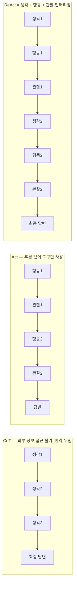

# ReAct Pattern (Reasoning + Acting)

## 개요

**ReAct**는 LLM이 **추론(Reasoning)**과 **행동(Acting)**을 인터리빙하여 문제를 해결하는 에이전트 패턴이다. "생각 → 행동 → 관찰"의 루프를 반복하며 외부 도구를 활용하는 동시에 추론 흔적(reasoning trace)을 명시적으로 생성한다.

## 제창

- **저자**: Yao et al., Princeton + Google Brain (2022)
- **논문**: "ReAct: Synergizing Reasoning and Acting in Language Models" — [arXiv:2210.03629](https://arxiv.org/abs/2210.03629)
- CoT(추론만)와 Act(행동만)의 한계를 결합하여 극복

## 핵심 아이디어



## ReAct 루프 예시

```
사용자: "2024년 삼성전자 매출과 그 전년 대비 성장률은?"

[생각1]: 삼성전자의 2024년 매출을 검색해야겠다.
[행동1]: search("삼성전자 2024년 연간 매출")
[관찰1]: "삼성전자 2024년 매출: 300조 6,900억원"

[생각2]: 2023년 매출도 검색해서 성장률을 계산해야겠다.
[행동2]: search("삼성전자 2023년 연간 매출")
[관찰2]: "삼성전자 2023년 매출: 258조 9,350억원"

[생각3]: 성장률 = (300.69 - 258.94) / 258.94 × 100 = 16.1%
[최종 답변]: 삼성전자 2024년 매출은 300조 6,900억원이며,
             2023년 대비 약 16.1% 성장했습니다.
```

## 구현

### LangGraph ReAct Agent

```python
from langgraph.prebuilt import create_react_agent
from langchain_openai import ChatOpenAI
from langchain_community.tools import TavilySearchResults, WikipediaQueryRun

# 도구 목록
tools = [
    TavilySearchResults(max_results=3),
    WikipediaQueryRun(),
]

# ReAct 에이전트 생성
agent = create_react_agent(
    model=ChatOpenAI(model="gpt-4o"),
    tools=tools,
)

# 실행
result = agent.invoke({
    "messages": [{"role": "user", "content": "2024년 삼성전자 매출은?"}]
})
```

### 수동 구현

```python
def react_agent(question: str, tools: dict, max_steps: int = 10) -> str:
    history = []
    
    for step in range(max_steps):
        # 1. 생각 + 행동 결정
        prompt = build_react_prompt(question, history)
        thought_action = llm.generate(prompt)
        
        # 2. 파싱: 행동인가 최종 답변인가?
        if "Final Answer:" in thought_action:
            return extract_final_answer(thought_action)
        
        action, action_input = parse_action(thought_action)
        
        # 3. 도구 실행
        if action in tools:
            observation = tools[action](action_input)
        else:
            observation = f"Error: Unknown tool '{action}'"
        
        # 4. 히스토리 업데이트
        history.append({
            "thought": extract_thought(thought_action),
            "action": action,
            "action_input": action_input,
            "observation": observation
        })
    
    return "Max steps reached without final answer"
```

## ReAct 프롬프트 형식

```
You have access to the following tools:
- search(query): 웹 검색
- calculator(expression): 수식 계산

Use this format:
Thought: [현재 상황 분석 및 다음 행동 결정]
Action: [도구명]
Action Input: [도구 입력]
Observation: [도구 출력]
... (반복)
Thought: 이제 최종 답변을 할 수 있다.
Final Answer: [최종 답변]

Begin!
Question: {question}
```

## ReAct의 장점

- **환각 감소**: 실제 외부 정보로 추론 보완
- **추론 투명성**: 단계별 사고 과정 추적 가능
- **에러 회복**: 잘못된 관찰 후 추론으로 수정 가능
- **범용성**: 다양한 도구 조합 가능

## ReAct의 한계와 개선

| 한계 | 해결책 |
|------|-------|
| 긴 루프에서 컨텍스트 손실 | Context Compression |
| 잘못된 행동 선택 | 계획 단계 추가 (Plan-and-Solve) |
| 루프 비용 | 캐싱, 조기 종료 조건 |
| 단일 경로만 탐색 | Tree of Thoughts 결합 |

## Reflexion과의 관계

Reflexion(→ [[Planning_and_Reflection]])은 ReAct를 확장하여 **실패 후 언어적 자기 반성**을 추가:
```
ReAct:    생각 → 행동 → 관찰 → 반복
Reflexion: 실패 → 반성 생성 → 반성을 메모리에 저장 → 다음 시도에 활용
```

## AI Engineering에서의 역할

ReAct는 현대 LLM 에이전트 아키텍처의 **기본 설계 원칙**이다. LangGraph의 기본 에이전트 패턴, OpenAI Assistants, Anthropic Claude의 에이전트 모드 모두 ReAct의 아이디어를 기반으로 한다. "생각하고 행동하는" 에이전트를 구현할 때 가장 먼저 적용하는 패턴이다.

## 관련 개념
[[Chain_of_Thought]] · [[Tool_Use_and_Function_Calling]] · [[LangGraph]] · [[Planning_and_Reflection]]

## 출처
- Yao et al. (2022) "ReAct: Synergizing Reasoning and Acting in Language Models" — [arXiv:2210.03629](https://arxiv.org/abs/2210.03629)
- LangGraph ReAct 예시 — [langchain-ai.github.io/langgraph](https://langchain-ai.github.io/langgraph/tutorials/introduction/)
- Google AI for Developers "ReAct agent with LangGraph" — [ai.google.dev](https://ai.google.dev/gemini-api/docs/langgraph-example)
