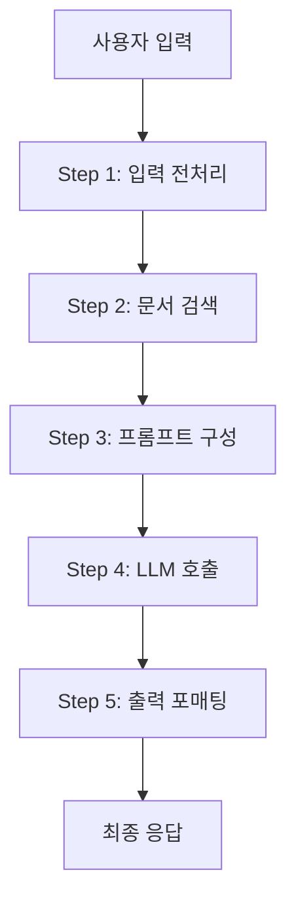

# Linear Flow (선형 플로우)

## 개요

**Linear Flow**는 입력이 들어와서 고정된 순서의 단계를 거쳐 출력이 나오는 **방향성 비순환 그래프(DAG)** 형태의 LLM 파이프라인이다. 조건 분기나 루프 없이 한 방향으로만 흐른다.



## 하위 문서

| 문서 | 내용 |
|------|------|
| [[LangChain]] | LCEL `\|` 연산자 기반 체인 조립 (Harrison Chase, 2022) |
| [[LlamaIndex]] | 5단계 인덱싱-질의 파이프라인 (Jerry Liu, 2022) |
| [[Tool_Use_and_Function_Calling]] | LLM이 외부 함수를 호출하는 단일 라운드 트립 |

## Linear vs Graph Flow

| 비교 | Linear Flow | Graph Flow |
|------|------------|-----------|
| 구조 | 순차적 단계 | 노드와 엣지 |
| 루프 | 없음 | 가능 |
| 조건 분기 | 제한적 | 자유로움 |
| 디버깅 | 쉬움 | 복잡 |
| 적합 케이스 | RAG QA, 요약 | Agent, HITL |

## 언제 Linear Flow를 선택하는가

```
✅ Linear Flow 적합:
  - 고정된 RAG 파이프라인 (검색 → 생성)
  - 문서 요약/변환
  - 단순 질의응답
  - 비용 예측이 중요한 서비스

❌ Graph Flow가 필요한 경우:
  - 품질 검증 후 재시도
  - 사람 승인 필요
  - 동적으로 다음 단계 결정
  - 멀티에이전트 협업
```

## AI Engineering에서의 역할

Linear Flow는 **가장 단순하고 신뢰할 수 있는 LLM 파이프라인 패턴**이다. 예측 가능한 동작, 쉬운 디버깅, 낮은 레이턴시가 장점이며, 많은 프로덕션 RAG 시스템의 기반이 된다.

## 관련 개념
[[Graph_Flow/Graph_Flow]] · [[Retrieval_Strategies/RAG/RAG]]
