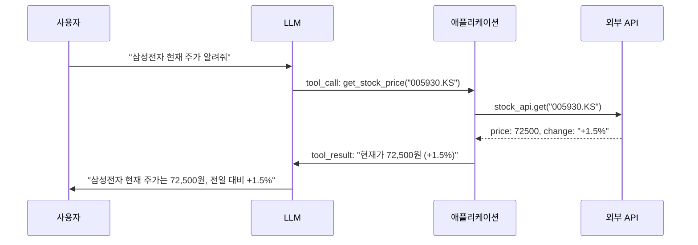

# Tool Use & Function Calling

## 개요

**Tool Use**(또는 Function Calling)는 LLM이 외부 함수·API·도구를 호출하여 자신의 지식 한계를 넘어서는 능력이다. LLM이 "어떤 도구를 어떤 인자로 호출해야 하는지"를 구조화된 형태로 출력하면, 실제 실행은 애플리케이션이 담당하고 결과를 다시 LLM에게 제공한다.

## 제창 및 역사

- **OpenAI Function Calling** (2023년 6월): 최초 공식 API 지원
- **Anthropic Tool Use** (2024년 초): Claude에서 공식 지원
- **Google Function Declarations**: Gemini에서 지원
- **MCP (Model Context Protocol)**: Anthropic이 제안한 오픈 도구 표준 (2024) → [[AI/Engineering/Agent_Engineering/Agent_Skills_and_Protocols/MCP|MCP]]

## 작동 원리



## API 구현 예시

### OpenAI Function Calling

```python
import openai
import json

# 도구 정의
tools = [
    {
        "type": "function",
        "function": {
            "name": "get_weather",
            "description": "지정한 도시의 현재 날씨를 가져옵니다",
            "parameters": {
                "type": "object",
                "properties": {
                    "city": {
                        "type": "string",
                        "description": "도시명 (예: 서울)"
                    },
                    "unit": {
                        "type": "string",
                        "enum": ["celsius", "fahrenheit"]
                    }
                },
                "required": ["city"]
            }
        }
    }
]

# LLM에게 도구 제공
response = openai.chat.completions.create(
    model="gpt-4o",
    messages=[{"role": "user", "content": "서울 날씨 어때?"}],
    tools=tools,
    tool_choice="auto"
)

# 도구 호출 여부 확인
if response.choices[0].finish_reason == "tool_calls":
    tool_call = response.choices[0].message.tool_calls[0]
    args = json.loads(tool_call.function.arguments)
    # 실제 함수 호출
    result = get_weather(args["city"])
```

### Anthropic Tool Use

```python
import anthropic

client = anthropic.Anthropic()

tools = [
    {
        "name": "search_web",
        "description": "웹에서 정보를 검색합니다",
        "input_schema": {
            "type": "object",
            "properties": {
                "query": {"type": "string", "description": "검색어"},
                "num_results": {"type": "integer", "default": 5}
            },
            "required": ["query"]
        }
    }
]

response = client.messages.create(
    model="claude-sonnet-4-6",
    max_tokens=1024,
    tools=tools,
    messages=[{"role": "user", "content": "2024년 AI 트렌드 찾아줘"}]
)

# 도구 호출 처리
if response.stop_reason == "tool_use":
    tool_use = next(b for b in response.content if b.type == "tool_use")
    result = search_web(tool_use.input["query"])
    # 결과를 다시 Claude에게 전달
    ...
```

## Parallel Tool Calling

최신 모델은 여러 도구를 병렬로 호출:
```python
# LLM이 여러 도구 동시 호출 결정
tool_calls = [
    {"name": "get_weather", "args": {"city": "서울"}},
    {"name": "get_news", "args": {"topic": "주식"}},
    {"name": "search_db", "args": {"query": "삼성전자"}}
]
# 세 도구 병렬 실행 → 모든 결과 수집 → 하나의 응답 생성
```

## 도구 설계 모범 사례

```python
# ✅ 좋은 도구 설명
{
    "name": "search_products",
    "description": "제품 데이터베이스에서 제품을 검색합니다. "
                   "제품명, 카테고리, 가격 범위로 필터링 가능합니다.",
    "parameters": {
        "query": "검색어 (예: '블루투스 이어폰')",
        "category": "카테고리 필터 (예: '전자제품'). 선택사항.",
        "max_price": "최대 가격 (원). 선택사항.",
        "limit": "반환할 최대 결과 수 (기본값: 10)"
    }
}

# ❌ 나쁜 도구 설명
{
    "name": "search",  # 너무 모호
    "description": "검색합니다",  # 정보 없음
    "parameters": {"q": "쿼리"}  # 설명 없음
}
```

## 도구 유형 분류

Tool Use에서 사용하는 도구는 **정의 주체와 실행 방식**에 따라 세 가지 유형으로 나뉜다 [1].

### 1. Built-in Tools (내장 도구)

모델 서비스 제공자가 플랫폼 수준에서 제공하는 도구. 개발자가 별도 구현 없이 API 파라미터 하나로 활성화하며, 모델 학습과 긴밀히 통합되어 있다.

| 플랫폼 | 내장 도구 예시 |
|---|---|
| Gemini (Google) | Google Search Grounding, Code Execution, URL Context, Computer Use |
| OpenAI | Web Search, Code Interpreter, File Search |
| Claude (Anthropic) | Computer Use |

**특징**: 구현 불필요, 플랫폼 종속적, 모델과 통합되어 고성능.

### 2. Function Tools (함수 도구)

개발자가 JSON Schema로 정의하고 LLM이 호출 여부·인자를 판단하며, 실제 실행은 애플리케이션 코드가 담당하는 커스텀 도구 [1]. 이 문서의 "작동 원리"와 "API 구현 예시"에서 설명하는 핵심 패턴이다.

```python
# Google ADK 예시: docstring이 description으로 자동 변환
def set_light_values(brightness: int, color_temp: str):
    """거실 조명 밝기와 색온도를 설정합니다.

    Args:
        brightness: 밝기 (0-100%)
        color_temp: 색온도 ("warm" | "cool")
    """
    ...
```

**특징**: 완전한 커스터마이징 가능, 플랫폼 독립적, MCP로 표준화 가능.

### 3. Agent Tools / Sub-Agent (에이전트 도구)

다른 에이전트 전체를 하나의 도구로 추상화하는 방식 [1]. Orchestrator가 전문화된 Sub-Agent를 마치 함수처럼 호출하며, A2A(Agent-to-Agent) 프로토콜로 원격 에이전트도 도구화할 수 있다.

```python
# Google ADK: AgentTool로 Sub-Agent를 도구로 wrap
from google.adk.tools import AgentTool

research_agent = LlmAgent(name="researcher", tools=[search_tool])
writer_agent = LlmAgent(
    name="writer",
    tools=[AgentTool(agent=research_agent)]  # Sub-Agent를 도구로
)
```

**특징**: 복잡한 태스크를 전문 에이전트에게 위임, 재귀적 구성 가능, 에이전트 간 책임 분리.

→ 자세한 내용: [[Agent_Architectures]] (Orchestrator & Sub-Agents 패턴), [[Agent_Skills_and_Protocols/A2A]]

---

## 도구의 기능별 Use Case

도구가 수행하는 역할에 따라 네 가지 범주로 분류된다 [1][2].

### 1. 정보 검색 (Information Retrieval)

외부 지식 소스에서 데이터를 가져오는 도구. LLM의 학습 시점 이후 최신 정보나 내부 데이터에 접근한다.

- **예시**: [[Agent_Skills_and_Protocols/MCP|MCP]] Toolbox, [[AI/Engineering/Context_Engineering/Retrieval_Strategies/NL2SQL/NL2SQL|NL2SQL]](자연어 → SQL 변환), [[AI/Engineering/Context_Engineering/Retrieval_Strategies/RAG/RAG|RAG]](벡터 DB 검색), [[AI/Engineering/Context_Engineering/Retrieval_Strategies/GraphRAG/Knowledge_Graph/Knowledge_Graph|Knowledge Graph]] 조회
- **특징**: 읽기 전용, 사이드 이펙트 없음, 캐싱 가능

### 2. API 연결 (API Integration)

외부 서비스 API를 호출하여 실시간 데이터를 가져오거나 단순 액션을 실행하는 도구.

- **예시**: 날씨 API, 주식 시세 API, 결제 API, GitHub REST API
- **특징**: 실시간 데이터 접근, 인증(API Key/OAuth) 필요, 멱등성 고려

### 3. 시스템 통합 (System Integration)

기업 내부 시스템이나 SaaS 서비스와 연결하여 실질적인 액션을 수행하는 도구.

- **예시**: Gmail, Google Drive, Calendar, Slack, Jira, Salesforce (Google Connectors 등)
- **특징**: 영구적 사이드 이펙트(이메일 전송·파일 수정 등), 세밀한 권한 관리 필수, HITL 검토 권장

### 4. Human-in-the-Loop (HITL) ([[Human_in_the_Loop]])

에이전트가 자율 판단하기 어려운 단계에서 인간의 승인·입력을 요청하는 도구 [1][2].

```python
def ask_for_confirmation(action: str, details: dict) -> bool:
    """비가역적 액션 전 인간 승인을 요청합니다"""
    # UI에 승인 다이얼로그 → 사용자 응답 대기
    return user_approved

def ask_for_input(prompt: str) -> str:
    """에이전트가 결정할 수 없는 정보를 사용자에게 요청합니다"""
    ...
```

- **사용 시점**: 비가역적 작업(대량 이메일 발송, 파일 삭제), 민감 데이터 접근, 모델 확신도 낮을 때
- **특징**: 자율성과 안전성의 균형, [[Agent_Skills_and_Protocols/MCP|MCP]] Sampling primitive와 연계 가능

---

## Tool Use와 Agent의 관계

Tool Use는 [[AI/Engineering/Agent_Engineering/Agent_Engineering|Agent Engineering]]의 핵심 구성 요소다:
```
Agent = LLM + Tools + Memory + Planning
              ↑
          Tool Use가 여기서 실제 세계와의 인터페이스 제공
```

ReAct 에이전트 루프:
```
생각(Thought) → 행동(Action: 도구 호출) → 관찰(Observation: 결과) → 반복
```

## MCP: Function Calling의 표준화 레이어

Function Calling은 각 모델(OpenAI, Anthropic, Google)마다 API 형식이 다르고, 도구마다 커스텀 통합 코드가 필요하다는 한계가 있다. Anthropic은 2024년 11월 이를 해결하는 오픈 표준을 발표했다.

**MCP (Model Context Protocol)**는 "어떤 LLM이든 표준화된 방식으로 외부 도구·서비스와 통신한다"는 프로토콜이다:

```
Function Calling (모델별 상이):
  OpenAI 방식: tools=[{"type": "function", "function": {...}}]
  Anthropic 방식: tools=[{"name": ..., "input_schema": {...}}]
  → 같은 도구를 두 번 구현해야 함

MCP (표준화):
  MCP Server 한 번 구현 → Claude, GPT-4, Gemini 모두 사용 가능
  → 2026년 기준 주간 다운로드 2,000만 회, 사실상 업계 표준
```

MCP의 4가지 Primitive 중 **Tools**가 Function Calling과 직접 대응하며, 추가로 **Resources**(데이터 노출), **Prompts**(템플릿), **Sampling**(서버→LLM 요청)을 제공한다.

→ 자세한 내용: [[Agent_Skills_and_Protocols/MCP]]

---

## AI Engineering에서의 역할

Function Calling은 LLM을 "텍스트 생성기"에서 "실제 행동 실행자"로 전환시키는 핵심 기술이다. 검색, DB 조회, API 호출, 코드 실행 등 모든 외부 상호작용이 Function Calling을 통해 이루어진다. Structured Output([[Structured_Output]])의 특수 형태로, 프로덕션 Agent 시스템의 필수 구성 요소다. MCP는 이 Function Calling을 표준 프로토콜로 승화시킨 다음 단계다.

## 관련 개념
[[Structured_Output]] · [[ReAct_Pattern]] · [[Agent_Core_Pillars]] · [[LangChain]] · [[Agent_Skills_and_Protocols/MCP]]

## 출처
- OpenAI Function Calling 문서 — [platform.openai.com](https://platform.openai.com/docs/guides/function-calling)
- Anthropic Tool Use 문서 — [docs.anthropic.com](https://docs.anthropic.com/en/docs/build-with-claude/tool-use)
- Anthropic (2024) "Introducing the Model Context Protocol" — [anthropic.com](https://www.anthropic.com/news/model-context-protocol)
- Anthropic (2025) "Equipping Agents for the Real World with Agent Skills" — [anthropic.com](https://www.anthropic.com/engineering/equipping-agents-for-the-real-world-with-agent-skills)

## References

[1] Mike Styer et al. (Google), "Agent Tools & Interoperability with Model Context Protocol (MCP)" — [kaggle.com](https://www.kaggle.com/whitepaper-agent-tools-and-interoperability-with-mcp) (2025년 11월 최초 발행, 2026년 5월 업데이트) · 이 위키: [[AI/sources/Agent_Tools_&_Interoperability_with_Model_Context_Protocol_(MCP)|Agent Tools & MCP]]

[2] Kaggle 5-Day Gen AI Course (2026년 5월), "Agent Tools" (Day 2) — `raw/kaggle/2026may/2025_Day_2_Rewrite_v1_AgentTools.pdf`
