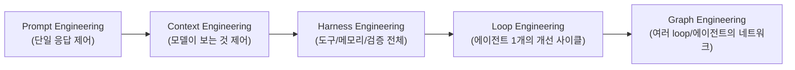

# Graph Engineering (그래프 엔지니어링)

## 개요

**Graph Engineering**은 2026년 7월 전후로 업계에서 부상한 용어로, [[Loop_Engineering/Loop_Engineering|Loop Engineering]]의 다음 단계를 가리킨다. Loop Engineering이 **에이전트 하나의 행동 사이클**(observe → reason → act → verify)을 프로그래밍 가능하게 만드는 것이었다면, Graph Engineering은 **여러 loop와 에이전트로 이뤄진 조직 전체**를 엔지니어링 대상으로 삼는다 — 누가 존재하고, 무엇을 소유하고, 어떤 전이(transition)가 허용되며, 서로 다른 루프들이 어떻게 서로를 감시·제약·교정하는가를 명시적으로 설계하는 작업이다.

## 명명 계보: 왜 지금 등장했는가

Carlos E. Perez(Intuition Machine)는 이를 `prompt engineering → context engineering → harness engineering → loop engineering → graph engineering`으로 이어지는 명명 계보의 최신 단계로 정리한다. 각 이름은 실무자들이 프로덕션에서 부딪힌 벽에 붙인 이름이지, 마케팅이 만들어낸 신조어가 아니라는 것이 LangChain(Sydney Runkle)의 입장이다. 다만 LangChain은 동시에 "Graph Engineering 자체는 새롭지 않다 — LangGraph가 3년째 해온 일이다"라고 반박한다. 이 위키는 아래처럼 이 두 입장을 종합한다: **그래프 표현(노드/엣지/state) 자체는 새롭지 않지만, 노드 안에 이제 "완전한 에이전트"가 들어갈 수 있다는 점, 그리고 그 그래프를 멀티에이전트 "조직"의 거버넌스 단위로 다루기 시작했다는 점은 실질적으로 새롭다.**

## 세 가지 관점

같은 용어를 서로 다른 3개 소스가 서로 다른 각도에서 정의하고 있다:

| 관점 | 핵심 주장 | 초점 |
|------|-----------|------|
| **LangChain** | 그래프(노드/엣지/state)로 에이전트 행동에 구조적 제약을 부여. 새로운 것은 노드 안에 완전한 에이전트가 들어갈 수 있다는 점 | 구현 메커니즘 |
| **TrueFoundry** | 멀티에이전트 시스템의 **토폴로지**(누가 존재하고, 무엇을 소유하고, 어떤 전이가 허용되는가)를 명시적으로 설계 | 조직 구조 + 거버넌스 |
| **Eigent** | 여러 feedback loop(메트릭, eval, 감사, 정책, 워크플로)를 서로 감시·제약·교정하는 네트워크로 엮는 작업 | loop들의 네트워크 |

이 챕터는 TrueFoundry·Eigent의 관점(조직 토폴로지, loop-of-loops)을 중심으로 다루며, [[Multi_Agent_Topology]] · [[Loop_Networks_and_Anchors]] 두 하위 문서로 구성된다.

## 하위 문서

| 문서 | 내용 |
|------|------|
| [[Multi_Agent_Topology]] | 노드/엣지 유형, 동적 라우팅(LangGraph `Send()`), 거버넌스(identity/budget/guardrail hook), Graph-of-Agents 학술 근거 |
| [[Loop_Networks_and_Anchors]] | Work Graph vs Improvement Graph, 4대 구조적 실패 모드(Goodhart's Law 등), Anchor(외부 고정 기준점) |

## 기존 위키의 "그래프" 관련 내용과의 관계

이 위키에는 이미 그래프 관련 내용이 두 곳에 있다. **Graph Engineering은 이 둘을 대체하지 않는다** — 둘 다 여전히 유효하며, 이 챕터는 그 위에 놓이는 조직/거버넌스 레이어다.

- [[Flow_Engineering/Graph_Flow/Graph_Flow|Graph Flow]] — LangGraph의 **구현 메커니즘**(StateGraph, 조건부 엣지, 순환 플로우, ReAct, Human-in-the-Loop). "그래프를 어떻게 코드로 짜는가"에 대한 답.
- [[Context_Engineering/Retrieval_Strategies/GraphRAG/GraphRAG|GraphRAG]] / [[Context_Engineering/Retrieval_Strategies/GraphRAG/Knowledge_Graph/Knowledge_Graph|Knowledge Graph]] — **데이터** 그래프. 엔티티-관계를 저장·검색하는 구조. "무엇을 검색하는가"에 대한 답.
- **Graph Engineering** (이 챕터) — **조직** 그래프. 누가(어떤 노드가) 존재하고, 어떤 권한과 예산을 가지며, 어떤 loop가 다른 loop를 감시·거부권 행사하는가. "누가 무엇을 할 수 있는가"에 대한 답.

## AI Engineering에서의 역할

Graph Engineering은 단일 에이전트·단일 루프 수준에서는 보이지 않던 실패 — 서로 다른 loop가 충돌하거나(Inter-loop Conflict), 한 에이전트의 최적화가 다른 에이전트의 목표를 훼손하는 것 — 를 드러내고 관리하는 최상위 계층이다. [[Loop_Engineering/Loop_Engineering|Loop Engineering]]이 "시스템 하나가 스스로 개선되는가"를 다뤘다면, Graph Engineering은 "여러 개선 시스템들이 서로를 방해하지 않고 함께 개선되는가"를 다룬다.

## 관련 개념
[[Loop_Engineering/Loop_Engineering]] · [[Flow_Engineering/Graph_Flow/Graph_Flow]] · [[Agent_Engineering/Multi_Agent_Coordination]] · [[Harness_Engineering/AI_Governance_and_Compliance]]

## 출처
- LangChain, ["3 Years of Graph Engineering with LangGraph"](https://www.langchain.com/blog/3-years-of-graph-engineering-with-langgraph) (2026)
- LangChain, ["The Art of Loop Engineering"](https://www.langchain.com/blog/the-art-of-loop-engineering) (2026)
- TrueFoundry, ["Graph Engineering for Multi-Agent Systems: Architecture, Governance, and Observability"](https://www.truefoundry.com/blog/graph-engineering-enterprise-guide) (2026)
- Eigent, ["Graph Engineering for AI Agents"](https://www.eigent.ai/blog/graph-engineering-ai-agents) (2026)
- Carlos E. Perez (Intuition Machine), ["Is Graph Engineering Here? LangChain Says It's Nothing New"](https://ai-engineering-trend.medium.com/is-graph-engineering-here-langchain-says-its-nothing-new-17a35a2bad37) (2026)
