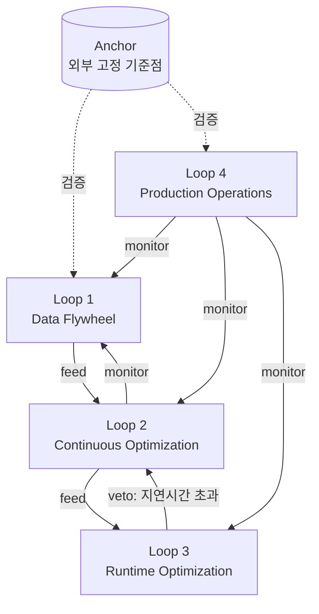

# Loop Networks and Anchors (루프 네트워크와 앵커)

## 개요

Eigent는 [[Loop_Engineering/Loop_Engineering|Loop Engineering]]과 Graph Engineering의 관계를 다음과 같이 요약한다: *loop engineering이 "에이전트 하나의 행동을 프로그래밍 가능하게 만드는 것 — act, observe, reason, repeat의 반복 사이클 하나"였다면, graph engineering은 그 다음 계층 — "loop와 에이전트로 이뤄진 조직 전체를 프로그래밍 가능하게 만드는 것"*이다.



## Work Graph vs Improvement Graph

Eigent는 그래프를 두 종류로 구분한다:

| 구분 | 정의 | 예시 |
|------|------|------|
| **Work Graph** | 에이전트가 **무엇을 실행하는가**. 노드=도구/스킬/파일/서브태스크, 엣지=어떤 도구가 어떤 산출물을 만들었고 그 산출물이 어떤 단계로 흘러갔는가 | [[Multi_Agent_Topology]]에서 다룬 노드/엣지 토폴로지 |
| **Improvement Graph** | 에이전트가 시간이 지나며 **스스로를 어떻게 바꾸는가**. 노드=측정 지점·최적화 대상 변수(지연시간/품질/비용)·액션, 엣지=신뢰·권한·주기(cadence)를 인코딩한 방향성 관계 — 어떤 loop가 다른 loop를 먹이고(feed), 소유하고(own), 감시하고(monitor), 거부권을 행사하는지(veto) | [[Loop_Engineering/Loop_Engineering|Loop Engineering]]의 4개 하위 문서(Data Flywheel, Continuous Optimization, Runtime Optimization, Production Operations)가 각각 단일 loop이며, 이 문서는 그 4개를 네트워크로 엮는 상위 레이어 |

## 4대 구조적 실패 모드

여러 loop가 네트워크로 얽히면, 단일 loop에서는 나타나지 않던 실패가 발생한다.

| 실패 모드 | 설명 |
|-----------|------|
| **Goodhart's Law** | 메트릭을 강하게 밀어붙일수록 원래 목표에서 분리(detach)된다 — 예: [[Loop_Engineering/Runtime_Optimization\|Runtime Optimization]] 루프가 지연시간(latency)만 최적화하면, [[Loop_Engineering/Continuous_Optimization\|Continuous Optimization]] 루프가 추구하는 품질이 조용히 희생된다 |
| **Upward Blindness** | 개별 loop는 자신의 목표(target) 자체가 잘못됐는지 스스로 질문할 수 없다 — 목표 설정은 loop 바깥에서 와야 한다 |
| **Inter-loop Conflict** | 조정 없이 독립적으로 운영되는 loop들이 서로 충돌한다 — 예: 비용 절감 loop와 품질 개선 loop가 반대 방향으로 시스템을 당긴다 |
| **Measurement Decay** | 센서(측정 파이프라인)가 시간이 지나며 서서히 오작동하는데도, loop는 계속 낡은 데이터를 근거로 동작한다 — [[Harness_Engineering/Benchmarking\|Benchmarking]]에서 벤치마크가 오염(contamination)되는 문제와 근본적으로 같은 패턴 |

## Anchor: 외부 고정 기준점

이 네 가지 실패를 막는 핵심 장치가 **Anchor**다 — *"내부 메커니즘이 재작성하는 것이 금지된, 외부의 고정된 노드."*

```
Anchor의 예:
  - Held-out test set: 학습/최적화 루프가 절대 접근하거나 최적화 대상으로 삼을 수 없는 평가셋
  - 실물 재고(physical inventory): 시스템이 보고하는 숫자가 아니라 실제 셀 수 있는 대상
  - 안전 명세(safety spec): loop가 스스로 완화할 수 없는, 외부에서 정의된 제약
  - 인간 판단: 자동화된 루프 네트워크 전체를 우회해서 개입할 수 있는 최종 체크포인트
```

Anchor가 없는 loop 네트워크는 스스로를 참조하며 표류(self-referential drift)한다 — 모든 loop가 서로의 출력을 근거로 서로를 조정하면, 전체 네트워크가 현실과 점점 멀어져도 내부적으로는 "모든 지표가 개선되고 있다"고 보일 수 있다. [[Loop_Engineering/Data_Flywheel|Data Flywheel]]의 LLM-as-a-Judge 기반 자동 필터링이나 [[Loop_Engineering/Continuous_Optimization|Continuous Optimization]]의 자동 최적화 루프처럼 자기 강화적인 메커니즘일수록 Anchor의 필요성이 커진다.

## 실무 적용: 루프 네트워크 감사

```
분기별 루프 네트워크 감사 체크리스트:
  1. 이 시스템에 있는 모든 loop를 나열 (Data Flywheel, Continuous Optimization, Runtime Optimization, Production Operations 등)
  2. 각 loop 쌍 사이의 엣지를 기록 — 누가 누구를 feed/monitor/veto하는가?
  3. 각 loop가 최소 1개의 Anchor에 연결돼 있는지 확인 — 없다면 Upward Blindness 위험
  4. 최근 3개월간 두 loop가 반대 방향으로 움직인 사례가 있는지 확인 — Inter-loop Conflict 징후
  5. Anchor 데이터 자체의 최신성(freshness) 확인 — Anchor도 Measurement Decay에서 자유롭지 않다
```

## AI Engineering에서의 역할

[[Loop_Engineering/Loop_Engineering|Loop Engineering]]의 4개 하위 문서는 각각 훌륭하게 설계된 단일 loop라도, 서로 연결되지 않은 채 병렬로 돌아가면 이 문서가 다루는 실패 모드에 노출된다. Loop Networks and Anchors는 "루프 하나를 얼마나 잘 설계했는가"에서 "루프들의 네트워크가 전체적으로 현실에 발이 붙어 있는가(anchored)"로 질문을 한 단계 끌어올린다.

## 관련 개념
[[Loop_Engineering/Loop_Engineering]] · [[Loop_Engineering/Data_Flywheel]] · [[Loop_Engineering/Continuous_Optimization]] · [[Multi_Agent_Topology]] · [[Harness_Engineering/Guardrail_Engineering]] · [[Harness_Engineering/Benchmarking]]

## 출처
- Eigent, ["Graph Engineering for AI Agents"](https://www.eigent.ai/blog/graph-engineering-ai-agents) (2026)
- LangChain, ["The Art of Loop Engineering"](https://www.langchain.com/blog/the-art-of-loop-engineering) (2026)
- BDTechTalks, ["Demystifying loop engineering: Get more from AI agents, avoid loopmaxxing"](https://bdtechtalks.com/2026/06/22/ai-loop-engineering/) (2026)
