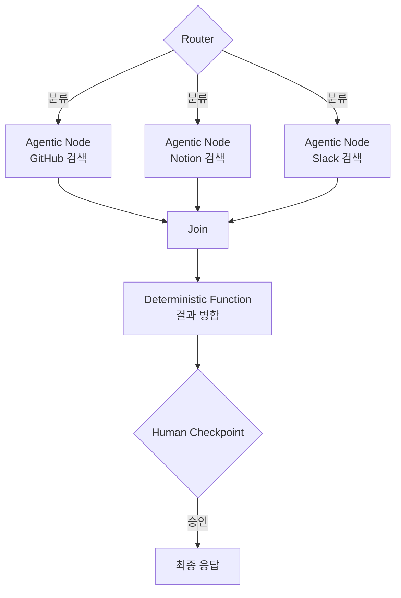

# Multi-Agent Topology (멀티에이전트 토폴로지)

## 개요

TrueFoundry는 Graph Engineering을 이렇게 정의한다: *"어떤 노드(에이전트, 결정론적 함수, 라우터, 인간 체크포인트)가 존재하고, 어떤 전이가 허용되며, 런타임에 work graph가 어떻게 형성·변형되는지를 설계하는 것."* 이는 데이터를 구조화하는 지식 그래프 엔지니어링과는 다르다 — **토폴로지**(topology)는 조직의 구조를 다룬다.



## 노드 유형

| 노드 유형 | 설명 |
|-----------|------|
| **Agentic Node** | observe-reason-act-verify 루프를 실행하는 완전한 에이전트. LangChain이 지적한 "새로운 점" — 예전에는 노드가 단일 LLM 호출이었지만, 이제는 노드 하나가 그 자체로 하나의 에이전트 시스템일 수 있다(nested agency) |
| **Deterministic Function** | 비-에이전트 연산. 고정된 입출력 규칙 |
| **Router** | 다음 노드를 결정하는 분기점 |
| **Join** | 병렬 경로의 결과를 통합 |
| **Tool** | MCP 서버 또는 함수 호출 (→ [[AI/Engineering/Agent_Engineering/Agent_Skills_and_Protocols/MCP\|MCP]]) |
| **Human Checkpoint** | 승인 게이트. [[AI/Engineering/Flow_Engineering/Graph_Flow/Human_in_the_Loop\|Human-in-the-Loop]]의 조직 그래프 버전 |

엣지는 노드 간의 **위임·신뢰·데이터 흐름**을 인코딩한다 — 어떤 노드가 다른 노드를 감시(monitor)하거나, 소유(own)하거나, 거부권(veto)을 행사할 수 있는지가 엣지의 방향과 속성으로 표현된다.

## Work Graph의 런타임 형성: 동적 라우팅

정적으로 미리 정의된 전이만으로는 부족하다. LangGraph의 `Send()` API는 런타임에 워커 노드를 동적으로 생성하고 데이터를 분배한다 (구현 세부는 → [[AI/Engineering/Flow_Engineering/Graph_Flow/LangGraph|LangGraph]]):

```python
from langgraph.types import Send

def route_to_workers(state: OrchestratorState) -> list[Send]:
    """작업 목록 개수만큼 워커 노드를 동적으로 fan-out"""
    return [
        Send("worker_node", {"task": task})
        for task in state["pending_tasks"]
    ]

builder.add_conditional_edges("orchestrator", route_to_workers)
```

정적 그래프에서는 전이 경로가 설계 시점에 고정되지만, `Send()` 기반 라우팅에서는 **work graph 자체가 실행마다 다른 모양으로 형성**된다 — task 개수, 우선순위, 실패 재시도 여부에 따라 노드 인스턴스 수와 연결 구조가 매번 달라진다.

## 거버넌스: 조직 그래프에 정체성과 예산을 부여하기

노드가 늘어날수록 "누가 무엇에 접근 가능한가"와 "누가 무엇을 소비했는가"를 추적하는 일이 핵심 과제가 된다. TrueFoundry가 제시하는 패턴:

**Identity & Access**: 각 노드는 독립적으로 거버넌스되는 호출자로서 고유한 identity를 가진다. Virtual-account 토큰이 호출자 컨텍스트를 전파한다.

**Guardrail Hook 4종**: `llm_input`(요청 전 콘텐츠 검사) · `llm_output`(응답 후 필터링) · pre-tool-invoke · post-tool-invoke — 노드별로 다른 정책을 적용할 수 있다 (→ [[AI/Engineering/Harness_Engineering/Guardrail_Engineering|Guardrail Engineering]]).

**노드 단위 상관관계 추적**: 예산·비용·지연시간을 노드 단위로 귀속시키려면 요청마다 그래프/실행/노드 식별자를 propagate해야 한다.

```
Authorization: Bearer <node-specific-virtual-account-token>
X-Graph-Metadata: {
  "graph_id": "release-review",
  "run_id": "run-8f31",
  "node_id": "security-reviewer"
}
```

이 식별자들을 오케스트레이터가 기록한 실제 런타임 토폴로지와 게이트웨이의 요청 로그가 서로 상관관계를 맺을 수 있게 하면, 노드별 비용·지연시간·모델·도구 사용 분석이 가능해진다 (→ [[AI/Engineering/Harness_Engineering/Observability_and_Tracing|Observability & Tracing]]).

**프로덕션 체크리스트**: ① 독립 거버넌스 대상마다 resolved identity ② 게이트웨이 요청에 안정적인 graph/run/node 식별자 ③ 오케스트레이터가 실제 런타임 work graph를 기록 ④ 오케스트레이션 트레이스와 게이트웨이 로그의 상관관계 확보 ⑤ virtual account 또는 메타데이터를 통한 예산 규칙 매핑 ⑥ 민감한 도구 액션에 승인 체크포인트 ⑦ virtual-model 레이어 뒤에 모델 라우팅 격리.

## 학술적 근거: Graph-of-Agents

Graph-of-Agents(GoA, 2026)는 멀티 LLM 협업을 그래프로 모델링하는 프레임워크로, "누구를 참여시키고 어떻게 연결할 것인가"를 자동화하려는 학술적 시도다:

1. **Node Sampling**: 모델 카드(각 모델의 도메인·태스크 특화)를 기반으로 관련성 높은 에이전트만 선택
2. **Edge Construction**: 선택된 에이전트들의 응답을 상호 평가해 관련성 순서로 엣지를 구성
3. **Message Passing & Aggregation**: 관련성 높은 에이전트 → 낮은 에이전트로 방향성 메시지 전달, 역방향 전달 후 그래프 기반 풀링으로 통합

MMLU/MMLU-Pro/GPQA 등에서 6개 에이전트를 모두 쓰는 기존 방법보다 3개만 선택한 GoA가 더 높은 성능을 보였다 — 토폴로지 설계(누구를 참여시킬지)가 단순히 에이전트 수를 늘리는 것보다 중요하다는 근거다.

## AI Engineering에서의 역할

노드 안에 완전한 에이전트가 들어갈 수 있게 되면서, 멀티에이전트 시스템은 더 이상 "여러 LLM 호출의 파이프라인"이 아니라 "여러 자율적 행위자로 구성된 조직"에 가까워진다. Multi-Agent Topology는 이 조직을 설계·통제하는 실무 기법이며, [[AI/Engineering/Agent_Engineering/Multi_Agent_Coordination|Multi-Agent Coordination]]이 다루는 조정 패턴·실패 모드와 함께 읽어야 한다 — 조정 패턴이 "에이전트들이 어떻게 상호작용하는가"라면, 토폴로지는 "그 상호작용이 허용되는 구조가 무엇인가"를 먼저 정의한다.

## 관련 개념
[[AI/Engineering/Flow_Engineering/Graph_Flow/LangGraph|Flow_Engineering/Graph_Flow/LangGraph]] · [[AI/Engineering/Agent_Engineering/Multi_Agent_Coordination|Agent_Engineering/Multi_Agent_Coordination]] · [[AI/Engineering/Harness_Engineering/Observability_and_Tracing|Harness_Engineering/Observability_and_Tracing]] · [[AI/Engineering/Harness_Engineering/AI_Governance_and_Compliance|Harness_Engineering/AI_Governance_and_Compliance]] · [[AI/Engineering/Agent_Engineering/Agent_Deployment|Agent_Engineering/Agent_Deployment]]

## 출처
- TrueFoundry, ["Graph Engineering for Multi-Agent Systems: Architecture, Governance, and Observability"](https://www.truefoundry.com/blog/graph-engineering-enterprise-guide) (2026)
- LangChain, ["3 Years of Graph Engineering with LangGraph"](https://www.langchain.com/blog/3-years-of-graph-engineering-with-langgraph) (2026)
- "Graph-of-Agents: A Graph-based Framework for Multi-Agent LLM Collaboration" (2026) — [arXiv:2604.17148](https://arxiv.org/abs/2604.17148)
- "Graph-Augmented Large Language Model Agents: Current Progress and Future Prospects" (2025) — [arXiv:2507.21407](https://arxiv.org/pdf/2507.21407)
