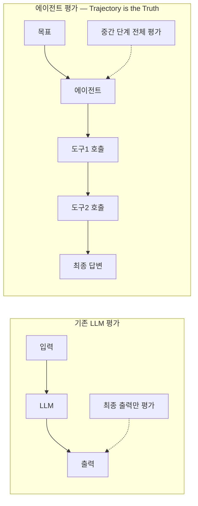
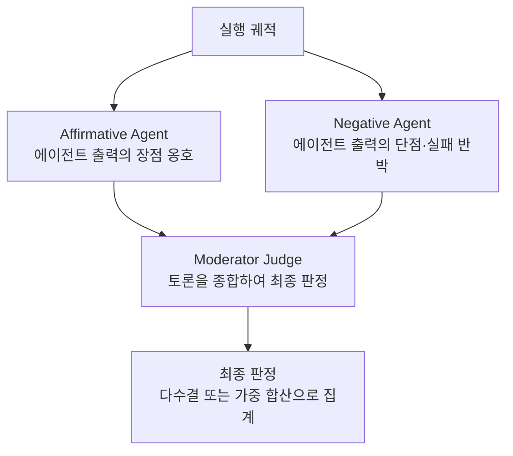
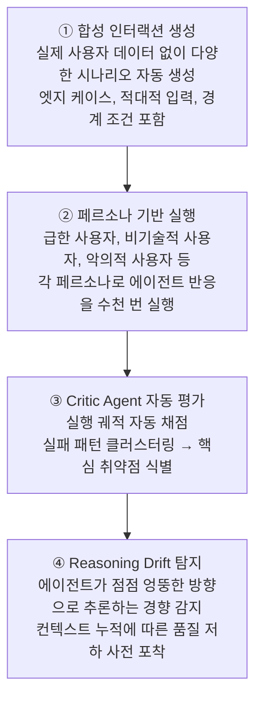

# Agent-as-a-Judge

## 개요

**Agent-as-a-Judge**는 에이전트 시스템을 평가하기 위해 또 다른 에이전트 시스템을 사용하는 평가 패러다임이다. LLM-as-a-Judge의 유기적 확장으로, **최종 출력만 평가하던 기존 방식에서 전체 실행 궤적(execution trajectory)을 평가하는 방식**으로 전환한다는 것이 핵심이다.

## 제창

- **저자**: Zhuge et al. (2024) — Mingchen Zhuge, Changsheng Zhao, Dylan Ashley 외 (Meta·KAUST·iGent 공동)
- **논문**: "Agent-as-a-Judge: Evaluate Agents with Agents" — [arXiv:2410.10934](https://arxiv.org/abs/2410.10934)
- **발표**: ICML 2025 (42nd International Conference on Machine Learning)
- **GitHub**: [metauto-ai/agent-as-a-judge](https://github.com/metauto-ai/agent-as-a-judge)
- **핵심 기여**: Agent Judge가 LLM-as-a-Judge를 극적으로 능가하며, 인간 평가 기준선과 동등한 수준임을 실증

## 왜 에이전트 평가는 다른가

기존 평가 방식은 에이전트 시스템에 두 가지 근본적 한계를 갖는다:



**문제: 최종 답변이 올바르더라도 최종 출력만으로 탐지 불가:**
- 과도한 도구 호출로 비용 낭비
- 잘못된 경로로 우연히 도달 (Process Failure)
- 보안 정책 위반 단계 포함
- 루프·반복 추론 발생

## LLM-as-a-Judge와의 핵심 차이점

| 항목 | LLM-as-a-Judge | Agent-as-a-Judge |
|------|---------------|-----------------|
| 평가 대상 | 최종 텍스트 출력 | 전체 실행 궤적 (trajectory) |
| 평가 주체 | 단일 LLM 호출 | 도구·멀티스텝 추론을 갖춘 Agent |
| 중간 피드백 | ✗ 불가 | ✅ 각 단계별 피드백 제공 |
| 도구 사용 | ✗ 없음 | ✅ 정보 검색·코드 실행 등 |
| 계층적 요건 검증 | ✗ 불가 | ✅ 요건 트리 구성 후 검증 |
| 인간 정렬률 | 60–70% | **~90%** |
| 비용 | 낮음 | 높음 |

## Agent Judge의 구조 (DevAI 기준)

Zhuge et al.은 코드 생성 Agent 평가용으로 초기 8개 Skills에서 ablation을 거쳐 5개 핵심 Skills로 정제했다:

| Skill | 역할 |
|-------|------|
| **Graph Building** | 코드베이스·태스크 관계 그래프 구성 |
| **File Location** | 평가 대상 파일·코드 스니펫 탐색 |
| **Information Retrieval** | 요건·문서에서 근거 정보 검색 |
| **Requirement Validation** | 계층적 사용자 요건 충족 여부 검증 |
| **Interactive Querying** | 에이전트 출력에 대한 추가 질의 |

이 Skills의 조합으로 Judge Agent는 단순 텍스트 비교를 넘어 **작업 완료의 맥락과 과정**을 이해한다.

## DevAI 벤치마크

Agent-as-a-Judge의 증명 테스트베드로 함께 제안된 벤치마크:

- **규모**: 55개 현실적인 AI 개발 자동화 태스크
- **요건**: 총 365개 계층적 사용자 요건 (hierarchical requirements)
- **특징**: 코드 생성뿐 아니라 전체 개발 사이클(중간 단계 포함) 평가
- **데이터셋**: [HuggingFace DEVAI-benchmark](https://huggingface.co/DEVAI-benchmark)

```
예시 태스크: "이미지에 숨겨진 텍스트를 삽입하되, 특정 요건을 준수하라"
계층 요건:
  1. 기능 완성 (최상위)
     1.1 입력 이미지 처리 → 1.1.1 포맷 지원, 1.1.2 예외 처리
     1.2 텍스트 인코딩 → 1.2.1 스테가노그래피 적용, 1.2.2 품질 유지
  2. 코드 품질 → 2.1 타입 힌트, 2.2 테스트 커버리지
```

## Critic Agent 패턴

에이전트 시스템에 Agent-as-a-Judge를 실제로 적용하는 핵심 패턴:

```python
# 에이전트 실행 추적 수집
execution_trace = {
    "goal": "사용자의 여행 일정 예약",
    "initial_plan": "항공편 검색 → 호텔 확인 → 예약 완료",
    "steps": [
        {"action": "search_flights", "input": "ICN→JFK 2026-08-01",
         "output": "결과 10건", "latency_ms": 320},
        {"action": "check_hotel", "input": "뉴욕 5성급",
         "output": "객실 3건", "latency_ms": 180},
        {"action": "book_flight", "input": "KE081",
         "output": "예약 완료", "latency_ms": 450},
    ],
    "final_answer": "여행 일정이 예약되었습니다.",
    "token_usage": 4200,
    "n_turns": 3
}

# Critic Agent 평가 프롬프트 — 최종 답변이 아닌 trace 전체를 전달하는 것이 핵심
critic_prompt = """
다음 에이전트 실행 추적을 평가하세요:

실행 추적: {execution_trace}

평가 기준:
1. 목표 달성 여부 (0-10) — 최종 상태가 목표를 충족하는가?
2. 단계 효율성 (0-10) — 불필요한 도구 호출 없이 최적 경로인가?
3. 정책 준수 (0-10) — 사용자 승인 없이 예약 등 위험 행동이 없는가?
4. 계획 품질 (0-10) — 초기 계획이 합리적이고 실행과 일치하는가?
5. 컨텍스트 처리 (0-10) — 중간 결과를 올바르게 해석하고 활용했는가?
6. 과정 실패 탐지 (서술) — 최종 답변이 맞더라도 과정에서 실패한 단계?

각 항목에 점수와 근거를 제시하세요.
"""

critic_result = critic_agent.run(
    critic_prompt.format(execution_trace=execution_trace)
)
```

**핵심 팁**: Critic Agent에 최종 답변만이 아닌 `execution_trace` 객체 전체(초기 계획·선택 도구·전달 인자)를 전달해야 Process Failure를 탐지할 수 있다 [1].

## Multi-Agent-as-Judge

단일 Critic Agent를 넘어 **여러 Agent가 협의하여 평가**하는 방식. 편향 완화와 다차원 평가에 효과적이다 [3].

### 역할 기반 토론 (Role-Based Debate)



### 페르소나 기반 평가

```python
# 서로 다른 페르소나를 가진 평가 Agent 앙상블
evaluators = [
    CriticAgent(persona="급한 사용자 — 속도·효율 중시"),
    CriticAgent(persona="비기술 사용자 — 명확성·UX 중시"),
    CriticAgent(persona="보안 감사자 — 정책 준수·리스크 중시"),
    CriticAgent(persona="도메인 전문가 — 정확성·완전성 중시"),
]

scores = [e.evaluate(execution_trace) for e in evaluators]
# 중간값 또는 가중 평균으로 최종 점수 산출
final_score = weighted_average(scores, weights=[0.2, 0.2, 0.3, 0.3])
```

## Agent Simulation *(2026년 5월)*

배포 전 에이전트를 수천 가지 시나리오로 사전 검증하는 규모 평가 방식. Critic Agent와 결합하면 자동 stress-test가 가능하다 [1][2].



## 장단점

### 장점
- 최종 출력만으로 탐지 불가능한 **Process Failure** 감지
- 계층적 요건을 단계별로 검증 → **세밀한 평가**
- LLM-as-a-Judge 대비 인간 정렬률 대폭 향상 (60-70% → ~90%)
- Reward Signal 제공 → 에이전트 **자기 개선 루프** 활성화
- Agent Simulation과 결합 시 배포 전 대규모 검증 가능

### 단점 및 한계
- LLM-as-a-Judge 대비 **비용과 복잡도** 증가
- 초기 논문은 코드 생성 도메인에 특화 → **도메인 일반화** 미검증
- **Gaming the Judge** 문제: 판사 Agent의 CoT가 부정확할 때 평가 결과가 왜곡될 수 있음 [4]
- Judge Agent 자체의 편향이 평가에 전이될 위험

## 구현 시 고려사항

```python
# ✅ 좋은 패턴: 궤적 전체를 Judge에게 전달
critic.evaluate(execution_trace=full_trace)

# ❌ 나쁜 패턴: 최종 답변만 전달
critic.evaluate(output=final_answer_only)

# ✅ 좋은 패턴: 평가 차원을 분리하여 각각 독립 평가
scores = {
    "goal_completion": critic.score(trace, "목표 달성"),
    "efficiency":      critic.score(trace, "단계 효율성"),
    "policy":          critic.score(trace, "정책 준수"),
}

# ✅ 좋은 패턴: 인간 전문가와 Judge 결과를 주기적으로 교정 (calibration)
calibrate_critic_agent(judge=critic, human_labels=golden_set)
```

## 현황 (2025–2026)

- **ICML 2025** 정식 발표 이후 에이전트 평가의 표준 패러다임으로 부상
- **Multi-Agent-as-Judge** (2025) 로 확장: 복수 Agent 협의 평가, 다차원 인간 평가 정렬 연구 [3]
- **AgentRewardBench** (2025): 웹 에이전트 궤적의 자동 평가 신뢰도 측정 벤치마크
- **TRAIL** (arXiv:2505.08638, 2025): Trace Reasoning and Agentic Issue Localization — 궤적에서 문제 단계를 자동 진단하는 후속 연구
- **Gaming the Judge** (arXiv:2601.14691, 2026): Judge의 CoT 부정직성이 평가를 왜곡하는 문제를 공식화
- Anthropic 내부에서도 LLM-based rubric grader를 에이전트 평가에 활용 (LLM-as-judge와 Agent-as-judge의 경계 수렴 중) [2]

## 관련 개념

[[LLM_as_a_Judge]] · [[Human_Evaluation]] · [[Observability_and_Tracing]] · [[Guardrail_Engineering]] · [[AI/Engineering/Harness_Engineering/LLM_as_a_Judge|LLM-as-a-Judge]] · [[Agent_Deployment]]

## 출처

- [1] Zhuge et al. (2024) "Agent-as-a-Judge: Evaluate Agents with Agents" — [arXiv:2410.10934](https://arxiv.org/abs/2410.10934) (ICML 2025)
- [2] Anthropic Engineering (2026) "Demystifying evals for AI agents" — [anthropic.com/engineering](https://www.anthropic.com/engineering/demystifying-evals-for-ai-agents)
- [3] "Multi-Agent-as-Judge: Aligning LLM-Agent-Based Automated Evaluation with Multi-Dimensional Human Evaluation" — [arXiv:2507.21028](https://arxiv.org/html/2507.21028v1)
- [4] "Gaming the Judge: Unfaithful Chain-of-Thought Can Undermine Agent Evaluation" — [arXiv:2601.14691](https://arxiv.org/pdf/2601.14691)
- [[Agent_Quality]] (이 위키의 소스 문서, 2025년 11월 최초 발행 → 2026년 5월 업데이트)
- Arize AI (2024) "Agent-as-a-Judge: Evaluate Agents with Agents" — [arize.com/blog](https://arize.com/blog/agent-as-a-judge-evaluate-agents-with-agents/)
