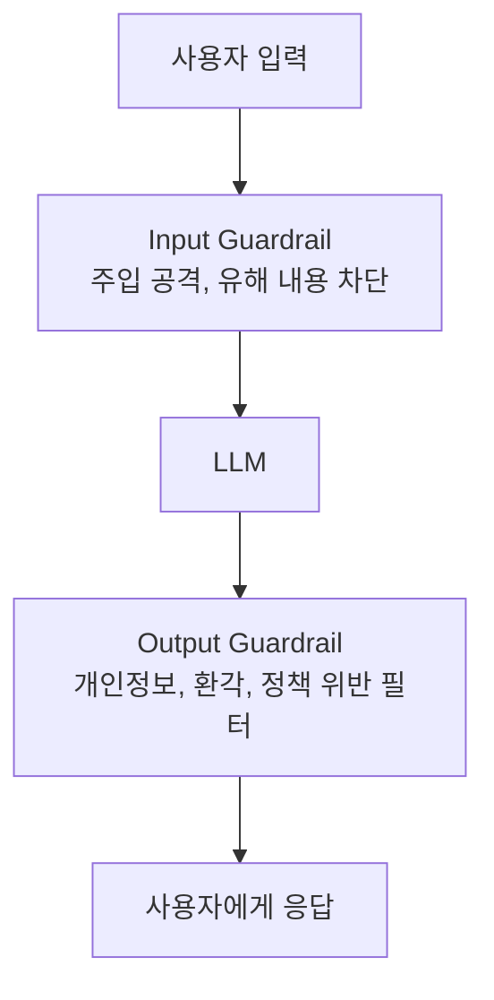
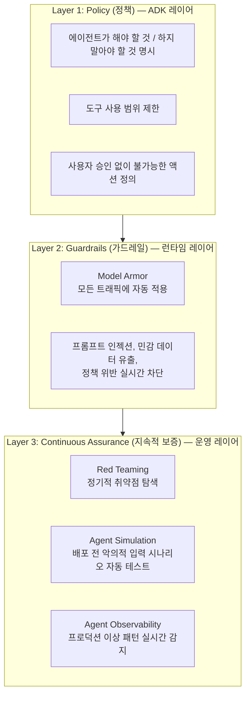
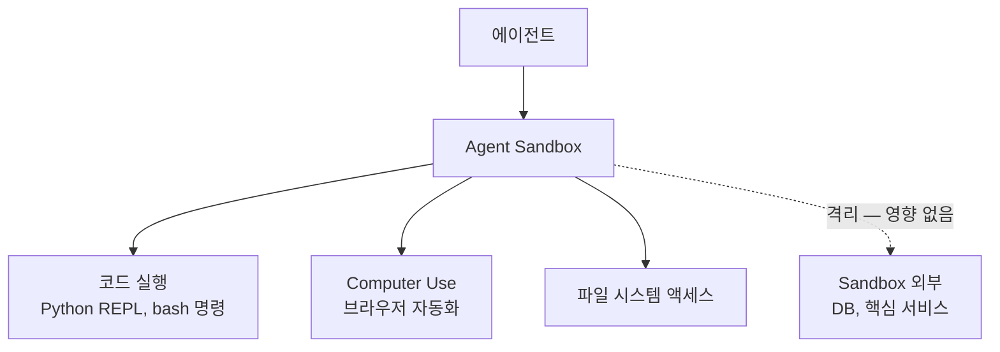

# Guardrail Engineering (안전 가드레일)

## 개요

**Guardrail Engineering**은 LLM 시스템이 유해하거나, 부정확하거나, 정책에 위반되는 출력을 생성하지 못하도록 **자동화된 안전 장치**를 설계하고 구현하는 분야다. Safety(안전)와 Alignment(정렬) 두 측면을 다룬다.

## Safety vs Alignment

```
Safety (안전):
  물리적·사회적 피해 방지
  예: 폭발물 제조법 제공 차단, 혐오 발언 필터링

Alignment (정렬):
  모델이 의도한 대로 동작
  예: 고객 지원 봇이 경쟁사 비교 안 하도록
      의료 AI가 진단이 아닌 안내만 하도록
```

## 가드레일 레이어

### Layer 1: 모델 내장 안전 (RLHF)

훈련 단계에서 모델에 안전 행동 내재화:
- OpenAI의 RLHF, Anthropic의 Constitutional AI
- "이것은 해로울 수 있으므로 도와드릴 수 없습니다"
- **장점**: 모든 입력에 자동 적용
- **단점**: 과도한 거부(over-refusal) 문제, 우회 가능성

### Layer 2: Runtime Guardrails (런타임)

외부 레이어로 입력/출력 감시:



## 주요 가드레일 도구

### NVIDIA NeMo Guardrails

오픈소스 프로그래밍 방식 가드레일:

```python
from nemoguardrails import LLMRails, RailsConfig

# 가드레일 설정
config = RailsConfig.from_path("./config")
rails = LLMRails(config)

# Colang 언어로 규칙 정의 (config/rails.co)
"""
define user ask about competitor
  "경쟁사 제품은 어때요?"
  "다른 회사 제품이 더 낫나요?"

define bot refuse to compare competitor
  "저는 자사 제품 안내만 담당합니다."

define flow competitor question
  user ask about competitor
  bot refuse to compare competitor
"""

# 사용
response = await rails.generate_async(
    messages=[{"role": "user", "content": "경쟁사 제품 어때요?"}]
)
```

**NeMo Guardrails 기능**:
- Input Moderation (유해 입력 차단)
- Output Moderation (응답 품질 검증)
- Fact-checking (환각 탐지)
- Topical Rails (주제 일탈 방지)
- Jailbreak Detection (탈옥 시도 감지)

### Guardrails AI

출력 검증 특화 오픈소스:

```python
from guardrails import Guard, OnFailAction
from guardrails.hub import ToxicLanguage, DetectPII

guard = Guard().use_many(
    ToxicLanguage(on_fail=OnFailAction.EXCEPTION),
    DetectPII(
        pii_entities=["EMAIL", "PHONE_NUMBER", "SSN"],
        on_fail=OnFailAction.FIX  # 자동으로 마스킹
    )
)

# 출력 검증
validated_output = guard.validate(llm_output)
```

### LlamaGuard (Meta)

Llama 기반 입력/출력 안전 분류기:

```python
from transformers import AutoModelForCausalLM, AutoTokenizer

model = AutoModelForCausalLM.from_pretrained("meta-llama/Llama-Guard-3-8B")
tokenizer = AutoTokenizer.from_pretrained("meta-llama/Llama-Guard-3-8B")

def check_safety(conversation):
    input_ids = tokenizer.apply_chat_template(conversation, return_tensors="pt")
    output = model.generate(input_ids, max_new_tokens=100)
    result = tokenizer.decode(output[0][len(input_ids[0]):])
    return "safe" in result.lower()
```

## 가드레일 유형별 구현

### 1. Input Validation

```python
def validate_input(user_input: str) -> tuple[bool, str]:
    # 길이 제한
    if len(user_input) > 10000:
        return False, "입력이 너무 깁니다"
    
    # Prompt Injection 탐지
    injection_patterns = ["ignore previous", "disregard instructions", "system:"]
    if any(p in user_input.lower() for p in injection_patterns):
        return False, "허용되지 않는 입력입니다"
    
    # 유해 내용 API 검사
    moderation = openai_moderation_api(user_input)
    if moderation.flagged:
        return False, "부적절한 내용이 포함되어 있습니다"
    
    return True, ""
```

### 2. Output Validation

```python
def validate_output(response: str, context: dict) -> tuple[str, bool]:
    # PII 탐지 및 마스킹
    response = mask_pii(response)
    
    # 환각 탐지 (출처 검증)
    if context.get("retrieved_docs"):
        faithfulness = check_faithfulness(response, context["retrieved_docs"])
        if faithfulness < 0.7:
            return "죄송합니다, 정확한 정보를 찾을 수 없습니다.", False
    
    # 독성 언어 필터
    toxicity_score = toxicity_classifier(response)
    if toxicity_score > 0.8:
        return "적절하지 않은 표현이 포함되어 수정되었습니다.", False
    
    return response, True
```

### 3. Constitutional AI (Anthropic)

모델이 스스로 원칙에 따라 응답을 자기 수정:
```
원칙 1: 안전에 해가 되는 정보를 제공하지 않는다
원칙 2: 차별적이거나 혐오적인 발언을 하지 않는다
원칙 3: 개인 프라이버시를 존중한다

1단계: 초기 응답 생성
2단계: 각 원칙에 따라 응답 비판
3단계: 비판을 반영하여 응답 수정
```

## 가드레일 설계 원칙

```
✅ 좋은 가드레일:
  - 구체적 규칙 ("의료 진단은 하지 않는다")
  - 측정 가능한 기준 (독성 점수 > 0.8 차단)
  - 우아한 실패 (거부 시 도움 방향 제시)
  - 최소 거부 원칙 (필요한 것만 차단)

❌ 나쁜 가드레일:
  - 모호한 규칙 ("나쁜 것은 하지 않는다")
  - 과도한 거부 (안전한 질문도 차단)
  - 일관성 없는 적용
  - 우회 가능한 단순 키워드 필터
```

## 에이전트 보안 아키텍처 *(2026년 5월)*

에이전트 시스템은 단순 입출력 필터를 넘어 3개 레이어의 체계적 보안이 필요하다.

### 3-Layer 보안 프레임워크



### ADK SafetyPlugin 패턴

Google ADK에서 에이전트 실행의 각 단계에 안전 검사를 삽입하는 패턴:

```python
from google.adk.agents import Agent
from google.adk.plugins import BasePlugin
from google.adk.types import CallbackContext, LlmRequest, LlmResponse

class SafetyPlugin(BasePlugin):
    """에이전트 실행 전후에 안전 검사를 수행하는 플러그인"""
    
    async def before_model_callback(
        self, callback_ctx: CallbackContext, llm_request: LlmRequest
    ) -> LlmResponse | None:
        """LLM 호출 전 실행 — 위험 입력 차단"""
        user_message = llm_request.contents[-1].parts[0].text
        
        # 정책 위반 패턴 검사
        if self._contains_policy_violation(user_message):
            # None 대신 LlmResponse 반환하면 LLM 호출 자체를 건너뜀
            return LlmResponse(
                content="요청된 작업은 정책상 허용되지 않습니다."
            )
        return None  # None 반환 = LLM 호출 정상 진행
    
    async def after_model_callback(
        self, callback_ctx: CallbackContext, llm_response: LlmResponse
    ) -> LlmResponse | None:
        """LLM 응답 후 실행 — 위험 출력 필터링"""
        response_text = llm_response.content.parts[0].text
        
        # 민감 정보 마스킹
        filtered = self._mask_pii(response_text)
        # 정책 위반 응답 차단
        if self._is_policy_violation(filtered):
            return LlmResponse(content="응답을 제공할 수 없습니다.")
        
        return None  # None 반환 = 원본 응답 그대로 사용
    
    def _contains_policy_violation(self, text: str) -> bool:
        # 구체적 정책 규칙 구현
        ...

# 에이전트에 플러그인 등록
agent = Agent(
    model="gemini-3.2-pro",
    plugins=[SafetyPlugin()]
)
```

**핵심**: `before_model_callback`은 위험 입력 차단(LLM 호출 비용도 절감), `after_model_callback`은 위험 출력 필터링에 각각 특화된다.

### Agent Sandbox

에이전트가 코드 실행·브라우저 자동화 등 위험 작업을 수행할 때 핵심 엔터프라이즈 시스템으로부터 격리하는 환경:



격리 효과: 에이전트가 악성 코드를 실행하거나 의도치 않은 시스템 명령을 내려도 Sandbox 외부(DB, 핵심 서비스)에 영향 없음.

Gemini Enterprise Agent Platform에서는 Agent Sandbox가 Agent Runtime에 통합되어 별도 설정 없이 코드 실행 작업이 자동 격리된다.

## 간접 프롬프트 인젝션 방어: PVE

**Indirect Prompt Injection**(→ [[Red_Teaming]])은 에이전트가 도구·문서·웹페이지를 통해 관찰한 외부 콘텐츠에 숨겨진 지시를 실행 지시로 오인하는 공격이다. **PVE (Prompt Vaccination / Verification-based Defense)** 계열 방어는 신뢰 레벨을 구조적으로 분리한다.

```
핵심 원칙: "데이터"와 "지시"를 신뢰 경계로 분리

  시스템 프롬프트 (신뢰됨)         → 항상 지시로 처리
  사용자 입력 (부분 신뢰)          → 지시로 처리하되 정책 범위 내로 제한
  도구/웹/문서 관찰 결과 (비신뢰)  → 절대 지시로 해석하지 않음, 오직 "데이터"로만 취급

구현 패턴:
  - 관찰 결과를 별도 태그로 감싸 모델에 전달: <observation untrusted="true">...</observation>
  - 관찰 결과 안에서 발견된 명령형 문장을 별도 분류기로 사전 스캔
  - 민감 행동(결제, 삭제, 외부 전송) 직전에는 "직전 근거가 신뢰된 소스인가"를 재검증
```

이 원칙은 [[Computer_Use_and_Voice_Agents]]의 브라우저 기반 에이전트, [[Autonomous_Systems]]의 장기 실행 에이전트에서 특히 중요하다 — 실행이 길어질수록 비신뢰 콘텐츠에 노출되는 빈도가 누적되기 때문이다.

## 워터마킹 (Watermarking)

AI 생성 콘텐츠임을 사후에 식별 가능하게 하는 기술. 정렬·안전과는 다른 축의 신뢰 메커니즘이다 — "이 출력이 안전한가"가 아니라 "이 출력이 AI가 만들었는가"를 다룬다.

| 기법 | 방식 |
|------|------|
| **SynthID** (Google DeepMind) | 텍스트/이미지 생성 시 통계적으로 감지 불가능한 패턴을 토큰 선택 확률에 삽입 |
| **Stable Signature** (Meta) | 이미지 생성 모델 가중치 자체에 워터마크 삽입 — 생성 후 편집에도 견고 |
| **C2PA** (Coalition for Content Provenance and Authenticity) | 콘텐츠에 암호학적 서명된 출처 메타데이터 첨부 (누가, 언제, 어떤 도구로 생성했는지) |

## 차등 프라이버시 (Differential Privacy)

모델이 학습 데이터의 특정 개인 정보를 암기해 유출하는 것을 수학적으로 제한하는 기법. 학습 과정에 통제된 노이즈를 추가해, 특정 한 개인의 데이터가 포함되든 안 되든 모델 출력 분포가 통계적으로 거의 구별되지 않도록 보장한다(ε-차등 프라이버시). 의료·금융처럼 개인정보 규제가 엄격한 도메인의 파인튜닝에서 특히 중요하다 — 순수 가드레일(출력 필터링)과 달리 **학습 단계**에서 유출 가능성 자체를 줄인다는 점이 다르다.

## 편향과 공정성 (Bias & Fairness)

```
대표적 편향 유형:
  - 인구통계학적 편향: 특정 성별·인종·연령대에 대한 체계적 차등 대우
  - 확증 편향 증폭: 학습 데이터의 사회적 편견을 모델이 그대로 학습·재생산

공정성 기준 3가지 (상호 동시 만족이 수학적으로 불가능한 경우가 많음):
  - Group Fairness (집단 공정성): 그룹 간 평균 결과가 동등해야 함
  - Individual Fairness (개인 공정성): 유사한 개인은 유사하게 대우받아야 함
  - Counterfactual Fairness (반사실적 공정성): 민감 속성(성별 등)만 바꿨을 때 결과가 동일해야 함
```

실무에서는 도메인·법적 요구사항에 따라 어떤 공정성 기준을 우선할지 명시적으로 선택해야 한다 — 세 기준을 동시에 만족시키는 단일 해가 존재하지 않는 경우가 많기 때문이다 (Kleinberg et al., 2016의 불가능성 정리).

## 모더레이션 시스템

OpenAI Moderation API, Google Perspective API, Meta Llama Guard 등 범용 유해 콘텐츠 분류기를 Layer 2(Runtime Guardrails)의 입력/출력 필터로 조합해 사용하는 것이 실무 표준이다. 단일 분류기에 의존하기보다, 여러 분류기의 판정을 앙상블하고 카테고리별로 다른 임계값을 적용하는 방식이 과도한 거부(over-refusal)를 줄인다.

## AI Engineering에서의 역할

Guardrail Engineering은 **프로덕션 AI 시스템의 안전벨트**다. 아무리 잘 만든 LLM 애플리케이션도 악의적 사용자나 예상치 못한 입력으로 인해 의도치 않은 행동을 할 수 있다. 에이전트 시스템에서는 단순 입출력 필터를 넘어 3-Layer 프레임워크(Policy/Guardrails/Continuous Assurance)와 SafetyPlugin 패턴, Agent Sandbox로 심층 방어를 구현해야 한다. 규제가 있는 산업(금융, 의료, 법률)에서 가드레일은 선택이 아닌 필수다.

## 관련 개념
[[Red_Teaming]] · [[Human_in_the_Loop]] · [[LLM_as_a_Judge]] · [[Observability_and_Tracing]] · [[Production]] · [[Computer_Use_and_Voice_Agents]] · [[Autonomous_Systems]] · [[Alignment_Research]] · [[AI_Governance_and_Compliance]]

## 출처
- NVIDIA NeMo Guardrails 문서 — [docs.nvidia.com](https://docs.nvidia.com/nemo/guardrails/latest/about/overview.html)
- Guardrails AI 문서 — [guardrailsai.com](https://guardrailsai.com/blog/nemoguardrails-integration)
- Meta LlamaGuard — [ai.meta.com](https://ai.meta.com/research/publications/llama-guard-llm-based-input-output-safeguard-for-human-ai-conversations/)
- "Essential Guide to LLM Guardrails" — [Medium](https://medium.com/data-science-collective/essential-guide-to-llm-guardrails-llama-guard-nemo-d16ebb7cbe82)
- Google DeepMind "SynthID" — [deepmind.google/technologies/synthid](https://deepmind.google/technologies/synthid/)
- Meta AI "Stable Signature" — [ai.meta.com](https://ai.meta.com/blog/stable-signature-watermarking-generative-ai/)
- C2PA 공식 스펙 — [c2pa.org](https://c2pa.org)
- Kleinberg, Mullainathan & Raghavan (2016) "Inherent Trade-Offs in the Fair Determination of Risk Scores" — [arXiv:1609.05807](https://arxiv.org/abs/1609.05807)
- [[Agent_Quality]] (이 위키의 기존 소스, 2025년 11월 최초 발행 → 2026년 5월 업데이트)
- [[Prototype_to_Production]] (이 위키의 기존 소스, 2025년 11월 최초 발행 → 2026년 5월 업데이트)
- AI Engineering from Scratch, Phase 14 · Lesson 27, Phase 18 (프롬프트 인젝션 방어, 워터마킹, 차등 프라이버시, 편향/공정성, 모더레이션) — [GitHub](https://github.com/rohitg00/ai-engineering-from-scratch/tree/main/phases/18-ethics-safety-alignment)
