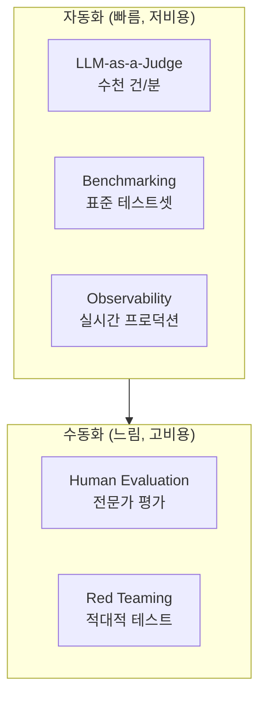

# Harness Engineering (하네스 엔지니어링)

## 개요

**Harness Engineering**은 AI 시스템을 **안전하게 제어하고, 품질을 측정하고, 운영 중 관찰**하는 모든 기술이다. 자동차의 안전벨트·계기판·블랙박스에 해당하는 계층이다. 없으면 시스템이 작동하지만, 있을 때 비로소 신뢰할 수 있게 된다.

```
Harness = Guardrails (안전) + Evaluation (품질) + Observability (관찰)
```

## 하위 문서

| 문서 | 내용 |
|------|------|
| [[Guardrail_Engineering]] | NeMo Guardrails, Guardrails AI, LlamaGuard |
| [[LLM_as_a_Judge]] | 자동 품질 평가 — MT-Bench, RAGAS |
| [[Benchmarking]] | MMLU/HumanEval/SWE-bench, pass@k |
| [[Human_Evaluation]] | Preference Annotation, IAA, Chatbot Arena |
| [[Observability_and_Tracing]] | LangSmith/Langfuse/Arize Phoenix |
| [[Red_Teaming]] | HarmBench, PAIR, Jailbreaking 탐지, Garak/PyRIT |
| [[Alignment_Research]] | Reward Hacking, Sleeper Agents, Alignment Faking, AI Control |
| [[AI_Governance_and_Compliance]] | RSP/Preparedness/FSF, METR 외부평가, EU AI Act, 모델 카드 |

## 평가 계층 구조



## Harness 없는 배포의 위험

```
가드레일 없음 → 유해 출력이 사용자에게 전달
평가 없음    → 모델 업데이트 후 품질 회귀 감지 못함
관찰 없음    → "왜 사용자가 떠났나?" 알 수 없음
Red Team 없음 → 악의적 사용자가 시스템 오용
```

## AI Engineering에서의 역할

Harness Engineering은 **AI 시스템을 실험에서 프로덕션으로 전환하는 관문**이다. 규제 산업(금융, 의료, 법률)에서는 이 계층이 컴플라이언스 요건의 핵심이며, B2C 서비스에서는 브랜드 신뢰의 기반이다.

## 관련 개념
[[AI/Engineering/Agent_Engineering/Agent_Engineering|Agent Engineering]] · [[Loop_Engineering/Data_Flywheel]]
