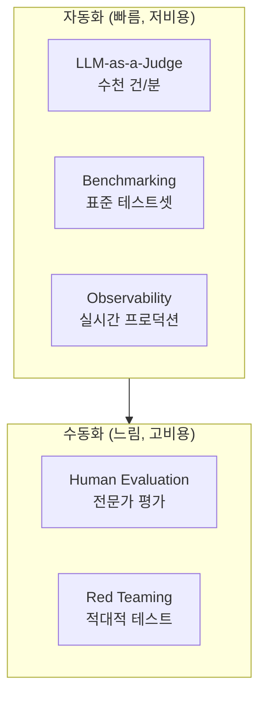

# Harness Engineering (하네스 엔지니어링)

## 개요

**Harness Engineering**은 AI 시스템을 **안전하게 제어하고, 품질을 측정하고, 운영 중 관찰**하는 모든 기술이다. 자동차의 안전벨트·계기판·블랙박스에 해당하는 계층이다. 없으면 시스템이 작동하지만, 있을 때 비로소 신뢰할 수 있게 된다.

```
Harness = Guardrails (안전) + Evaluation (품질) + Observability (관찰)
```

## 하위 문서

| 문서 | 내용 |
|------|------|
| [[AI/Engineering/Harness_Engineering/Guardrail_Engineering\|Guardrail_Engineering]] | NeMo Guardrails, Guardrails AI, LlamaGuard |
| [[AI/Engineering/Harness_Engineering/LLM_as_a_Judge\|LLM_as_a_Judge]] | 자동 품질 평가 — MT-Bench, RAGAS, G-Eval, Prometheus |
| [[AI/Engineering/Harness_Engineering/Agent_as_a_Judge\|Agent_as_a_Judge]] | 에이전트 실행 궤적 평가, Critic Agent, Agent Simulation |
| [[AI/Engineering/Harness_Engineering/Benchmarking\|Benchmarking]] | MMLU/HumanEval/SWE-bench(Verified), pass@k |
| [[AI/Engineering/Harness_Engineering/Human_Evaluation\|Human_Evaluation]] | Preference Annotation, IAA, Chatbot Arena |
| [[AI/Engineering/Harness_Engineering/Observability_and_Tracing\|Observability_and_Tracing]] | LangSmith/Langfuse/Arize Phoenix |
| [[AI/Engineering/Harness_Engineering/Red_Teaming\|Red_Teaming]] | HarmBench, PAIR, Jailbreaking 탐지, OWASP LLM Top 10, Garak/PyRIT |
| [[AI/Engineering/Harness_Engineering/Alignment_Research\|Alignment_Research]] | Reward Hacking, Sleeper Agents, Agentic Misalignment, Alignment Faking, AI Control |
| [[AI/Engineering/Harness_Engineering/Mechanistic_Interpretability\|Mechanistic_Interpretability]] | Sparse Autoencoders, Circuit Tracing, 모델 내부 회로 분석 |
| [[AI/Engineering/Harness_Engineering/AI_Governance_and_Compliance\|AI_Governance_and_Compliance]] | RSP/Preparedness/FSF, NIST AI RMF, ISO 42001, EU AI Act, 모델 카드 |
| [[AI/Engineering/Harness_Engineering/Prompt_Injection_Defense\|Prompt_Injection_Defense]] | Lethal Trifecta, Rule of Two, CaMeL, Dual-LLM, Spotlighting |

## 명명 충돌: "Agent Harness"와의 구분

2026년부터 업계 일부에서 "agent harness (engineering)"이라는 용어가 이 챕터와 **다른 의미**로 쓰이기 시작했다 — LangChain·Anthropic 등의 최신 용법에서는 에이전트를 둘러싼 **실행 스캐폴딩**(execution runtime, context system, capability surface, governance layer, protocol adapter의 5계층)을 가리킨다. 즉 "모델에 상태·도구 실행·피드백 루프·제약을 부여해 실제로 작동하는 에이전트로 만드는 코드·설정 전체"라는, [[AI/Engineering/Flow_Engineering/Flow_Engineering|Flow Engineering]]·[[AI/Engineering/Agent_Engineering/Agent_Engineering|Agent Engineering]]·[[AI/Engineering/Context_Engineering/Context_Engineering|Context Engineering]]을 아우르는 실행 인프라에 가까운 개념이다.

여기서 **Harness Engineering**은 위 개요가 정의한 대로 **안전·평가·관찰**(Guardrails + Evaluation + Observability)이라는 좁은 의미로 쓴다. 외부 자료에서 "agent harness"라는 표현을 마주친다면, 그것은 대개 이 챕터가 아니라 위 실행 스캐폴딩 의미(주로 Agent Engineering·Flow Engineering·Context Engineering의 조합)를 가리키는 것임을 구분해서 읽어야 한다.

## 평가 계층 구조


```mermaid
flowchart TD
    subgraph auto["자동화 (빠름, 저비용)"]
        A1["LLM-as-a-Judge<br/>수천 건/분"]
        A2["Benchmarking<br/>표준 테스트셋"]
        A3["Observability<br/>실시간 프로덕션"]
    end
    subgraph manual["수동화 (느림, 고비용)"]
        M1["Human Evaluation<br/>전문가 평가"]
        M2["Red Teaming<br/>적대적 테스트"]
    end
    auto --> manual
```

## Harness 없는 배포의 위험

```
가드레일 없음 → 유해 출력이 사용자에게 전달
평가 없음    → 모델 업데이트 후 품질 회귀 감지 못함
관찰 없음    → "왜 사용자가 떠났나?" 알 수 없음
Red Team 없음 → 악의적 사용자가 시스템 오용
```

## AI Engineering에서의 역할

Harness Engineering은 **AI 시스템을 실험에서 프로덕션으로 전환하는 관문**이다. 규제 산업(금융, 의료, 법률)에서는 이 계층이 컴플라이언스 요건의 핵심이며, B2C 서비스에서는 브랜드 신뢰의 기반이다.

## 관련 개념
[[AI/Engineering/Agent_Engineering/Agent_Engineering|Agent Engineering]] · [[AI/Engineering/Loop_Engineering/Data_Flywheel|Loop_Engineering/Data_Flywheel]]
